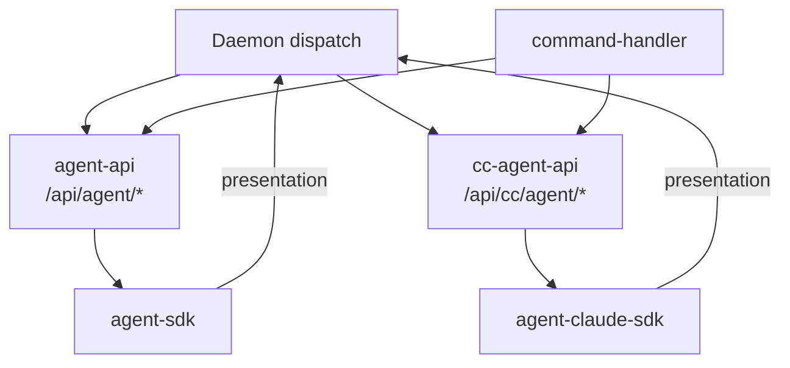

# Agent 调度 · 概览

## 一、模块定位与边界

连接 Daemon 队列与 Cursor Agent（**IM 路径支持 Cursor SDK 与 Claude Code SDK 双引擎**）。Daemon 编排 claim 并转发 Electron `agent-api`/`cc-agent-api`；Electron 负责任务/工作流/斜杠 launch。

## 二、整体架构

## 三、核心状态机/主流程

Idle → claim → launch（首条）→ processing → resident idle → dispatch（连发）→ idle/close。

## 四、子模块清单

[02 多会话](./02-多会话模型.md) · [03 启动](./03-启动与自动重连.md) · [04 指令](./04-远程指令.md) · [05 定时](./05-定时任务.md) · [06 Cursor SDK](./06-CursorSDK执行引擎.md) · [07 Claude Code SDK](./07-ClaudeCodeSDK执行引擎.md)

## 五、关键约束

IM **双引擎**（Cursor SDK / Claude Code SDK）；无 poll；launch 不写盘 inject；`SDK_RESIDENT_AGENT` 默认开；CC resident 靠 ccSessionId --resume。

## 六、术语表

agent-api、residentMode、dispatch、f41Eligible — 见各子模块。

## 七、依赖关系

Agent 调度 → Daemon + config-store + agent-api + cc-agent-api。

## 八、全局非功能与可观测

dispatch 300ms 防抖；`dispatch_failed` 可检索。

## 九、全局已知限制

合并按钮 T8；admin MCP 待 T10 废弃；T11/T12 未交付。

## 十、文档入口

[02 多会话](./02-多会话模型.md) → [03 启动](./03-启动与自动重连.md) → [04 指令](./04-远程指令.md) → [05 定时](./05-定时任务.md)；SDK 排查：[06 Cursor SDK](./06-CursorSDK执行引擎.md) → [07 Claude Code SDK](./07-ClaudeCodeSDK执行引擎.md) → [03 启动](./03-启动与自动重连.md)

## 十一、变更记录

2026-06-30：§十 文档入口改为与 §四 一致的有序 markdown 链接（kb-check lite）。
2026-06-30：新增 06/07 SDK 执行引擎子模块文档（kb-sync lite）。
2026-06-27：Daemon IM 编排、SDK-only（archive 20260627162620）。
2026-06-29：扩展 Claude Code SDK 执行引擎，双引擎路由（archive 20260629164130）。
