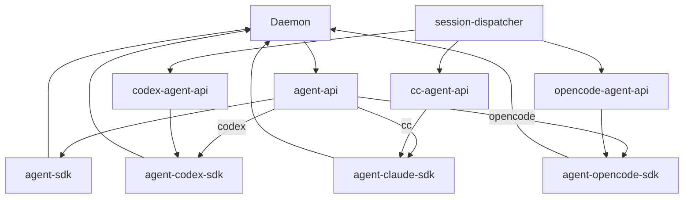
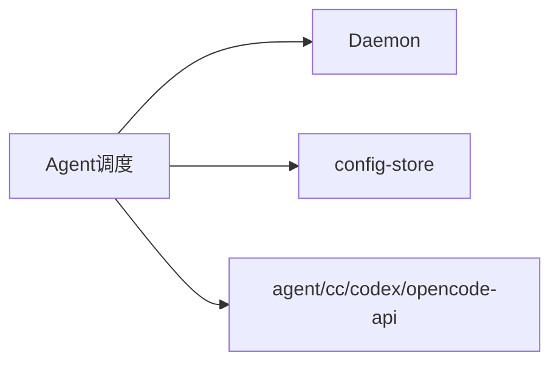

# Agent 调度 · 概览

## 一、模块定位与边界

连接 Daemon 与 Agent（**IM 四引擎**：Cursor SDK / Claude Code SDK / Codex SDK / OpenCode SDK）。Daemon claim 转发 `agent-api` 等；Electron 负责任务/工作流/斜杠 launch。

## 二、整体架构

## 三、核心状态机/主流程

Idle → claim → launch → processing → resident idle → dispatch → idle/close。

## 四、子模块清单

[02 多会话](./02-多会话模型.md) · [03 启动](./03-启动与自动重连.md) · [04 指令](./04-远程指令.md) · [05 定时](./05-定时任务.md) · [06 Cursor SDK](./06-CursorSDK执行引擎.md) · [07 Claude Code SDK](./07-ClaudeCodeSDK执行引擎.md) · [08 Codex SDK](./08-CodexSDK执行引擎.md) · [09 OpenCode SDK](./09-OpenCodeSDK执行引擎.md)

## 五、关键约束

IM **四引擎**；无 poll；不写盘 inject；`SDK_RESIDENT_AGENT` 默认开；CC `ccSessionId`+`resume`；Codex `codexSessionId`+`resumeThread`；OpenCode `opencodeSessionId`+`session.prompt` 续接；OpenCode 支持 embedded/external 双部署。

## 六、术语表

agent-api、cc-agent-api、codex-agent-api、opencode-agent-api、residentMode、dispatch、f41Eligible、codexSessionId、opencodeSessionId、deployMode。

## 七、依赖关系

## 八、全局非功能与可观测

dispatch 300ms 防抖；`dispatch_failed` 可检索。

## 九、全局已知限制

T8 合并按钮；T10 admin MCP；T11/T12 未交付；Codex/OpenCode Dashboard MCP 占位或 disk 读盘策略；OpenCode 外部探活经 `config.get`。

## 十、文档入口

[02](./02-多会话模型.md) → [03](./03-启动与自动重连.md) → [04](./04-远程指令.md) → [05](./05-定时任务.md)；排查：[06](./06-CursorSDK执行引擎.md) → [07](./07-ClaudeCodeSDK执行引擎.md) → [08](./08-CodexSDK执行引擎.md) → [09](./09-OpenCodeSDK执行引擎.md) → [03](./03-启动与自动重连.md)

## 十一、变更记录

2026-06-30：三引擎→四引擎，纳入 OpenCode（archive 20260630105159）。
2026-06-30：双引擎→三引擎，纳入 Codex（archive 20260630104714）。
2026-06-30：新增 06/07 子模块（kb-sync）。
2026-06-29：双引擎路由 CC（archive 20260629164130）。
