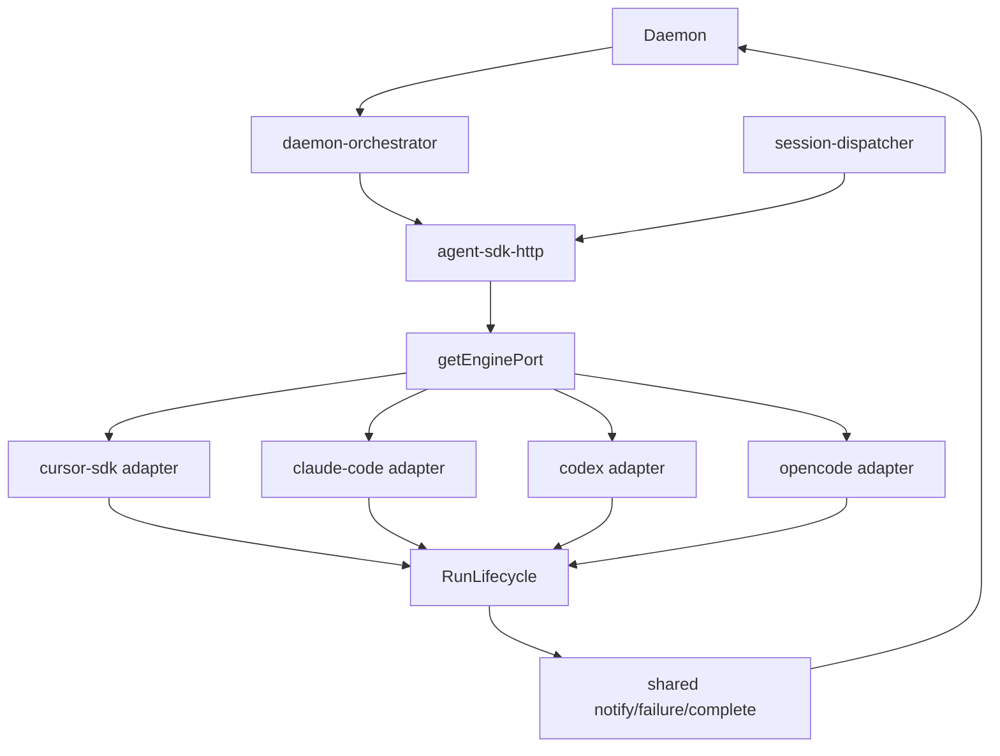
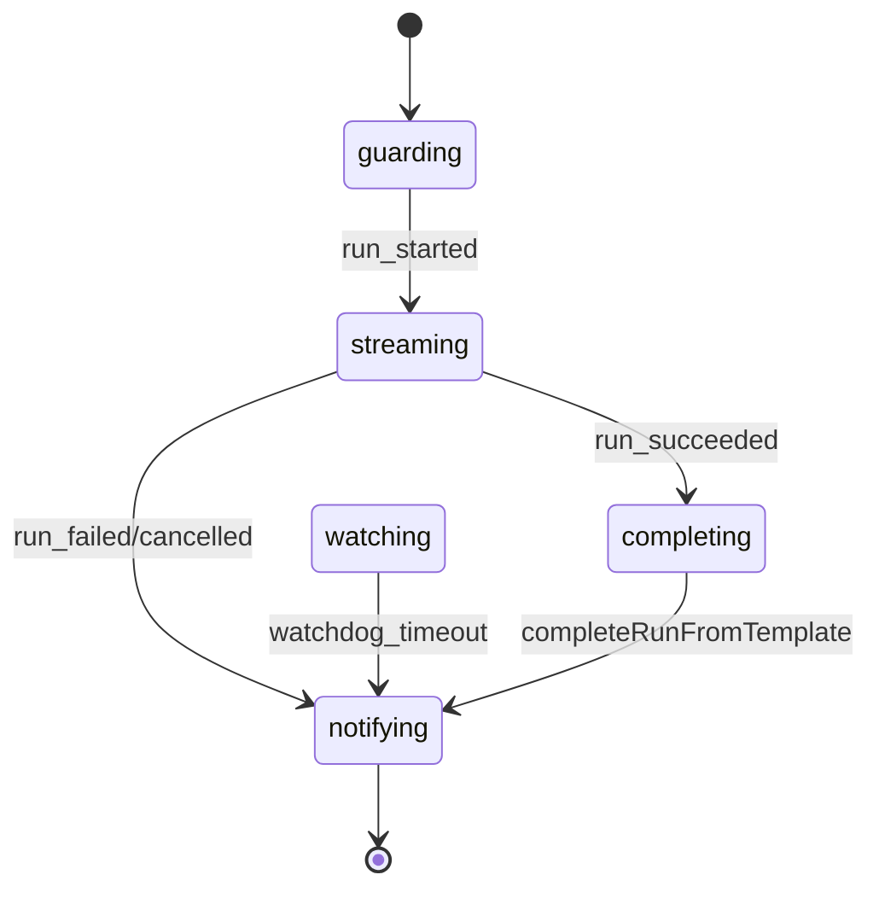
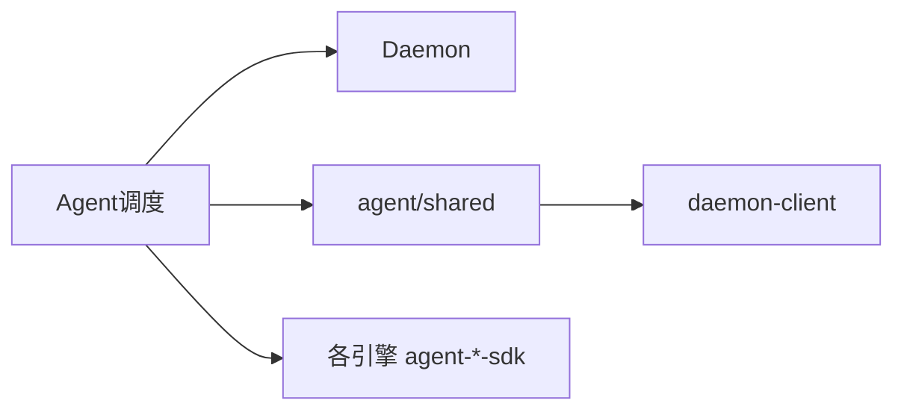

# Agent 调度 · 概览

## 一、模块定位与边界

连接 Daemon 与 Agent（**IM 四引擎**：Cursor SDK / Claude Code SDK / Codex SDK / OpenCode SDK）。Daemon claim 转发 `agent-api`；Electron 经 `AgentEnginePort` 统一网关 launch/dispatch，Run 终态经共享 `RunLifecycle`。

## 二、整体架构

## 三、核心状态机/主流程

**RunLifecycle**（四引擎共用）：`guarding → streaming → watching → completing → notifying`。引擎原生事件经 adapter 映射 `RunEvent` 驱动阶段转移；终态 `completeRunFromTemplate`+`notifySessionChat`。

Daemon 调度：跨 sessionKey **并行** kickoff；同会话 Idle → claim（挡 `starting`|`processing`）→ launch/dispatch → processing → idle（MergeBatch/phase 串行）。详见 [02](./02-多会话模型.md)；续接见 [03](./03-启动与自动重连.md)。

## 四、子模块清单

[02 多会话](./02-多会话模型.md) · [03 启动](./03-启动与自动重连.md) · [04 指令](./04-远程指令.md) · [05 定时](./05-定时任务.md) · [06 Cursor SDK](./06-CursorSDK执行引擎.md) · [10 上下文/失败归因](./10-SDK上下文保护与失败归因.md) · [07 Claude](./07-ClaudeCodeSDK执行引擎.md) · [08 Codex](./08-CodexSDK执行引擎.md) · [09 OpenCode](./09-OpenCodeSDK执行引擎.md)

## 五、关键约束

IM **四引擎**经 `agent-sdk-http` Port；终态 IM 唯一 `run-notify`；`errorNotified` 四引擎一致；**S8** 须 `enterGuardWithLifecycle`（busy 一次 IM）；Daemon dispatch 非 busy 失败对称 IM。**S7** 四引擎 recover+resume+快照；三引擎 hardening（07–09）；Cursor 另 `getRun`。T11 与 S7 正交。**并发**：会话间并行、会话内串行（`inFlightSessions` + phase 门控）。

## 六、术语表

AgentEnginePort、RunLifecycle、RunEvent、RunFailureReason、errorNotified、engine-port-adapter、completeRunFromTemplate、residentMode、f41Eligible。

## 七、依赖关系

## 八、全局非功能与可观测

dispatch 300ms 防抖；`dispatch_failed`/`dispatch_parallel`/`agent_failed` 可检索；失败归档 `crash-log-archiver` 与 notify 同路径。

## 九、全局已知限制

Cursor 独有 `getRun`；三引擎 `*-run-probe`；Codex ordering 见 08；CC 审批见 07。无跨机分布式队列 / worker pool。

## 十、文档入口

[02](./02-多会话模型.md) → [03](./03-启动与自动重连.md) → [04](./04-远程指令.md) → [05](./05-定时任务.md)；排查：[06](./06-CursorSDK执行引擎.md) → [10](./10-SDK上下文保护与失败归因.md) → [07](./07-ClaudeCodeSDK执行引擎.md) → [08](./08-CodexSDK执行引擎.md) → [09](./09-OpenCodeSDK执行引擎.md)

## 十一、变更记录

- 2026-07-12：多会话并发调度（跨 session 并行 / 同会话串行，20260712170543）。
- 2026-07-12：S7 hardening、T11 路由、Engine Port+RunLifecycle、四引擎续接。
- 2026-07-02 / 06-30：事件流 SSOT、四引擎。
