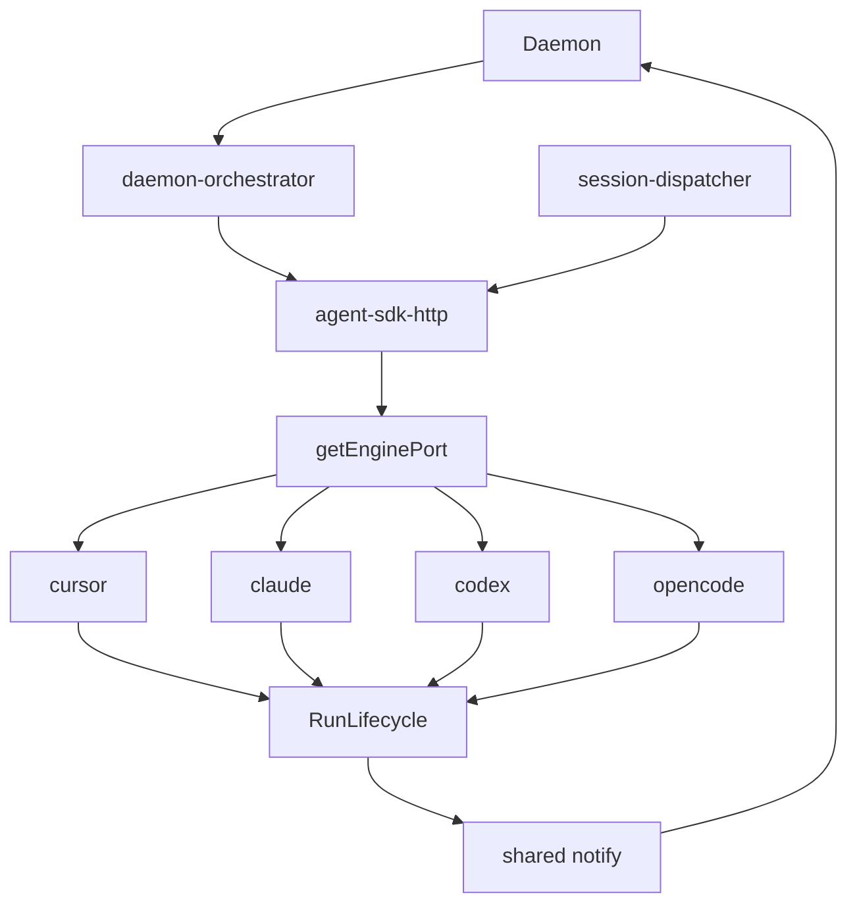
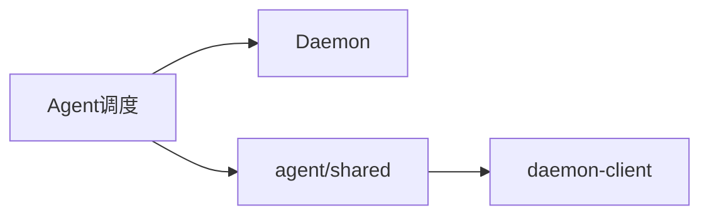

# Agent 调度 · 概览

## 一、模块定位与边界

连接 Daemon 与 Agent（**IM 四引擎**：Cursor / Claude Code / Codex / OpenCode）。Daemon claim 转发 `agent-api`；Electron 经 `AgentEnginePort` 统一网关；终态经共享 `RunLifecycle`。

## 二、整体架构

## 三、核心状态机/主流程

**RunLifecycle**：`guarding → streaming → watching → completing → notifying`。终态 `completeRunFromTemplate`+`notifySessionChat`。

Daemon：跨 session **并行** kickoff；同会话 phase 串行 claim。见 [[02-多会话模型]]、[[03-启动与自动重连]]。

## 四、子模块清单

| 模块 | 职责 |
|------|------|
| [[02-多会话模型]] | ChatType、sessionKey、同目录提示 |
| [[03-启动与自动重连]] | 启动、resume、空闲预热 |
| [[04-远程指令]] | 斜杠/菜单 |
| [[05-定时任务]] | Cron |
| [[06-CursorSDK执行引擎]] | Cursor 长驻/tool/预热 |
| [[10-SDK上下文保护与失败归因]] | pre-send、失败归因 |
| [[07-ClaudeCodeSDK执行引擎]]～[[09-OpenCodeSDK执行引擎]] | 其余引擎 |

## 五、关键约束

IM 四引擎经 `agent-sdk-http`；终态唯一 `run-notify`；S8 `enterGuardWithLifecycle`；S7 四引擎 recover。**并发**：会话间并行、会话内串行。同 `workspaceDir`：**通道提示 + UI WARN，不默认硬阻断**。Cursor 空闲 ≥15min：**后台预热 recreate + 发前 refresh**。

## 六、术语表

AgentEnginePort、RunLifecycle、RunEvent、RunFailureReason、errorNotified、residentMode、f41Eligible、`tool_running`。

## 七、依赖关系

## 八、全局非功能与可观测

dispatch 300ms 防抖；`dispatch_failed`/`dispatch_parallel`/`agent_failed`/`resident-bg-warmup`/`shared-workspace` 可检索。

## 九、全局已知限制

Cursor 独有 `getRun`；同目录仅提示；无跨机队列 / worker pool。

## 十、文档入口

[[02-多会话模型]] → [[03-启动与自动重连]] → [[04-远程指令]] → [[05-定时任务]]；排查：[[06-CursorSDK执行引擎]] → [[10-SDK上下文保护与失败归因]] → 07→08→09。

## 十一、相关

- [[02-多会话模型]]
- [[03-启动与自动重连]]
- [[06-CursorSDK执行引擎]]
- [[业务域/消息桥接/02-飞书通道]]
- [[业务域/消息桥接/04-消息队列与路由]]
- [[00-README]]
