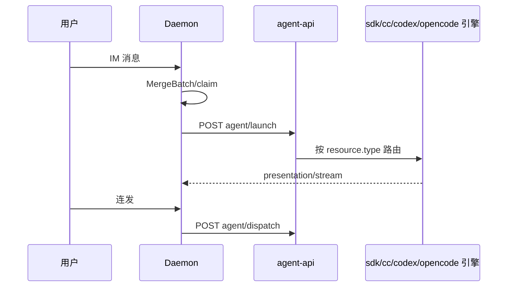

# 多会话模型

## 一、能力范围

定义五类 `ChatType` 会话、sessionKey 规则、工作目录隔离、活跃会话切换与消息路由。不负责 Daemon MergeBatch 与 Presentation 细节。

## 二、设计决策与取舍

- **sessionKey 含工作目录**：主私聊 `{chatKey}::{workspaceDir}`（`makeMainP2pSessionKey`）。
- **主用户判定**：p2p 且 rawChatId 等于 `mainUserChatId`。
- **IM 路径四引擎**：通道 `agentResourceId` 绑定 sdk / claude-code / codex / opencode；Daemon dispatch 至 `agent-api`，由 `agent-sdk` 按资源类型路由。
- **长驻 Agent**：`SDK_RESIDENT_AGENT` 默认开；同 sessionKey Run 结束后保留实例，连发走 `dispatch` 非新 launch。
- **活跃会话栈 SSOT**：`activeSessionMap`（chatId→活跃 sessionKey）与 `fallbackSessionMap`（临时 sessionKey→回退目标）均在 Daemon 进程内存；Electron 经 `daemon-client` 的 `syncActiveSession` / `setSessionFallback` / `getSessionFallback` / `clearSessionFallback` 读写。`/chat new` 与 `__IND_LAUNCH__` 写入回退关系，`handleSessionClosed` 条件切回并清理。
- **多群隔离心智**：每群/每 ChatType 独立 `sessionKey` 与引擎 session Map 条目；SDK 上下文压力、`lastPreSend*` 快照、失败 notify 均 **session 级**，无跨 session 读写。多群几乎同时收到失败提示，多为各 session 独立上下文超限的**并发同类问题**，非 A 群失败污染 B 群。

## 三、服务端规则

| ChatType | 工作目录 | IM 调度 | Presentation |
|----------|----------|---------|--------------|
| p2p（主用户） | 通道/全局主目录 | Daemon launch/dispatch | eligible |
| p2p（他人） | isolated/specified | 同左（allowOthers） | 否 |
| group | isolated/specified | 同左 | 飞书+allowOthers eligible |
| task/temp/workflow | 见各 launch 路径 | Electron launch | 视 chatType |

- 非主用户/群聊需 `allowOthers`。
- **他人/群聊目录**：`resolveOthersWorkspaceDir`（`session-dispatcher.ts`）— 读通道 `othersWorkspaceMode`（默认 **`isolated`**）：`isolated` 为 `userData/workspaces/{safeChatId}` 按会话隔离；`specified` 为指定目录或回退 `effectiveWorkspaceDir`。**sessionKey/agent 隔离**与 **workspace 目录策略**独立：即使多群误配同一 `workspaceDir`，session 状态仍按 sessionKey 隔离；共用目录仅影响磁盘侧 cwd，不合并 IM 会话。

## 四、客户端流程

**临时/工作流**：仍经 `launchIndependentAgent` / `launchWorkflowAgent`（非 Daemon IM 循环）。

**Dashboard**：`getSessionAgentList` 合并四引擎；`engineType` 含 codex/opencode。

## 五、接口

`launchSessionAgent` / `launchIndependentAgent` / `launchWorkflowAgent`；Daemon `POST /api/agent/launch|dispatch`；会话路由 `POST|GET|DELETE /api/session-fallback`（Electron `set/get/clearSessionFallback`）。

## 六、数据

- **配置**：`mainChatIds`、通道 `othersWorkspaceMode`/`othersWorkspaceDir`、workspace/allowOthers 等。
- **内存**：四引擎会话 Map（含 resident、`pendingDispatch`）、`sessionAgents`（遗留）。SDK `sdkSessions` 按 sessionKey 索引。

## 七、非功能与可观测

- SDK 会话 pid 为 0；`hasSdkSession` 表 idle 长驻。
- 群名异步拉取；启动失败 notify。
- **共享 workspaceDir 诊断（T6）**：SDK `warnIfSharedWorkspaceDir` 在 launch/dispatch 统计同 `workspaceDir` 活跃 session 数 >1 时输出 `[shared-workspace]` WARN（每目录每进程 1 条）。便于排查通道是否误将多群指向同一目录；**不改变** session 隔离与 notify 路由。

## 八、推送

无（回复经 Daemon Presentation/stream）。

## 九、已知限制与 TODO

- T11：Agent 标识跨 Daemon 重启持久化未实现。
- 群聊 sessionKey 通常不含 `::` 后缀。
- MCP launch 不支持 `-dir`。

## 十、变更记录

- 2026-07-11：活跃会话与回退栈 SSOT 迁至 Daemon（`fallbackSessionMap` + `/api/session-fallback`）。
- 2026-07-05：多群隔离心智、othersWorkspaceMode 与 session 隔离关系、共享 workspaceDir WARN（archive 20260705230806）。
- 2026-06-30：四引擎列表含 OpenCode（archive 20260630105159）。
- 2026-06-27：长驻与 dispatch（archive 20260627162620）。
