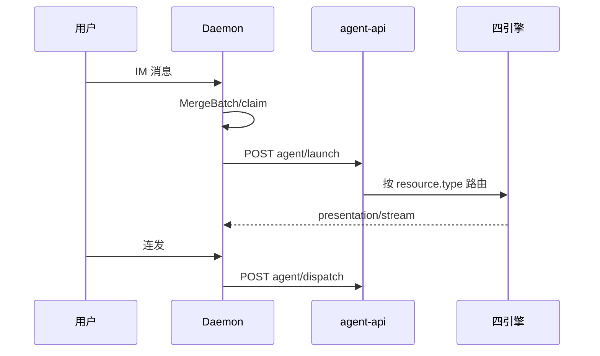

# 多会话模型

## 一、能力范围

定义五类 `ChatType`、sessionKey、工作目录隔离、活跃会话与消息路由。不负责 MergeBatch / Presentation 细节。

## 二、设计决策与取舍

- **sessionKey**：主私聊 `{chatKey}::{workspaceDir}`（`makeMainP2pSessionKey`）；主用户 = p2p 且 rawChatId=`mainUserChatId`。
- **IM 四引擎**：通道 `agentResourceId` → Daemon → `agent-api` → 按 resource 路由。
- **长驻**：`SDK_RESIDENT_AGENT` 默认开；同 sessionKey 连发走 `dispatch`。
- **活跃会话栈 SSOT**：`activeSessionMap` / `fallbackSessionMap` 在 Daemon；冷启动读 `session-routing.json`；`set*`/`clear*` debounce 500ms 写盘。**不**持久化 `sessionAgentPhaseMap`。Electron 经 `daemon-client`；`/chat new`、`__IND_LAUNCH__` 写回退。
- **多群隔离**：状态/快照/notify 均 session 级；多群同时失败多为并发同类，非跨 session 污染。
- **Daemon 调度并发**：跨 session 并行 kickoff（`inFlightSessions` + 短 `dispatchScanBusy`）；同会话 MergeBatch / phase 串行；claim 挡 `starting`|`processing`。日志 `dispatch_parallel`。

## 三、服务端规则

| ChatType | 工作目录 | IM 调度 | Presentation |
|----------|----------|---------|--------------|
| p2p（主用户） | 通道/全局主目录 | Daemon launch/dispatch | eligible |
| p2p（他人） | isolated/specified | 同左（allowOthers） | 否 |
| group | isolated/specified | 同左 | 飞书+allowOthers eligible |
| task/temp/workflow | 见各 launch | Electron launch | 视 chatType |

- 非主用户/群聊需 `allowOthers`。
- **他人/群聊目录**：`resolveOthersWorkspaceDir`（默认 `isolated`）；sessionKey 隔离与 workspace 策略独立。

## 四、客户端流程

临时/工作流：`launchIndependentAgent` / `launchWorkflowAgent`。Dashboard：`getSessionAgentList` 合四引擎。

## 五、接口

`launchSessionAgent` / `launchIndependentAgent` / `launchWorkflowAgent`；Daemon `POST /api/agent/launch|dispatch`；`POST|GET|DELETE /api/session-fallback`。

## 六、数据

- **配置**：`mainChatIds`、`othersWorkspaceMode`/`othersWorkspaceDir`、workspace/allowOthers。
- **路由（T11）**：`session-routing.json` — active/fallback + `lastTouchedAt`；TTL 30d；冷启动 `touch:false`；6h prune。
- **续接**：Daemon 管 chatId→sessionKey；Electron `*-active-runs`+S7 管 Run；双轨正交。
- **内存**：四引擎会话 Map；SDK `sdkSessions` 按 sessionKey。

## 七、非功能与可观测

- SDK pid=0；`hasSdkSession` 表 idle 长驻；群名异步；启动失败 notify。
- **T6**：同 workspaceDir 活跃 session>1 → `[shared-workspace]` WARN（每目录每进程 1 条）。
- **调度并行**：`dispatch_parallel`；他会话 busy/重试不阻塞本会话 kickoff。

## 八、推送

无（经 Daemon Presentation/stream）。

## 九、已知限制与 TODO

- 历史膨胀 `lastTouchedAt` 不在 load 纠偏，靠 TTL 消化。
- T11-E2E、群聊 key 常无 `::`、MCP launch 无 `-dir`。
- 无 worker pool / 跨机队列；引擎 busy 与 Daemon 并行正交。

## 十、变更记录

- 2026-07-12：多会话并发调度（跨 session 并行 / 同会话串行，20260712170543）。
- 2026-07-12：T11 路由持久化；活跃会话栈迁 Daemon。
- 2026-07-05 / 06-30 / 06-27：多群隔离、四引擎、长驻 dispatch。
