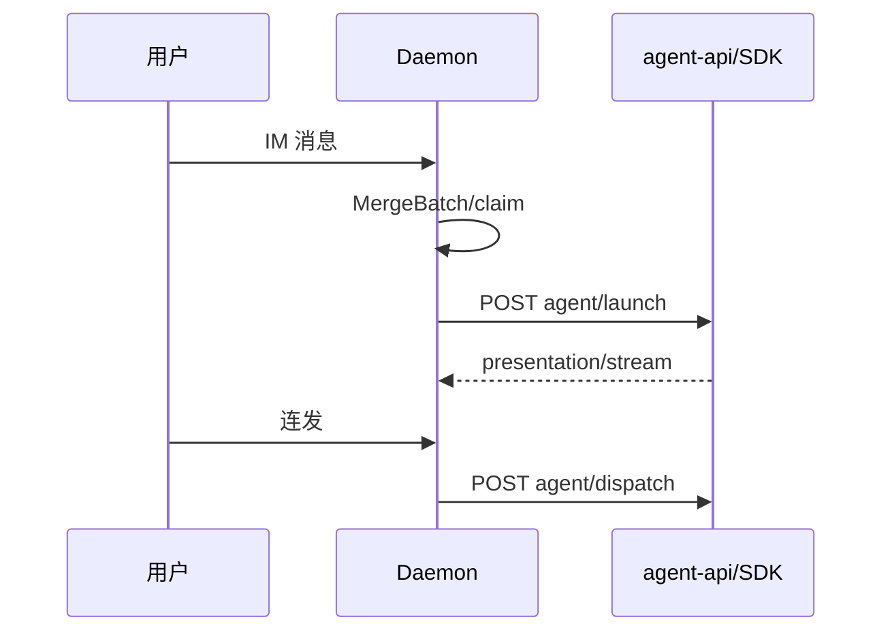

# 多会话模型

## 一、能力范围

定义五类 `ChatType` 会话、sessionKey 规则、工作目录隔离、活跃会话切换与消息路由。不负责 Daemon MergeBatch 与 Presentation 细节。

## 二、设计决策与取舍

- **sessionKey 含工作目录**：主私聊 `{chatKey}::{workspaceDir}`（`makeMainP2pSessionKey`）。
- **主用户判定**：p2p 且 rawChatId 等于 `mainUserChatId`。
- **IM 路径 SDK-only**：通道 `agentResourceId` 须为 SDK；Daemon dispatch 至 `agent-api`。
- **长驻 Agent**：`SDK_RESIDENT_AGENT` 默认开；同 sessionKey Run 结束后保留实例，连发走 `dispatch` 非新 launch。
- **活跃会话栈**：`/chat new` 仍用 `previousActiveSessionMap` 回退。

## 三、服务端规则

| ChatType | 工作目录 | IM 调度 | Presentation |
|----------|----------|---------|--------------|
| p2p（主用户） | 通道/全局主目录 | Daemon launch/dispatch | eligible |
| p2p（他人） | isolated/specified | 同左（allowOthers） | 否 |
| group | isolated/specified | 同左 | 飞书+allowOthers eligible |
| task/temp/workflow | 见各 launch 路径 | Electron launch | 视 chatType |

- 非主用户/群聊需 `allowOthers`。
- **他人/群聊目录**：`resolveOthersWorkspaceDir` — isolated 临时目录 / specified 指定路径。

## 四、客户端流程

**临时/工作流**：仍经 `launchIndependentAgent` / `launchWorkflowAgent`（非 Daemon IM 循环）。

**Dashboard 活跃会话详情**：`agent:sessions` / `getSessionAgentList` 合并 SDK 与 CC 列表，每项含 `workspaceDir?`（SDK 与会话 key 同源；CC 自 `CcSessionAgent`）及 `engineType`（`sdk` | `claude-code`）。UI 按会话绑定 MCP 诊断（`SessionMcpPanel`），合并规则与运行时 `mcp-sdk-loader` / `cc-mcp-loader` 一致；会话 ws 为空时回退全局主工作区。

## 五、接口

`launchSessionAgent` / `launchIndependentAgent` / `launchWorkflowAgent`；Daemon `POST /api/agent/launch|dispatch` 转发。

## 六、数据

- **配置**：`mainChatIds`、通道 workspace/allowOthers 等。
- **内存**：`sdkSessions`（含 resident、`pendingDispatch`）、`sessionAgents`（CLI 任务路径）。

## 七、非功能与可观测

- SDK 会话 pid 为 0；`hasSdkSession` 表 idle 长驻。
- 群名异步拉取；启动失败 notify。

## 八、推送

无（回复经 Daemon Presentation/stream）。

## 九、已知限制与 TODO

- T11：Agent 标识跨 Daemon 重启持久化未实现。
- 群聊 sessionKey 通常不含 `::` 后缀。
- MCP launch 不支持 `-dir`。

## 十、变更记录

2026-06-30：活跃会话列表透出 `workspaceDir`/`engineType`，供 Dashboard MCP 按会话诊断（archive 20260630104251）。
2026-06-27：长驻 Agent 与 dispatch 边界（archive 20260627162620）。
2026-06-27：他人/群聊工作目录模式。
2026-06-27：kb-sync 初始建立。
