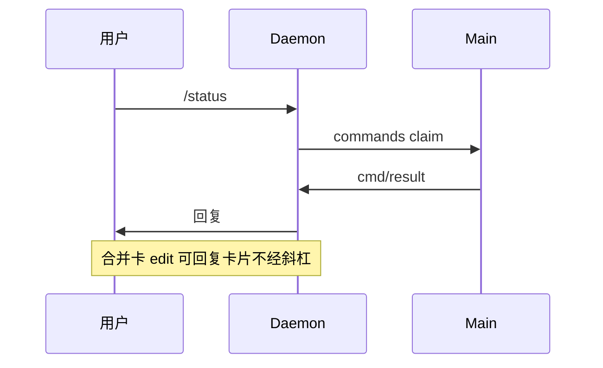

# 远程指令

## 一、能力范围

飞书/微信 `/` 指令：除 `/merge` 外 Daemon 写命令文件，Main 5s 轮询 claim 执行并回报。**飞书私聊菜单点击**（推送事件，映射斜杠或文本回复）与**进入私聊帮助卡**（CardKit，与 `/help` 语义并存）。**飞书合并卡控制** 经按钮、`/merge` 斜杠、HTTP 与回复编辑四入口，共用 `handleMergeBatchAction` SSOT。

## 二、设计决策与取舍

- **与 Agent 解耦**：`checkAndExecutePendingCommands` 在 `daemon-manager` 轮询中运行。
- **指令不区分角色**：已授权用户（通道准入通过）均可使用全量斜杠与菜单映射指令；**不再**以 `isMainUser` 拒绝执行。`isMainUser` 仍用于会话键/工作区解析（`resolveCommandSessionKey` 等），与指令门控解耦。
- **通道准入独立**：能否与机器人对话仍由 `allowOthers`、主用户绑定、群聊 @ 等通道策略决定。
- **控制层演进**：展示/控制在飞书 CardKit；admin MCP 待 T10 废弃；IM 路径不依赖 MCP poll。
- **合并卡**：按钮、`/merge`、HTTP、回复编辑四入口共用 `handleMergeBatchAction`；防抖与文案见 `feishu-card-action.ts`、`daemon-merge-action-feedback.ts`。
- **菜单入队**：`menu_v6` 经 `resolveMenuCommand(eventKey)`→`pushCommandToQueue`；未知 key 直接 IM 回复，不入队。

## 三、服务端规则

指令 claim 后按首 token 路由（不区分大小写）。

| 指令 | 权限 | 行为摘要 |
|------|------|----------|
| `/stop` | 全员 | 仅停当前会话 Agent（`resolveCommandSessionKey` 后 `stopSessionAgent`） |
| `/status` | 全员 | Daemon/Agent/队列统计 |
| `/reset` | 全员 | 停会话 Agent + 清空 resume |
| `/help` | 全员 | `buildHelpText()` 全量指令列表 |
| `/list` `/clean` `/restart` | 全员 | 队列列表/清空/重启 Daemon |
| `/workspace` `/model` `/mcp` | 全员 | 配置 CRUD |
| `/task` `/workflow` `/chat` | 全员 | 任务/工作流/临时会话 |
| `/merge` | 全员 | send/split/edit 子命令；未知子命令返回用法 |

**合并控制（多入口，SSOT `handleMergeBatchAction`）**：

| 动作 | 入口 | 说明 |
|------|------|------|
| send_now | 按钮 `merge_send_now`、斜杠 `/merge`/`/merge send`、HTTP `merge-batch/action` | collecting→ready→`flushReadyMergeBatches` |
| split | 按钮 `merge_split`、斜杠 `/merge split`、HTTP 同上 | 取消合并，逐条 dispatch |
| edit | 按钮 `merge_edit`（无内联正文→F3 引导）、斜杠 `/merge edit <正文>`、HTTP 或回复合并卡 | 设置 overrideText |

**飞书菜单 event_key**（`FEISHU_MENU_EVENT_MAP`，须与后台一致）：

| event_key | 等价斜杠 | 权限 |
|-----------|----------|------|
| cmd_help | `/help` | 全员 |
| cmd_status | `/status` | 全员 |
| cmd_reset | `/reset` | 全员 |
| cmd_stop | `/stop` | 全员 |
| cmd_workspace | `/workspace` | 全员 |
| cmd_model | `/model` | 全员 |
| cmd_chat_new | `/chat new` | 全员 |

## 四、客户端流程

## 五、接口

- **Daemon**：`/commands`、`/commands/claim`、`/cmd/result`、`/api/merge-batch/action`
- **子处理器**：`handleChatCommand` 等
- `/task run`：独立 Agent 或入主队列

## 六、数据

- 命令文件：`FileCommand { id, command, messageId, chatId? }`

## 七、非功能与可观测

指令写日志；异常仍 reply。

## 八、推送

无。

## 九、已知限制与 TODO

- `/mcp` 仍走 admin MCP（T10 统一 HTTP 控制层）。
- README `/task trigger` vs 实现 `/task run`。
- 合并卡按钮依赖飞书订阅 `card.action.trigger`；E2E 实机 toast/M7/R5 联调待维护者验收。

## 十、变更记录

2026-07-12：合并卡按钮与 `/merge` 双入口（archive 20260712113253）。
2026-07-04：菜单映射斜杠；全量指令开放（archive 20260704152837）。
2026-06-27：合并卡 HTTP/回复控制；`/chat new` `-dir`（archive 20260627162620）。
