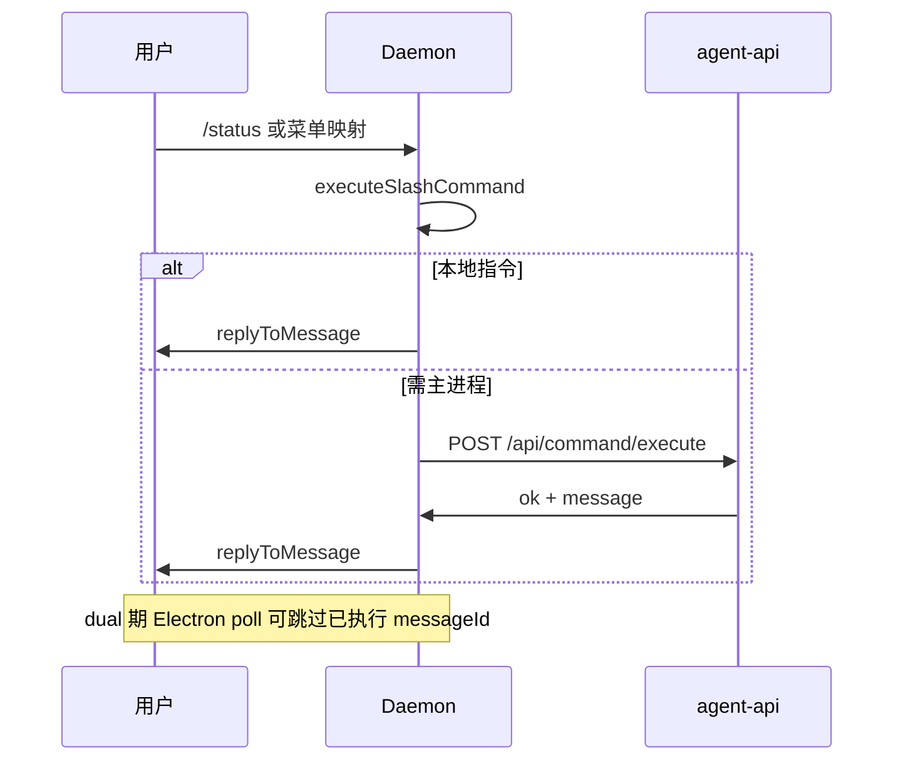

# 远程指令

## 一、能力范围

飞书/微信 `/` 指令与菜单映射：Daemon `executeSlashCommand` 即时执行；主进程指令经 `POST /api/command/execute`。合并卡四入口共用 `handleMergeBatchAction`。`dual|electron` 保留 `.fcmd` 兼容。

## 二、设计决策与取舍

- **Daemon SSOT**：`executeSlashCommand` 分 local/mcp/electron；`replyToMessage` 内联（dual poll 仍可用 `/cmd/result`）。
- **Electron 后端**：`command-executor.executeFileCommand`；未就绪中文提示。
- **`SLASH_EXEC_MODE`**：默认 `dual`；稳态 `daemon`；回滚 `electron`。
- **权限**：通道准入通过即可用全量斜杠；`isMainUser` 仅会话键解析。
- **菜单**：`menu_v6` → `handleSlashCommand(..., "menu")`。
- **合并卡**：四入口 SSOT `handleMergeBatchAction`（见 §三表）。

## 三、服务端规则

`handleCommand`：T8 `/merge` 前置 → 按 `SLASH_EXEC_MODE` 路由（见 [Daemon 02-HTTP](../../工程平台/Daemon守护进程/02-HTTP与MCP服务.md)）。

指令按首 token 路由（不区分大小写）。

| 指令 | 权限 | 行为摘要 |
|------|------|----------|
| `/stop` | 全员 | 仅停当前会话 Agent（`resolveCommandSessionKey` 后 `stopSessionAgent`） |
| `/status` | 全员 | Daemon/Agent/队列统计 |
| `/reset` | 全员 | 停会话 Agent + 清空 resume |
| `/help` | 全员 | `buildHelpText()` 全量指令列表 |
| `/list` `/clean` `/restart` | 全员 | 队列列表/清空/重启 Daemon |
| `/workspace` `/model` `/mcp` | 全员 | 配置 CRUD |
| `/task` `/workflow` `/chat` | 全员 | 任务/工作流/临时会话 |
| `/merge` | 全员 | send/split/edit 子命令；未知子命令返回用法 |

**合并控制（多入口，SSOT `handleMergeBatchAction`）**：

| 动作 | 入口 | 说明 |
|------|------|------|
| send_now | 按钮 `merge_send_now`、斜杠 `/merge`/`/merge send`、HTTP `merge-batch/action` | collecting→ready→`flushReadyMergeBatches` |
| split | 按钮 `merge_split`、斜杠 `/merge split`、HTTP 同上 | 取消合并，逐条 dispatch |
| edit | 按钮 `merge_edit`（无内联正文→F3 引导）、斜杠 `/merge edit <正文>`、HTTP 或回复合并卡 | 设置 overrideText |

**飞书菜单 event_key**（`FEISHU_MENU_EVENT_MAP`，须与后台一致）：

| event_key | 等价斜杠 | 权限 |
|-----------|----------|------|
| cmd_help | `/help` | 全员 |
| cmd_status | `/status` | 全员 |
| cmd_reset | `/reset` | 全员 |
| cmd_stop | `/stop` | 全员 |
| cmd_workspace | `/workspace` | 全员 |
| cmd_model | `/model` | 全员 |
| cmd_chat_new | `/chat new` | 全员 |

## 四、客户端流程

## 五、接口

进程内：`executeSlashCommand`、`handleCommand`。HTTP 路由见 [Daemon 02-HTTP](../../工程平台/Daemon守护进程/02-HTTP与MCP服务.md) §五。

## 六、数据

- 命令文件：`FileCommand { id, command, messageId, chatId? }`

## 七、非功能与可观测

指令写日志；异常仍 reply。

## 八、推送

无。

## 九、已知限制与 TODO

- `/mcp` 已 HTTP 化；健康列待 Electron `status-map`（R2）。
- `slash_exec` 缺 `source=im|menu`（R1）；默认仍 `dual`（R3 双写窗口）。
- README `/task trigger` vs `/task run`。

## 十、变更记录

2026-07-12：斜杠 Daemon SSOT 与 `/mcp` HTTP（archive 20260712113307）。
2026-07-12：合并卡双入口（archive 20260712113253）。
2026-06-27：合并卡 HTTP；`/chat new`（archive 20260627162620）。
