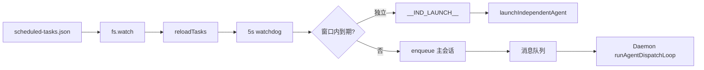

# 定时任务

## 一、能力范围

基于 Cron 表达式的计划任务：配置持久化、Daemon 侧 watchdog 触发、独立 Agent 或入主会话队列、UI/飞书远程 CRUD。不负责任务内容的具体 Agent 执行逻辑。

## 二、设计决策与取舍

- **双端读写同一文件**：`{userData}/scheduled-tasks.json`；Electron 用 `cron-scheduler.ts`，Daemon 用 `daemon-scheduled-tasks.ts`。
- **Watchdog 非 setTimeout 链**：5s 轮询扫描时间窗口，避免锁屏节流丢触发。
- **Catchup 上限 30min**：睡眠过久唤醒不补跑过期槽位（`CATCHUP_MAX_MS`）。
- **独立模式默认开启**：`independent !== false` 时 spawn 独立 sessionKey=task.id；否则 enqueue 主会话。
- **热重载**：watch `scheduled-tasks.json` 变更 500ms 防抖 reload。

## 三、服务端规则

1. 启用任务（`enabled!==false`）且 cron 合法才注册。
2. 槽位去重：`firedSlotKeys` = `{taskId}:{fireTime}`。
3. 触发消息格式：`[定时任务: {name}] (触发时间: ...)\n\n{content}`。
4. 独立触发：Daemon stdout `__IND_LAUNCH__:` → Main `launchIndependentAgent`（可带 channelId/model）。
5. 非独立：enqueue 到通道主会话。
6. `/task create` 默认 enabled，绑定当前通道。

## 四、客户端流程

**UI 手动触发**：IPC `scheduled-tasks:trigger` 或 `/task run <序号>`，内容附加「手动触发」时间戳。

## 五、接口

| API | 说明 |
|-----|------|
| `readTasksFromFile` / `writeTasksToFile` | Electron 读写 |
| `validateCron` / `previewCronNextRuns` | node-cron + cron-parser |
| `startDaemonScheduledTasks` | Daemon 启动调度 |
| `handleFeishuTaskCommand` | 远程 CRUD |

**ScheduledTask 字段**：id, name, cron, content, enabled, independent?, channelId?, model?, modelParams?

## 六、数据

- 存储路径：`app.getPath("userData")/scheduled-tasks.json`
- 迁移：旧配置迁移时可 `patchScheduledTasks` 补 channelId
- 运行状态：`getIndependentTaskStatuses()` 汇总 chatType=task/temp 的 CLI+SDK 会话

## 七、非功能与可观测

单 tick 最多 10000 次 fire；去重集 >2000 清空；Daemon 日志 `[定时任务]`；`/status` 统计启停数。

## 八、推送

无（触发后走 Agent 回复或独立会话输出）。

## 九、已知限制与 TODO

- 需应用保持运行；完全退出后不触发。
- Cron 校验 Electron 用 `node-cron.validate`，Daemon 用 `cron-parser.parse`（表达式需两端均合法）。
- UI 创建任务未暴露 independent 开关时默认为独立模式。

## 十、变更记录

- 2026-07-11：非独立 enqueue 后调度节点改为 Daemon `runAgentDispatchLoop`。
- 2026-06-27：kb-sync 初始建立。
