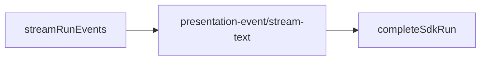

# Cursor SDK 执行引擎

## 一、能力范围

`@cursor/sdk` 在 Electron 主进程执行 IM/任务/工作流：`Agent.create`、`agent.send`、Presentation、MCP inline+`settingSources`、`agent-api` HTTP。`sdk-run-stream` 消费事件流；`sdk-run-recover` 重启续接。出站：`presentation-event`+`stream-text`。

**不负责**：Daemon 队列、其他引擎（07–09）；Settings 见 [Electron §五](../../工程平台/Electron桌面应用/02-主进程与IPC.md)。

## 二、设计决策与取舍

- **API**：长驻+二次 send；**事件流 SSOT**：`for await (run.stream())` 驱动呈现，`run.wait()` 仅收尾 usage。
- **MCP**：inline HTTP/sse/OAuth；stdio `settingSources`；`Agent.resume` 重传 inline。
- **续接**：`sdk-active-runs.json`；`userStopped` 不再续接。
- **Presentation**：thinking/task 始终 `postPresentationEvent`（不受分级）；tool_call 经 `resolveSdkToolPresentationTier`（`src/shared/sdk-tool-presentation-tier.ts`）分级：notify（shell/write/strreplace/delete/task）→ `markProcessEventSeen`+`postPresentationEvent`；silent（read/glob 等默认）跳过出站，`pushUiLog` `[tool]` 与 `lastTool` 全量；assistant→`stream-text`（400ms）。飞书抑制 daemon 里程碑降级。
- **PRESENTATION_ORDERING**（p2p+f41）：notify tool/thinking 置 `seenProcessEvent`+`presentationDeferStream`；task 不置闩；释放 `seenProcessEvent||presentationDeferStream`。

## 三、服务端规则

1. `type:"sdk"`+API Key；模型空→`composer-2`；非超时 error→`failedCooldowns` 30s。
2. **watchdog**：`tool_running`/`awaiting_user`/`lastTool.running` 豁免 idle 取消。
3. **handleSdkEvent**：thinking→mark+post；task→`mapTaskMilestoneText`→post（不 mark）。**tool_call**：`resolveSdkToolPresentationTier`→notify 走 `markProcessEventSeen`+`postPresentationEvent`；silent 仅日志/`lastTool`/runPhase，跳过 mark 与出站。非 running 时 `maybeReleaseDeferredAssistant`。
4. **markProcessEventSeen**：task 或飞书抑制 kind 不置 defer 闩；否则 `seenProcessEvent`+`presentationDeferStream`。
5. **maybeReleaseDeferredAssistant**：闩已置时 flush assistant。

## 四、客户端流程

`launchSdkAgent`/`dispatchToSdkAgent`→`startSdkRun`→`streamRunEvents`→`completeSdkRun`；init `recoverSdkActiveRuns`。Settings 四 Tab；Skills project/user 双区块。

## 五、接口

`launchSdkAgent`/`dispatchToSdkAgent`；`POST /api/agent/launch|dispatch`。出站 `presentation-event`（含 `task`）、`stream-text`。

## 六、数据

`SdkSessionAgent`：`runPhase`、`seenProcessEvent`、`presentationDeferStream`、呈现游标。`PresentationEvent` 含 `task_status`/`task_text`。磁盘 `sdk-active-runs.json`。

## 七、非功能与可观测

RunGuard+watchdog；`[tool]`/`[task]` 日志全量；400ms 节流；Run 收尾强制 flush。

## 八、推送

`presentation-event`+`stream-text` 出站 IM。thinking/task 始终 presentation；assistant 仅 stream-text。tool_call：notify 仍 `presentation-event`；read/glob 等 silent 默认不出站 IM。飞书抑制 notify CardKit，daemon `sendMilestoneText` 降级（3s 节流、≤4 次/Run）。

## 九、已知限制与 TODO

续接依赖 SDK Run；持久化含 apiKey；飞书过程为文本里程碑非 CardKit。

## 十、变更记录

- 2026-07-04：SDK 工具调用通知分级；read/glob 等静默；shell/write/delete/Task 仍通知（archive 20260704183752）。
- 2026-07-04：SDK think/task 实时通知；task 独立分支、飞书 daemon 降级（archive 20260704174846）。
- 2026-07-02：Skills、事件流 SSOT、watchdog 续接、MCP 分层（archive 20260701212732–120631）。
- 2026-06-30：十段式；移除 CLI（archive 20260629232914）。
