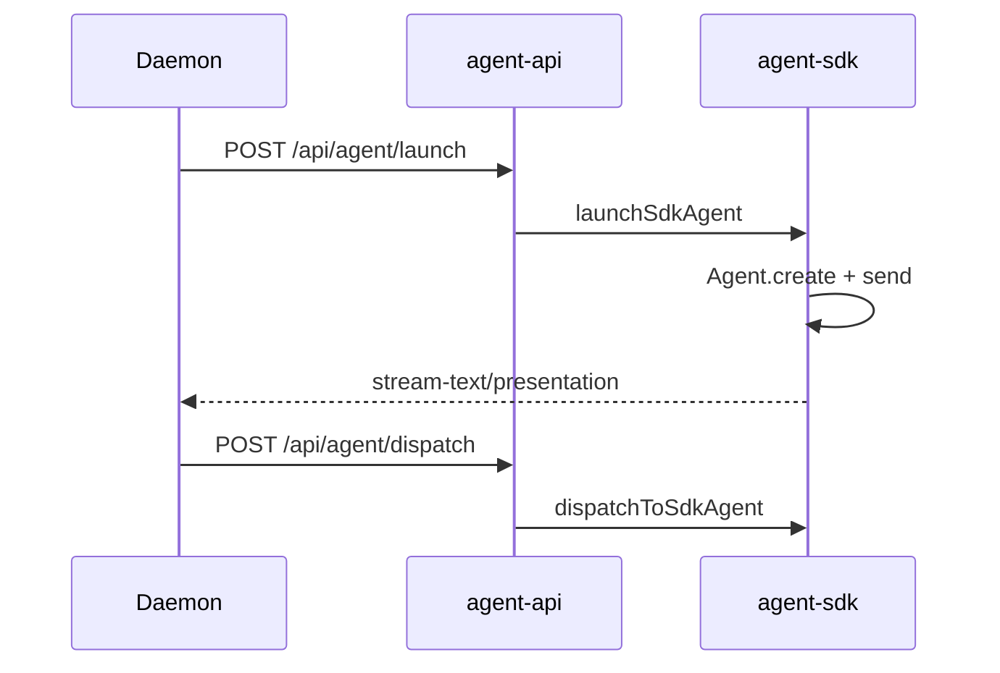

# Cursor SDK 执行引擎

## 一、能力范围

负责 `@cursor/sdk` 在 Electron 主进程内的 IM/任务/工作流执行：`Agent.create`、`agent.send`、`run.stream()`、Presentation 出站、MCP 内联与 `agent-api` HTTP 服务。

**不负责**：Daemon 队列 claim、消息通道连接、Claude Agent 引擎（见 [07-ClaudeCodeSDK执行引擎](./07-ClaudeCodeSDK执行引擎.md)）。

## 二、设计决策与取舍

- **包/API**：`Agent.create` + `agent.send` + `run.stream()`（`electron/agent-sdk.ts`）；本应用采用长驻 + 二次 send，非 `Agent.prompt` 一次性。
- **路由**：IM → Daemon → `agent-api`；任务/工作流 → `session-dispatcher.launchAgent` → Daemon launch。
- **长驻**：`SDK_RESIDENT_AGENT` 默认开；Run 结束保留实例，连发 `dispatchToSdkAgent`。
- **MCP inline**：`mcp-sdk-loader` 合并 mcp.json + OAuth；每次 send 重传 `mcpServers`。
- **无 resume**：无跨进程续接；ContextRotation-lite 超阈值重建 Agent。

## 三、服务端规则

1. 通道 `agentResource.type === "sdk"` 且配 API Key；模型空/`auto` → `composer-2`。
2. 非超时 error 写 `failedCooldowns`（30s）；超时经 `finalizeSdkRunOnTimeout` 清 session（长驻亦清理）。
3. `acquireRunGuard` 同 sessionKey 单飞；processing = `run !== null || pendingDispatch`。
4. legacy CLI 绑定（`agentResourceId === "cli"` 或 `type:"cli"`）返回固定错误。

## 四、客户端流程

任务/工作流：`launchSdkAgentFromHttp` 解析工作目录与模型。

## 五、接口

| 入口 | 说明 |
|------|------|
| `launchSdkAgent` / `dispatchToSdkAgent` | 首条 create+send / 长驻二次 send |
| `POST /api/agent/launch\|dispatch` | Daemon 契约；端口见 `agent-api-port.json` |
| `checkSdkApiKey` / `listSdkModels` | 设置页 API Key 与模型列表 |

## 六、数据

- **SdkSessionAgent**：sessionKey、agent、run、residentMode、pendingDispatch、contextUsage、runGuardToken、f41Stream 等（`agent-sdk.ts`）。
- **配置**：`config-store` 的 `AgentResource`（`type:"sdk"`, `apiKey`）；通道 `agentResourceId` 绑定。

## 七、非功能与可观测

- RunGuard + idle watchdog（`SDK_IDLE_TIMEOUT_MS`）；`NEVER_CANCEL_ON_DURATION` 默认 true。
- 日志：`dispatch_retry`、`watchdog`、`dispatch_failed`、`[compression]`。
- f41Eligible → `/api/stream-text`；tool/thinking → `/api/presentation-event`。

## 八、推送

无独立推送；IM 出站经 Daemon `/api/send-text`、`/api/stream-text`、`/api/presentation-event`。

## 九、已知限制与 TODO

- SDK 无 `Agent.resume` 级跨进程续接；超时 finalizer 会 `agent.close()` 并删 Map 条目。
- 自动压缩依赖 harness 默认 summarization，LocalAgentOptions 无显式 `autoCompress` 字段。
- Ripgrep 平台包 `@cursor/sdk-{platform}-{arch}` 须 asar 解包（`ensureSdkBinaryPaths`）。

## 十、变更记录

- 2026-06-30：新增十段式文档（kb-sync lite）。
- 2026-06-30：移除 Cursor CLI，统一 sdk/cc 路由（archive 20260629232914）。
