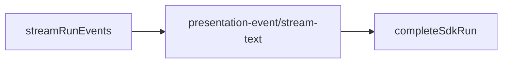

# Cursor SDK 执行引擎

## 一、能力范围

`@cursor/sdk` 在 Electron 执行 IM/任务/工作流：`Agent.create`、`agent.send`、Presentation、MCP inline+`settingSources`、`agent-api` HTTP。`sdk-run-stream` 消费事件流；`sdk-run-recover` 重启续接。出站：`presentation-event`+`stream-text`。

**不负责**：Daemon 队列、其他引擎（07–09）。

## 二、设计决策与取舍

- **API**：长驻+二次 send；**事件流 SSOT**：`for await (run.stream())` 驱动呈现，`run.wait()` 仅收尾 usage。
- **MCP**：inline HTTP/sse/OAuth；stdio `settingSources`；`Agent.resume` 重传 inline。
- **续接**：`sdk-active-runs.json`；`userStopped` 不再续接。
- **Presentation**：thinking/task 始终 post；tool 分级 notify→mark+post、silent 仅日志；assistant→stream-text（400ms）。飞书抑制→里程碑；Electron POST+置闩。
- **PRESENTATION_ORDERING**（p2p+f41）：thinking/notify-tool/task 经 mark 置 defer 闩；抑制≠defer；Daemon `sendMilestoneText` sent 时亦置 `presentationProcessActive`。**ordering 闩锁与 Rev2 分工**：闩锁仍标记含过程应 defer assistant；Rev2 将 release 从过程 idle 改为 Run final 唯一出站。**Rev2 end-only**：含过程 Run 过程未结束前 assistant **零 IM 出站**；`shouldEndOnlyAssistantDefer` 禁止 Electron mid-run release；Daemon 禁用 process-idle `enqueueRelease`，`handleStreamText` defer-only 直至 final；里程碑 `sendMilestoneText` 行为不变。
- **release 串行与 Run 收尾**：`assistantReleaseChain` 仅服务 final 首建；Run 收尾 `flushStreamPost(true)` 为 ordering+含过程场景唯一 assistant 出站，无 non-final 双 POST。

## 三、服务端规则

1. `type:"sdk"`+API Key；模型空→`composer-2`；非超时 error→`failedCooldowns` 30s。
2. **watchdog**：`tool_running`/`awaiting_user`/`lastTool.running` 豁免 idle 取消。
3. **handleSdkEvent**：thinking→mark+post；task→`mapTaskMilestoneText`→**mark**→post（task 只置闩、不单独 release）。**tool_call**：notify→`markProcessEventSeen`+`postPresentationEvent`；silent 仅日志/`lastTool`/runPhase。非 running 时 `maybeReleaseDeferredAssistant`（**Rev2**：`shouldEndOnlyAssistantDefer` 时为 no-op）。
4. **markProcessEventSeen**：仅 ordering 门控；thinking/tool/task 均置 defer 闩（不因飞书抑制早退）。Daemon：`sendMilestoneText` sent 时置 `presentationProcessActive`（task 仅该字段）；**不**在 process-idle 时 release assistant。
5. **Rev2 end-only**：ordering+已见过程时 `maybeReleaseDeferredAssistant`/`flushDeferredStreamPost`/`doFlushStreamPost` non-final 均 no-op；assistant 首建仅 Run 收尾 `flushStreamPost(true)`。
6. **handleStreamText**：`presentationProcessActive` 且 non-final → 累积 `deferredAssistantText`、返回 `deferred: true`；final 经 `enqueueReleaseDeferredAssistantStream` 首建+完结。飞行窗口：占位无 outbound 时 await chain 再判 `isFirst`。

## 四、客户端流程

`launchSdkAgent`/`dispatchToSdkAgent`→`startSdkRun`→`streamRunEvents`→`completeSdkRun`；init `recoverSdkActiveRuns`。

## 五、接口

`launchSdkAgent`/`dispatchToSdkAgent`；`POST /api/agent/launch|dispatch`。出站 `presentation-event`（含 `task`）、`stream-text`。

## 六、数据

`SdkSessionAgent`：`runPhase`、`seenProcessEvent`、`presentationDeferStream`。磁盘 `sdk-active-runs.json`。

## 七、非功能与可观测

RunGuard+watchdog；400ms 节流；Rev2 end-only：含过程 Run 收尾单次 `flushStreamPost(true)` 为唯一 assistant IM 出站。

## 八、推送

`presentation-event`+`stream-text` 出站。thinking/task 始终 presentation；assistant 仅 stream-text；notify tool 仍 presentation-event；silent 不出站。飞书抑制→`sendMilestoneText`（3s、≤4/Run）。

## 九、已知限制与 TODO

续接依赖 SDK Run；飞书过程为文本里程碑。

## 十、变更记录

- 2026-07-04：Rev2 end-only assistant IM——过程实时出站、答复仅 Run final 首建流式完结；禁用 process-idle release（archive 20260704190748 Rev2）。
- 2026-07-04：T-FIX release 串行化与飞行窗口门控（archive 20260704190748 复归档）。
- 2026-07-04：ordering 闩统一（task/飞书里程碑参与 defer；抑制≠defer）（archive 20260704190748）。
- 2026-07-04：SDK 工具调用通知分级；read/glob 等静默；shell/write/delete/Task 仍通知（archive 20260704183752）。
- 2026-07-04：SDK think/task 实时通知；task 独立分支、飞书 daemon 降级（archive 20260704174846）。
- 2026-07-02：Skills、事件流 SSOT、watchdog、MCP（archive 20260701212732）。
- 2026-06-30：十段式；移除 CLI（archive 20260629232914）。
