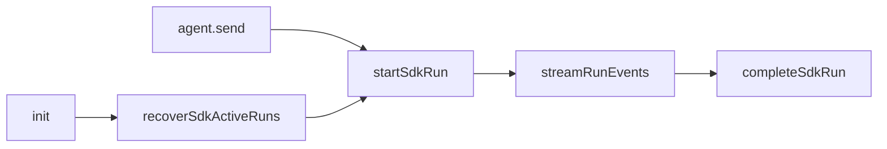

# Cursor SDK 执行引擎

## 一、能力范围

`@cursor/sdk` 在 Electron 主进程执行 IM/任务/工作流：`Agent.create`、`agent.send`、Presentation、MCP inline + `settingSources`、`agent-api` HTTP。运行期 `sdk-run-stream` 消费事件流；主进程重启 `sdk-run-recover` 有条件续接。

**不负责**：Daemon 队列、其他引擎（07–09）；Settings CRUD 见 [Electron §五](../../工程平台/Electron桌面应用/02-主进程与IPC.md)。

## 二、设计决策与取舍

- **API**：长驻 + 二次 send（`agent-sdk.ts` + `sdk-run-dispatch.ts`）。
- **事件流 SSOT**：`streamRunEvents` 经 `for await (run.stream())` 驱动呈现与活跃时钟；`run.wait()` 仅收尾读 usage。
- **onDelta**：`createAgentSendOptions.onActivity` → `markSessionActivity("onDelta")`。
- **MCP**：HTTP/sse/OAuth inline；stdio `settingSources`；`Agent.resume` 重传 inline。
- **续接**：`sdk-active-runs.json` 快照；init `recoverSdkActiveRuns`；`userStopped` 不再续接；失败一次 IM 提示。
- **cwd/resident/settingSources**：通道 cwd 可能与 Settings 主工作区不一致；resident 每次 send 重传 inline。

## 三、服务端规则

1. `type:"sdk"` + API Key；模型空 → `composer-2`。
2. 非超时 error → `failedCooldowns` 30s；超时清 session。
3. `mergeMcpJsonEntries`：project 覆盖 global；inline 覆盖 settingSources。
4. **watchdog**（`sdk-run-watchdog.ts`）：`running→draining→cancelling`；`NEVER_CANCEL_ON_DURATION` 默认 true；`tool_running`/`awaiting_user`/`lastTool.running` 豁免 idle 取消。
5. **runPhase**：`handleSdkEvent` 写入 `executing|tool_running|awaiting_user`。

### 官方配置来源

| 项 | 项目 | 用户 | 加载 | 优先级 |
|----|------|------|------|--------|
| MCP | `.cursor/mcp.json` | `~/.cursor/mcp.json` | settingSources+inline | inline>project>user |
| Rules | `.cursor/rules/*` | settingSources | settingSources | project>user |
| Skills | `.cursor/skills/` | `~/.cursor/skills/` | settingSources | project>user |

## 四、客户端流程

同链路：`launchSdkAgent`/`dispatchToSdkAgent` → `agent.send` → `startSdkRun` → `armRunWatchdog`+`streamRunEvents` → `completeSdkRun`。

**续接**：`listRecoverableSdkRuns` → `Agent.resume`+`getRun` → 终态 `notifyResumeFailure` 一次，否则挂 `startSdkRun` 补消费。

**Settings → SDK**：四 Tab；Skills 双区块 project/user；Dashboard 标注来源。

## 五、接口

`launchSdkAgent`/`dispatchToSdkAgent`；`POST /api/agent/launch|dispatch`。内部：`persistActiveSdkRun`/`clearActiveSdkRun`/`recoverSdkActiveRuns`/`markSdkRunUserStopped`。

## 六、数据

`SdkSessionAgent`：`runPhase`、呈现游标、`lastInjectedMcpServers`。磁盘 `userData/sdk-active-runs.json`（sessionKey upsert，含 apiKey/agentId/runId/`userStopped`）。`config-store` `AgentResource`。

## 七、非功能与可观测

RunGuard+watchdog；`[recover]`/`[tool]`/`[status]` 日志；f41 400ms 节流；写盘失败 WARN 不阻断。

## 八、推送

无；IM 经 Daemon send-text/stream-text/presentation-event。

## 九、已知限制与 TODO

续接依赖 SDK Run；stdio 依赖 settingSources；持久化含 apiKey。

## 十、变更记录

- 2026-07-02：Skills 双来源与 Settings 界面（archive 20260702120631）。
- 2026-07-02：事件流 SSOT、watchdog 活动豁免、重启续接与 sdk-active-runs（archive 20260701212827）。
- 2026-07-02：MCP 分层、Settings 四 Tab（archive 20260701212732）。
- 2026-06-30：十段式；移除 CLI（archive 20260629232914）。
