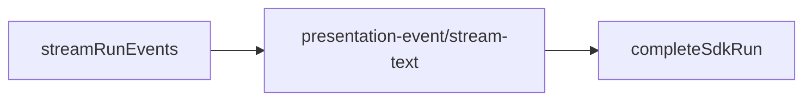

# Cursor SDK 执行引擎

## 一、能力范围

`@cursor/sdk` 在 Electron 执行 IM/任务/工作流：`Agent.create`、`agent.send`、Presentation、MCP inline+`settingSources`、`agent-api` HTTP。`sdk-run-stream` 消费事件流；`sdk-run-recover` 重启续接。出站：`presentation-event`+`stream-text`。

**不负责**：Daemon 队列、其他引擎（07–09）。

## 二、设计决策与取舍

- **API**：长驻+二次 send；**事件流 SSOT**：`for await (run.stream())` 驱动呈现，`run.wait()` 仅收尾 usage。
- **MCP**：inline HTTP/sse/OAuth；stdio `settingSources`；`Agent.resume` 重传 inline。
- **续接**：`sdk-active-runs.json`；`userStopped` 不再续接。
- **Presentation**：thinking/task 始终 post（飞书 thinking **零里程碑出站**）；tool 分级 notify→mark+post、silent 仅日志；assistant→stream-text（400ms）；**飞书 f41** assistant delta 只累积 buffer，Run 收尾 `flushFeishuPlainAssistantIfNeeded` → `POST /api/send-text`（不走 stream-text CardKit）。飞书 tool/task 抑制→`formatToolMilestoneText` / `mapTaskMilestoneText` 里程碑；Electron POST+置闩。**与 A Rev2 end-only 正交**；supersede A·F8.1 飞书 thinking 实时里程碑部分。
- **PRESENTATION_ORDERING**（p2p+f41）：thinking/notify-tool/task 经 mark 置 defer 闩；抑制≠defer；Daemon `sendMilestoneText` sent 时亦置 `presentationProcessActive`。**ordering 闩锁与 Rev2 分工**：闩锁仍标记含过程应 defer assistant；Rev2 将 release 从过程 idle 改为 Run final 唯一出站。**Rev2 end-only**：含过程 Run 过程未结束前 assistant **零 IM 出站**；`shouldEndOnlyAssistantDefer` 禁止 Electron mid-run release；Daemon 禁用 process-idle `enqueueRelease`，`handleStreamText` defer-only 直至 final；里程碑 `sendMilestoneText` 行为不变。
- **release 串行与 Run 收尾**：`assistantReleaseChain` 仅服务 final 首建；Run 收尾 `flushStreamPost(true)` 为 ordering+含过程场景唯一 assistant 出站，无 non-final 双 POST。
- **watchdog**：idle 默认 30min（`SDK_IDLE_TIMEOUT_MS` 可覆盖），absolute 默认 7min（`SDK_RUN_WATCHDOG_MS`/`PLATFORM_RUN_LIMIT_MS`），二者解耦；`NEVER_CANCEL_ON_DURATION` 默认 true 不按总时长硬杀。`tool_running`/`awaiting_user`/`lastTool.running` 豁免 idle 取消。`onTimeout` 在 `cancelRunAndWait` 前置 `watchdogTimedOut` 闩（对称 CC；用户 stop 不置闩，`resetSdkRunPresentationState` 清零）；`markSessionActivity` 在 `cancelling`/闩已置时禁止 `activity_resume`（防 stream CANCELLED 复活 watchdog）。

## 三、服务端规则

1. `type:"sdk"`+API Key；模型空→`composer-2`；非超时 error→`failedCooldowns` 30s。
2. **watchdog**：`tool_running`/`awaiting_user`/`lastTool.running` 豁免 idle 取消。
3. **handleSdkEvent**：thinking→mark+post（飞书 daemon 零出站）；task→递增 `taskSeq`→`mapTaskMilestoneText`→**mark**→post（task 只置闩、不单独 release）。**tool_call**：notify→`markProcessEventSeen`+`postPresentationEvent`；silent 仅日志/`lastTool`/runPhase。非 running 时 `maybeReleaseDeferredAssistant`（**Rev2**：`shouldEndOnlyAssistantDefer` 时为 no-op）。
4. **markProcessEventSeen**：仅 ordering 门控；thinking/tool/task 均置 defer 闩（不因飞书抑制早退）。Daemon：`sendMilestoneText` sent 时置 `presentationProcessActive`（task 仅该字段）；**不**在 process-idle 时 release assistant。
5. **Rev2 end-only**：ordering+已见过程时 `maybeReleaseDeferredAssistant`/`flushDeferredStreamPost`/`doFlushStreamPost` non-final 均 no-op；assistant 首建仅 Run 收尾 `flushStreamPost(true)`。
6. **handleStreamText**：`presentationProcessActive` 且 non-final → 累积 `deferredAssistantText`、返回 `deferred: true`；final 经 `enqueueReleaseDeferredAssistantStream` 首建+完结。飞行窗口：占位无 outbound 时 await chain 再判 `isFirst`。
7. **pre-send 上下文保护**：`sendWithRetry` 首 attempt 经 `maybeRotateSessionForPressure` 评估并写 `lastPreSend*`；ratio≥100% 强制首轮轮转，失败则 `context_blocked` 快拒（详见 [10-SDK上下文保护与失败归因](./10-SDK上下文保护与失败归因.md)）。
8. **长驻空闲刷新**：idle≥15min（`RESIDENT_STALE_IDLE_MS`）时 dispatch/`sendWithRetry` 前按 ContextRotation 安全顺序重建 Agent（`resident-refresh`）；create 失败保留旧实例。
9. **静默早期 ERROR 一次重试**：无 message/result/tool、短 duration 的 opaque ERROR 经 `opaque_retry` 重建并重发一次；成功不向用户 notify；非上下文静默失败文案为临时故障/请重试（上下文≥95% 仍走上限文案）。

## 四、客户端流程

`launchSdkAgent`/`dispatchToSdkAgent`→`startSdkRun`→`streamRunEvents`→`completeSdkRun`；init `recoverSdkActiveRuns`。

## 五、接口

`launchSdkAgent`/`dispatchToSdkAgent`；`POST /api/agent/launch|dispatch`。出站 `presentation-event`（含 `task`）、`stream-text`。

## 六、数据

`SdkSessionAgent`：`runPhase`、`seenProcessEvent`、`presentationDeferStream`、`lastPreSendUsedTokens`/`lastPreSendUsageRatio`（pre-send 快照）、`lastSendText`/`opaqueRetryDone`（opaque_retry）。磁盘 `sdk-active-runs.json`。

## 七、非功能与可观测

RunGuard+watchdog（idle 30min / absolute 7min 解耦，`SDK_IDLE_TIMEOUT_MS` 可覆盖 idle）；400ms 节流；Rev2 end-only：含过程 Run 收尾单次 `flushStreamPost(true)` 为唯一 assistant IM 出站。失败 IM：`notifySdkFailure` / `notifyPreSendContextFailure`（pre-send 与 peak 归因见 10）。

## 八、推送

`presentation-event`+`stream-text` 出站（飞书 f41 assistant 仅 Run 收尾 plain `send-text`）。thinking/task 始终 presentation（**飞书 thinking 零里程碑**）；assistant 非飞书 f41 走 stream-text；notify tool 仍 presentation-event；silent 不出站。飞书 tool/task 抑制→`sendMilestoneText`（3s、≤4/Run）：shell/Task **tool_call** started 经 `formatToolMilestoneText`（shell 命令摘要；Task 含 `tool_task_description`→`正在执行：{描述}`）；task **事件** started 含描述或 `#序号`（`mapTaskMilestoneText`+`taskSeq`）。watchdog 竞态仅单次 `sdk_timeout`（`watchdogTimedOut` 闩去重 status/stream/complete 收尾）。与 A Rev2 end-only 正交；supersede A·F8.1 飞书 thinking 部分。

## 九、已知限制与 TODO

续接依赖 SDK Run；飞书过程为文本里程碑。

## 十、变更记录

- 2026-07-11：长驻空闲 resident-refresh + 静默早期 ERROR opaque_retry + 非上下文临时故障文案（hotfix-lite 20260711113147）。
- 2026-07-05：pre-send 上下文保护、context_blocked 快拒与失败文案归因（见 [10-SDK上下文保护与失败归因](./10-SDK上下文保护与失败归因.md)；archive 20260705230806）。
- 2026-07-05：SDK idle 默认 30min（`SDK_IDLE_TIMEOUT_MS` 可覆盖），与 absolute 7min 解耦（archive 20260705211057-SDK idle超时延长至30分钟）。
- 2026-07-05：飞书 f41 assistant plain 收尾（`feishu-plain-assistant-reply`，Run 末条 send-text）。
- 2026-07-04：`watchdogTimedOut` 闩与 activity 门控、超时收尾去重；Task tool_call 飞书 started 含描述（archive 20260704223914）。
- 2026-07-04：飞书 started 里程碑文案补强（shell 命令摘要、task 描述/序号）+ 飞书 thinking 零出站（archive 20260704212706；supersede A·F8.1 飞书 thinking 部分）。
- 2026-07-04：Rev2 end-only assistant IM——过程实时出站、答复仅 Run final 首建流式完结；禁用 process-idle release（archive 20260704190748 Rev2）。
- 2026-07-04：T-FIX release 串行化与飞行窗口门控（archive 20260704190748 复归档）。
- 2026-07-04：ordering 闩统一（task/飞书里程碑参与 defer；抑制≠defer）（archive 20260704190748）。
- 2026-07-04：SDK 工具调用通知分级；read/glob 等静默；shell/write/delete/Task 仍通知（archive 20260704183752）。
- 2026-07-04：SDK think/task 实时通知；task 独立分支、飞书 daemon 降级（archive 20260704174846）。
- 2026-07-02：Skills、事件流 SSOT、watchdog、MCP（archive 20260701212732）。
- 2026-06-30：十段式；移除 CLI（archive 20260629232914）。
