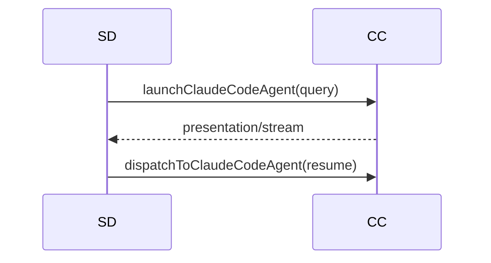

# Claude Code SDK 执行引擎

## 一、能力范围

`claude-agent-sdk` `query()` 执行：launch/dispatch、事件映射 Presentation、`cc-agent-api` HTTP、MCP 内联与 `ccSessionId` 续接。不负责 Cursor SDK（[06](./06-CursorSDK执行引擎.md)）、Daemon IM。

## 二、设计决策与取舍

- **包/API**：`query({ prompt, options })` 返可迭代 `Query`；无 CLI spawn；SDK 平台包内 `claude` 二进制（asar 解包，optional 包缺失 fallback 可能失败）。
- **resume**：`ccSessionId` 来自 `system/init`/`result`；传 `resume`。
- **长驻**：`CC_RESIDENT_AGENT` 默认开（可回退 `SDK_RESIDENT_AGENT`）；idle = `activeQuery === null`。
- **MCP inline**：`cc-mcp-loader` 读 Claude 原生源合并（优先级见 §九）；`strictMcpConfig:true` 使 SDK 只用 inline、忽略原生加载，每次 `query()` 重传。**审批门控**：inline 经 `loadApprovedInlineCcMcpServers` 过滤后注入，对齐 CC 加载；`strictMcpConfig:true` 下 SDK 忽略原生审批门控，cursor-claw 须自行复刻过滤；规则 `enableAll`→全留 / `disabled` 命中弃 / `enabled` 命中留 / 均未命中弃（Pending approval）/ user/local 不过滤。

## 三、服务端规则

1. 通道 `type === "claude-code"` 且配 API Key；默认 `claude-sonnet-4-6`。
2. `activeQuery` 非空时 launch 转 dispatch；`pendingDispatch` 防并发。
3. ContextRotation 命中清 `ccSessionId`；未配 baseUrl 时 delete 继承 `ANTHROPIC_BASE_URL`。

## 四、客户端流程

IM 委托 `launchCcAgentFromHttp`。

## 五、接口

| 入口 | 说明 |
|------|------|
| `launchClaudeCodeAgent`/`dispatchToClaudeCodeAgent` | query 首条 / resume 续跑 |
| `POST /api/cc/agent/launch\|dispatch` | 端口见 `cc-agent-api-port.json` |
| `checkClaudeCodeApiKey` | Messages API 最小校验 |
| `getSessionMcpStatus(...)` | 返 `{servers,statusMap,source}`；`toEntry` 增 `approved?`，`false` 置 `enabled:false`；三态读 `readCcProjectApproval` 计算 approvedMap |
| `getCcSession`/`getCcActiveQuery` | 按 key 取 session/Query |

## 六、数据

- **CcSessionAgent**：sessionKey、`activeQuery`、`ccSessionId`、`residentMode`、`pendingDispatch`、contextUsage；`lastMcpServersSnapshot` 于 `system/init` 浅拷贝覆写。
- **配置**：`AgentResource`（`type`/`apiKey`/`baseUrl?`/`model?`）。

## 七、非功能与可观测

- RunGuard+`armCcWatchdog`（idle/draining）；`handleSdkMessage` 映射 assistant/thinking/tool/result→Presentation。
- **MCP 取数三态**：runtime→snapshot→disk；无 session→读盘。`mapCcStatusToUi`：`connected`→`ready`、`needs-auth`→`needs_login`。**审批标记**：三态读 `readCcProjectApproval` 标 enabled/disabled；`appendDisabledPending` 补 Pending 条目；跨 ws 缓存键含 workspaceDir。

## 八、推送

无独立推送；IM 出站对称 Cursor SDK（stream-text/presentation-event/send-text）。

## 九、已知限制与 TODO

- SDK 无 `startup()`；长驻 = Map + `query(resume)`（推测）。
- MCP 优先级 project>local>user 与官方相反，同名整条覆盖。
- project scope 审批门控已实现（`readCcProjectApproval` 读 `~/.claude.json` projects[ws] enabled/disabled/enableAll）；上限：未并读 settings 源预置审批（R1 accepted_debt）。
- HTTP/sse OAuth 暂留 Cursor `mcp-auth.json`；首版 stdio-only。

## 十、变更记录

- 2026-06-30：审批门控与启用展示：project scope 审批门控过滤（`readCcProjectApproval`/`filterApprovedProjectMcp`/`loadApprovedInlineCcMcpServers`）；R1 settings 多源归并债务（archive 20260630140113）。
- 2026-06-30：spawn 改 `query()`+cc-mcp-loader（archive 20260630002838）。
- 2026-06-29：双引擎路由接入（archive 20260629164130）。
