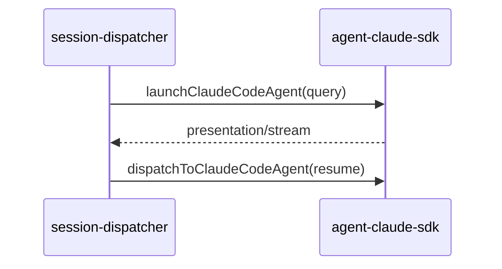

# Claude Code SDK 执行引擎

## 一、能力范围

负责 `@anthropic-ai/claude-agent-sdk` `query()` 执行：launch/dispatch、事件映射 Presentation、`cc-agent-api` HTTP、MCP 内联与 `ccSessionId` 续接。不负责 Cursor SDK 引擎（见 [06-CursorSDK执行引擎](./06-CursorSDK执行引擎.md)）、Daemon IM 队列。

## 二、设计决策与取舍

- **包/API**：`query({ prompt, options })` 返回可迭代 `Query`；无 CLI spawn（`agent-claude-sdk.ts`）。
- **resume**：`ccSessionId` 来自 `system/init`/`result` 的 `session_id`；`buildQueryOptions` 传 `options.resume`。
- **长驻**：`CC_RESIDENT_AGENT` 默认开（可回退 `SDK_RESIDENT_AGENT`）；idle = `activeQuery === null`。
- **MCP inline**：`cc-mcp-loader` 读 Claude Code 原生源（**不读 `.cursor/mcp.json`**），优先级 `{ws}/.mcp.json`(project) > `~/.claude.json` projects[ws].mcpServers(local) > 顶层 mcpServers(user)，同名整条覆盖（`readClaudeJsonMcpServers` 出 user+local，`mergeMcpJsonEntries` 叠 project）。`buildQueryOptions` 设 `strictMcpConfig: true` 使 SDK 只用 inline、忽略原生加载；每次 `query()` 重传，日志 `[mcp] inline N servers`。
- **二进制**：`@anthropic-ai/claude-agent-sdk-{platform}-{arch}` 内 `claude`（asar 解包）。

## 三、服务端规则

1. 通道 `type === "claude-code"` 且配 API Key；默认模型 `claude-sonnet-4-6`。
2. resident 且 `activeQuery` 非空时 launch 转 dispatch。
3. dispatch 须已有 session；`pendingDispatch`/`activeQuery` 防并发。
4. ContextRotation 命中清 `ccSessionId`；未配 baseUrl 时 delete 继承 `ANTHROPIC_BASE_URL`。

## 四、客户端流程

IM：Daemon `/api/agent/launch` 通道路由 claude-code 时委托 `launchCcAgentFromHttp`。

## 五、接口

| 入口 | 说明 |
|------|------|
| `launchClaudeCodeAgent`/`dispatchToClaudeCodeAgent` | query 首条 / resume 续跑 |
| `POST /api/cc/agent/launch\|dispatch` | 端口见 `cc-agent-api-port.json` |
| `checkClaudeCodeApiKey` | Messages API 最小校验 |
| `getSessionMcpStatus(sessionKey, force?, engineType?, workspaceDir?)` | 取 MCP 状态，返 `{servers,statusMap,source}` |
| `getCcSession`/`getCcActiveQuery` | 按 key 取 session/活跃 Query（`agent-cc-session-registry.ts`） |

## 六、数据

- **CcSessionAgent**：sessionKey、`activeQuery`、`ccSessionId`、`residentMode`、`pendingDispatch`、contextUsage（`agent-cc-types.ts`）；`lastMcpServersSnapshot: Array<{name,status,config?,scope?,tools?}>` 由 `handleSdkMessage` 于 `system/init` 浅拷贝 `msg.mcp_servers` 覆写，idle/complete 不清。
- **配置**：`AgentResource`（`type:"claude-code"`,`apiKey`,`baseUrl?`,`model?`）。

## 七、非功能与可观测

- RunGuard+`armCcWatchdog`（idle/draining），`NEVER_CANCEL_ON_DURATION` 默认 true。
- `handleSdkMessage` 映射 assistant/thinking/tool/result→Presentation 与 context usage。
- **MCP 取数三态**：`getSessionMcpStatus`：activeQuery→`mcpServerStatus()`(runtime)→`lastMcpServersSnapshot`(snapshot，缺 config 读盘补)→读盘(disk)；无 session+`engineType=claude-code`→读盘。`mapCcStatusToUi`：`connected`→`ready`、`needs-auth`→`needs_login`。日志 `cc_session_id=`/`[mcp] inline N servers`/`watchdog`/`上下文轮转`。

## 八、推送

无独立推送；IM 出站对称 Cursor SDK（stream-text/presentation-event/send-text）。

## 九、已知限制与 TODO

- SDK 无 `startup()`；长驻 = Map + `query(resume)`（**待确认/推测**）。
- `bypassPermissions` 为 harness 取舍；optional 包缺失 fallback `claude` 可能失败。
- MCP 优先级 project>local>user 与官方（local>project>user）相反。
- 未实现 project scope 审批门控，首版全量加载 `.mcp.json`。
- HTTP/sse OAuth 暂留 Cursor `mcp-auth.json`，首版 CC MCP stdio-only。

## 十、变更记录

- 2026-06-30：十段式文档；spawn 改 `query()`+cc-mcp-loader（archive 20260630002838）；MCP 配置源改读 Claude 原生源+strictMcpConfig+状态快照/取数器对齐（ClaudeAgent-MCP展示与注入对齐）。
- 2026-06-29：双引擎路由接入（archive 20260629164130）。
