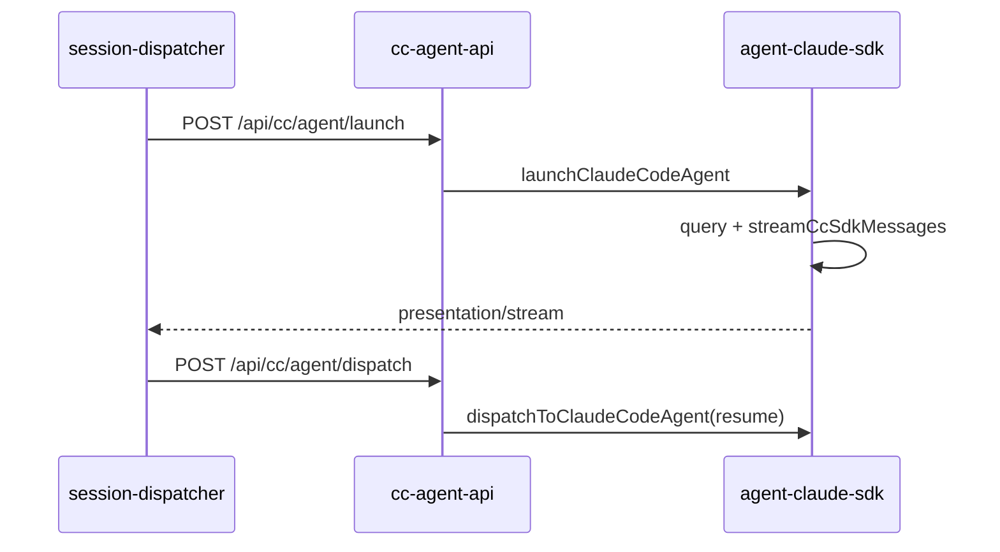

# Claude Code SDK 执行引擎

## 一、能力范围

负责 `@anthropic-ai/claude-agent-sdk` 的 `query()` 执行：launch/dispatch、事件映射至 Presentation、`cc-agent-api` HTTP 服务、MCP 内联与 `ccSessionId` 续接。

**不负责**：Cursor SDK 引擎（见 [06-CursorSDK执行引擎](./06-CursorSDK执行引擎.md)）、Daemon IM 队列编排。

## 二、设计决策与取舍

- **包/API**：`query({ prompt, options })` 返回可迭代 `Query`；无 CLI spawn（依据：`electron/agent-claude-sdk.ts`）。
- **resume**：`ccSessionId` 来自 `system/init`/`result` 等 `session_id`；`buildQueryOptions` 传 `options.resume`。
- **长驻**：`CC_RESIDENT_AGENT` 默认开（可回退 `SDK_RESIDENT_AGENT`）；idle = `activeQuery === null`。
- **MCP inline**：`cc-mcp-loader` 对称 Cursor；每次 `query()` 重传 `mcpServers`。
- **二进制**：`@anthropic-ai/claude-agent-sdk-{platform}-{arch}` 内 `claude`（asar 解包）。

## 三、服务端规则

1. 通道 `type === "claude-code"` 且配 API Key；默认模型 `claude-sonnet-4-6`。
2. resident 且 `activeQuery` 非空时 launch 转 dispatch。
3. dispatch 须已有 session；`pendingDispatch`/`activeQuery` 防并发。
4. ContextRotation 命中清 `ccSessionId`；未配 baseUrl 时 delete 继承 `ANTHROPIC_BASE_URL`。

## 四、客户端流程

IM：Daemon `/api/agent/launch` 在通道路由 claude-code 时委托 `launchCcAgentFromHttp`。

## 五、接口

| 入口 | 说明 |
|------|------|
| `launchClaudeCodeAgent` / `dispatchToClaudeCodeAgent` | query 首条 / resume 续跑 |
| `POST /api/cc/agent/launch\|dispatch` | 端口见 `cc-agent-api-port.json` |
| `checkClaudeCodeApiKey` | Messages API 最小校验 |

## 六、数据

- **CcSessionAgent**：sessionKey、`activeQuery`、`ccSessionId`、`residentMode`、`pendingDispatch`、contextUsage 等（`agent-cc-types.ts`）。
- **配置**：`AgentResource`（`type:"claude-code"`, `apiKey`, `baseUrl?`, `model?`）。

## 七、非功能与可观测

- RunGuard + `armCcWatchdog`（idle/draining）；`NEVER_CANCEL_ON_DURATION` 默认 true。
- `handleSdkMessage` 映射 assistant/thinking/tool/result → Presentation 与 context usage。
- 日志：`cc_session_id=`、`watchdog`、`上下文轮转`。

## 八、推送

无独立推送；IM 出站语义对称 Cursor SDK（stream-text / presentation-event / send-text）。

## 九、已知限制与 TODO

- SDK 无 `startup()` 导出；长驻 = Map + `query(resume)`（**待确认/推测**：版本号随依赖升级变化）。
- `bypassPermissions` 为 harness 集成取舍；optional 包缺失时 fallback `claude` 可能失败。

## 十、变更记录

- 2026-06-30：新增十段式文档（kb-sync lite）。
- 2026-06-30：spawn 改 `query()` + cc-mcp-loader（archive 20260630002838）。
- 2026-06-29：双引擎路由接入（archive 20260629164130）。
