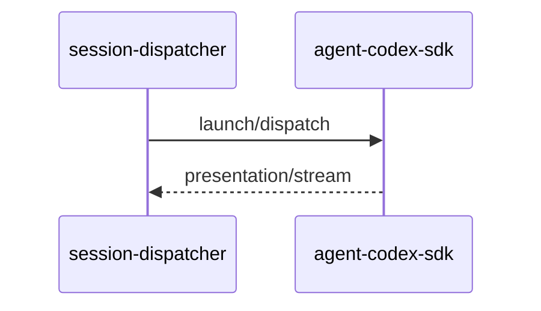

# Codex SDK 执行引擎

## 一、能力范围

`@openai/codex-sdk`：`new Codex` + `startThread`/`resumeThread` + `runStreamed`、launch/dispatch、Presentation、`codex-agent-api`、MCP 内联、`codexSessionId` 续接。不负责 [06](./06-CursorSDK执行引擎.md)/[07](./07-ClaudeCodeSDK执行引擎.md) 引擎与 Daemon claim。

## 二、设计决策与取舍

- **API**：`new Codex` → `startThread`/`resumeThread(codexSessionId)` → `runStreamed`（`agent-codex-sdk.ts`）。
- **resume**：`thread.started` 写 `codexSessionId`（`agent-codex-events.ts`）。
- **长驻**：`CODEX_RESIDENT_AGENT` 随 `SDK_RESIDENT_AGENT` 默认开（`codexResidentModeEnabled`）。
- **MCP**：`codex-mcp-loader` 读 `~/.codex` 与 `{ws}/.codex/config.toml`，project>global，每次注入。
- **CLI**：`checkCodexCliAvailable`；二进制 `@openai/codex-*` optional 包（`agent-codex-utils.ts`）。
- **模块**：`agent-codex-{types,http,events,stream,utils,...}` 仿 `agent-cc-*`。

## 三、服务端规则

1. `type==="codex"` + API Key；模型空 → `CODEX_DEFAULT_MODEL_ID`（`gpt-5.5`）。
2. `pendingDispatch` 时 launch→dispatch；`acquireRunGuard` 单飞。
3. ContextRotation 清 `codexSessionId`（`maybeRotateCodexSessionContext`）。
4. Profile 已删 → `codex-missing`（`agent-sdk.ts`）。
5. 任务/工作流：`session-dispatcher` POST `codex-agent-api`（不经 Daemon）。

## 四、客户端流程

IM：`agent-api` → `agent-sdk` 路由 codex → `launchCodexAgentFromHttp`。

## 五、接口

| 入口 | 说明 |
|------|------|
| `launchCodexAgent`/`dispatchToCodexAgent` | 首条/resume |
| `POST /api/codex/agent/launch\|dispatch` | `codex-agent-api-port.json` |
| `getCodexSessionList` | `agent-codex-session-registry.ts` |

## 六、数据

`CodexSessionAgent`（`agent-codex-types.ts`）；`AgentResource type:"codex"`；`codex-agent-api-port.json`。

## 七、非功能与可观测

RunGuard+`armCodexWatchdog`；事件未知类型 WARN；`codex-failure-messages` 脱敏 apiKey。

## 八、推送

无；出站对称 SDK/CC（stream-text/presentation-event）。

## 九、已知限制与 TODO

Dashboard MCP 对 codex 仅占位；须本机 Codex CLI。与 [09 OpenCode SDK](./09-OpenCodeSDK执行引擎.md) 并列第四引擎，共享 `launchAgent`/`agent-sdk` 路由落点。

## 十、变更记录

2026-06-30：Codex 三引擎接入（archive 20260630104714）。
