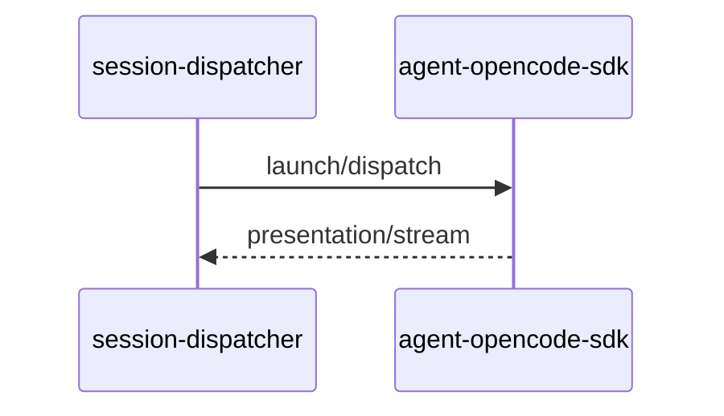

# OpenCode SDK 执行引擎

## 一、能力范围

`@opencode-ai/sdk`：内嵌/外部 Client、`session.create`/`prompt`、SSE、`opencode-agent-api`、MCP 内联、`opencodeSessionId` 续接。不负责 [06](./06-CursorSDK执行引擎.md)/[07](./07-ClaudeCodeSDK执行引擎.md)/[08](./08-CodexSDK执行引擎.md) 与 Daemon claim。

## 二、设计决策与取舍

- **Client**：`resolveOpencodeClient` — embedded 懒启动 `createOpencode` 按 Profile 缓存；external 连 `baseUrl`；探活 `config.get()`（无 `global.health`）。
- **会话**：`session.create` 写 `opencodeSessionId`；长驻 `session.prompt` 复用（`OPENCODE_RESIDENT_AGENT` 随 SDK 默认开）。
- **Provider**：Run 前 `auth.set`；`parseModelRef` 解析模型。
- **MCP**：`opencode-mcp-loader` 读 `opencode.json`/项目配置，每次注入。
- **模块**：`agent-opencode-*` 仿 `agent-codex-*`，单文件 <300 行。

## 三、服务端规则

1. `type==="opencode"` 须 `providerId`/`apiKey`；模型空 → `OPENCODE_DEFAULT_MODEL`。
2. `pendingDispatch` launch→dispatch；`acquireRunGuard` 单飞。
3. `resolveOpencodeContextLimit` 写阈值；轮转清 `opencodeSessionId`（`maybeRotateOpencodeSessionContext`）。
4. Profile 已删 → `opencode-missing`（`agent-sdk.ts`）。
5. 任务/工作流 POST `opencode-agent-api`；IM 经 `agent-sdk` 转发。
6. `initSessionDispatcher` 注册 handler；`before-quit` → `closeAllEmbeddedOpencodeServers()`。

## 四、客户端流程

IM：`agent-api` → opencode 路由 → `launchOpencodeAgentFromHttp`。UI：`OpenCodeEditModal`/`ChannelModelSection`/`mcp-view-strategy`。

## 五、接口

| 入口 | 说明 |
|------|------|
| `launchOpencodeAgent`/`dispatchToOpencodeAgent` | 首条/续跑 |
| `POST /api/opencode/agent/launch\|dispatch` | `opencode-agent-api-port.json` |
| `getOpencodeSessionList` | `agent-opencode-session-registry.ts` |

## 六、数据

`OpencodeSessionAgent`：`opencodeSessionId`、`activeClient`、`deployMode`、`contextLimitTokens` 等。`AgentResource type:"opencode"`（`deployMode`/`providerId`/`apiKey`/`model`/`baseUrl`）；`opencode-agent-api-port.json`。

## 七、非功能与可观测

RunGuard+watchdog；SSE 未知 WARN；`opencode-failure-messages` 脱敏；失败归档挂 `completeOpencodeRun`。

## 八、推送

无；出站对称 SDK/CC/Codex（`agent-opencode-events.ts` 映射 tool/thinking/assistant）。

## 九、已知限制与 TODO

`presentationOrderingEligible` 未接入（R3）；外部探活依赖 `config.get`；内嵌多 Profile 须独立 port；E2E 依赖本机 OpenCode。

## 十、变更记录

2026-06-30：OpenCode 四引擎接入（archive 20260630105159）。
