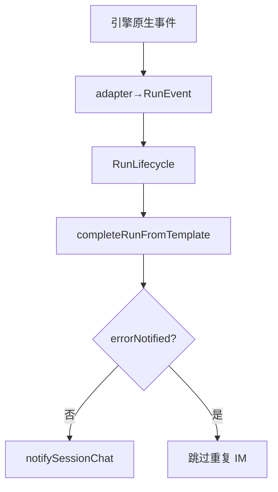

# SDK 上下文保护与失败归因

## 一、能力范围

四引擎共享 Run 终态契约：`RunFailureReason`、闩字段、`formatRunFailureMessage`、`completeRunFromTemplate`、`notifySessionChat`。SDK pre-send 保护为本文件特有。

## 二、设计决策与取舍

- **类型 SSOT**：`run-lifecycle-types.ts` — `RunPhase`、`RunEvent`、`RunFailureReason`、`AgentEnginePort`。
- **终态 IM 唯一出站**：`run-notify.notifySessionChat`；SDK/CC re-export，Codex/OpenCode 直接 import。
- **失败文案**：`formatRunFailureMessage` 引擎 SSOT；Daemon dispatch SSOT `orchestrator-failure-formatter.ts`。
- **收尾模板**：`completeRunFromTemplate` — 幂等闩、f41 禁双写、失败归档。
- **guard busy（S8）**：四引擎 `enterGuardWithLifecycle`；busy→`notifyGuardBusy` 一次 IM；`stale_aborted` 不二次 notify。
- **续接（S7）**：`resume()` 前调用；失败 `notifyResumeFailure(..., category?)`+`classifyResumeFailure`（`run-resume-notify.ts`，`stop_progress`）；`ResumeFailureCategory` 驱动尾句；默认 `unrecoverable`；契约见 shared AGENTS「续接失败分类」。
- **pre-send（SDK）**：`lastPreSend*`；ratio≥100% 未轮转→`context_blocked`。

## 三、服务端规则

**RunFailureReason**（对齐 `crash-log-archiver`）：

| 枚举 | 典型场景 |
|------|----------|
| `dispatch_failed` | 调度失败 |
| `run_error` | 引擎出错 |
| `timeout` | 看门狗/长时 |
| `user_cancelled` | 用户 stop（静默） |
| `context_exhausted` | 上下文满 |
| `stale_aborted` | 会话过期 |
| `session_abnormal` | busy/异常 |

**errorNotified 契约**：`notifying` 入口检查；失败/超时/取消仅一次 IM；`aborted` 静默；S7 `resume()` 重置闩。

**Daemon dispatch**：`POST /api/agent/dispatch` 失败经 `handleLaunchFailure`（有限重试+`notifySessionUser`；耗尽 ack）；见 `daemon-orchestrator-retry.ts`。

**续接失败分类**（`run-resume-notify.ts`）：

| category | 尾句 | 典型 reason |
|----------|------|-------------|
| `retryable` | 稍后重试 | 网络/服务瞬时 |
| `unrecoverable` | 开始新任务 | 已结束/CLI 缺失/失效 |

## 四、客户端流程

SDK pre-send 分支见 §二；`context_blocked` 走 `notifyPreSendContextFailure`。

## 五、接口

| 符号 | 路径 |
|------|------|
| `formatRunFailureMessage` | `run-failure-formatter.ts` |
| `completeRunFromTemplate` | `run-complete-template.ts` |
| `notifySessionChat` | `run-notify.ts` |
| `notifyResumeFailure` / `classifyResumeFailure` | `run-resume-notify.ts` |

## 六、数据

各引擎 session：`errorNotified`、`watchdogTimedOut`、`runFinalizing` 等；SDK 另含 `lastPreSend*`。

## 七、非功能与可观测

日志：`dispatch_failed`、`agent_failed`、`[compression]`；`npm run test:run-notify-contract`。

## 八、推送

终态 `stop_progress: true`；运行中非终态不传。

## 九、已知限制与 TODO

SDK pre-send 见 §二；CC 审批见 07。

## 十、变更记录

- 2026-07-12：续接 `ResumeFailureCategory`+`classifyResumeFailure`（20260712145449）。
- 2026-07-12：dispatch `handleLaunchFailure` 对齐（20260712144755）；`notifyResumeFailure` shared（20260712113332）。
- 2026-07-12：终态契约 D1～D3（20260711232258）；2026-07-05：pre-send（20260705230806）。
