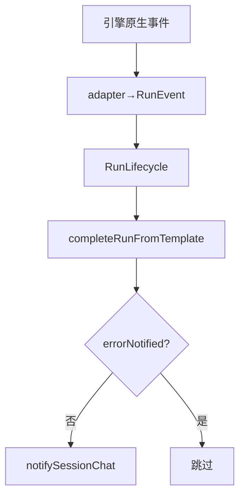

# SDK 上下文保护与失败归因

## 一、能力范围

四引擎共享 Run 终态契约：`RunFailureReason`、闩字段、`formatRunFailureMessage`、`completeRunFromTemplate`、`notifySessionChat`。SDK pre-send 为本文件特有。Claude spawn 同步失败文案见 §七（非新 `ResumeFailureCategory`）。

## 二、设计决策与取舍

- **类型 SSOT**：`run-lifecycle-types.ts`（`RunPhase`/`RunEvent`/`RunFailureReason`/`AgentEnginePort`）。
- **终态 IM**：仅 `run-notify.notifySessionChat`；失败文案 `formatRunFailureMessage`；Daemon 侧 `orchestrator-failure-formatter.ts`。
- **收尾模板**：`completeRunFromTemplate`（幂等闩、f41 禁双写、失败归档）。
- **guard busy（S8）**：`enterGuardWithLifecycle`→`notifyGuardBusy` 一次 IM。
- **续接（S7）**：`notifyResumeFailure`+`classifyResumeFailure`；`ResumeFailureCategory` 驱动尾句；默认 `unrecoverable`。
- **pre-send（SDK）**：ratio≥100% 未轮转→`context_blocked`。

## 三、服务端规则

**RunFailureReason**：`dispatch_failed` / `run_error` / `timeout` / `user_cancelled`（静默）/ `context_exhausted` / `stale_aborted` / `session_abnormal`。

**errorNotified**：`notifying` 入口检查；失败/超时/取消仅一次 IM；S7 `resume()` 重置闩。

**Daemon dispatch**：`handleLaunchFailure`（有限重试+耗尽 ack）。

**续接分类**：`retryable`→稍后重试；`unrecoverable`→开始新任务（含 CLI 缺失/失效）。

## 四、客户端流程

`context_blocked` 走 `notifyPreSendContextFailure`。

## 五、接口

| 符号 | 路径 |
|------|------|
| `formatRunFailureMessage` | `run-failure-formatter.ts` |
| `completeRunFromTemplate` | `run-complete-template.ts` |
| `notifySessionChat` | `run-notify.ts` |
| `notifyResumeFailure` / `classifyResumeFailure` | `run-resume-notify.ts` |

## 六、数据

各引擎闩字段；SDK `lastPreSend*`；CC 内存 `childPid`/`spawnedProcess`。

## 七、非功能与可观测

`dispatch_failed`/`agent_failed`/`[compression]`；`npm run test:run-notify-contract`。

**Claude spawn 可检索错误**（`cc-spawn-process.ts`；launch/dispatch `error` 含前缀；**非**新 `ResumeFailureCategory`）：

| 码 | 含义 |
|----|------|
| `cc_spawn_enoent` | CLI 可执行文件不存在 |
| `cc_spawn_failed` | spawn 同步失败；或子进程 `error`（日志） |

续接 detail 含上述串时仍走 `classifyResumeFailure("cc", detail)`。

## 八、推送

终态 `stop_progress: true`；运行中非终态不传。

## 九、已知限制与 TODO

SDK pre-send 见 §二；CC 审批与 spawn 见 [[07-ClaudeCodeSDK执行引擎]]。

## 十、相关

- [[01-概览]]
- [[03-启动与自动重连]]
- [[07-ClaudeCodeSDK执行引擎]]
