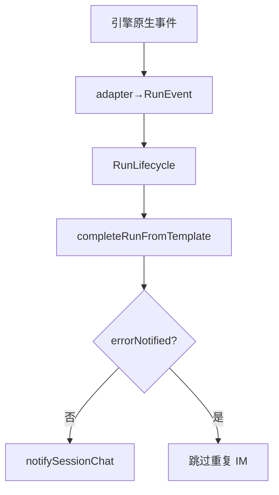

# SDK 上下文保护与失败归因

## 一、能力范围

四引擎共享 **Run 终态契约**：`RunFailureReason`、`errorNotified`/`watchdogTimedOut`/`runFinalizing` 闩、`formatRunFailureMessage`、`completeRunFromTemplate`、`notifySessionChat` 唯一出站。SDK pre-send 上下文保护为本文件特有。

## 二、设计决策与取舍

- **类型 SSOT**：`run-lifecycle-types.ts` — `RunPhase`、`RunEvent`、`RunFailureReason`、`AgentEnginePort`。
- **终态 IM 唯一出站**：`run-notify.notifySessionChat`；SDK/CC re-export，Codex/OpenCode 直接 import。
- **失败文案**：`formatRunFailureMessage` 引擎终态 SSOT；Daemon dispatch 文案 SSOT `src/shared/orchestrator-failure-formatter.ts`（electron re-export）。
- **收尾模板**：`completeRunFromTemplate` — 幂等闩、f41 成功路径禁止双写 assistant、失败挂 `archiveAgentFailureLogs`。
- **guard busy（S8）**：四引擎 `enterGuardWithLifecycle`；busy→`notifyGuardBusy` 一次 IM；`stale_aborted` 不二次 notify。
- **续接（S7）**：`RunLifecycle.resume()` 续接前调用；失败 `notifyResumeFailure`（`run-resume-notify.ts`，`stop_progress`）；skip 不 notify。
- **pre-send（SDK）**：`lastPreSend*`；ratio≥100% 未轮转→`context_blocked`。

## 三、服务端规则

**RunFailureReason**（对齐 `crash-log-archiver`）：

| 枚举 | 典型场景 |
|------|----------|
| `dispatch_failed` | Daemon/Electron 调度失败 |
| `run_error` | 引擎执行出错 |
| `timeout` | 看门狗/平台长时 |
| `user_cancelled` | 用户 stop（aborted 静默，不 notify） |
| `context_exhausted` | 上下文已满/pre-send≥95% |
| `stale_aborted` | 会话过期/中止 |
| `session_abnormal` | busy/异常 |

**errorNotified 契约**：`notifying` 入口检查；失败/超时/取消仅一次 IM；`aborted` 静默；S7 `resume()` 重置闩。

**Daemon dispatch 对称**：`POST /api/agent/dispatch` 失败与 IM launch 共用 `handleLaunchFailure`（`daemon-orchestrator-retry.ts`）：`releaseClaimedMessages` + 有限重试（最多 3 次退避）；未耗尽不 ack、排程 `scheduleDispatchRetry`；非 busy 每次失败可 `notifySessionUser`；`agent_busy` 走 `parseBusyRetryDelayMs`+`scheduleBusyRetry`；耗尽后 `notifySessionUser`（`stop_progress`）+ `ackMessages`，日志 `dispatch_retry_exhausted`。接线见 `daemon-http-routes-orchestrator.ts`。

## 四、客户端流程

SDK pre-send 分支见 §二；`context_blocked` 走 `notifyPreSendContextFailure`。

## 五、接口

| 符号 | 路径 |
|------|------|
| `formatRunFailureMessage` | `electron/agent/shared/run-failure-formatter.ts` |
| `completeRunFromTemplate` | `electron/agent/shared/run-complete-template.ts` |
| `notifySessionChat` | `electron/agent/shared/run-notify.ts` |
| `createOrchestratorNotify` | `src/daemon/daemon-orchestrator-notify.ts` |
| `notifyResumeFailure` | `electron/agent/shared/run-resume-notify.ts` |
| SDK pre-send | `electron/agent/cursor-sdk/context-rotation-lite.ts` 等 |

## 六、数据

各引擎 session 保留：`errorNotified`、`watchdogTimedOut`、`runFinalizing`、`abortController`、`failureArchiveDone`。SDK 另含 `lastPreSendUsedTokens`/`lastPreSendUsageRatio`。

## 七、非功能与可观测

日志：`dispatch_failed`、`agent_failed`、`[compression] pre-send`；`npm run test:run-notify-contract`（S1/S4/S5/S7/S8）。

## 八、推送

终态均 `notifySessionChat(..., stop_progress: true)`；运行中「Agent 处理中…」等非终态不传 `stop_progress`。

## 九、已知限制与 TODO

SDK pre-send 边界见 §二；CC project scope 门控见 07。

## 十、变更记录

- 2026-07-12：§三 HTTP dispatch 失败语义对齐 `handleLaunchFailure`（#1 `20260712144755`；archive 步骤 6 核对）。
- 2026-07-12：`notifyResumeFailure` 抽取 shared（archive 20260712113332）。
- 2026-07-12：终态契约 + D1～D3（archive 20260711232258）。
- 2026-07-05：SDK pre-send 保护、context_blocked（archive 20260705230806）。
