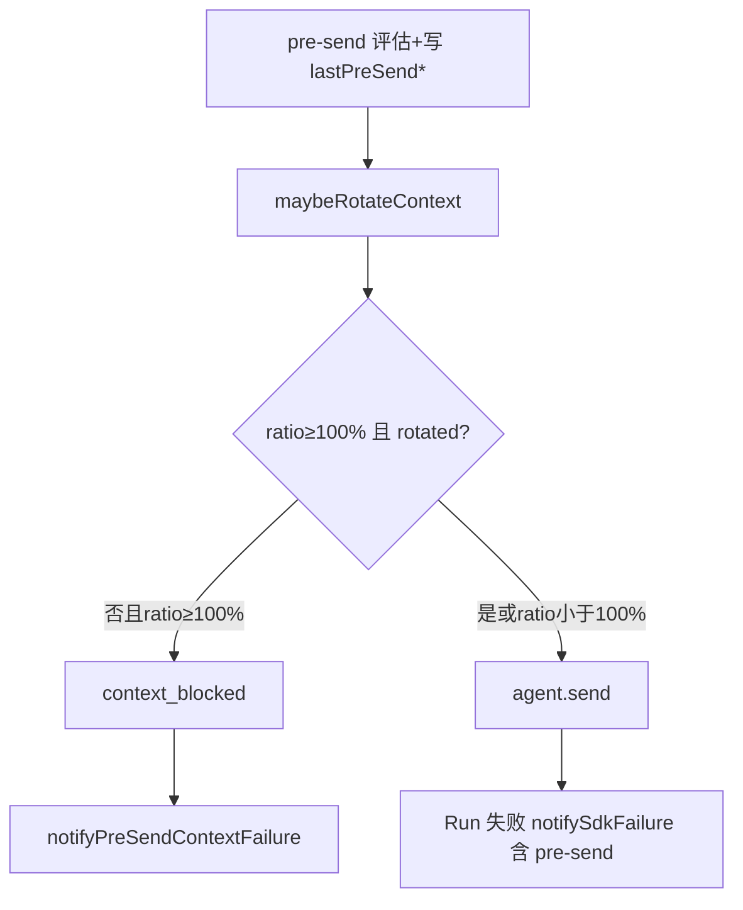

# SDK 上下文保护与失败归因

## 一、能力范围

Cursor SDK send 前上下文压力评估、高压轮转、`context_blocked` 快拒，Run 失败 IM 归因（pre-send 快照）。不负责通道 `othersWorkspaceMode` 默认（见 [02-多会话模型](./02-多会话模型.md)）。

## 二、设计决策与取舍

- **快照**：`lastPreSendUsedTokens`/`lastPreSendUsageRatio` 每次 dispatch pre-send 覆盖；轮转清零 peak 后仍保留至下次 pre-send。
- **ratio≥100%**：`maybeRotateContext` 跳过 90% 的「连续 2 次」与 3min 冷却；须 `Agent.create` 成功才算 `rotated`。
- **快拒**：ratio≥100% 且 `!rotated` 时不调用 `agent.send`。
- **文案**：pre-send≥95% 不依赖 error 态，避免 peak 清零后误报「精简输入」兜底。

## 三、服务端规则

1. **评估链**：`launchSdkAgent`/`dispatchToSdkAgent`→`sendWithRetry`→`maybeRotateSessionForPressure`→`evaluatePreSendContextPressure`；日志 `[compression] pre-send usage {pct}%`。
2. **轮转**（`context-rotation-lite.ts`）：ratio∈[90%,100%) 连续 2 次且冷却 3min；ratio≥100% 首轮即 `rotated`（bypass 冷却）。成功：`Agent.create` 换新、清零 peak、`close` 旧实例。
3. **context_blocked**：ratio≥100% 且 `!rotated`→`finalReason:"context_blocked"`；`notifyPreSendContextFailure` 即时 IM（launch/dispatch 各 1 处）。
4. **Run 失败归因**（`formatUserSdkFailureMessage`）：timeout→peak/error≥95%→**pre-send≥95%**→busy/retryable→兜底。上下文已满句含「上下文窗口已接近或达到上限」。

## 四、客户端流程

## 五、接口

`evaluatePreSendContextPressure`、`maybeRotateContext`、`maybeRotateSessionForPressure`、`sendWithRetry`、`notifyPreSendContextFailure`、`notifySdkFailure`、`formatUserSdkFailureMessage`（`electron/agent/cursor-sdk/`）。

## 六、数据

`SdkSessionAgent`：`lastPreSendUsedTokens?`、`lastPreSendUsageRatio?`（used/limit，可>1）。`SdkFailureContext` 同名字段。**session 级**，无跨 session 读写。

## 七、非功能与可观测

日志：`[compression] pre-send usage`、`pre-send context_blocked ratio=`、`[shared-workspace]`。**T6 诊断**：`warnIfSharedWorkspaceDir`（launch/dispatch 入口）统计 `sdkSessions` 同 `workspaceDir` 活跃数>1 时 WARN，每目录每进程 1 条；仅可观测，多群并发失败多为各 session 独立超限，非串扰。

## 八、推送

`context_blocked` 与 Run 失败均 `notifySessionChat(..., stop_progress: true)`，附 context footer。

## 九、已知限制与 TODO

ratio<100% 不 pre-send 阻断；limit 不可得时 ratio 缺失，快拒与 pre-send 归因降级。

## 十、变更记录

- 2026-07-05：pre-send 保护、context_blocked、失败归因、workspaceDir WARN（archive 20260705230806）。
