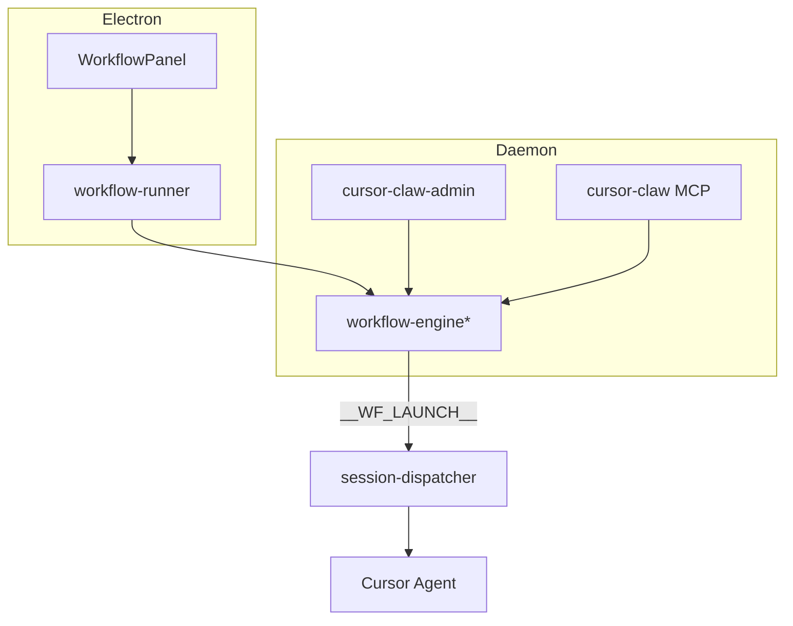
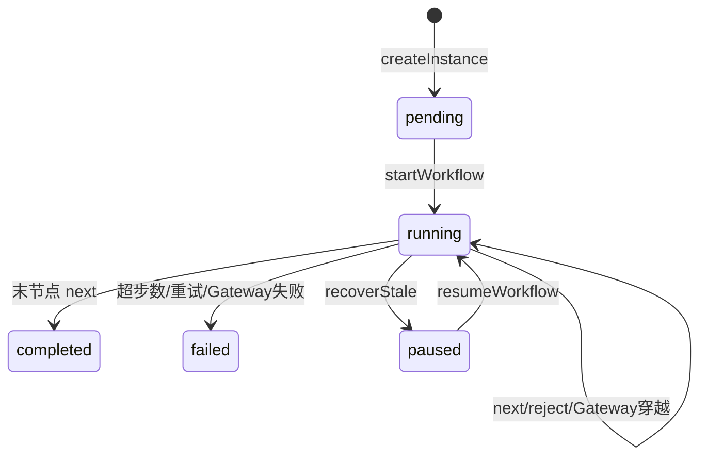
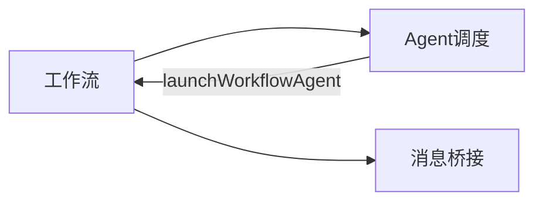

# 工作流 · 概览

## 一、模块定位与边界

多节点 Agent 流水线：有序节点链 + MCP 流转。默认单会话连续执行；`isolated` 节点 spawn 独立 Agent；`kind: gateway` 仅条件路由、不跑 Agent。不负责通道连接与通用 Agent 调度（见 Agent 调度域）。

## 二、整体架构

引擎拆分：`prompt` / `advance`+`gateway` / `reject` / `lifecycle`；facade 稳定导出。

## 三、核心状态机/主流程

**恢复入口**（`paused`→`running`）：设置页「恢复」→ IPC `workflow:resume`；飞书 `/workflow resume`；`POST /api/workflow-signal`；MCP `manage_workflows` action=`resume`（均经引擎 `resumeWorkflow` / Daemon `resumeWorkflowAndEmit`）。非 paused →「工作流非暂停状态」。

## 四、子模块清单

| 子模块 | 文档 |
|--------|------|
| 定义与实例 | [02-定义与实例](./02-定义与实例.md) |
| 节点执行与流转 | [03-节点执行与流转](./03-节点执行与流转.md) |
| 触发与管理入口 | [04-触发与管理入口](./04-触发与管理入口.md) |

## 五、关键约束

- `nodes` 顺序为主干；Gateway 可经 `routes`/`defaultNext` 跳转；驳回仅回退到当前之前的 **task**（跳过 gateway）。
- `maxSteps` 默认 50；`maxRetries` 默认 2。
- 定义 YAML、实例 JSON；next/reject 在 agent MCP，管理在 admin MCP。
- 存储根 `{APP_DATA_DIR}/workflows`（`workflow-path.ts` SSOT）。

## 六、术语表

| 术语 | 含义 |
|------|------|
| WorkflowDefinition | 蓝图（节点链 + config） |
| WorkflowInstance | 运行态与 context |
| Gateway | `kind: gateway`；不 spawn，按 when 选下一节点 |
| context | `nodeId → output` 产物表 |
| isolated | 独立 Agent 会话 |
| workflowAutoPauseStale | 启动将陈旧 running→paused 的开关（默认 true） |

## 七、依赖关系

## 八、全局非功能与可观测

- `recoverStaleInstances(autoPause?)`：Electron `seedBuiltins` 与 Daemon bootstrap 接线；读 `AppConfig.workflowAutoPauseStale` / env `WORKFLOW_AUTO_PAUSE_STALE`（缺省 true）。
- 通知：`__WF_NOTIFY__`；实例：`__WF_INSTANCE__`；启动：`__WF_LAUNCH__`（仅 task，Gateway 不触发）。

## 九、全局已知限制

- Gateway when 仅极简：`always`/`true`、`contains …`、`context.<id> contains …`（无通用表达式引擎）。
- 纯 Daemon 冷启动且数据仅在历史 Electron userData 时，须 Electron `seedBuiltins` 触发迁移。

## 十、文档入口

1. [02-定义与实例](./02-定义与实例.md) 2. [03-节点执行与流转](./03-节点执行与流转.md) 3. [04-触发与管理入口](./04-触发与管理入口.md)

## 十一、变更记录

2026-07-12：Gateway、config 二次替换、MCP resume、recover 开关接线；关闭旧限制（archive 20260712170536）。
2026-07-12：统一存储根与 sessionKey；paused 恢复三入口（archive 20260712145628 / 20260712113344）。
2026-06-27：kb-sync 初始建立
