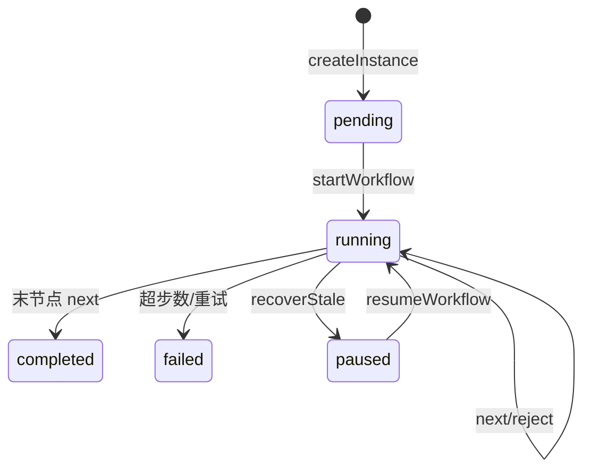
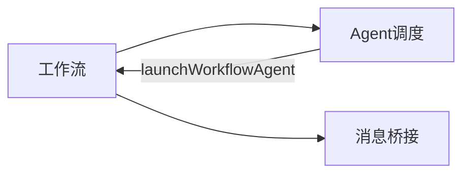

# 工作流 · 概览

## 一、模块定位与边界

多节点 Agent 流水线：有序节点链 + MCP 流转。默认单会话连续执行；`isolated` 节点 spawn 独立 Agent。不负责通道连接与通用 Agent 调度（见 Agent 调度域）。

## 二、整体架构

## 三、核心状态机/主流程

**恢复入口**（`paused`→`running`）：设置页 `WorkflowInstanceDetail`「恢复」→ IPC `workflow:resume`；飞书 `/workflow resume`（T10 斜杠链）；外部 `POST /api/workflow-signal`（Daemon `resumeWorkflowAndEmit` + stdout 信号）。非 paused 统一返回「工作流非暂停状态」。

## 四、子模块清单

| 子模块 | 文档 |
|--------|------|
| 定义与实例 | [02-定义与实例](./02-定义与实例.md) |
| 节点执行与流转 | [03-节点执行与流转](./03-节点执行与流转.md) |
| 触发与管理入口 | [04-触发与管理入口](./04-触发与管理入口.md) |

## 五、关键约束

- `nodes` 顺序即执行顺序；驳回仅可回退到当前节点之前。
- `maxSteps` 默认 50；`maxRetries` 默认 2（计带 `rejectFromNodeId` 的历史）。
- 定义 YAML、实例 JSON；next/reject 在 `cursor-claw`，管理在 `cursor-claw-admin`。

## 六、术语表

| 术语 | 含义 |
|------|------|
| WorkflowDefinition | 蓝图（节点链 + config） |
| WorkflowInstance | 运行态与 context |
| context | `nodeId → output` 产物表 |
| isolated | 独立 Agent 会话 |
| notifyChatId | 通知固定投递 chatId |

## 七、依赖关系

## 八、全局非功能与可观测

- `recoverStaleInstances`：`running`→`paused`；恢复经 §三产品入口（`resumeWorkflowInstance` / `resumeWorkflowAndEmit`）。
- 通知：`__WF_NOTIFY__` → `notifyWorkflowChat`；实例：`__WF_INSTANCE__` → UI。

## 九、全局已知限制

- 无分支 Gateway。
- 节点 prompt 内 `{{config.xxx}}` 引擎不二次替换。
- MCP `manage_workflows` 无 `resume` action（HTTP 信号为外部集成入口）。

## 十、文档入口

1. [02-定义与实例](./02-定义与实例.md) 2. [03-节点执行与流转](./03-节点执行与流转.md) 3. [04-触发与管理入口](./04-触发与管理入口.md)

## 十一、变更记录

2026-07-12：paused 恢复三入口落地；关闭「无产品恢复」「HTTP 未实现」限制（archive 20260712113344）。
2026-06-27：kb-sync 初始建立
