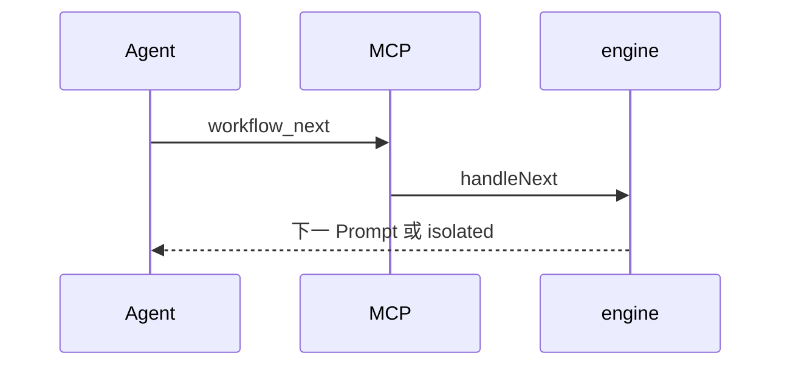

# 工作流 · 节点执行与流转

## 一、能力范围

Prompt 组装、`startWorkflow`/`handleNext`/`handleReject`/`resumeWorkflow` 及 isolated 启动信号。不负责 MCP 注册与 Agent spawn。

## 二、设计决策与取舍

- 默认单 Agent 内 MCP 返回值携带下一节点 Prompt。
- `isolated`：返回 `isolated: true` 并 `__WF_LAUNCH__` spawn 新 Agent。
- 首节点 INPUT=`instance.input`；后续=`assembleContext`（各 `context[nodeId]`）。
- 驳回计数：`nodeHistory` 中带 `rejectFromNodeId` 的条数 ≥ `maxRetries` → failed。

## 三、服务端规则

**handleNext**：写产物→completed→stepCount++→步数熔断→末节点 completed 或推进→isolated 则单独返回。

**handleReject**：目标 `targetNodeId` 或上一节点（须在当前之前）→标 rejected→重试上限→回退→`buildRetryPrompt`。

**resume**：`paused`→`running`，`buildStartPrompt` 当前节点。

模板 `node-prompt.md`：`isRetry`/`hasConfig` 条件块；要求产物写文档 URI 再 `workflow_next`。

## 四、客户端流程

## 五、接口

| 工具 | 参数 |
|------|------|
| workflow_next | instance_id, output |
| workflow_reject | instance_id, reason, target_node_id? |

`EngineResult`：prompt/done/failed/isolated/node/message。

独立 Agent sessionKey：`{notifyChatId||"wf"}::wf_{instanceId}_{nodeId}`（`buildWorkflowSessionKey`）。

## 六、数据

改实例 JSON：context、currentNodeId、status、nodeHistory、stepCount；**isolated** 路径另写 `sessionKey` 并 `saveInstance`（`startWorkflow` 首节点、`handleNext`/`handleReject` 推进、`resumeWorkflow` 恢复当前 isolated 节点，均经 `assignInstanceSessionKey`）。

## 七、非功能与可观测

next/reject/run 经 `emitNotify` 通知 `notifyChatId`；`recoverStaleInstances` 标 paused。

## 八、推送

状态通知固定 `notifyChatId`，不随 isolated 会话切换。

## 九、已知限制与 TODO

- isolated 后 spawn 新 Agent；`launchWorkflowAgent` **优先**实例已落盘 `sessionKey`，重启 resume 续聊同键（`workflow-runner` / `__WF_LAUNCH__` 透传）。
- 驳回 Prompt 依赖 context，未单独注入上次 output。
- `resumeWorkflow` 产品入口见 [04-触发与管理入口](./04-触发与管理入口.md)（UI/斜杠/HTTP）；`recoverStaleInstances` 自动 paused 仍无单独产品开关。

## 十、变更记录

2026-07-12：isolated `sessionKey` 落盘与 resume 复用持久键（archive 20260712145628）。
2026-07-12：resume 产品入口接线（archive 20260712113344）。
2026-06-27：kb-sync 初始建立
