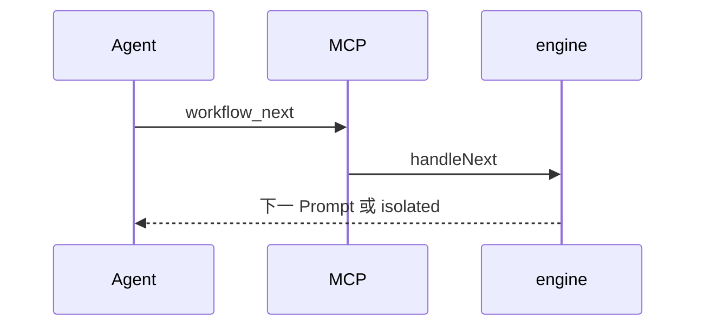

# 工作流 · 节点执行与流转

## 一、能力范围

Prompt 组装、`startWorkflow`/`handleNext`/`handleReject`/`resumeWorkflow`/`recoverStaleInstances`、Gateway 穿越与 isolated 启动信号。不负责 MCP 注册与 Agent spawn。

## 二、设计决策与取舍

- 默认单 Agent 内 MCP 返回下一 Prompt；`isolated` → `__WF_LAUNCH__`。
- **Gateway**：前进路径 `enterFromNode`→`resolveToTaskNode` 可连续穿过多个 gateway，**不**组装 Prompt、不 spawn。
- **驳回**：`resolveRejectTarget` 默认跳过连续 gateway 至最近 task；显式目标为 gateway → 中文失败，禁止 `buildRetryPrompt`/spawn。
- config：组装前对 `node.prompt` 做 `{{config.key}}` 二次替换；驳回注入独立「上次本节点产出」块。

## 三、服务端规则

**handleNext**：写产物→推进→若下一节点为 gateway 则求值路由→进入 task 或 failed。

**Gateway when**（`workflow-gateway.ts`）：`always`/`true`；`contains <子串>`（上一节点 output）；`context.<nodeId> contains <子串>`；首条命中 routes，否则 `defaultNext`，皆无则 failed。

**handleReject**：目标须为当前之前的 task；重试上限→`buildRetryPrompt`（含 `LAST_NODE_OUTPUT`）。

**resume**：`paused`→`running`，当前节点 Prompt（当前为 gateway 的产品路径不预期落盘，recover 保留原 `currentNodeId`）。

**recoverStaleInstances(autoPause?)**：`running`→`paused`；`autoPause===false` 或 env `WORKFLOW_AUTO_PAUSE_STALE=0/false` 则跳过。

模板 `node-prompt.md`：`isRetry`/`hasConfig`；要求产物写文档 URI 再 `workflow_next`。

## 四、客户端流程

## 五、接口

| 工具 | 参数 |
|------|------|
| workflow_next | instance_id, output |
| workflow_reject | instance_id, reason, target_node_id? |

`EngineResult`：prompt/done/failed/isolated/node/message。

## 六、数据

改实例：context、currentNodeId、status、nodeHistory、stepCount；isolated 路径写 `sessionKey`。

## 七、非功能与可观测

next/reject/run 经 `emitNotify`；recover 经 Electron `seedBuiltins`（读 `workflowAutoPauseStale` 并同步 env）与 Daemon bootstrap。config 缺失键 `console.warn`。

## 八、推送

状态通知固定 `notifyChatId`；Gateway 不触发 `__WF_LAUNCH__`。

## 九、已知限制与 TODO

- when 语法极简，无布尔组合/正则引擎。
- isolated 后 spawn 新 Agent；launch **优先**实例已落盘 `sessionKey`。

## 十、变更记录

2026-07-12：Gateway 穿越、reject 跳过 gateway、config 替换、上次 output、recover 接线/开关（archive 20260712170536）。
2026-07-12：isolated sessionKey 与 resume（archive 20260712145628 / 20260712113344）。
2026-06-27：kb-sync 初始建立
