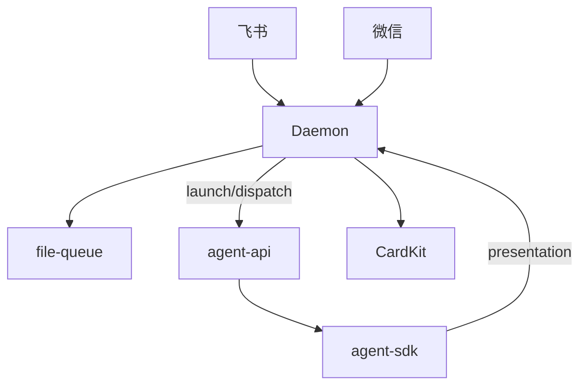
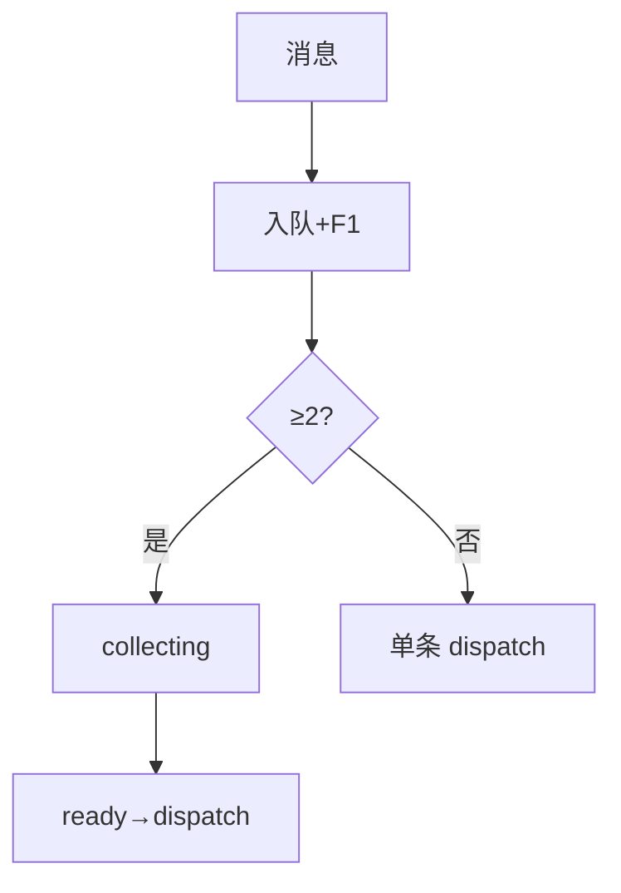

# 消息桥接 · 概览

## 一、模块定位与边界

Daemon **外部消息入口与出口**：飞书/微信收消息，file-queue 由 Daemon claim 并 `POST /api/agent/launch|dispatch`；SDK 经 Presentation 与 stream-text 回写 CardKit。飞书：**F1**、**F2 合并卡**、**F3 回复编辑**、菜单触达。

**边界**：凭据在 Electron；斜杠/菜单见 Agent 调度域。

## 二、整体架构

## 三、核心状态机/主流程

≥2 条 → MergeBatch collecting（静默 2.5s）→ ready → claim → dispatch → Presentation。

## 四、子模块清单

| 模块 | 职责 |
|------|------|
| [[02-飞书通道]] | CardKit、长任务心跳续期 |
| [[03-微信通道]] | iLink、typing |
| [[04-消息队列与路由]] | MergeBatch、入队「已排队」文案 |

## 五、关键约束

- collecting 第 2+ 条 suppress 逐条 F1；processing 入队文案「已排队，当前任务结束后处理」。
- 飞书长静默：CardKit settings 续期或「仍在处理中…」；**禁止**假 SDK turn。
- Presentation eligible：主用户 p2p 或飞书群聊+`allowOthers`。
- **`GET /api/poll-message` 404**。

## 六、术语表

MergeBatch、PresentationEvent、f41Eligible、CardKit 流式、F1 三态。

## 七、依赖关系

Daemon 编排 → Electron agent-api → SDK → Presentation 回 Daemon。

## 八、全局非功能与可观测

`presentation_failed`、`dispatch_failed`、`dispatch_retry_*`；dispatch 300ms 防抖。

## 九、全局已知限制

须飞书 `card.action.trigger`；CardKit 需 7.20+ 与 `cardkit:card:write`。

| 能力 | 飞书 | 微信 |
|------|------|------|
| 进行中 | Get + CardKit/心跳 | typing ~4s |
| 合并/菜单 | 有 | 一期无 |

## 十、文档入口

[[02-飞书通道]] → [[04-消息队列与路由]] → [[03-微信通道]]

## 十一、相关

- [[02-飞书通道]]
- [[04-消息队列与路由]]
- [[业务域/Agent调度/06-CursorSDK执行引擎]]
- [[00-README]]
