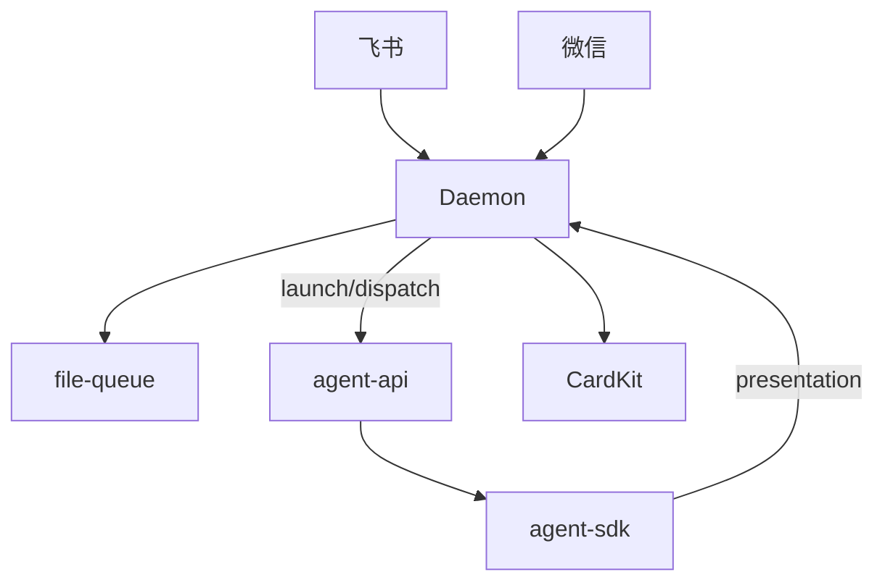
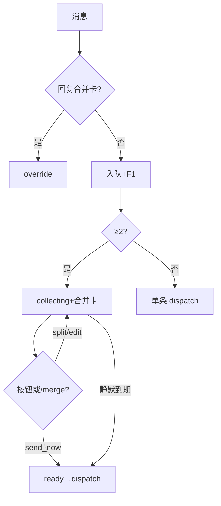

# 消息桥接 · 概览

## 一、模块定位与边界

Daemon 的**外部消息入口与出口**：飞书/微信收消息，file-queue 由 **Daemon 编排** claim 并 `POST /api/agent/launch|dispatch`；SDK 经 **Presentation**（tool/thinking/assistant）与 stream-text 回写 CardKit。飞书私聊：**F1 反馈**、**F2 合并 CardKit**、**F3 回复卡编辑**、**菜单触达**（推送事件映射斜杠）。

**边界**：凭据在 Electron；斜杠与菜单指令入队前拦截（`.fcmd`），见 Agent 调度域。

## 二、整体架构

## 三、核心状态机/主流程

≥2 条待领取 → **MergeBatch collecting**（静默 2.5s）→ **ready** → claim-and-merge → dispatch → Presentation 出站。

## 四、子模块清单

| 子模块 | 文档 | 职责 |
|--------|------|------|
| 飞书 | [02](./02-飞书通道.md) | CardKit、Presentation |
| 微信 | [03](./03-微信通道.md) | iLink |
| 队列 | [04](./04-消息队列与路由.md) | MergeBatch、dispatch |

## 五、关键约束

- collecting 第 2+ 条 suppress 逐条 F1；collecting/ready+processing 禁止 claim。
- Presentation eligible：主用户 p2p 或飞书群聊+`allowOthers`。
- **`GET /api/poll-message` 404**；IM SDK-only。

## 六、术语表

| 术语 | 含义 |
|------|------|
| MergeBatch | collecting→ready→locked→dispatched |
| PresentationEvent | assistant/thinking/tool/merge_batch |
| f41Eligible | 同 isStreamTextEligible |
| CardKit 流式 | assistant stream-text 首选：create→send→update→close；失败 PATCH/分段 |
| 菜单触达 | 飞书私聊 `menu_v6` 推送事件→斜杠入 `.fcmd`；进入私聊自动发帮助 CardKit（24h 节流） |

## 七、依赖关系

Daemon 编排 → Electron agent-api → SDK → Presentation 回 Daemon 出站。

## 八、全局非功能与可观测

`presentation_failed`、`dispatch_failed`、`dispatch_retry_scheduled`、`dispatch_retry_exhausted` 可检索；dispatch 300ms 防抖；SSE 触发循环。

## 九、全局已知限制

合并卡按钮与 `/merge` 已接线 `handleMergeBatchAction`；须飞书订阅 `card.action.trigger`。CardKit 需飞书 7.20+ 且应用开通 `cardkit:card:write`（assistant 流式首选 CardKit 卡片，非 PATCH）。**IM launch 调度失败**可自动重入队并有限重试，耗尽后停试通知再 ack（不必立即手动重发）；**HTTP `/api/agent/dispatch` 旁路**仍可能失败即丢。队列策略细节见 [04](./04-消息队列与路由.md)。

## 十、文档入口

[02](./02-飞书通道.md) → [04](./04-消息队列与路由.md) → [03](./03-微信通道.md)

## 十一、变更记录

2026-07-12：合并卡按钮与 `/merge` 斜杠双入口闭环（archive 20260712113253）。
2026-07-12：IM launch 失败重入队与有限重试；HTTP dispatch 旁路仍旧（archive 20260711232817）。
2026-06-27：Presentation MVP、MergeBatch、poll 移除（archive 20260627162620）。
2026-06-27：飞书 assistant stream-text CardKit 流式卡片首选术语（archive 20260627113111 Rev1）。
2026-07-04：飞书私聊菜单触达与进入私聊帮助卡（archive 20260704120250）。
