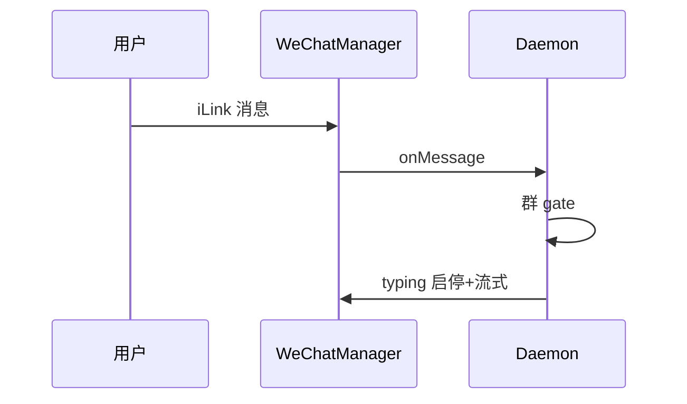

# 微信通道

## 一、能力范围

**负责**：iLink HTTP 封装、Token/扫码、长轮询收消息、文本/媒体收发、**会话级 typing（4s 续期）**、context 持久化、媒体 CDN 解密、出站 **`wxc_<clientId>` track**。

**不负责**：Token 申请、Electron 二维码 UI、**群聊 @ gate 实现**（Daemon `wechat-group-enqueue-gate.ts` + `initWeChatChannel`；本文述口径）。斜杠与飞书**同枢纽、全员规则**。

## 二、设计决策与取舍

- **长轮询**：`getUpdates` 默认 35s（`api.ts`）。
- **群聊策略**：`wechatGroupEnqueueMode`：`mention_required`（默认）| `all`；别名 `name` + 可选 `wechatBotDisplayName`。
- **@ 判定**：协议无 mention 元数据；正文 `@别名` 启发式（含 `@所有人`）；可扩展（gate ponytail）。
- **typing**：`sessionProgressMap` 驱动；实现在 `WeChatProgressTyping`（`wechat-manager` 门面委托）；iLink ~5s 消失 → **4s** 续期（`wechat_typing_refresh`）直至 `stopProgressTyping`。
- **sendText**：默认 `skipTyping=true`；最终/流式显式 `{ skipTyping: true }`。
- **首条私聊不入队**：`bindArmed`/`firstMessage` 仅绑 context（`daemon-channel-wechat.ts`）。
- **track**：无服务端 `message_id`；`clientId` 前缀 `wxc_` 写入 `messageSessionMap`（≠飞书 open_message_id）。
- **CDN**：AES-128-ECB（`crypto.ts`）。

## 三、服务端规则

- **丢弃**：`message_type===2`、非 FINISH、`selfAccountId` 自消息。
- **群聊 gate**（仅 group）：`shouldEnqueueWechatGroupMessage`；失败 → `wechat_group_skip` 不入队；私聊/斜杠不经 gate。
- **入队后**：`confirmEnqueue` → `startProgressTyping`；完成/失败/取消经 `stopSessionProgress`（含 `finishFinal` ack 后无条件 stop）必停 typing。
- **发送**：需 `context_token`；流式分段 `skipTyping` + `trackMessageSession`。

## 四、客户端流程

## 五、接口

| iLink | 用途 |
|-------|------|
| getupdates / sendmessage / sendtyping | 收/发/typing |

| WeChatManager | 说明 |
|---------------|------|
| `sendText`/`sendMedia` | `WeChatSendResult`；`outboundId=wxc_*` |
| `startProgressTyping`/`stopProgressTyping` | 门面 → `WeChatProgressTyping`；4s 续期 |

`POST /api/send-text`（微信）：`{ ok, message_id }`，`message_id` 即 `wxc_*`。

## 六、数据

`APP_DATA_DIR/wechat-data/{channelId}/`：`wechat-sync.txt`、`wechat-ctx-tokens.json`、`state.json`；运行时 typing tickets/timers 在 `WeChatProgressTyping` 内。

## 七、非功能与可观测

状态机 `disconnected→…→connected|error`；`__WECHAT_QR__`/`__WECHAT_STATUS__`；失败 3 次退避 30s；`-14` 休眠 1h；`\n→\r\n`；日志 `wechat_group_skip`、`wechat_typing_refresh`（成功 INFO / 无 ticket 或抛错 WARN）。

## 八、推送

无。

## 九、已知限制与 TODO

- 无 Get/DONE；进行中仅 typing：长任务 4s 续期可观测（`wechat_typing_refresh`）；终态经 `stopSessionProgress` 必停。
- 群 @ 启发式可能误判；用户说明与 `all` 场景在 `ChannelEditWechat`；未入队查 `wechat_group_skip`。
- 主次能力对照用户入口：`SettingsSetupTab` 帮助引导（与概览 §九 同口径）。
- `wxc_*` 为客户端 id，非服务端 message_id。
- typing 簇：`wechat-progress-typing.ts` + `wechat-manager-types.ts`；域外仅经 `wechat-manager`，勿直引。

## 十、变更记录

2026-07-12：体验对齐——设置/帮助文案、终态必停、typing 拆分（20260712170556）。
2026-07-12：首条绑定锚点迁至 `daemon-channel-wechat.ts`（20260712170438）；群 @ gate / typing / `wxc_` track（20260712145946）。
2026-06-28：进度 typing 与 sendText skipTyping 解耦。
2026-06-27：kb-sync 初始建立。
