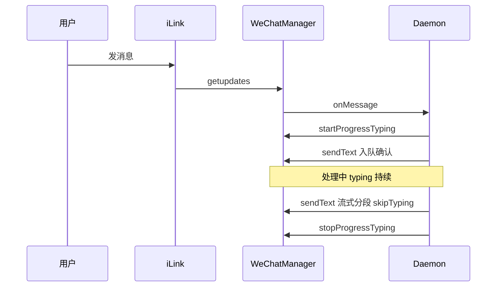

# 微信通道

## 一、能力范围

**负责**：微信 iLink（ClawBot）HTTP API 封装、Token/扫码登录、长轮询收消息、文本与媒体收发、**会话级进度 typing**、sync buf 与 context_token 持久化、入站媒体 CDN 解密下载。

**不负责**：iLink Token 申请流程、Electron 二维码展示 UI、群聊 @ 路由（微信无 @ 过滤）。斜杠指令经 Daemon `daemon-manager` 与飞书**同枢纽、同规则**（全员、无管理员二分）。

## 二、设计决策与取舍

- **长轮询**：`ILinkApi.getUpdates(buf, timeout)` 默认 35s（`api.ts`）。
- **进度 typing 独立**：daemon `sessionProgressMap` 经 `startProgressTyping`/`stopProgressTyping` 控制进行中指示，**不**绑定每次 `sendText`（T2）。
- **sendText 默认 skipTyping**：`opts.skipTyping !== false` 时跳过 `ensureTyping`/`cancelTyping`；Agent 最终回复与流式分段显式 `{ skipTyping: true }`。
- **首条私聊不入队**：WeChat `onMessage` 在 `bindArmed` 或 `firstMessage` 时仅 context 绑定、不入队（`src/daemon/daemon.ts` L291–297）。
- **CDN 加解密**：AES-128-ECB（`crypto.ts:parseAesKey`）。

## 三、服务端规则

- **过滤丢弃**：`message_type===2`、非 FINISH 的 `message_state`、发送者等于 `selfAccountId`。
- **群聊判定**：`group_id` 非空 → group；否则 p2p。
- **入队后进度**：daemon 入队确认成功后 `startProgressTyping(chatId)`，直至 `stopSessionProgress`（ack/异常/final）。
- **发送依赖**：`sendText/sendMedia` 需目标用户 `context_token`（收消息时更新并持久化）。
- **流式**：daemon `stream-text` 首包与分段均 `sendText(..., { skipTyping: true })`；无 PATCH，靠分段 delta 模拟流式。

## 四、客户端流程

## 五、接口

| iLink 端点 | 用途 |
|------------|------|
| `ilink/bot/getupdates` | 长轮询收消息 |
| `ilink/bot/sendmessage` | 发送文本/媒体 |
| `ilink/bot/getconfig` + `sendtyping` | typing / cancel |

**WeChatManager 公开方法**：

| 方法 | 说明 |
|------|------|
| `sendText(to, text, { skipTyping? })` | 默认 skipTyping=true |
| `startProgressTyping(userId)` | 会话级进行中（daemon 调用） |
| `stopProgressTyping(userId)` | 停止并 cancelTyping |

## 六、数据

- 持久化目录 `APP_DATA_DIR/wechat-data/{channelId}/`：`wechat-sync.txt`、`wechat-ctx-tokens.json`、`state.json`。
- 运行时：`typingTickets` Map 缓存 ticket。

## 七、非功能与可观测

- 状态机：`disconnected → qr_pending → logging_in → connected | error`。
- stdout：`__WECHAT_QR__`、`__WECHAT_STATUS__` 供 Electron 展示。
- 连续 API 失败 3 次退避 30s；errcode -14 会话过期休眠 1h。
- 文本换行：出站 `\n` → `\r\n`。

## 八、推送

无；纯 iLink HTTP 长轮询。

## 九、已知限制与 TODO

- 无 Get/DONE 表情；进行中仅 typing 可见。
- 群聊无 @ 过滤，所有 FINISH 用户消息均入队。
- send-text API 不返回 message_id，无法 trackMessageSession。
- typing 5s 内消失等时效须联调确认（NF3）。

## 十、变更记录

2026-07-11：批1 锚点同步——首条 p2p 不入队精确至 `src/daemon/daemon.ts` L291–297（lite 20260711232323）。
2026-06-28：startProgressTyping/stopProgressTyping；sendText 默认 skipTyping 与进度状态机解耦。
2026-06-27：kb-sync 初始建立。
2026-07-04：斜杠指令与飞书同枢纽、全员规则（archive 20260704152837）。
