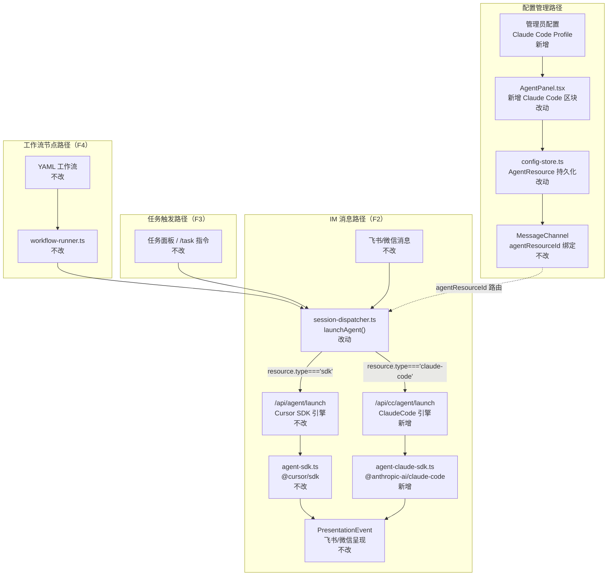
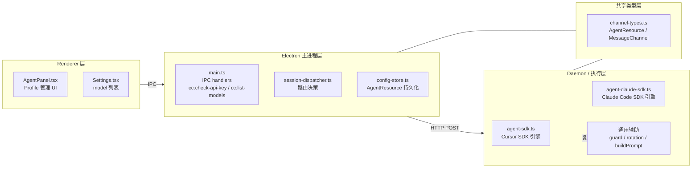

# 执行引擎扩展接入 ClaudeCode - 实现设计

> **业务 PRD**：见同目录 `01-proposal.md`（验收标准以 01 为准）

## 1、业务流程与改动范围

> 业务口径以 `01-proposal.md` F1～F6 为准；下图覆盖三条执行路径（IM 消息、任务触发、工作流节点）以及配置管理流程。

### 1.1 业务流程图



**图例**：`不改` 行为与现网一致；`改动` 需改代码/配置；`新增` 新节点或新分支；`删除` 移除路径。

### 1.2 流程步骤与改动对照

| 步骤 ID | 业务含义 | 改动 | 落点（模块/文件） | 01 验收关联 |
|---------|----------|------|-------------------|-------------|
| C-1 | AgentResource 数据类型加 `claude-code` 与 `baseUrl` | 改动 | `src/shared/channel-types.ts` | 01 §F1、验收 7/8 |
| C-2 | config-store 加 `newClaudeCodeResourceId()`，兼容新 type | 改动 | `electron/config-store.ts` | 01 §F1、验收 8 |
| C-3 | AgentPanel 加 Claude Code Profile 管理区块 | 改动 | `src/renderer/components/AgentPanel.tsx` | 01 §F1/F6、验收 7/8 |
| C-4 | Settings model 列表加载兼容 `claude-code` type | 改动 | `src/renderer/pages/Settings.tsx` | 01 §F1 |
| C-5 | main.ts 加 IPC handler `cc:check-api-key`、`cc:list-models` | 改动 | `electron/main.ts` | 01 §F1、验收 7 |
| C-6 | command-handler 加 `claude-code` 分支处理模型列表 | 改动 | `electron/command-handler.ts` | 01 §F1 |
| D-1 | session-dispatcher `launchAgent()` 加 `claude-code` 路由分支 | 改动 | `electron/session-dispatcher.ts` | 01 §F2/F3/F4、验收 1/2/3/4 |
| D-2 | 新建 Claude Code SDK 执行引擎文件 | 新增 | `electron/agent-claude-sdk.ts` | 01 §F2/F3/F4/F5、验收 1/2/3/5/6 |
| D-3 | context-usage 加 Claude 模型上限硬编码 fallback | 改动 | `electron/context-usage.ts` | 01 §F5、验收 6 |
| D-4 | 通用辅助：guard / rotation / buildPrompt / PresentationEvent | 不改 | `electron/agent-run-guard.ts`、`context-rotation-lite.ts`、`agent-launcher.ts` | 01 §F5 |
| D-5 | IM 连接层（飞书/微信 WebSocket） | 不改 | 飞书/微信 Daemon 侧 | — |
| D-6 | 工作流 YAML 定义格式 | 不改 | `workflow-file.ts`、工作流 YAML | — |

### 1.3 改动汇总

- **改动**：`channel-types.ts`（类型扩展）、`config-store.ts`（ID 生成）、`session-dispatcher.ts`（路由分支）、`command-handler.ts`（模型列表）、`context-usage.ts`（上限 fallback）、`main.ts`（IPC handler）、`AgentPanel.tsx`（Profile 管理 UI）、`Settings.tsx`（model 列表兼容）
- **新增**：`electron/agent-claude-sdk.ts`（Claude Code SDK 执行引擎）
- **不改（显式列出）**：`agent-sdk.ts`（Cursor SDK 路径完整保留）、`agent-run-guard.ts`、`context-rotation-lite.ts`、`agent-launcher.ts`、`workflow-runner.ts`、`workflow-file.ts`、飞书/微信 WebSocket 层、工作流 YAML 格式

---

## 2、整体思路

见 01 §背景/目标：根因是对单一 SDK（`@cursor/sdk`）的硬依赖，方案要点是新增 `agent-claude-sdk.ts` 镜像现有 SDK 引擎结构，在 `session-dispatcher.ts` 的单一路由决策点按 `resource.type` 切换，下游 Presentation 层不感知引擎差异。

**最小方案三问（必答）**：

1. **能否复用现有模块，而非新建抽象层？** 可以。`agent-run-guard.ts`（纯 mutex/watchdog，无 SDK 依赖）、`context-rotation-lite.ts`（纯状态机）、`agent-launcher.ts` 的 `buildPrompt`/`resolveSessionChatName`/`ChatType`/`LaunchMeta` 均引擎无关，新引擎直接 import 复用，不需要新增抽象层或 wrapper。

2. **拟新增的抽象是否被 PRD 明确要求？** 新建 `agent-claude-sdk.ts` 是 F2/F3/F4 明确要求（覆盖三条执行路径）。**不引入** 公共 `AgentEngine` interface——PRD 验收无此要求，两 SDK 的 `Run` 生命周期 API 不同构，强行对齐会扭曲实现，引入仅有两个实现的过度抽象。

3. **能否合并到已有文件？** `agent-claude-sdk.ts` 不可合并到 `agent-sdk.ts`——两文件依赖完全不同的 npm 包（`@cursor/sdk` vs `@anthropic-ai/claude-code`），合并会导致类型冲突与职责混乱。`channel-types.ts` 和 `config-store.ts` 的改动可原地 inline（加一个 union 成员和一个可选字段），无需新文件。

---

## 3、分层设计



- **端点层（Renderer）**：`AgentPanel.tsx` 管理 Claude Code Profile（新建/编辑/删除/验证），`Settings.tsx` 展示 model 列表
- **服务层（Main Process）**：`session-dispatcher.ts` 是唯一路由决策点，`config-store.ts` 负责 Profile 持久化
- **数据层（Daemon 执行层）**：`agent-claude-sdk.ts` 新建，与 `agent-sdk.ts` 并列，共享 `agent-run-guard.ts`、`context-rotation-lite.ts`

---

## 4、接口设计

### 4.1 新增 IPC Handler（`electron/main.ts`）

```typescript
// cc:check-api-key — 验证 Claude Code API Key 有效性
ipcMain.handle("cc:check-api-key", async (_, apiKey: string): Promise<{ ok: boolean; error?: string }>)

// cc:list-models — 返回 Claude 可用模型列表（硬编码，后续可接 API 动态拉取）
ipcMain.handle("cc:list-models", async (): Promise<{ id: string; label: string }[]>)
```

### 4.2 新增 HTTP 端点（`agent-claude-sdk.ts` 暴露，Daemon 侧）

| 端点 | 方法 | 请求体关键字段 | 说明 |
|-----|------|-------------|------|
| `/api/cc/agent/launch` | POST | `session_key, chat_type, channel_id, model, api_key, base_url, working_directory, chat_name, message_ids?` | 发起新 Claude Code Run 或复用 resident session |
| `/api/cc/agent/dispatch` | POST | `session_key, text, message_ids?` | 二次 dispatch 到 resident CC session |

`ensureClaudeCodeHttpServer()` 在 Daemon 启动时调用，与 `ensureAgentSdkHttpServer()` 并列注册路由，共用同一 HTTP 服务器实例（不同路径前缀 `/api/cc/*`）。现有 `/api/agent/*` 端点不改动。

### 4.3 session-dispatcher.ts 路由扩展

```typescript
// electron/session-dispatcher.ts — launchAgent() 改动片段
const resource = getAgentResource(channel?.agentResourceId)
if (resource.type === "sdk") {
  // 原有路径：POST http://127.0.0.1:{lock.port}/api/agent/launch
  // body: { session_key, chat_type, channel_id, model, model_params, ... }
} else if (resource.type === "claude-code") {
  // 新增路径：POST http://127.0.0.1:{lock.port}/api/cc/agent/launch
  // body 额外加入 api_key: resource.apiKey, base_url: resource.baseUrl
} else {
  return { ok: false, error: "请配置 SDK 资源（设置 → Agent）" }
}
```

---

## 5、数据结构

### 5.1 AgentResource 扩展（`src/shared/channel-types.ts`）

```typescript
// 改动：type union 加 "claude-code"；加可选字段 baseUrl、model
export interface AgentResource {
  id: string;         // "cli" | "sdk_<uuid>" | "cc_<hex8>"（新增 cc_ 前缀）
  type: "cli" | "sdk" | "claude-code";   // 改动：加 "claude-code"
  name: string;
  apiKey?: string;    // SDK（Cursor）/ Claude Code 均使用
  email?: string;     // 仅 Cursor SDK：账号邮箱缓存（展示用）
  baseUrl?: string;   // 新增：Claude Code 自定义 API Base URL，空 = 使用 Anthropic 默认
  model?: string;     // 新增：Claude Code Profile 默认模型
}
```

`MessageChannel.agentResourceId` 字段不改动，直接绑定 `cc_<hex8>` ID 即实现 F6（IM 通道绑定 Claude Code Profile），无需新字段。

### 5.2 ClaudeCodeLaunchOptions（`electron/agent-claude-sdk.ts`，新增）

```typescript
export interface ClaudeCodeLaunchOptions {
  sessionKey: string;
  chatType: ChatType;       // 复用 agent-launcher.ts 的类型
  meta?: LaunchMeta;
  workspaceDir: string;
  useMainWorkspace?: boolean;
  senderOpenId?: string;
  chatName?: string;
  taskMessage?: string;
  apiKey: string;
  baseUrl?: string;         // 自定义 Anthropic 协议端点
  model?: string;
}
```

### 5.3 config-store 扩展

新增 `newClaudeCodeResourceId(): string`，返回 `"cc_" + randomHex(8)`，与现有 `sdk_<uuid>` 命名空间隔离，无需迁移现有数据。

---

## 6、实现步骤

（步骤编号可回溯「1.2」对照表步骤 ID）

1. **[C-1] 扩展 `channel-types.ts`**：`AgentResource.type` 加 `"claude-code"`，加 `baseUrl?: string`、`model?: string` 可选字段。确认 TypeScript 类型推断无破坏。
2. **[C-2] 扩展 `config-store.ts`**：加 `newClaudeCodeResourceId()` 函数，`getAgentResources()` 无需改动（已返回全部 Resource，type 判断由调用方做）。
3. **[D-2] 新建 `electron/agent-claude-sdk.ts`**：
   - 复制 `agent-sdk.ts` 的整体骨架（`SessionAgent` Map、HTTP 服务器注册、launch/dispatch/stop 函数）
   - 将 `@cursor/sdk` 的 `SDKAgent`/`Run` 调用替换为 `@anthropic-ai/claude-code` 的对应 API
   - 实现 `handleCcEvent(session, event)` 将 Claude Code SDK 流式事件映射到 `PresentationEvent`（见步骤 5 表格）
   - 直接 import `agent-run-guard.ts`（`acquireRunGuard`/`releaseRunGuard`/`watchRunGuard`）
   - 直接 import `context-rotation-lite.ts`（`maybeRotateContext`）
   - 直接 import `agent-launcher.ts`（`buildPrompt`、`resolveSessionChatName`、`ChatType`、`LaunchMeta`）
   - 实现 `ensureClaudeCodeHttpServer()`，注册 `/api/cc/agent/launch`、`/api/cc/agent/dispatch` 路由
4. **[D-3] 扩展 `context-usage.ts`**：`resolveModelContextLimit` 加 Claude 模型硬编码 fallback：`claude-*(3|4|sonnet|opus|haiku)` → 200k；`claude-*2` → 100k；其余 `claude-*` → 200k（保守默认）。
5. **[D-1] 修改 `session-dispatcher.ts`**：`launchAgent()` 中 `resource.type !== "sdk"` 判断改为两分支（`sdk`/`claude-code`），`claude-code` 分支 POST 到 `/api/cc/agent/launch`，body 加入 `api_key`、`base_url`；并在模块初始化时调用 `ensureClaudeCodeHttpServer()`。
6. **[C-6] 修改 `command-handler.ts`**：加 `resource.type === "claude-code"` 分支，调用 `cc:list-models` IPC（或直接返回硬编码列表）。
7. **[C-5] 修改 `electron/main.ts`**：注册 `cc:check-api-key`（调用 Claude Code SDK auth 验证）和 `cc:list-models`（返回硬编码模型列表）IPC handler。
8. **[C-3] 修改 `AgentPanel.tsx`**：在 Cursor SDK Profile 列表下方新增独立区块「Claude Code SDK」，字段：名称（必填）、API Key（必填 + 验证按钮）、API Base URL（选填）、默认模型（选填）；通过 `config:save` 持久化（复用现有模式，无需新 IPC）。
9. **[C-4] 修改 `Settings.tsx`**：model 列表加载逻辑兼容 `resource.type === "claude-code"`，分支调用 `cc:list-models`。
10. **集成测试**：覆盖三条路径（IM、任务、工作流）在 Claude Code SDK 引擎下的端到端流转，对照 01 §验收标准 1-9 逐条验证。

**事件映射对照（步骤 3 用）**：

| Claude Code SDK 事件类型 | PresentationEvent.kind | 备注 |
|--------------------|----------------------|------|
| 文本 / assistant 内容 | `"assistant"` | 流式累积，final 包携带 ack |
| thinking / 推理链内容 | `"thinking"` | SDK 暴露时转发，否则忽略 |
| `tool_use` / `tool_result` | `"tool"` | 工具调用名称映射到 `tool_name` |
| 文件 diff 变更 | `"diff"` | 读取工具结果后提取 |
| 批量合并 | `"merge_batch"` | 多 diff 聚合 |

---

## 7、参考实现

CodeGraph 定位的关键符号与路径：

- `launchSdkAgent` — `electron/agent-sdk.ts`：Claude Code 引擎的 `launchClaudeCodeAgent` 以此为结构参考（launch params 解析、session Map 管理、guard 获取、HTTP 服务器注册方式）
- `streamRunEvents` / `handleSdkEvent` — `electron/agent-sdk.ts`：事件流处理骨架，CC 引擎的 `streamCcEvents` / `handleCcEvent` 镜像此结构
- `acquireRunGuard` / `watchRunGuard` — `electron/agent-run-guard.ts`：直接复用，无需适配
- `maybeRotateContext` — `electron/context-rotation-lite.ts`：直接复用，无需适配
- `buildPrompt` — `electron/agent-launcher.ts`：Prompt 构建唯一入口，两引擎共用
- `PresentationEvent` — `electron/agent-sdk.ts`：下游通用事件格式，CC 引擎 emit 相同结构，飞书/微信呈现层无需改动
- `getAgentResource` / `newSdkResourceId` — `electron/config-store.ts`：新增 `newClaudeCodeResourceId()` 模仿此函数
- `handleSave` / `handleVerify` — `src/renderer/components/AgentPanel.tsx`：ClaudeCode Profile 管理 UI 复用此交互模式

---

## 8、技术影响

### 8.1 影响范围

- **涉及模块**：`agent-claude-sdk.ts`（新建）、`session-dispatcher.ts`、`channel-types.ts`、`config-store.ts`、`context-usage.ts`、`command-handler.ts`、`main.ts`、`AgentPanel.tsx`、`Settings.tsx`
- **接口/proto 变更**：新增 HTTP 端点 `/api/cc/agent/launch`、`/api/cc/agent/dispatch`；新增 IPC handler `cc:check-api-key`、`cc:list-models`；现有接口全部保留不变
- **数据变更**：`AgentResource` 类型扩展（加 union 成员 + 2 个可选字段）；`electron-store` 配置 schema 向前兼容（新字段均可选）
- **风险**：
  - `@anthropic-ai/claude-code` SDK 流式事件结构与 Cursor SDK 不同构，事件映射可能有遗漏（中风险，`handleCcEvent` 加 unknown event 日志）
  - Claude Code SDK Run 取消 API 语义差异导致 timeout 收尾不干净（中风险，单独测试超时场景）
  - 硬编码模型上限与实际 API 不符（低风险，加注释说明来源）
  - `baseUrl` 为空字符串 vs `undefined` 时 SDK 行为差异（低风险，实现时确认并加防御处理）

### 8.2 工程补充验收项

- [ ] `resource.type === "claude-code"` 的通道切换回 Cursor SDK 后，`session-dispatcher.ts` 路由恢复正常（验收标准 4）
- [ ] `agent-run-guard.ts` 的 mutex 在 CC 引擎路径下正常防止同 session 并发 dispatch
- [ ] `context-rotation-lite.ts` 在 CC 引擎路径下正常触发上下文轮转
- [ ] `electron-store` 旧配置（不含 `claude-code` type 条目）启动后正常加载，不崩溃
- [ ] `baseUrl` 为空/未设置时，CC 引擎使用 Anthropic 默认端点，不报错

---

## 9、知识库影响

- `knowledge/业务域/Agent调度/03-启动与自动重连.md` — 新增 Claude Code SDK 引擎启动路径，现文档仅描述 Cursor SDK；需更新「关键源码」表加 `agent-claude-sdk.ts`
- `knowledge/业务域/Agent调度/01-概览.md` — 模块总图需加 `agent-claude-sdk.ts` 节点与 Cursor SDK 并列
- `knowledge/业务域/Agent调度/00-README.md` — 「关键源码」表加 `agent-claude-sdk.ts`
- `src/shared/channel-types.ts`（类型层）— 已更新，知识库文档中引用此接口的地方（如 02-多会话模型.md）需校验无过时描述
- 两级索引：`知识索引.md` 不需要更新（Agent 调度域已有入口）；Agent 调度域 README 需更新文件清单

---

## 10、知识库更新计划

### 10.1 必须更新

- `knowledge/业务域/Agent调度/00-README.md` — 文件清单加 `agent-claude-sdk.ts` 条目
- `knowledge/业务域/Agent调度/01-概览.md` — 模块总图加 Claude Code 引擎节点
- `knowledge/业务域/Agent调度/03-启动与自动重连.md` — 补充 Claude Code SDK 启动路径说明

### 10.2 可能更新（视实现结果）

- `knowledge/工程平台/Electron桌面应用/02-主进程与IPC.md` — 若新增 IPC handler 超过 3 个，补充 `cc:*` 系列说明
- `knowledge/业务域/Agent调度/02-多会话模型.md` — 若 Claude Code SDK 的 resident session 行为与 Cursor SDK 有差异，补充说明

### 10.3 不需要更新

- `knowledge/业务域/Agent调度/04-远程指令.md` — 远程指令层不涉及引擎切换
- `knowledge/业务域/Agent调度/05-定时任务.md` — Cron 调度路径通过 session-dispatcher 透明路由，文档描述仍准确
- `knowledge/工程平台/` 其余文档 — 无直接涉及
- `知识索引.md` — Agent 调度域入口无变化
