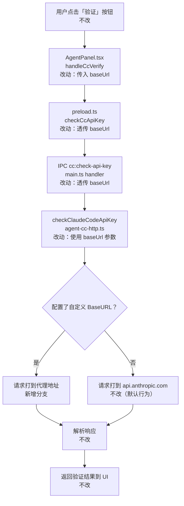

# 修复 Anthropic 协议 API Key 验证忽略自定义 BaseURL - 实现设计

> **业务 PRD**：见同目录 `01-proposal.md`（验收标准以 01 为准）

## 1、业务流程与改动范围

> 业务口径以 `01-proposal.md` §期望行为 为准；下图覆盖「验证 Key」主流程与 BaseURL 配置分支。

### 1.1 业务流程图



**图例**：`不改` 行为与现网一致；`改动` 需改代码/配置；`新增` 新节点或新分支。

### 1.2 流程步骤与改动对照

| 步骤 ID | 业务含义 | 改动 | 落点（模块/文件） | 01 验收关联 |
|---------|----------|------|-------------------|-------------|
| V-1 | 用户点击「验证」按钮 | 不改 | `AgentPanel.tsx` UI 触发 | — |
| V-2 | handleCcVerify 调用 checkCcApiKey | 改动 | `AgentPanel.tsx:185` — 增加传入 `editingCc.baseUrl` | AC-1、AC-2 |
| V-3 | preload.ts 透传 IPC | 改动 | `preload.ts:252` — 函数签名增加 `baseUrl?` 并透传 | AC-4（编译） |
| V-4 | main.ts IPC handler 调用后端函数 | 改动 | `main.ts:373` — handler 解构 `baseUrl` 并传给 `checkClaudeCodeApiKey` | AC-4（编译） |
| V-5 | checkClaudeCodeApiKey 发起 HTTP 请求 | 改动 | `agent-cc-http.ts:49` — 函数签名增加 `baseUrl?`，请求使用该地址 | AC-1、AC-2、AC-3 |
| V-6 | 使用自定义 BaseURL 路由请求（新分支） | 新增 | `agent-cc-http.ts` 内部逻辑 | AC-1 |
| V-7 | 兜底默认 api.anthropic.com（原路径） | 不改 | `agent-cc-http.ts` 默认值 | AC-2 |
| V-8 | 解析响应并返回 UI | 不改 | `agent-cc-http.ts` 响应解析段 | AC-3 |
| T-1 | env.d.ts 类型声明同步 | 改动 | `src/renderer/env.d.ts:223` | AC-4（编译） |

### 1.3 改动汇总

- **改动（5 个文件，最小改动）**：
  - `electron/agent-cc-http.ts` — `checkClaudeCodeApiKey` 增加 `baseUrl?` 参数
  - `electron/main.ts` — IPC handler 透传 `baseUrl`
  - `electron/preload.ts` — `checkCcApiKey` 函数签名与 invoke 调用增加 `baseUrl?`（PRD 漏列，设计补充）
  - `src/renderer/env.d.ts` — 类型签名同步
  - `src/renderer/components/AgentPanel.tsx` — `handleCcVerify` 传入 `editingCc.baseUrl`
- **新增**：`checkClaudeCodeApiKey` 内部 `baseUrl` 有值时走代理分支
- **不改（显式列出）**：
  - 响应解析逻辑（V-8）— 无需变更
  - `buildSpawnEnv` 与 Agent 启动链路 — 已正确处理 `ANTHROPIC_BASE_URL`，不受本次影响
  - 错误文案格式 — 保持不变

## 2、整体思路

根因见 `01-proposal.md` §根因分析：`checkClaudeCodeApiKey` 将验证用的 `baseUrl` 硬编码为 `https://api.anthropic.com`，IPC 链路（preload → main → 函数）全程只传递 `apiKey`，导致配置了代理的用户验证时绕开代理直接打官方地址。

**方案要点**：沿 IPC 链路向下传递可选的 `baseUrl` 参数，函数内部用 `baseUrl?.trim() || "https://api.anthropic.com"` 决定请求目标，其余逻辑（请求构造、响应解析、超时）不变。

**最小方案三问**：

1. **能否复用现有模块/符号？** 是。所有改动均在已有函数/文件内追加一个可选参数，无需新建文件或抽象层。
2. **是否引入新抽象或第三方依赖？** 否。改动仅在函数签名和参数传递上，不引入任何新依赖或接口层。
3. **能否合并到已有文件？** 是。5 个文件均为就地修改，无新增文件。

## 3、分层设计

- **端点层（Renderer）**：`AgentPanel.tsx` 读取 `editingCc.baseUrl` 并传入 IPC 调用
- **桥接层（Preload / IPC）**：`preload.ts` + `main.ts` 透传 `baseUrl` 参数，接口契约随类型声明同步
- **主进程层（Main）**：`agent-cc-http.ts` 使用 `baseUrl` 替换硬编码地址

## 4、接口设计

IPC Channel `cc:check-api-key` 签名变更：

| 方向 | 修改前 | 修改后 |
|------|--------|--------|
| Renderer → Main | `invoke("cc:check-api-key", apiKey)` | `invoke("cc:check-api-key", apiKey, baseUrl?)` |
| Main handler | `(_, apiKey: string)` | `(_, apiKey: string, baseUrl?: string)` |
| 返回值 | `{ ok: boolean; error?: string }` | 不变 |

`checkClaudeCodeApiKey` 函数签名：

```ts
// 修改前
export async function checkClaudeCodeApiKey(apiKey: string): Promise<{ ok: boolean; error?: string }>

// 修改后
export async function checkClaudeCodeApiKey(apiKey: string, baseUrl?: string): Promise<{ ok: boolean; error?: string }>
```

`env.d.ts` / `preload.ts` 中 `checkCcApiKey` 签名同步：

```ts
// 修改前
checkCcApiKey(apiKey: string): Promise<{ ok: boolean; error?: string }>

// 修改后
checkCcApiKey(apiKey: string, baseUrl?: string): Promise<{ ok: boolean; error?: string }>
```

## 5、数据结构

无新增表/字段/模型。`baseUrl` 已在 `AgentResource` 中存在（`src/shared/channel-types.ts`），本次仅将其传入验证链路。

## 6、实现步骤

1. **步骤 V-5 对应**：修改 `electron/agent-cc-http.ts`
   - `checkClaudeCodeApiKey(apiKey: string, baseUrl?: string)` 增加可选参数
   - 函数体第一行将 `const baseUrl = "https://api.anthropic.com"` 改为 `const effectiveBaseUrl = baseUrl?.trim() || "https://api.anthropic.com"`
   - 后续 `url` 拼接改用 `effectiveBaseUrl`

2. **步骤 V-4 对应**：修改 `electron/main.ts:373`
   - `ipcMain.handle("cc:check-api-key", (_, apiKey: string, baseUrl?: string) => checkClaudeCodeApiKey(apiKey, baseUrl))`

3. **步骤 V-3 对应**：修改 `electron/preload.ts:252`
   - `checkCcApiKey: (apiKey: string, baseUrl?: string): Promise<...> => ipcRenderer.invoke("cc:check-api-key", apiKey, baseUrl)`

4. **步骤 T-1 对应**：修改 `src/renderer/env.d.ts:223`
   - `checkCcApiKey(apiKey: string, baseUrl?: string): Promise<{ ok: boolean; error?: string }>`

5. **步骤 V-2 对应**：修改 `src/renderer/components/AgentPanel.tsx:185`
   - `window.electronAPI.checkCcApiKey(editingCc.apiKey.trim(), editingCc.baseUrl?.trim() || undefined)`

## 7、参考实现

- **已有参数模式**：`buildSpawnEnv(apiKey, baseUrl?)` 在 `electron/agent-claude-sdk.ts:257`，已经以相同方式将可选 `baseUrl` 转为 `ANTHROPIC_BASE_URL`，本次改动与其保持一致。
- **checkClaudeCodeApiKey 现有实现**：`electron/agent-cc-http.ts:49-104`
- **IPC handler 参考**：`electron/main.ts:371`（`sdk:check-api-key` 签名，单参数模式）

## 8、技术影响

### 8.1 影响范围

- **涉及模块**：主进程 API Key 验证、IPC 桥接层、Renderer Agent 配置面板
- **接口/proto 变更**：IPC Channel `cc:check-api-key` 新增可选第二参数（向后兼容，旧 invoke 不传 baseUrl 时行为不变）
- **数据变更**：无
- **风险**：极低。参数可选且兜底逻辑与现有行为完全一致；不影响 Agent 启动链路；不影响 SDK 验证逻辑

### 8.2 工程补充验收项

- [ ] TypeScript 编译（`npm run build` 或 `tsc --noEmit`）无新增错误
- [ ] 未配置 BaseURL 时 `invoke("cc:check-api-key", apiKey)` 行为不变（兼容性）

## 9、知识库影响

- `knowledge/业务域/Agent调度/`（若有 API Key 验证相关文档）— 验证逻辑与参数传递有变更
- 无跨域影响，IPC 链路为内部实现细节，不影响外部接口契约

## 10、知识库更新计划

### 10.1 必须更新

- 无（本次为 bugfix，无新业务能力；archive 阶段确认无相关知识文件需同步）

### 10.2 可能更新（视实现结果）

- `knowledge/业务域/Agent调度/`（如存在 Claude Code Profile / API Key 验证相关页）— 补充「验证请求遵循 BaseURL 配置」说明

### 10.3 不需要更新

- 知识索引、工程平台入口 — 无结构变更
- `01-概览.md` — 业务域主流程无变化
