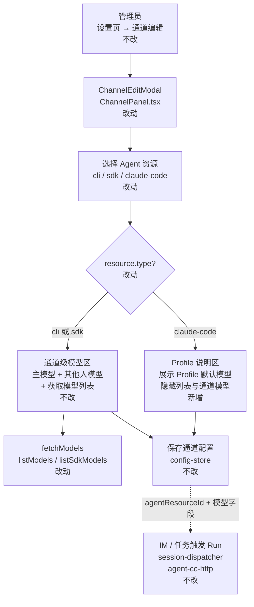

# 通道编辑 Agent 资源与模型按类型联动 - 实现设计

> **业务 PRD**：见同目录 `01-proposal.md`（验收标准以 01 为准）

## 一、业务流程与改动范围

### （一）业务流程图

**图例**：`不改` 行为与现网一致；`改动` 需改代码；`新增` 新 UI 分支；`删除` 本变更无删除路径。

### （二）流程步骤与改动对照

| 步骤 ID | 业务含义 | 改动 | 落点（模块/文件） | 01 验收关联 |
|---------|----------|------|-------------------|-------------|
| CE-1 | 打开通道编辑弹窗 | 不改 | `src/renderer/components/ChannelPanel.tsx` → `ChannelEditModal` | 01 验收 1/2/5 |
| CE-2 | 选择 Agent 资源类型 | 改动 | 同上；`resource = resources.find(...)`（约 L266） | 01 §F3/F4、验收 3/4 |
| CE-3 | Cursor CLI/SDK：展示通道级主/其他人模型 +「获取模型列表」 | 不改 | 同上「Agent 资源与模型」区块（约 L541–578） | 01 §F1、验收 1 |
| CE-4 | Claude Code Profile：隐藏列表入口与通道级模型控件 | 改动 | 同上；条件渲染替代固定展示 | 01 §F2、验收 2/5 |
| CE-5 | 展示 Profile 层默认模型说明 | 新增 | 同上；读取 `resource.model`（Profile 字段） | 01 §F2、验收 2 |
| CE-6 | 点击「获取模型列表」 | 改动 | `fetchModels`（约 L268–283）：仅 `cli`/`sdk` 分支；`claude-code` 不触发 | 01 §F2、验收 2/5 |
| CE-7 | 切换资源类型时清空列表缓存 | 不改 | `useEffect` 清空 `modelOptions`（约 L285–287） | 01 §F3、验收 3 |
| CE-8 | 切换至 CC 时清理 draft 通道模型（防误导） | 改动 | `agentResourceId` onChange 或等价 effect | 01 §F3、验收 3 |
| CE-9 | 资源下拉分组/文案区分三类 | 改动 | `<select>` options（约 L552–554） | 01 §F4、验收 4 |
| CE-10 | 保存通道并触发 Run | 不改 | `config-store.ts`、`session-dispatcher.ts`、`agent-cc-http.ts` | 01 非目标、验收 6 |

### （三）改动汇总

- **改动**：`src/renderer/components/ChannelPanel.tsx`（`ChannelEditModal` 条件 UI、`fetchModels` 守卫、资源下拉分组、切换 CC 时清理 draft 模型）
- **新增**：Claude Code Profile 只读说明区（Profile 名称 + 默认模型/ SDK 默认提示）
- **不改**：`AgentPanel.tsx`（Profile CRUD 与默认模型字段）、`Settings.tsx` 任务编辑、`electron/*` 执行与模型解析、`channel-types.ts` 数据结构

---

## 二、整体思路

**根因**：Claude Code 接入后，`ChannelEditModal` 的「Agent 资源与模型」仍为 Cursor 时代固定布局——无论 `resource.type` 均展示「获取模型列表」与通道级主/其他人模型；`fetchModels` 仅区分 `sdk` 与「其他」（走 `listModels` CLI 路径），未识别 `claude-code`。

**方案要点**（对齐 01，参考 `Settings.tsx` 的 `fetchTaskModels` 三分支思路，但通道级 CC **不拉列表**）：

1. 以 `resource?.type` 驱动 UI：`cli`/`sdk` 保持现网；`claude-code` 隐藏列表与通道模型，改为 Profile 说明。
2. 切换资源时复用已有 `modelOptions` 清空 effect；补充切换至 CC 时清空 `draft.model` / `draft.othersModel`（及 params），避免残留 Cursor 配置。
3. 资源 `<select>` 用 `<optgroup>` 或类型前缀区分 Cursor CLI、Cursor SDK、Claude Code Profile（F4）。
4. **不修改**执行引擎；运行时模型仍以 `agent-cc-http.ts` 解析链为准：`body > resource.model > resolveChannelModel > fallback`。

---

## 三、分层设计

| 层级 | 落点 | 本变更职责 |
|------|------|------------|
| Renderer UI | `ChannelPanel.tsx` | 唯一改动文件；弹窗内条件展示 |
| 配置持久化 | `config-store.ts` / IPC | 不改 schema；CC 通道可仍存 legacy `model` 字段 |
| 执行引擎 | `agent-cc-http.ts`、`session-dispatcher.ts` | 不改；Profile 默认模型已在 `AgentResource.model` |

Profile 层模型配置仍在 `AgentPanel.tsx`「默认模型（选填）」字段（约 L321–324），列表卡片亦展示 `r.model`（约 L271–275）。

---

## 四、接口设计

无 IPC、HTTP、proto 变更。仍使用既有：

- `window.electronAPI.listModels()` — CLI
- `window.electronAPI.listSdkModels(apiKey, model, modelParams)` — SDK
- `window.electronAPI.getConfig()` / `saveConfig()` — 通道与资源读写

`listCcModels` **不在**通道编辑弹窗调用（与 01 §F2 一致；任务编辑 `Settings.fetchTaskModels` 仍可用，本变更不触及）。

---

## 五、数据结构

无 `MessageChannel` / `AgentResource` 字段增删。

| 字段 | 层级 | 本变更 UI 含义 |
|------|------|----------------|
| `AgentResource.model` | Profile（`claude-code`） | CC 通道编辑区只读展示来源 |
| `ChannelConfig.model` / `othersModel` | 通道 | Cursor 类型可编辑；切 CC 时 draft 清空，保存后不再误导 |

---

## 六、实现步骤

1. **S1（CE-2/CE-4/CE-5）** 在 `ChannelEditModal` 增加 `isCcProfile = resource?.type === "claude-code"`、`isCursorChannel = resource?.type === "cli" || resource?.type === "sdk"`。
2. **S2（CE-4/CE-5）** `isCcProfile` 时：隐藏「获取模型列表」按钮与主/其他人模型控件；展示说明文案（Profile 名、`resource.model` 或「未配置，执行时使用 SDK 默认」）。
3. **S3（CE-6）** `fetchModels` 开头：`if (resource?.type === "claude-code") return`（防御性，与隐藏按钮双保险）。
4. **S4（CE-8）** `agentResourceId` 变更：若新资源为 `claude-code`，`set` 清空 `model`/`modelParams`/`othersModel`/`othersModelParams`；若从 CC 切回 Cursor，保留或回显 draft 中已存通道模型（打开弹窗时 `useState(channel)` 已带持久化值）。
5. **S5（CE-9）** 资源下拉改为 `<optgroup label="Cursor CLI">` 等三组，option 文案含类型提示（如 SDK 保留 `email` 后缀）。
6. **S6** 手工回归 01 验收 1–6。

---

## 七、参考实现

> CodeGraph 索引未初始化（`codegraph init` 缺失），以下由源码核实。

| 符号 | 路径 | 用途 |
|------|------|------|
| `ChannelEditModal` | `src/renderer/components/ChannelPanel.tsx:244` | 通道编辑弹窗主体 |
| `fetchModels` | `src/renderer/components/ChannelPanel.tsx:268` | 现仅 sdk/cli 分支；缺 CC 守卫 |
| `modelOptions` 清空 effect | `src/renderer/components/ChannelPanel.tsx:285` | 切换 `agentResourceId` 清列表 |
| Agent 资源与模型 JSX | `src/renderer/components/ChannelPanel.tsx:541` | 待条件化区块 |
| `fetchTaskModels` | `src/renderer/pages/Settings.tsx:411` | 参考三分支；通道 CC **不**照搬 listCcModels |
| CC Profile 默认模型 UI | `src/renderer/components/AgentPanel.tsx:321` | Profile 层模型 SSOT |
| `handleCcSave` | `src/renderer/components/AgentPanel.tsx:192` | 持久化 `resource.model` |
| CC 运行时模型解析 | `electron/agent-cc-http.ts:218` | `resource.model` 优先于通道 model |
| `resolveChannelModel` | `electron/config-store.ts:207` | 通道级 model 解析（引擎不改） |
| `AgentResource.type` | `src/shared/channel-types.ts:7` | `"cli" \| "sdk" \| "claude-code"` |

---

## 八、技术影响

### （一）影响范围

- **涉及模块**：`src/renderer/components/ChannelPanel.tsx`（单文件 UI）
- **接口/proto/持久化**：无变更
- **风险**：
  - Profile 无默认模型且通道仍存 legacy Cursor `model` 时，引擎仍可能走 `resolveChannelModel`（`agent-cc-http.ts:226`）——UI 清空 draft 可减轻新保存通道；历史数据需人工改绑或清模型（待产品确认是否后续引擎对齐 01 文案）。
  - `ChannelPanel.tsx` 已超 300 行——若 S1–S5 增量过大，须按 AGENTS.md 拆分子组件（如 `ChannelModelSection.tsx`），本设计倾向最小 diff + 必要时抽取。

### （二）工程补充验收项

- [ ] 打开已绑定 CC Profile 的通道编辑：不自动调用 `listModels` / `listSdkModels`
- [ ] `resource.type === "claude-code"` 时 DOM 无「获取模型列表」按钮
- [ ] 切换 Cursor SDK → CC → Cursor CLI：UI 即时切换，无 Cursor 模型下拉残留
- [ ] 资源下拉三组可辨（optgroup 或等价）
- [ ] 新增/修改代码含中文注释；单文件 ≤300 行或已拆分
- [ ] `npm run build` 通过

---

## 九、知识库影响

- **可能**：`knowledge/工程平台/` 下 Quasar/设置页相关子模块（若已有通道编辑描述）——archive 阶段视实现补一句
- **不需要**：执行引擎、Claude Code 接入变更文档（行为未变）

---

## 十、知识库更新计划

### （一）必须更新

- 无（纯 UI 缺陷修复，archive 时视 `kb-archive` 判定）

### （二）可能更新（视实现结果）

- 工程平台设置/通道管理相关子模块——补充「CC Profile 通道不配置通道级模型」

### （三）不需要更新

- `electron/AGENTS.md`、`src/AGENTS.md` 执行约定
- Profile 管理（`AgentPanel`）文档
- Proto / 数据模型知识文件
