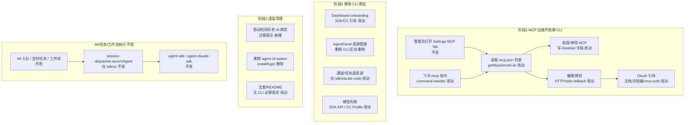

# 完全移除 Cursor CLI 依赖 - 实现设计

> **业务 PRD**：见同目录 `01-proposal.md`（验收标准以 01 为准）

## 一、业务流程与改动范围

> 业务口径以 `01-proposal.md` 阶段 1～3（F1～F3）为准；下图覆盖 MCP 运维、Agent 资源配置、IM 执行与升级迁移四条主路径。

### （一）业务流程图

**图例**：`不改` 行为与现网一致；`改动` 需改代码/配置；`新增` 新节点或新分支；`删除` 移除路径。

### （二）流程步骤与改动对照

| 步骤 ID | 业务含义 | 改动 | 落点（模块/文件） | 01 验收关联 |
|---------|----------|------|-------------------|-------------|
| P1-1 | Settings 展示 MCP 列表 | 改动 | `electron/mcp-manager.ts` `getMcpServerList` | 验收 2 |
| P1-2 | MCP 启用/停用 | 改动 | `mcp-manager.ts` `toggleMcpServer` → 写 `mcp.json` `disabled` | 验收 2、F1.1 |
| P1-3 | MCP 连接/健康状态 | 改动 | `mcp-manager.ts` `getMcpStatusMap` → `queryToolsViaHttp` / `queryToolsViaProtocol` | 验收 2、F1.2 |
| P1-4 | MCP OAuth/需登录引导 | 改动 | `mcp-manager.ts` `loginMcpServer`；`mcp-project-dir.ts` `mcp-auth.json` | 验收 2、F1.2 |
| P1-5 | 飞书 `/mcp ls/info/enable/...` | 改动 | `electron/command-handler.ts` `handleFeishuMcpCommand`（依赖新 enabled/status API） | 验收 3、F1.3 |
| P1-6 | Settings MCP Tab 刷新/开关 | 改动 | `src/renderer/pages/Settings.tsx` `refreshMcpServers` / `handleMcpToggle` | 验收 2 |
| P2-1 | 移除 CLI Agent 资源类型 | 删除 | `electron/config-store.ts` `CLI_RESOURCE_ID`；`src/shared/channel-types.ts` | 验收 4、5、F2.1 |
| P2-2 | AgentPanel 仅 SDK/CC | 改动 | `src/renderer/components/AgentPanel.tsx` | 验收 4、F2.1 |
| P2-3 | 通道默认/可选资源 | 改动 | `src/renderer/components/ChannelPanel.tsx` | 验收 4、F2.1 |
| P2-4 | Dashboard onboarding | 改动 | `src/renderer/pages/Dashboard.tsx` | 验收 4、5、F2.2 |
| P2-5 | 任务/通道模型列表 | 改动 | `Settings.tsx` `fetchTaskModels`；`WorkflowPanel.tsx`；`main.ts` `models:list` | 验收 5、F2.3 |
| P2-6 | 飞书 `/model` 无 CLI 分支 | 改动 | `command-handler.ts` `listCursorModelsForCommands` | 验收 3、F2.3 |
| P2-7 | 移除 CLI IPC | 删除 | `electron/main.ts` `cli:*`；`electron/preload.ts`；`env.d.ts` | 验收 4 |
| P3-1 | 历史 CLI 通道/资源迁移提示 | 新增 | `config-store.ts` `migrateCliBindings`；`Dashboard.tsx` Banner | 验收 6、F3.1 |
| P3-2 | 删除 CLI spawn 与安装登录 | 删除 | `electron/agent-cli.ts`；`agent-launcher.ts` `launchAgent`/login | F3.2 |
| P3-3 | 帮助/Setup 文案 | 改动 | `Settings.tsx` Setup/About；应用内 README | 验收 7、F3.3 |
| EXEC-1 | IM Run / 任务 / 工作流 | 不改 | `session-dispatcher.ts` → Daemon `agent-sdk` / `agent-claude-sdk` | 验收 1 |
| EXEC-2 | SDK 运行时 MCP 注入 | 不改 | `electron/mcp-sdk-loader.ts` | 验收 1 |

### （三）改动汇总

- **改动**：`mcp-manager.ts`（核心）、`command-handler.ts`、`config-store.ts`、Renderer（Dashboard/Settings/AgentPanel/ChannelPanel/WorkflowPanel）、`main.ts`/`preload.ts`/`channel-types.ts`
- **新增**：`migrateCliBindings` 启动迁移与 Dashboard 提示 Banner；可选 `electron/proxy-env.ts`（从 `agent-cli` 抽出 `applyProxyEnv`）
- **删除**：`agent-cli` 中 install/login/spawn/list-models；`agent-launcher.launchAgent` CLI 会话 spawn；CLI IPC 与 UI；虚拟 `cli` 资源
- **不改（显式列出）**：`session-dispatcher` SDK/CC 路由、`agent-sdk.ts`、`agent-claude-sdk.ts`、`mcp-sdk-loader.ts`、Daemon IM 编排、飞书/微信连接层

---

## 二、整体思路

见 01 §背景：IM/任务/工作流已走 SDK/CC（`session-dispatcher` 内 `launchAgent` 仅接受 `sdk`/`claude-code`，代码 L255-257），但 MCP 运维、模型列表、资源配置与 onboarding 仍强依赖 `agent` CLI。方案按 PRD 三阶段递进：**先**用 `mcp.json` + 已有 HTTP/stdio 探测替代 `agent mcp *`，**再**移除 CLI 资源类型与 UI，**最后**删 spawn 代码并处理历史数据。

**最小方案三问**：

1. **能否复用现有模块？** 能。`mcp-manager` 已有 `queryToolsViaProtocol`/`queryToolsViaHttp`（L365-472）、`readMcpJson`/`saveMcpServer`、`buildEntry.enabled`（`disabled !== true`）；`mcp-sdk-loader` 已读 `mcp-auth.json` OAuth。无需新 MCP 协议层。
2. **新增抽象是否 PRD 要求？** 否。不引入 `McpBackend` trait；仅在 `mcp-manager` 内联「文件读写 + 探测」替换 CLI 分支。`proxy-env.ts` 仅为拆分 `applyProxyEnv`（SDK/CC 仍用），非业务抽象。
3. **能否合并到已有文件？** 能。MCP 改造集中 `mcp-manager.ts`；`agent-launcher.ts` **保留** `buildPrompt`/`ChatType`/`LaunchMeta`（`agent-sdk`/`agent-claude-sdk` 依赖），**删除**无调用方的 `launchAgent` CLI spawn（全库无 import，仅文件内 export）。

---

## 三、分层设计

- **端点层（Renderer）**：Settings MCP Tab、AgentPanel、Dashboard onboarding、ChannelPanel 资源下拉；移除 CLI 安装/登录控件
- **服务层（Main IPC）**：`mcp:*` 改走文件+探测；删除 `cli:*`/`models:list`（CLI）；`/model`、`/mcp` 指令同步
- **数据层**：`~/.cursor/mcp.json`、项目 `.cursor/mcp.json` 的 `disabled`；`mcp-approvals.json` / `mcp-auth.json`（OAuth）；`electron-store` 去虚拟 `cli` 资源

---

## 四、接口设计

| IPC / 导出 | 变更 | 说明 |
|---|---|---|
| `mcp:enabled-map` / `mcp:status-map` | 改动 | 不再调用 `agent mcp list`；enabled 来自 json，status 来自探测 |
| `mcp:toggle` | 改动 | 写 `disabled: true/false` 至对应 scope 的 `mcp.json` |
| `mcp:login` | 改动 | 移除 `agent mcp login`；URL 型失败时返回 OAuth 配置说明并 `shell.openExternal` 文档链接（若 entry 含 `url`） |
| `cli:check/login/install/login-status` | 删除 | 阶段 2 移除 handler 与 preload |
| `models:list` | 删除或返回明确错误 | 阶段 2；Renderer 统一走 `sdk:list-models` / `cc:list-models` |
| `getMcpServerTools` | 改动 | 去掉 `queryToolsViaCli` 优先路径，直接 HTTP/stdio |

飞书指令 `/mcp`、`/model` 契约不变，错误文案改为「请检查 mcp.json / 配置 SDK 资源」。

---

## 五、数据结构

| 项 | 变更 |
|---|---|
| `AgentResource.type` | 删除 `"cli"` union 成员（`channel-types.ts`） |
| `CLI_RESOURCE_ID` / 虚拟 cli 资源 | 删除；`getAgentResources` 不再 prepend |
| `mcp.json` 单条 | 沿用 `disabled?: boolean`（true=停用）；toggle 读写此字段 |
| `AppConfig.agentMode` | 阶段 3 标记 deprecated，UI 不再暴露 |
| `DaemonStatus.cliAvailable` | 删除字段 |
| `mainChatIds` | 保留只读兼容；CLI resume 路径删除，不阻塞启动 |

启动迁移：检测 `agentResources` 含 `type:"cli"` 或通道 `agentResourceId==="cli"` → 自动改绑首个 sdk/cc（扩展现有 `ensureSdkChannelBindings`）并置 `cliMigrationNotified` 标志。

---

## 六、实现步骤

**阶段 1（F1，对应 P1-*）**

1. `mcp-manager`：`getMcpEnabledMap` 同步返回 `getMcpServerList` 的 `enabled`；删除 `fetchMcpList`/`spawnAsync` 的 `mcp list` 路径。
2. `toggleMcpServer`：定位 global/project entry，`saveMcpServer(name, { ...raw, disabled: !enabled })`。
3. `getMcpStatusMap`：对每个 server — `disabled`→`"disabled"`；command→`queryToolsViaProtocol` 成功 `"ready"` 否则错误摘要；url→`queryToolsViaHttp`，结合 `readApprovedServers` 标 `"needs_login"`/`"ready"`。
4. `loginMcpServer`：删除 CLI spawn；返回「请在浏览器完成 OAuth 并将 token 写入 mcp-auth.json」+ 打开 MCP 文档 URL（config headers 或固定帮助链接）。
5. `getMcpServerTools`：删除 CLI 优先，保留 HTTP/stdio。
6. 回归 Settings MCP Tab 与 `/mcp`（P1-5、P1-6）。

**阶段 2（F2，对应 P2-*）**

7. `config-store`：移除 `CLI_RESOURCE_ID` 注入；`getAgentResource` 默认首个 sdk/cc。
8. 类型与 preload：删 `cli` type；删 `cli:*` IPC；`fetchTaskModels`/`WorkflowPanel` 仅 sdk/cc。
9. Renderer：删 AgentPanel CLI 区块、Dashboard CLI 安装/登录、ChannelPanel cli 默认。
10. `command-handler`：`listCursorModelsForCommands` 对非 sdk/cc 返回「请绑定 SDK 或 Claude Code」。

**阶段 3（F3，对应 P3-*）**

11. `migrateCliBindings` + Dashboard Banner（一次性提示）。
12. 删除 `agent-cli` spawn/install/login/list-models；`applyProxyEnv` 迁至 `proxy-env.ts`（或保留最小导出）。
13. 删 `agent-launcher.launchAgent` 及 CLI login/`sessionAgents`；保留 `buildPrompt` 等共享符号。
14. 文案扫尾：Settings Setup、About、README。

---

## 七、参考实现

| 符号 | 路径 | 说明 |
|---|---|---|
| `getMcpServerList` / `buildEntry` | `electron/mcp-manager.ts` L177-224 | 已解析 `disabled` |
| `queryToolsViaProtocol` / `queryToolsViaHttp` | `mcp-manager.ts` L365-472 | 探测 fallback |
| `loadInlineMcpServers` | `electron/mcp-sdk-loader.ts` | SDK 运行时 MCP（不改） |
| `launchAgent`（SDK/CC 路由） | `electron/session-dispatcher.ts` L249-327 | 执行主路径 |
| `ensureSdkChannelBindings` | `electron/config-store.ts` L361-375 | cli→sdk 自动改绑可扩展 |
| `buildPrompt` | `electron/agent-launcher.ts` | SDK/CC 共用，不可整删文件 |
| `listCursorModelsForCommands` | `electron/command-handler.ts` L54-82 | CLI `--list-models` 待移除 |

---

## 八、技术影响

### （一）影响范围

- **涉及模块**：`mcp-manager`（高风险）、`config-store`、Renderer 四组件、`command-handler`、`main/preload`、可选 `agent-cli`/`agent-launcher` 瘦身
- **接口/proto 变更**：删除 `cli:*`、`models:list` IPC；`mcp:*` 行为变更（对 Settings 透明）
- **数据变更**：`mcp.json` 写入 `disabled`；electron-store 去 cli 资源；迁移标志位
- **风险**：① OAuth MCP 无 CLI 时仅能 manual/auth.json 引导；② 部分 remote MCP 探测超时需保留 30s/15s 上限；③ 历史用户通道仍绑 cli 需迁移 UI；④ 误删 `buildPrompt`/`applyProxyEnv` 会破坏 SDK/CC

### （二）工程补充验收项

- [ ] 未装 CLI 时 Settings MCP 开关与状态刷新正常，toggle 后 `mcp.json` 出现/清除 `disabled`
- [ ] SDK 通道 Run 仍注入 `mcp-sdk-loader` 内联 MCP（与 Settings 开关一致：loader 读 json `disabled`）
- [ ] `agent-launcher.launchAgent` 删除后 TypeScript 编译通过，无 dangling import
- [ ] 全库 grep `agent mcp` / `execAgentSync` 无 MCP/模型业务残留（proxy 除外）

---

## 九、知识库影响

- `knowledge/工程平台/Electron桌面应用/02-主进程与IPC.md` — MCP 不再经 CLI；删 `cli:*` IPC 描述
- `knowledge/工程平台/Electron桌面应用/03-渲染端界面.md` — Dashboard/AgentPanel onboarding 变更
- `knowledge/工程平台/Electron桌面应用/04-配置与更新.md` — AgentResource 无 cli 类型
- 两级索引：若 Electron 分区 README 仍提「CLI 安装」需同步

---

## 十、知识库更新计划

### （一）必须更新

- `02-主进程与IPC.md` §五 IPC 列表、§七 MCP 超时描述（改文件+探测）
- `04-配置与更新.md` AgentResource/通道绑定说明

### （二）可能更新（视实现结果）

- `03-渲染端界面.md` Dashboard onboarding 截图级描述
- `electron/AGENTS.md` 删除 CLI 相关约定句

### （三）不需要更新

- Daemon 编排、IM 合并/流式知识文件（执行路径未变）
- `mcp-sdk-loader` 行为文档（inline 注入逻辑不变）
