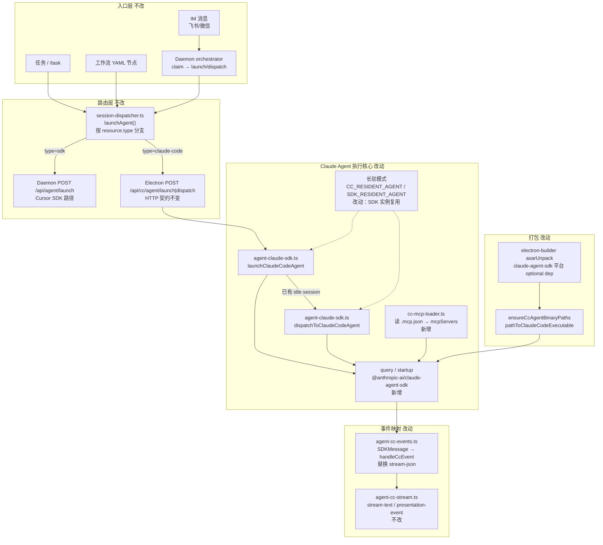
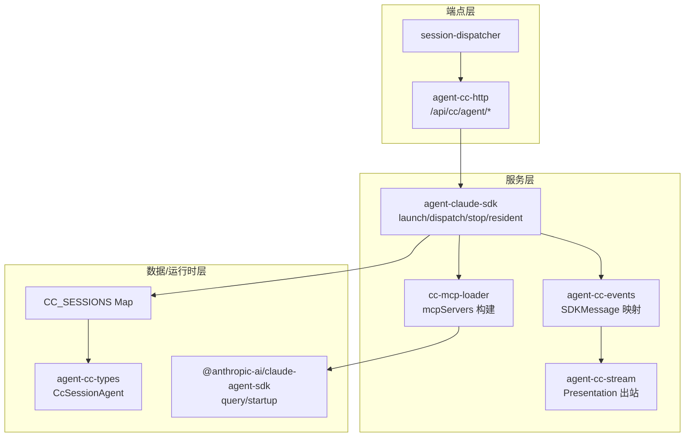

# Claude Agent SDK 落地 - 实现设计

> **业务 PRD**：见同目录 `01-proposal.md`（验收标准以 01 为准）

## 一、业务流程与改动范围

> 业务口径以 `01-proposal.md` F1～F7 与验收 1～9 为准；下图覆盖 IM / 任务 / 工作流三条执行路径及 MCP、会话恢复、打包子流程。

### （一）业务流程图



**图例**：`不改` 行为与现网一致；`改动` 需改代码/配置；`新增` 新节点或新分支；`删除` 迁移完成后移除 spawn + stream-json 路径（含 `buildSpawnArgs`、`streamCcEvents`、 `@anthropic-ai/claude-code` 依赖）。

### （二）流程步骤与改动对照

| 步骤 ID | 业务含义 | 改动 | 落点（模块/文件） | 01 验收关联 |
|---------|----------|------|-------------------|-------------|
| P-1 | IM 通道 claim 后 launch/dispatch | 不改 | Daemon orchestrator、`session-dispatcher.ts` L249-326 | 验收 1 |
| P-2 | `resource.type=claude-code` 路由至 CC HTTP | 不改 | `session-dispatcher.ts`、`agent-cc-http.ts` | 验收 1、9 |
| P-3 | CC HTTP `/api/cc/agent/launch\|dispatch` 契约 | 不改 | `agent-cc-http.ts`（路径、body 字段、handler 注入） | 验收 1、3、6 |
| P-4 | launch：创建/复用 session、guard、首条 prompt | 改动 | `agent-claude-sdk.ts` | 验收 1、5、7 |
| P-5 | dispatch：resident idle 续跑 | 改动 | `agent-claude-sdk.ts`（`options.resume=ccSessionId`） | 验收 1、5 |
| P-6 | 执行引擎：`query()` / 可选 `startup()` 预暖 | 新增/改动 | `agent-claude-sdk.ts`；删除 `spawn` + `buildSpawnArgs` | 验收 6、7 |
| P-7 | SDK 事件流 → Presentation | 改动 | `agent-cc-events.ts`（`SDKMessage` 映射）；删除 `parseCcEvent`/`streamCcEvents` | 验收 2、4 |
| P-8 | stream-text / tool / thinking 出站 | 不改（对齐增强） | `agent-cc-stream.ts`；补 `PRESENTATION_ORDERING` 与 SDK 对称 | 验收 2 |
| P-9 | MCP 注入 Run | 新增 | `electron/cc-mcp-loader.ts`（仿 `mcp-sdk-loader.ts`） | 验收 4 |
| P-10 | 会话标识恢复（ccSessionId） | 改动 | `agent-cc-types.ts`、`agent-cc-events.ts`（`system/init` 写 session_id） | 验收 5 |
| P-11 | 上下文轮转 | 不改 | `context-rotation-lite.ts`（仍清 ccSessionId） | 验收 5 |
| P-12 | Run 生命周期 / watchdog / complete | 改动 | `agent-claude-sdk.ts`、`agent-cc-events.ts`、`agent-cc-stream.ts`（子进程 close → async iterator end） | 验收 2、3 |
| P-13 | macOS 打包内嵌 Claude 二进制 | 改动 | `electron-builder.yml`、`agent-cc-utils.ts`（`ensureCcAgentBinaryPaths`）、可选 `scripts/after-pack.cjs` | 验收 6 |
| P-14 | 任务 / 工作流经同一 launch 路径 | 不改 | `launchIndependentAgent` / `launchWorkflowAgent` → `launchAgent` | 验收 3 |
| P-15 | Cursor SDK 路径回归 | 不改 | `agent-sdk.ts`、Daemon `/api/agent/*` | 验收 9 |
| P-16 | 品牌文案「Claude Agent」 | 改动 | `AgentPanel.tsx`、`Settings.tsx`、`electron/AGENTS.md`、日志字符串 | 验收 8 |
| P-17 | 依赖：`claude-code` → `claude-agent-sdk` | 改动/删除 | `package.json`、`package-lock.json`；移除 `@anthropic-ai/claude-code` | 验收 6、7 |

### （三）改动汇总

- **改动**：`agent-claude-sdk.ts`（执行核心）、`agent-cc-events.ts`（事件映射）、`agent-cc-types.ts`（session 结构）、`agent-cc-utils.ts`（二进制解析替换 CLI 路径）、`package.json` / `electron-builder.yml`、UI 品牌文案、知识库 Agent 调度文档
- **新增**：`electron/cc-mcp-loader.ts`
- **删除**：spawn 链路（`buildSpawnArgs`、`buildSpawnEnv`、`streamCcEvents`、stdout JSONL 解析）、`getCcBinaryPath`/`resolveCcBinaryPath`、`@anthropic-ai/claude-code` 依赖；hotfix `20260630000313` 的 `--verbose` spawn 修复随 spawn 路径一并废弃
- **不改（显式列出）**：`agent-cc-http.ts` HTTP 路由与请求体、`session-dispatcher.ts` 路由分支、`agent-cc-stream.ts` 出站 API、`agent-run-guard.ts`、`context-rotation-lite.ts`、`agent-launcher.ts`、IM WebSocket 层、工作流 YAML 格式、`agent-sdk.ts` Cursor 路径

## 二、整体思路

见 01 §背景/目标：根因是 Claude 路径通过外部 CLI spawn + 自研 stream-json 解析，与 Cursor 路径 `@cursor/sdk` 库集成不对称、维护成本高。方案要点是以 **`@anthropic-ai/claude-agent-sdk`** 的 `query()`（及可选 `startup()` 预暖）替换 spawn，新建 **`cc-mcp-loader.ts`** 对称 `mcp-sdk-loader.ts`，保留 **`agent-cc-http.ts`** 对外 HTTP 契约与 **`agent-cc-stream.ts`** Presentation 出站，使 IM/任务/工作流入口零感知。

**与关联变更边界**：

| 变更 | 关系 |
|------|------|
| `20260629164130-执行引擎扩展接入ClaudeCode`（已归档） | 提供 CC Profile、`agent-claude-sdk` 模块拆分与 HTTP 注入模式；本变更在其上替换执行内核 |
| `20260629232914-完全移除Cursor CLI依赖`（进行中） | 仅 Cursor SDK 路径；与本变更独立，可并行合并，避免同文件冲突即可 |
| `20260630000313-CC-spawn-verbose参数修复`（hotfix-lite） | 修补 `buildSpawnArgs`；SDK 迁移完成后 spawn 路径删除，该 hotfix 自然废弃，无需再合入 |

**最小方案三问**：

1. **能否复用现有模块？** 能。保留 `agent-claude-sdk.ts` 作 launch/dispatch/stop 入口、`agent-cc-http.ts` 作 HTTP 层、`agent-cc-stream.ts` 作出站；仅替换 `agent-cc-events.ts` 事件源（stream-json → `SDKMessage`），Session Map / guard / rotation 逻辑 inline 保留。
2. **新增抽象是否必要？** `cc-mcp-loader.ts` 必要——01 验收 4 要求 MCP 注入，且 `mcp-sdk-loader.ts` 已验证 `.cursor/mcp.json` + OAuth 合并模式；不另建通用 Agent 抽象层。`ensureCcAgentBinaryPaths` 对称 `ensureSdkBinaryPaths`，非额外框架。
3. **能否合并到已有文件？** MCP 加载独立文件（与 `mcp-sdk-loader.ts` 对称、控制单文件行数）；事件映射留在 `agent-cc-events.ts` 改写，不新建第三层 adapter。

## 三、分层设计



- **端点层**：`session-dispatcher` 与 `agent-cc-http` 维持 Daemon ↔ Electron 委托边界，Profile 绑定模型不变（01 非目标）。
- **服务层**：`agent-claude-sdk` 负责 session 生命周期与 SDK 调用；`agent-cc-events` 负责 SDK 事件 → 现有 `handleCcEvent` 语义；`cc-mcp-loader` 负责 MCP 配置合并。
- **数据层**：`CcSessionAgent` 中 `child: ChildProcess` 替换为 `activeQuery: Query \| null`（或等价 abort 句柄）；`ccSessionId` 仍存 SDK `system/init.session_id` 供 `options.resume` 使用。

## 四、接口设计

**对外 HTTP（不变）**——`agent-cc-http.ts`：

| 方法 | 路径 | 关键入参 | 出参 |
|------|------|----------|------|
| POST | `/api/cc/agent/launch` | `session_key`, `task_text`, `chat_type`, `channel_id`, `working_directory`, `model`, `message_ids`… | `{ ok, error? }` |
| POST | `/api/cc/agent/dispatch` | `session_key`, `task_text`, `message_ids?` | `{ ok, error? }` |

**Electron 导出（签名不变，实现替换）**——`agent-claude-sdk.ts`：

| 符号 | 说明 |
|------|------|
| `launchClaudeCodeAgent(opts)` | 首跑或 resident dispatch 委托 |
| `dispatchToClaudeCodeAgent(sessionKey, taskText, messageIds?)` | idle session 续跑 |
| `stopClaudeCodeSession` / `stopAllClaudeCodeSessions` | 中止 active Query、`Query.close()` |
| `isClaudeCodeSessionRunning` / `getClaudeCodeSessionList` | 运行态查询（processing 判定改为 `activeQuery !== null \|\| pendingDispatch`） |

**新增内部接口**——`cc-mcp-loader.ts`：

| 符号 | 说明 |
|------|------|
| `loadInlineCcMcpServers(workspaceDir)` | 返回 `Record<string, McpServerConfig>`（SDK 类型） |
| `appendInlineMcpToCcOptions<T>(options, workspaceDir?)` | 合并 `mcpServers` 至 `query()` options（resident 每次 query 须重传，对称 SDK send） |

**SDK 调用 options（实现要点）**：

```typescript
// 伪代码 — 实现时以 SDK 类型为准
query({
  prompt,
  options: {
    model: modelArg,
    resume: session.ccSessionId ?? undefined,
    env: { ANTHROPIC_API_KEY, ...(baseUrl && { ANTHROPIC_BASE_URL: baseUrl }) },
    pathToClaudeCodeExecutable: resolveCcAgentBinaryPath(),
    mcpServers: loadInlineCcMcpServers(workspaceDir),
    // strictMcpConfig: true  // 待实现确认：是否仅使用 inline MCP
  },
})
```

## 五、数据结构

**`CcSessionAgent`（`agent-cc-types.ts`）变更**：

| 字段 | 变更 | 说明 |
|------|------|------|
| `child: ChildProcess \| null` | 删除 | 不再 spawn |
| `activeQuery` | 新增 | 当前 Run 的 `Query` 句柄，用于 abort/完成判定 |
| `ccSessionId` | 保留 | 来自 SDK `system/init` 或 `result`，映射至 `options.resume` |
| `residentMode` / `pendingDispatch` | 保留 | 语义与 Cursor SDK 长驻对称 |
| 其余 Presentation / context / guard 字段 | 保留 | `f41Stream`、`streamBuffer`、`seenProcessEvent` 等 |

**依赖（`package.json`）**：

| 移除 | 新增 |
|------|------|
| `@anthropic-ai/claude-code` | `@anthropic-ai/claude-agent-sdk` |
| — | 平台 optional：`@anthropic-ai/claude-agent-sdk-darwin-arm64` 等（随 SDK 文档与 lockfile） |

**配置/持久化**：无 schema 变更；`cc-agent-api-port.json`、`AgentResource.type=claude-code` 保持不变。

## 六、实现步骤

1. **P-17 / 依赖**：安装 `@anthropic-ai/claude-agent-sdk`，移除 `@anthropic-ai/claude-code`；确认 optional 平台包被 lockfile 解析。
2. **P-9 / MCP**：新建 `cc-mcp-loader.ts`，复制 `mcp-sdk-loader.ts` 合并逻辑，输出 SDK `McpServerConfig` 类型。
3. **P-13 / 打包**：实现 `ensureCcAgentBinaryPaths()`（对称 `ensureSdkBinaryPaths` L616-648），解析 `@anthropic-ai/claude-agent-sdk-${platform}-${arch}` 二进制；`electron-builder.yml` `asarUnpack` 增加 `node_modules/@anthropic-ai/claude-agent-sdk-*/**/*`；launch 前调用。
4. **P-5 / 类型**：更新 `CcSessionAgent`，移除 `ChildProcess` 依赖。
5. **P-7 / 事件**：重写 `agent-cc-events.ts`——新增 `streamCcSdkMessages(session, queryIterator, opts)`，将 `SDKAssistantMessage` / tool / thinking / result 映射至现有 `handleCcEvent` 逻辑或等价 inline handler；删除 `parseCcEvent`、`streamCcEvents`、stream-json 类型。
6. **P-4～P-6 / 核心**：`agent-claude-sdk.ts` 用 `query()` 替换 `spawn`；launch/dispatch 构建 options（含 MCP、resume、env）；可选 `startup()` 在 `ensureClaudeCodeHttpServer` 或首 launch 前预暖（对称 `SDK_RESIDENT_AGENT`）。
7. **P-8 / Presentation 对齐**：在 CC 路径补 `PRESENTATION_ORDERING` / `presentationOrderingEligible`（复用 `agent-sdk.ts` 模式或提取至共享 util），确保 p2p + f41 时 tool/thinking 不抢 stream-text 首包。
8. **P-12 / 收尾**：`completeCcRun` 改为 Query iterator 结束触发；watchdog 不再 `child.kill`，改为 `Query.close()` / abort；`stopClaudeCodeSession` 同步更新。
9. **P-16 / 品牌**：UI「Claude Code SDK/Profile/Agent API」→「Claude Agent」；日志前缀可保留 `CC` 或改 `CA`（实现统一即可）。
10. **P-15 / 回归**：Cursor SDK 全路径 smoke；Claude Agent IM/任务/工作流/MCP/打包验收（01 验收 1～9）。

## 七、参考实现

> **CodeGraph 说明**：工作区 `.codegraph/` 未初始化（`codegraph init` 未执行），本节依据源码直接核对（2026-06-30）。

| 模块 | 关键符号 | 调用关系 |
|------|----------|----------|
| `electron/agent-claude-sdk.ts` | `launchClaudeCodeAgent`, `dispatchToClaudeCodeAgent`, `stopClaudeCodeSession`, `buildSpawnArgs`（待删） | 模块末尾 `registerCcLaunchHandler` / `registerCcDispatchHandler` → `agent-cc-http.ts`；launch 调用 `armCcWatchdog` + `streamCcEvents`（待替换为 SDK 流） |
| `electron/agent-sdk.ts` | `launchSdkAgent`, `dispatchToSdkAgent`, `ensureSdkBinaryPaths`, `loadInlineMcpServers`, `handleSdkEvent`, `presentationOrderingEligible` | **对称参考**：`Agent.create` + `agent.send` ↔ CC `query()`；MCP 每次 send 重传 ↔ 每次 query 重传 `mcpServers` |
| `electron/mcp-sdk-loader.ts` | `loadInlineMcpServers`, `appendInlineMcpToSendOptions`, `mergeMcpJsonEntries` | **cc-mcp-loader 仿照模板**；读 `~/.cursor/mcp.json` + `{workspace}/.cursor/mcp.json` + `mcp-auth.json` OAuth |
| `electron/agent-cc-events.ts` | `handleCcEvent`, `streamCcEvents`, `parseCcEvent` | `handleCcEvent` 保留 Presentation 语义；`streamCcEvents` 删除 |
| `electron/agent-cc-stream.ts` | `appendStreamDelta`, `postPresentationEvent`, `completeCcRun`, `flushStreamPost` | 被 `handleCcEvent` 调用；出站契约不变 |
| `electron/agent-cc-http.ts` | `launchCcAgentFromHttp`, `ensureClaudeCodeHttpServer`, `/api/cc/agent/launch\|dispatch` | `session-dispatcher` L317-325 `httpPost` 至 cc port；handler 注入模式保持 |
| `electron/session-dispatcher.ts` | `launchAgent`, `launchSessionAgent` | L255-257 仅允许 `sdk`/`claude-code`；L307-326 分支至 Daemon 或 CC HTTP |
| `electron/agent-cc-utils.ts` | `getCcBinaryPath`, `f41Eligible`, `ccResidentModeEnabled` | `f41Eligible`/`ccResidentModeEnabled` 保留；`getCcBinaryPath` 替换为 SDK 二进制解析 |

## 八、技术影响

### （一）影响范围

- **涉及模块**：`electron/agent-claude-sdk.ts`、`agent-cc-events.ts`、`agent-cc-types.ts`、`agent-cc-utils.ts`、新建 `cc-mcp-loader.ts`；`package.json`、`electron-builder.yml`；UI 文案；知识库 Agent 调度
- **接口/proto 变更**：无对外 HTTP/IPC 契约变更
- **数据变更**：无持久化 schema 变更
- **风险**：
  - SDK `SDKMessage` 与 stream-json 字段差异可能导致 thinking/tool 映射遗漏（需对照 01 验收 2 全量回归）
  - Electron asar 内 optional 二进制无法 spawn（须 asarUnpack + 路径解包，已有 Cursor SDK 先例）
  - `startup()` 与 resident 多轮语义需在实现阶段确认（WarmQuery 单次 query vs 每轮 `query({ resume })`）
  - 与 hotfix `20260630000313` 若已合入 main，迁移 PR 应直接删除 spawn 而非再依赖 `--verbose`

### （二）工程补充验收项

- [ ] `npm run dist:mac`（arm64）安装包内 Claude Agent 路径可完成一次 IM Run，无需用户本机 `claude` CLI
- [ ] `CC_RESIDENT_AGENT=0` 与默认 resident 行为均通过 launch → complete → dispatch 链路
- [ ] MCP stdio（相对路径 cwd）与 HTTP OAuth 各至少一条 server 在 Claude Run 中可调用
- [ ] 代码库无 `@anthropic-ai/claude-code` import 残留；`rg spawn.*claude` / `stream-json` 无 CC 路径命中
- [ ] Cursor SDK 路径 `npm run dev` smoke 无回归

## 九、知识库影响

- `knowledge/业务域/Agent调度/03-启动与自动重连.md` — CC 路径描述仍为 spawn CLI，须改为 Claude Agent SDK
- `knowledge/业务域/Agent调度/01-概览.md`（若含双引擎描述）— 引擎称谓与集成方式
- `knowledge/工程平台/Electron桌面应用/01-概览.md` — 依赖与打包说明
- `electron/AGENTS.md` — CC spawn 约定删除，补充 SDK/MCP/打包条目
- 两级索引：若 Agent 调度概览术语变更，可能需更新 `知识索引.md` 摘要（视 archive 时 diff 决定）

## 十、知识库更新计划

### （一）必须更新

- `knowledge/业务域/Agent调度/03-启动与自动重连.md` — CC 执行方式、resident、MCP、会话恢复、端口文件
- `electron/AGENTS.md` — Claude Agent SDK 模块边界、MCP inline、打包二进制、Presentation 对齐

### （二）可能更新（视实现结果）

- `knowledge/业务域/Agent调度/01-概览.md` — 双引擎架构图若仍引用 CLI spawn
- `knowledge/工程平台/Electron桌面应用/01-概览.md` — optional dep / asarUnpack 清单
- `knowledge/知识索引.md` — 仅当概览术语「Claude Code」→「Claude Agent」需索引级反映

### （三）不需要更新

- IM 通道绑定模型、工作流 YAML 格式相关文档（01 非目标）
- Cursor SDK 专属文档（本变更不涉及 Cursor 路径行为变更）
- 已归档 `20260629164130` 变更文档（历史记录，不 retro-edit）
