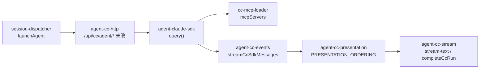

# Claude Agent SDK 落地 - 代码评审报告

## 1、审查范围

- **变更类型**：apply 产出的未提交变更（`git diff HEAD`）
- **评审等级**：focused-review（P1 执行引擎 refactor；对照 02-design / 03-tasks 与 8 项重点审查）
- **涉及文件**：14 个代码/配置 + 变更文档（manifest.files）
- **设计文档**：`02-design.md`（对照基准）
- **CodeGraph**：工作区 `.codegraph/` 未初始化，调用链分析回退为源码 + diff 静态审查

## 2、严重（必须处理）

无

## 3、警告（建议处理）

1. **zod peer 版本冲突（claude-agent-sdk 要求 ^4，项目锁定 ^3）**
   - 位置: `package.json:52`、`node_modules/@anthropic-ai/claude-agent-sdk` peerDependencies
   - 说明: `npm ls zod` 报告 `zod@3.25.76 invalid: "^4.0.0"`；SDK schema 校验路径可能在运行时触发 subtle 兼容问题。建议升级 `zod` 至 `^4` 并验证 `@cursor/sdk` / MCP 链路，或在 manifest 记录经实测的 override 债务。
   - 评分: 80

2. **@modelcontextprotocol/sdk peer 版本不满足 claude-agent-sdk**
   - 位置: `package.json`（`^1.27.1`）vs `claude-agent-sdk` peer `^1.29.0`
   - 说明: `npm ls @modelcontextprotocol/sdk` 同为 invalid；MCP 注入（验收 4）存在联调风险。建议 bump 至 `^1.29.0` 并重跑 MCP smoke。
   - 评分: 78

3. **cc-mcp-loader stdio 配置缺少 `cwd`，与 mcp-sdk-loader 不对称**
   - 位置: `electron/cc-mcp-loader.ts:54-68`（对比 `electron/mcp-sdk-loader.ts:73-74`）
   - 说明: Cursor 路径在 workspace 非空时为 stdio MCP 设置 `cwd=workspaceDir`；CC 路径仅 resolve command/args 路径，未设 `cwd`。相对路径 stdio server 在验收 4 / 八·（二）前提下可能启动失败。
   - 评分: 80

4. **品牌文案未完全统一为「Claude Agent」（用户可见路径仍有 Claude Code）**
   - 位置: `electron/agent-cc-http.ts:178,182,283`；`electron/session-dispatcher.ts:319`
   - 说明: T7 / 01 验收 8 要求用户可见文案统一；HTTP 错误提示与调度错误仍含「Claude Code Profile / Claude Code 引擎 / Claude Code Agent API」。`AgentPanel.tsx` 标题已改，但注释仍留「Claude Code SDK」（非用户可见，见 §7）。
   - 评分: 80

5. **`startup()` 预暖未实现（设计 P-6 可选项；F1 长驻预暖表述）**
   - 位置: `electron/agent-claude-sdk.ts`（全文件无 `startup` 引用）；`electron/agent-cc-http.ts` `ensureClaudeCodeHttpServer`
   - 说明: 当前以 Map resident + 每轮 `query({ resume })` 对等 Cursor `Agent.create` 长驻，**未**调用 SDK `startup()` 预暖。与 02 六·6「可选 startup」一致，但与 F1「SDK 长驻预暖能力」字面存在差距；首 launch 冷启动延迟未验证。建议 builder 评估是否在 `ensureClaudeCodeHttpServer` 或首 launch 前补 `startup()`，或 archive 时以 resident 语义接受债务。
   - 评分: 75

## 4、设计偏差

1. **MCP stdio `cwd` 对称性**
   - 设计预期: `cc-mcp-loader.ts` 仿 `mcp-sdk-loader.ts`，stdio 相对路径 resolve 规则一致（03-T2、02-P-9）
   - 实际实现: 缺 `cfg.cwd = workspaceDir`
   - 影响: workspace 相对 stdio MCP 可能无法启动

2. **startup() 预暖**
   - 设计预期: P-6 新增/改动 query + **可选** startup 预暖（对称 SDK_RESIDENT_AGENT）
   - 实际实现: 仅 `query()` + resident Map；无 `startup()`
   - 影响: 功能上接近 Cursor 长驻模式，但非 SDK 文档意义上的 WarmQuery 预暖；首包延迟待联调

3. **品牌 P-16 覆盖范围**
   - 设计预期: UI + 日志字符串统一「Claude Agent」；`agent-cc-http.ts` **不改路由契约**（02 一·（三））但未排除用户可见 error 文案
   - 实际实现: Renderer 部分已改；HTTP/调度用户可见 error 未改
   - 影响: 01 验收 8 未完全满足

## 5、验收标准检查

| 任务 | 验收条件 | 状态 |
|------|---------|------|
| T1 | 移除 claude-code、安装 claude-agent-sdk | ✅ diff 确认 |
| T1 | npm install 无报错 | ✅（peer invalid 见 R1/R2） |
| T2 | cc-mcp-loader ≤300 行、合并优先级一致 | ✅ 113 行；⚠️ cwd 缺失 |
| T3 | 无 spawn/buildSpawnArgs 残留 | ✅ rg 清零 |
| T3 | agent-cc-http.ts diff 为空 | ✅ 0 行 diff |
| T3 | agent-claude-sdk.ts ≤300 行 | ✅ 270 行 |
| T3 | IM launch 流式回复 | ⏳ 未执行 runtime smoke |
| T4 | 无 stream-json/parseCcEvent/streamCcEvents | ✅ |
| T4 | system/init → ccSessionId | ✅ handleSdkMessage 实现 |
| T4 | agent-cc-events.ts ≤300 行 | ✅ 231 行 |
| T5 | 无 ChildProcess；ensureCcAgentBinaryPaths | ✅ |
| T6 | asarUnpack 平台包 | ✅ electron-builder.yml |
| T6 | dist:mac 打包验证 | ⏳ 未执行 |
| T7 | 无用户可见「Claude Code Agent/SDK」 | ⚠️ HTTP/调度 error 仍违规 |
| T8 | electron/ 无 claude-code/spawn 残留 | ✅ |
| 01-验收 1~9 | 端到端 / MCP / 打包 / Cursor 回归 | ⏳ 代码审查无法替代联调 |

## 6、调用链与回归风险

| 风险点 | 说明 |
|--------|------|
| peer 依赖 | zod v3 + MCP sdk 1.27 与 claude-agent-sdk peer 不匹配 |
| MCP stdio | 缺 cwd 可能导致工具不可用 |
| Presentation | 新增 `agent-cc-presentation.ts` 对称 SDK 编排；Run 结束经 `completeCcRun` flush final |
| 打包二进制 | fallback 至 PATH `claude` 若 optional 包缺失（WARN 日志） |
| Cursor 路径 | 未改 agent-sdk / session-dispatcher 分支逻辑；回归风险低 |
| HTTP 契约 | 路由/handler 注入未变；仅 error 文案仍为旧品牌 |

**重点审查 8 项结论**：

| # | 项 | 结论 |
|---|-----|------|
| 1 | spawn/stream-json 移除 | ✅ 彻底移除（CC 路径） |
| 2 | agent-cc-http 契约 | ✅ diff 为空；⚠️ 用户 error 文案非契约但影响验收 8 |
| 3 | Presentation 映射 | ✅ tool/thinking/stream-text + ordering 已实现 |
| 4 | MCP cc-mcp-loader 对称 | ⚠️ 缺 stdio cwd |
| 5 | 单文件 ≤300 行 | ✅ 最大 agent-cc-stream 294 行 |
| 6 | zod peer 冲突 | ⚠️ npm ls invalid |
| 7 | startup() 预暖 | ⚠️ 未实现 |
| 8 | 品牌「Claude Agent」 | ⚠️ 部分完成 |

## 7、遗留债务

- **startup() 预暖**：若联调证明 resident + resume 首包延迟可接受，可 `accepted_debt` 归档并注明与 Cursor 路径对称策略。
- **runtime 验收空白**：dist:mac、IM/MCP/工作流 smoke 须在 archive 前由 builder 或 QA 补跑并写入 05-summary。
- **Ponytail**：`agent-cc-presentation.ts` 自 agent-cc-stream 拆出合理（满足 300 行）；`cc-mcp-loader` 与 `mcp-sdk-loader` 重复度高，长期可考虑共享 raw 解析层（非本次范围）。Lean already on scope. Ship after fixes.

## 8、修复任务建议

| 问题 ID | 建议动作 | 关联任务 |
|---------|----------|----------|
| R1 | 升级 `zod` 至 `^4.0.0`，全量 `npm install` + dev smoke | T-FIX-01 |
| R2 | 升级 `@modelcontextprotocol/sdk` 至 `^1.29.0` | T-FIX-01 |
| R3 | `toStdioInlineConfig` 补 `if (ws) cfg.cwd = ws`（对齐 mcp-sdk-loader） | T-FIX-02 |
| R4 | 评估 `startup()`：在 `ensureClaudeCodeHttpServer` 或首 launch 调用，或文档化 resident 等价策略 | T-FIX-03（可选） |
| R5 | `agent-cc-http.ts` / `session-dispatcher.ts` 用户可见 error →「Claude Agent」 | T-FIX-04 |
| I1 | `completeCcRun` fallback「子进程退出码」→「Run 退出码」或 SDK 语义 | T-FIX-05 |

## 9、结论

**未通过**，暂不可进入 `/kb-archive`。

代码层面已完成 spawn → SDK 主路径迁移，HTTP 路由契约与 Presentation 编排结构符合设计；但 **peer 依赖冲突**、**MCP stdio cwd 不对称**、**品牌文案缺口** 及 **runtime 验收未执行** 需在 builder 修复/联调后复评。manifest `stage` 保持 `applied`（本次 review 不升 stage）。
