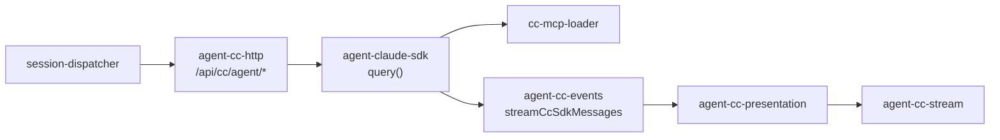

# Claude Agent SDK 落地 - 变更总结

> **变更 ID**：`20260630002838-ClaudeAgentSDK落地`
> **归档 stage**：`archived_with_debt`（含 R4 startup 债务与 K1–K8 runtime 待人工验收）

## 1、实际变更

**依赖与打包（T1、T6）**：

| 任务 | 文件 | 改动要点 |
|------|------|----------|
| T1 | `package.json`、`package-lock.json` | 移除 `@anthropic-ai/claude-code`；新增 `@anthropic-ai/claude-agent-sdk` 及平台 optional 包；review 修复后升级 `zod@^4.0.0`、`@modelcontextprotocol/sdk@^1.29.0` 以满足 SDK peer |
| T6 | `electron-builder.yml` | `asarUnpack` 增加 `node_modules/@anthropic-ai/claude-agent-sdk-*/**/*`，对称 Cursor SDK 二进制解包 |

**新建文件（T2、T4 拆分）**：

| 文件 | 职责 |
|------|------|
| `electron/cc-mcp-loader.ts` | 仿 `mcp-sdk-loader.ts`：读 global/project `.cursor/mcp.json` + OAuth，输出 SDK `McpServerConfig`；`loadInlineCcMcpServers` / `appendInlineMcpToCcOptions`；review 修复 stdio `cwd=workspaceDir` |
| `electron/agent-cc-presentation.ts` | 自 `agent-cc-stream` 拆出 `PRESENTATION_ORDERING` / `presentationOrderingEligible`，对称 Cursor SDK 编排 |

**执行核心重写（T3、T4、T5）**：

| 任务 | 文件 | 改动要点 |
|------|------|----------|
| T5 | `electron/agent-cc-types.ts` | `child: ChildProcess` → `activeQuery: Query \| null`；`ccSessionId` 注释改为 SDK init/result 来源 |
| T5 | `electron/agent-cc-utils.ts` | 删除 `getCcBinaryPath`/`resolveCcBinaryPath`；新增 `ensureCcAgentBinaryPaths`、`resolveCcAgentBinaryPath`（asar.unpacked 路径对称 `ensureSdkBinaryPaths`） |
| T3 | `electron/agent-claude-sdk.ts` | `spawn`/`buildSpawnArgs` 全删；launch/dispatch 改 `query({ prompt, options })`（model、resume、env、pathToClaudeCodeExecutable、mcpServers）；stop/watchdog 改 `Query.close()`；resident idle 判定改 `!activeQuery` |
| T4 | `electron/agent-cc-events.ts` | 新增 `streamCcSdkMessages(session, queryIterator, opts)`；`SDKMessage` → 现有 Presentation 语义；删除 `parseCcEvent`/`streamCcEvents`/stream-json |
| T4 | `electron/agent-cc-stream.ts` | `completeCcRun` 触发源改为 iterator 结束；I1 修复 fallback 文案为「Agent Run 失败」 |

**品牌与文档（T7）**：

| 文件 | 改动要点 |
|------|----------|
| `electron/AGENTS.md` | 删除 spawn/CLI/stream-json 约定；补充 Claude Agent SDK、MCP inline、打包二进制、resident/resume |
| `src/renderer/components/AgentPanel.tsx` | 用户可见「Claude Code」→「Claude Agent」（内部 `type: "claude-code"` 不变） |
| `src/renderer/pages/Settings.tsx` | Claude Profile 区块品牌统一 |
| `electron/agent-cc-http.ts`、`electron/session-dispatcher.ts` | review R5 修复：用户可见 error/日志改为「Claude Agent」 |

**扫尾清理（T8）**：

- `electron/` 内 `@anthropic-ai/claude-code`、`buildSpawnArgs`、`streamCcEvents`、`getCcBinaryPath` 等 spawn 时代残留已清零（rg 验证通过）
- `agent-cc-http.ts` HTTP 路由与 body 契约 **无 diff**（设计 P-3 不变）

**调用链（迁移后）**：

## 2、与设计的差异

| 项 | 设计预期 | 实际实现 | 处置 |
|----|----------|----------|------|
| **R4 startup() 预暖** | P-6 可选 `startup()` 对称 `SDK_RESIDENT_AGENT`（02 六·6） | `claude-agent-sdk@0.3.195` 无 `startup` 导出；以 resident Map + 每轮 `query({ resume: ccSessionId })` 实现长驻续跑 | **accepted_debt**（见 §5） |
| MCP stdio cwd | T2 与 `mcp-sdk-loader` 对称 | 初版缺 `cwd`；R3 已修复 `toStdioInlineConfig` | ✅ 已修复 |
| 品牌 P-16 | UI + 日志统一「Claude Agent」 | 初版 HTTP/调度 error 未改；R5 已修复 | ✅ 已修复 |
| peer 依赖 | T1 安装 SDK | 初版 zod@3、MCP sdk@1.27 不满足 peer；R1/R2 已升级 | ✅ 已修复 |

## 3、影响范围

- **涉及模块**：Claude 执行引擎全栈（`agent-claude-sdk`、`agent-cc-events`、`agent-cc-presentation`、`agent-cc-stream`、`agent-cc-types`、`agent-cc-utils`、`cc-mcp-loader`）；`package.json` / lockfile；`electron-builder.yml`；Renderer 品牌文案；`electron/AGENTS.md`
- **接口/proto 变更**：无对外 HTTP/IPC 契约变更；`/api/cc/agent/launch|dispatch` 路径与 body 字段不变
- **数据变更**：无持久化 schema 变更；`cc-agent-api-port.json`、`AgentResource.type=claude-code` 不变
- **不改（显式）**：`session-dispatcher` 路由分支、`agent-cc-http` handler 注入模式、`context-rotation-lite`、`agent-sdk.ts` Cursor 路径、IM WebSocket 层、工作流 YAML 格式
- **风险残留**：SDK `SDKMessage` 与旧 stream-json 字段差异须在 runtime 联调确认（K1–K8）；optional 平台包缺失时 fallback 至 PATH `claude`（WARN 日志）

## 4、知识库影响清单

> 来源：`02-design.md` 九、十；archive 时由 **kb-librarian** 消费本清单。

### （一）必须更新

- [ ] `knowledge/业务域/Agent调度/03-启动与自动重连.md` — CC 执行方式由 spawn CLI 改为 Claude Agent SDK；resident、MCP inline、会话 resume、端口文件
- [ ] `electron/AGENTS.md` — 已在 T7 代码侧更新；知识库若引用旧 spawn 约定须同步

### （二）可能更新（视 archive diff）

- [ ] `knowledge/业务域/Agent调度/01-概览.md` — 双引擎架构图若仍引用 CLI spawn
- [ ] `knowledge/工程平台/Electron桌面应用/01-概览.md` — optional dep / asarUnpack 清单
- [ ] `knowledge/知识索引.md` — 仅当概览术语「Claude Code」→「Claude Agent」需索引级反映

### （三）不需要更新

- [x] IM 通道绑定模型、工作流 YAML 格式相关文档（01 非目标）
- [x] Cursor SDK 专属文档（本变更不涉及 Cursor 路径行为变更）
- [x] 已归档 `20260629164130-执行引擎扩展接入ClaudeCode` 变更文档（历史记录，不 retro-edit）

## 5、accepted debt

归档 stage 定为 **`archived_with_debt`**，以下项接受为已知债务，不阻塞代码合并与静态验收归档。

### 5.1 R4：startup() 预暖未实现

| 字段 | 内容 |
|------|------|
| **review ID** | R4（manifest `status: deferred`） |
| **设计引用** | 02 P-6、01 F1「SDK 长驻预暖能力」 |
| **实际策略** | resident session Map + `query({ options: { resume: ccSessionId } })` 对等 Cursor `Agent.create` + `agent.send` 多轮语义 |
| **未实现原因** | 当前 `@anthropic-ai/claude-agent-sdk@0.3.195` 无 `startup` 导出；非实现遗漏 |
| **影响** | 功能上接近 Cursor 长驻模式；首 launch 冷启动延迟未在 runtime 量化；非 WarmQuery 预暖 |
| **后续** | SDK 后续版本若导出 `startup()`，可在 `ensureClaudeCodeHttpServer` 或首 launch 前补预暖 |

### 5.2 K1–K8：runtime 验收仍为「待人工」

> 详见 `06-automation-test.md` §3 追溯表与 §7 执行记录。

| 场景 ID | 关联验收 | 状态 |
|---------|----------|------|
| K1 IM launch/dispatch | 01·1 | ⏳ 待人工 |
| K2 流式呈现 | 01·2 | ⏳ 待人工 |
| K3 任务与工作流 | 01·3 | ⏳ 待人工 |
| K4 MCP 双类型 | 01·4、§8.2 | ⏳ 待人工 |
| K5 session 续跑 | 01·5、§8.2 resident | ⏳ 待人工 |
| K6 dist:mac 打包 Run | 01·6、T6 | ⏳ 待人工 |
| K7 品牌 UI 抽查 | 01·8 | ⏳ 待人工 |
| K8 Cursor 回归 | 01·9 | ⏳ 待人工 |

**已通过项（builder 静态/构建）**：`npm run build`；`electron/` 无 claude-code/spawn/stream-json 残留；`agent-cc-http.ts` 无 diff；T1–T8 代码任务均 `done`；R1–R3、R5、I1 review 项已修复。

**债务说明**：本期以 build + rg + 代码 review 完成 `/kb-test` 静态层；端到端 IM/MCP/打包/Cursor 回归依赖 Claude Profile、IM 凭据与 macOS 安装包，无 headless 等价脚本，故 K1–K8 留待后续 QA 或运维联调补录执行记录。

## 6、任务与 review 追溯

| 任务 | 状态 | 摘要 |
|------|------|------|
| T1 | done | 依赖迁移 + peer 修复 |
| T2 | done | cc-mcp-loader |
| T3 | done | agent-claude-sdk query() 核心 |
| T4 | done | agent-cc-events SDKMessage + agent-cc-presentation |
| T5 | done | types/utils 二进制路径 |
| T6 | done | electron-builder asarUnpack |
| T7 | done | UI 品牌 + AGENTS.md |
| T8 | done | spawn 死代码扫尾 |

| review | 状态 | 摘要 |
|--------|------|------|
| R1 | fixed | zod → ^4.0.0 |
| R2 | fixed | @modelcontextprotocol/sdk → ^1.29.0 |
| R3 | fixed | cc-mcp-loader stdio cwd |
| R4 | **deferred** | startup() → accepted_debt |
| R5 | fixed | HTTP/调度品牌文案 |
| I1 | fixed | completeCcRun fallback 文案 |
