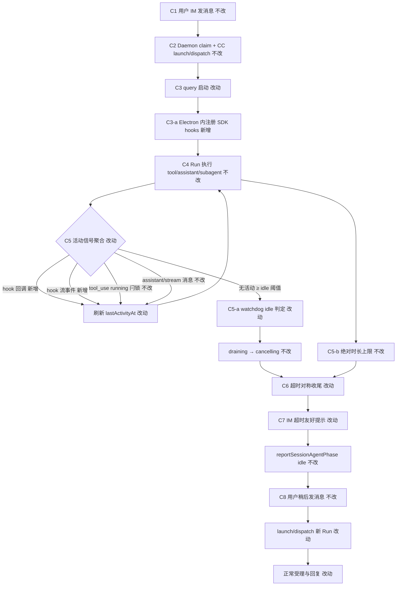
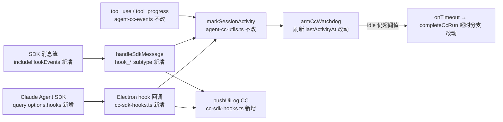

# CC 路径 watchdog 超时对称收尾与用户通知 - 实现设计

> **业务 PRD**：见同目录 `01-proposal.md`（验收标准以 01 为准）

## 一、业务流程与改动范围

> 业务口径以 `01-proposal.md` 场景 A～D、F1～F5（含 F4-hook/latch/log/notify）与验收 1～10 为准；下图覆盖 IM 主路径：launch → Run → 活动刷新（含 hooks）→ watchdog 超时 → 对称收尾 → 稍后发消息。

### （一）业务流程图

**图例**：`不改` 行为与现网一致；`改动` 需改代码/配置；`新增` 新节点或新分支；`删除` 无。

### （二）流程步骤与改动对照

| 步骤 ID | 业务含义 | 改动 | 落点（模块/文件） | 01 验收关联 |
|---------|----------|------|-------------------|-------------|
| C1 | 用户经 IM 发消息，Daemon 入队 | 不改 | `src/daemon.ts` orchestrator | — |
| C2 | `resource.type=claude-code` → CC HTTP launch/dispatch | 不改 | `session-dispatcher.ts`；`agent-cc-http.ts` | 验收 4 前置 |
| C3 | `startCcQuery`：`query()` + `armCcWatchdog` | 改动 | `electron/agent-claude-sdk.ts` `buildQueryOptions` / `startCcQuery` | 验收 1 |
| C3-a | Electron 内注册 `options.hooks` + `includeHookEvents: true` | 新增 | `electron/cc-sdk-hooks.ts`；`agent-claude-sdk.ts` `buildQueryOptions` | F4-hook；验收 7 |
| C4 | SDK 消息流：assistant / tool / stream | 不改（增强活动源） | `electron/agent-cc-events.ts` `handleSdkMessage` | — |
| C5 | 活动信号 → `markSessionActivity` | 改动 | `agent-cc-utils.ts`；`cc-sdk-hooks.ts`；`agent-cc-events.ts` | F4-latch；验收 6、7 |
| C5-a | watchdog `onTick`：idleMs vs `lastActivityAt` | 改动（依赖 C5 刷新） | `agent-cc-events.ts` `armCcWatchdog` | 验收 6 |
| C5-b | 绝对时长 `absoluteTimeoutMs` | 不改 | `agent-claude-sdk.ts` 常量；`watchRunGuard` | 验收 1 |
| C5-tool | tool_use → `lastTool.status=running` 闩锁 | 不改 | `agent-cc-events.ts` `handleContentBlocks` | F4-latch 组合 |
| C6 | watchdog `onTimeout` → 标记超时类终态 → `activeQuery.close()` → `completeCcRun` 超时分支 | 改动 | `agent-cc-events.ts` `armCcWatchdog`；`agent-cc-stream.ts` `completeCcRun` 或 `finalizeCcRunOnTimeout` | F1、F4-notify；验收 1、3 |
| C7 | IM 一次超时友好 notify（`stop_progress`） | 改动 | `agent-cc-stream.ts`；复用 `sdk-failure-messages.formatTimeoutFailureMessage` | F2；验收 2、5 |
| C8 | 用户稍后同会话发消息 | 不改 | Daemon claim | 验收 4 |
| C9 | 超时路径不写 `failedCooldowns` / resident 保留策略 | 改动 | `agent-cc-stream.ts` `completeCcRun` 分支 | F5；验收 4 |
| C10 | hook UI 日志（CC 前缀，含 hook_event 等） | 新增 | `electron/cc-sdk-hooks.ts`；`agent-cc-events.ts` hook 流 subtype | F4-log；验收 8 |
| C11 | 用户主动 Stop / 非超时 error | 不改 | `agent-claude-sdk.ts` `stopClaudeCodeSession`；`completeCcRun` error 分支 | 验收 9、10 |

### （三）改动汇总

- **改动**：`electron/agent-claude-sdk.ts`（`buildQueryOptions` 注入 hooks / `includeHookEvents`）；`electron/agent-cc-events.ts`（hook 流 subtype、`armCcWatchdog` 超时标记）；`electron/agent-cc-stream.ts`（超时 IM notify + 对称收尾）；`electron/agent-cc-types.ts`（可选 `watchdogTimedOut?: boolean`）
- **新增**：`electron/cc-sdk-hooks.ts`（hook 注册、回调内 `markSessionActivity` + `pushUiLog` 格式化）
- **不改（显式列出）**：
  - `agent-run-guard.ts` `watchRunGuard` 契约
  - `agent-cc-http.ts` HTTP 路由与 body
  - `session-dispatcher.ts` / Daemon phase 逻辑（idle 上报后既有 flush 足够）
  - Cursor SDK 路径 `agent-sdk.ts` / `finalize-sdk-run.ts`
  - 用户 shell `.claude/settings.json` hooks 作为主路径
  - 超时阈值毫秒数（`CC_IDLE_TIMEOUT_MS` / 默认 300_000）

## 二、整体思路

**根因**（已回源码核实）：

1. **F1/F2 缺口**：`armCcWatchdog` 超时仅 `activeQuery.close()` + UI WARN 日志；`completeCcRun` 未识别 watchdog 超时，**无** IM 友好 notify、`stop_progress` 与 SDK 路径 `finalizeSdkRunOnTimeout` 对等行为（`agent-cc-events.ts` L178–183；`agent-cc-stream.ts` L273–280 仅 generic error）。
2. **F4 缺口**：`handleSdkMessage` 对 `sdk:${msg.type}` 刷新活动，但 **子 Agent 长跑静默期** 可能长时间无 assistant/tool 可见消息；**未** 注册 SDK `options.hooks`，**未** 处理 `system` subtype `hook_*` 流事件。
3. **tool-running 闩锁**：`tool_use` 块已设 `lastTool.status=running` 并 `markProcessEventSeen`，但 **不等于** 持续刷新 `lastActivityAt`——须与 hook 信号 **叠加**（`handleSdkMessage` L94 已对每条消息 markActivity，tool_progress 亦覆盖；子 agent 静默是主要漏点）。

**方案要点**（最小改动，对称 SDK 路径）：

1. **F4-hook**：新建 `cc-sdk-hooks.ts`，在 `buildQueryOptions` 返回 `hooks`（SubagentStart / PreToolUse / PostToolUse 等）+ `includeHookEvents: true`；可选 `settingSources: ["project","user"]` **仅** 作 MCP/settings 补充，**不** 替代 Electron hooks。
2. **F4-latch**：hook 回调与 `handleSdkMessage` 内 `hook_started` / `hook_progress` / `hook_response` → 均调用 `markSessionActivity(session, source)`；与现有 tool/stream 活动 **OR 组合**。
3. **F4-log**：统一 `formatCcHookUiLog(...)` → `pushUiLog("CC", "INFO", ...)`，字段含 `hook_event`、`agent_type`、`tool_name`；**禁止** `notifySessionChat` 推送 hook 原文。
4. **F4-notify / F1/F2**：`armCcWatchdog.onTimeout` 置 `session.watchdogTimedOut=true`（或 `lastStatus` 超时语义）后 close Query；`completeCcRun` 检测超时类终态 → 一次 IM 文案（复用 `formatTimeoutFailureMessage`）+ `stop_progress` + **跳过** `failedCooldowns`；`runFinalizing` 幂等闩保留。

**与 01 追溯**：F1→C6；F2→C7；F3→C6+C7 与 SDK 文案对齐；F4-hook→C3-a；F4-latch→C5；F4-log→C10；F4-notify→C6+C7+C9；F5→C9。

**最小方案三问（Ponytail）**：

1. **复用现有模块？** 是。`markSessionActivity`、`armCcWatchdog`、`completeCcRun`、`watchRunGuard`、`formatTimeoutFailureMessage` 均已有；不新建通用 Agent 抽象层。
2. **新增文件是否 PRD 要求？** `cc-sdk-hooks.ts` 必要——hook 注册 + 日志格式化预计超 80 行，且 `agent-claude-sdk.ts` 已 272 行，符合仓库单文件 ≤300 行约束。
3. **能否合并单文件？** hooks 逻辑独立成 `cc-sdk-hooks.ts`；超时 finalizer 优先 **inline** `completeCcRun` 分支，仅当 stream 模块超限再抽 `finalize-cc-run.ts`（YAGNI）。

### Hook 回调链（技术补充）

## 三、分层设计

- **端点层**：`agent-cc-http.ts` launch/dispatch HTTP — **不改**。
- **服务层（CC 执行）**：
  - `agent-claude-sdk.ts`：session 生命周期、`buildQueryOptions` 组装 hooks。
  - `cc-sdk-hooks.ts`：hooks 工厂 + UI 日志格式化。
  - `agent-cc-events.ts`：SDK 流消费、watchdog、hook 流 subtype。
  - `agent-cc-stream.ts`：出站 stream-text / notify、`completeCcRun` 终态。
- **工具层**：`agent-cc-utils.ts`（`markSessionActivity`、`setWatchdogState`）；`agent-run-guard.ts`（`watchRunGuard`）；`sdk-failure-messages.ts`（超时 IM 文案复用）。
- **数据层**：`CcSessionAgent` 增可选字段 `watchdogTimedOut?: boolean`；无持久化/schema 变更。

## 四、接口设计

无新增 HTTP/IPC 契约。内部扩展：

| 符号 | 变更 |
|------|------|
| `buildQueryOptions(session)` | 返回项增 `hooks`、`includeHookEvents: true`；可选 `settingSources` |
| `buildCcSdkHooks(session, deps)` | **新增** — deps：`markActivity`、`pushUiLog` |
| `handleSdkMessage(...)` | 增 `system` subtype `hook_started` / `hook_progress` / `hook_response` 分支 |
| `completeCcRun(...)` | 增 watchdog 超时分支：IM notify + 跳过 cooldown |
| `armCcWatchdog.onTimeout` | 增 `session.watchdogTimedOut = true`（或等价 `lastStatus`） |

SDK `options.hooks` 具体事件名与回调签名 **以 `@anthropic-ai/claude-agent-sdk` ^0.3.195 类型为准**（本仓库 node_modules 未检出类型时 builder 须安装依赖核实，禁止编造字段）。

## 五、数据结构

`CcSessionAgent`（`agent-cc-types.ts`）可选扩展：

| 字段 | 类型 | 用途 |
|------|------|------|
| `watchdogTimedOut` | `boolean?` | `onTimeout` 置位；`completeCcRun` 判定超时 IM 分支 |

无 DB / proto 变更。

## 六、实现步骤

1. **C3-a / C10**：新增 `electron/cc-sdk-hooks.ts` — `buildCcSdkHooks(session)` 注册 SubagentStart / PreToolUse / PostToolUse（及 SDK 支持的同类事件）；回调内 `markSessionActivity` + `formatCcHookUiLog` → `pushUiLog`。
2. **C3-a**：`buildQueryOptions` 合并 `hooks: buildCcSdkHooks(...)`、`includeHookEvents: true`；按需 `settingSources: ["project","user"]`（与 MCP inline 去重策略同 archive stdio MCP）。
3. **C5 / C10**：`handleSdkMessage` 增 hook 流 subtype 处理 → `markSessionActivity(session, 'hook:${subtype}')` + UI 日志（与回调路径字段一致）。
4. **C6 / C7 / C9**：`armCcWatchdog.onTimeout` 标记 `watchdogTimedOut`；`completeCcRun` 超时分支：`notifySessionChat(..., stop_progress=true)` 复用 `formatTimeoutFailureMessage`；不写 `setFailedCooldown`；保留 `runFinalizing` 幂等。
5. **C5-a**：确认 hook + tool 活动下 `lastActivityAt` 持续刷新 — 手工/自动化用例覆盖验收 6、7。
6. **回归**：C11 主动 Stop、非超时 error 路径不变。

## 七、参考实现

> CodeGraph 未初始化（`.codegraph/` 缺失）；以下由源码 Read 核实。

| 符号 | 路径 | 职责 |
|------|------|------|
| `buildQueryOptions` | `electron/agent-claude-sdk.ts` L61–74 | 现网 query options；改动注入点 |
| `startCcQuery` | `electron/agent-claude-sdk.ts` L77–82 | query + watchdog + stream |
| `armCcWatchdog` | `electron/agent-cc-events.ts` L160–187 | idle/absolute 超时；`onTimeout` close Query |
| `handleSdkMessage` | `electron/agent-cc-events.ts` L88–148 | 消息分派；L94 `markActivity` |
| `handleContentBlocks` | `electron/agent-cc-events.ts` L35–66 | tool_use running 闩锁 |
| `markSessionActivity` | `electron/agent-cc-utils.ts` L155–160 | 刷新 `lastActivityAt`；draining→running |
| `setWatchdogState` | `electron/agent-cc-utils.ts` L143–152 | watchdog 状态机 |
| `completeCcRun` | `electron/agent-cc-stream.ts` L253–294 | Run 终态；待增超时 notify |
| `watchRunGuard` | `electron/agent-run-guard.ts` L60–79 | 统一 watchdog 循环 |
| `finalizeSdkRunOnTimeout` | `electron/finalize-sdk-run.ts` L110+ | **对称参考**（SDK 路径） |
| `formatTimeoutFailureMessage` | `electron/sdk-failure-messages.ts` L93–96 | 超时 IM 文案复用 |
| `notifySdkFailure` | `electron/agent-sdk.ts` L280–320 | notify + `stop_progress` 模式参考 |

## 八、技术影响

### （一）影响范围

- **涉及模块**：`agent-claude-sdk.ts`、`agent-cc-events.ts`、`agent-cc-stream.ts`、`agent-cc-types.ts`、**新增** `cc-sdk-hooks.ts`；只读依赖 `agent-cc-utils.ts`、`agent-run-guard.ts`、`sdk-failure-messages.ts`。
- **接口/proto 变更**：无。
- **数据变更**：无；session 内存字段可选增 1 项。
- **风险**：
  - SDK hooks API 与 `hook_*` subtype 字段名若与 PRD 假设不一致，builder 须以安装包类型为准调整（标待确认）。
  - hook 回调频率过高可能刷屏 UI 日志 — 可对同类 `hook_event` 做节流或 DEBUG 级别（实现阶段评估，默认 INFO 满足验收 8）。
  - `completeCcRun` 与 watchdog 并发：依赖 `runFinalizing` + `activeQuery.close()` 单路径收敛，须防双 notify。

### （二）工程补充验收项

- [ ] `buildQueryOptions` 输出含 `hooks` 与 `includeHookEvents: true`；Electron 内回调可触发（非仅 settings.json）。
- [ ] hook 回调或 `hook_*` 流事件到达后 1s 内 `lastActivityAt` 更新；持续 subagent hook 场景下 5min 内 **不** 触发 idle 误杀（可用缩短 `CC_IDLE_TIMEOUT_MS` 做台架）。
- [ ] UI 日志含 `hook_event=`、`agent_type=` 或 `tool_name=` 至少两类字段；IM 通道 **无** hook 原文。
- [ ] watchdog 超时后：`completeCcRun` 发送 **一条** 超时友好 IM（语义对齐 `formatTimeoutFailureMessage`）、`stop_progress`、phase=idle；**无** `failedCooldowns`。
- [ ] 超时后同会话 dispatch/launch **成功** 且非 `dispatch_failed`；resident 模式 presentation 重置后可续跑。
- [ ] 主动 `stopClaudeCodeSession` **不** 走超时文案；非超时 error 仍走既有失败 notify。

## 九、知识库影响

- `knowledge/工程平台/Electron桌面应用/` — CC 执行引擎、watchdog、hooks 可观测性（archive 时由 kb-librarian 更新）。
- 两级索引：archive 后视 `01-概览` 是否已覆盖双引擎超时对称，决定是否更新 `知识索引.md`。

## 十、知识库更新计划

### （一）必须更新

- `knowledge/工程平台/Electron桌面应用/` 下 CC Agent 子模块（或 `01-概览` 八·全局可观测）— 补充 CC hooks 活动策略、watchdog 超时 IM 对称、UI 日志字段约定。

### （二）可能更新（视实现结果）

- `electron/AGENTS.md` — CC 路径 watchdog / hook / 超时 notify 约定（若 builder 同步维护）。
- `knowledge/变更/归档/.../05-summary.md` — 实现偏差（SDK hook 字段、settingSources 是否启用）。

### （三）不需要更新

- IM Daemon 协议、`session-dispatcher` 路由文档（无契约变更）。
- Cursor SDK 路径专属知识文件（本变更不改 `agent-sdk.ts` 行为）。
- 用户-facing 设置页文档（无新 UI）。
