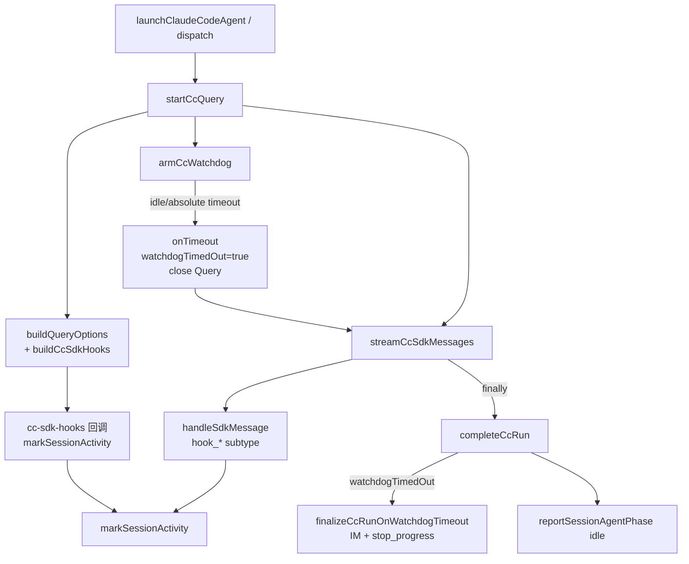

# CC 路径 watchdog 超时对称收尾与用户通知 - 代码评审报告

## 1、审查范围

- **变更类型**: apply 产出的未提交变更（`git diff electron/` + 未跟踪新文件）
- **评审等级**: focused-review（Electron CC 局部增强；含 Ponytail 精简轴）
- **涉及文件**: 7 个（新建 2、修改 5）
  - 新建: `electron/cc-sdk-hooks.ts`、`electron/cc-watchdog-finalize.ts`
  - 修改: `electron/agent-cc-types.ts`、`electron/agent-claude-sdk.ts`、`electron/agent-cc-events.ts`、`electron/agent-cc-stream.ts`、`electron/AGENTS.md`
- **设计文档**: `02-design.md`（对照基准）；任务: `03-tasks.md` T1–T5
- **CodeGraph**: 未初始化（`.codegraph/` 缺失）；调用链以下文手工 diff + grep 核实，并在 §6 标注

## 2、严重（必须处理）

无

## 3、警告（建议处理）

无（评分 ≥75 的问题未发现）

**Ponytail 精简轴（focused-review Agent #3）**：

| 标签 | 位置 | 说明 |
|------|------|------|
| `shrink:` | `agent-cc-stream.ts` | 已删除仅一处的 `resolveSessionChannelTypeForStream` 包装，直接内联 `resolveChannelType` 调用 — 正向精简 |
| `yagni:` | `cc-watchdog-finalize.ts` | 17 行超时 IM 分支独立文件，因 `agent-cc-stream.ts` 逼近 300 行上限，符合 02 §2 YAGNI 抽函数约定 |
| — | 整体 | **Lean already. Ship.** 无未批准新依赖；`CcSdkHooksDeps` 为最小 deps 注入，避免与 `agent-claude-sdk` 循环 import |

**评分 50–74、不写入 manifest open 的观察项**：

1. **hook 流事件 UI 日志字段略少于回调路径**（评分 55）
   - 位置: `electron/agent-cc-events.ts` L107–114
   - 说明: 流事件路径仅记录 `hook_event` + `hook_name`；回调路径经 `extractHookFields` 可带 `agent_type` / `tool_name`。设计 T4 要求「尽量带 tool_name」，验收 8 要求至少两类字段 — 回调路径已满足，流路径在 PreToolUse 类事件上可能缺 `tool_name`。若台架日志验收 8 仅观测流路径，可能需补字段提取；当前不阻断。

2. **onTimeout 与 stream finally 理论竞态**（评分 50）
   - 位置: `electron/agent-cc-events.ts` L191–197、L241–243
   - 说明: `onTimeout` 在 `!activeQuery` 时 early return 且不置 `watchdogTimedOut`；正常路径下 `onTimeout` 先 `close()` 再触发 finally，顺序安全。仅当 guard 已判定 timeout 但 Query 已被其他路径清空时可能漏标 — 概率极低，现网 idle/absolute 路径以 close 收敛为主。

## 4、设计偏差

1. **超时收尾由 inline 改为独立模块**
   - 设计预期: 02 §2「超时 finalizer 优先 inline `completeCcRun` 分支，仅当 stream 模块超限再抽小函数」
   - 实际实现: `agent-cc-stream.ts` 292 行，超时 IM 逻辑抽至 `cc-watchdog-finalize.ts`（17 行）
   - 影响: **可接受** — 符合 YAGNI 触发条件；命名与 SDK 侧 `finalizeSdkRunOnTimeout` 对称，利于 AGENTS 文档引用

2. **超时文案入口**
   - 设计预期: 复用 `formatTimeoutFailureMessage` 或经 `formatUserSdkFailureMessage({ isTimeoutFailure: true })`
   - 实际实现: `cc-watchdog-finalize.ts` 使用后者
   - 影响: **无功能偏差** — T5 接口契约已允许此路径

3. **未启用 `settingSources`**
   - 设计预期: T3 可选 YAGNI
   - 实际实现: `buildQueryOptions` 仅合并 `hooks` + `includeHookEvents: true`
   - 影响: **无** — Electron 内 hooks 为主路径，符合 F4-hook

## 5、验收标准检查

### 03-tasks 任务验收（代码结构）

| 任务 | 验收条件 | 状态 |
|------|---------|------|
| T1 | TS 编译通过；字段可选；≤300 行 | ✅ |
| T1 | 超时与主动取消可区分（数据前提） | ✅ `stopClaudeCodeSession` 不置 `watchdogTimedOut` |
| T2 | `buildCcSdkHooks` 含 SubagentStart/PreToolUse/PostToolUse | ✅ |
| T2 | 回调 `markActivity` + UI 日志含 `hook_event=` 及 agent/tool 字段 | ✅ 回调路径 |
| T2 | 无 IM notify；≤300 行 | ✅ |
| T3 | `buildQueryOptions` 含 hooks + includeHookEvents | ✅ |
| T3 | CC 路径外无改动 | ✅ |
| T4 | hook 流 subtype 三分支 + markActivity + UI 日志 | ✅ |
| T4 | `onTimeout` 先置 `watchdogTimedOut` 再 close | ✅ |
| T4 | ≤300 行 | ✅ 246 行 |
| T5 | 超时分支 IM + stop_progress；跳过 failedCooldowns | ✅ |
| T5 | error 分支与超时互斥 | ✅ |
| T5 | resident idle + 非 resident deleteSession 保留 | ✅ |
| T5 | ≤300 行 | ✅ 292 行 |

### 01-proposal 验收 1–10（运行时）

| 验收 | 说明 | 状态 |
|------|------|------|
| 1–3 | 空闲/绝对超时收尾 + IM + 进度结束 | ⏳ 待 `/kb-test` 台架 |
| 4 | 稍后发消息可继续 | ⏳ 待 `/kb-test` |
| 5 | 双路径对称抽样 | ⏳ 待 `/kb-test` |
| 6–7 | 子 Agent 静默不误杀 / hook 刷新时钟 | ⏳ 待 `/kb-test`（可缩短 `CC_IDLE_TIMEOUT_MS`） |
| 8 | Hook UI 日志字段 | ⏳ 待 `/kb-test`（回调路径代码已满足） |
| 9 | 主动 Stop 无回归 | ✅ 代码路径：`stopClaudeCodeSession` 不经 `completeCcRun`、不置位 |
| 10 | 非超时 error 无回归 | ✅ 代码路径：非 `watchdogTimedOut` 仍走原 error + cooldown |

### 02 §八·（二）工程补充验收项

| 项 | 状态 |
|----|------|
| buildQueryOptions 含 hooks + includeHookEvents | ✅ 代码 |
| hook 后 lastActivityAt 刷新 / 5min 不误杀 | ⏳ 待台架 |
| UI 日志字段 / IM 无 hook 原文 | ✅ 代码（IM 无 hook 推送） |
| 超时一条 IM + stop_progress + 无 cooldown | ✅ 代码 |
| 超时后 dispatch 成功 | ⏳ 待台架 |
| Stop / 非超时 error 不走超时文案 | ✅ 代码 |

## 6、调用链与回归风险

CodeGraph impact 不可用（项目未 `codegraph init`）；以下为 diff + grep 核实的 CC 主路径：

| 回归点 | 风险 | 说明 |
|--------|------|------|
| Cursor SDK 路径 | 低 | 未改 `agent-sdk.ts` / `finalize-sdk-run.ts` |
| CC HTTP / Daemon | 低 | 未改 `agent-cc-http.ts`、dispatcher |
| 主动 Stop | 低 | `stopClaudeCodeSession` 仍直接删 session，不经超时分支 |
| 非超时 error | 低 | `completeCcRun` else 分支逻辑未变 |
| 双 notify | 低 | `errorNotified` 闩 + `runFinalizing` 幂等 |
| resident 续跑 | 中 | 超时后保留 session 依赖 idle phase；需台架确认 F5 |
| hook 回调频率 | 低 | UI INFO 日志可能增多；设计已接受 |

**编译**: 根目录 `npx tsc --noEmit` 通过。

## 7、遗留债务

无阻断性债务。运行时验收 1–8、§八·（二）台架项留待 `/kb-test` 闭环。

## 8、修复任务建议

| 问题 ID | 建议动作 | 关联任务 |
|---------|----------|----------|
| — | 无 open 问题 | — |

若 `/kb-test` 发现 hook 流路径缺 `tool_name` 导致验收 8 失败，建议追加 `T-FIX-01`：在 `handleSdkMessage` hook 分支从 SDK 消息体安全提取 `tool_name`（以 `sdk.d.ts` 为准）。

## 9、结论

**通过**，可进入 `/kb-test` 执行台架验收；台架通过后运行 `/kb-archive`。

实现与 `02-design.md` C1–C11、`03-tasks.md` T1–T5 代码结构一致；F1–F5 与 F4 子项在代码层已落点。无评分 ≥75 的阻断问题；Ponytail 口径 Lean already.
