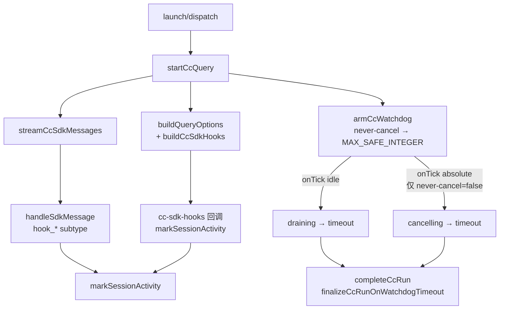

# CC 路径 watchdog 超时对称收尾与用户通知 - 变更总结

> **变更 ID**：`20260630100827-CC路径watchdog超时对称收尾与用户通知`
> **来源**：kb-propose（standard，Bug P1）
> **阶段**：`archived_with_debt`（04-review 通过；T1–T6 静态+编译已通过；**08 第 1 轮打回已由 T6 闭环**；K1–K10 台架待跑，归档接受 debt）

---

## 1、实际变更

**新建文件（T2、T5）**：

| 文件 | 行数 | 职责 |
|------|------|------|
| `electron/cc-sdk-hooks.ts` | 61 | `buildCcSdkHooks` 注册 SubagentStart/PreToolUse/PostToolUse；回调内 `markSessionActivity` + `formatCcHookUiLog` → `pushUiLog("CC")`；`CcSdkHooksDeps` 最小注入避免与 `agent-claude-sdk` 循环 import |
| `electron/cc-watchdog-finalize.ts` | 17 | `finalizeCcRunOnWatchdogTimeout`：一次 IM notify + `stop_progress`，复用 `formatUserSdkFailureMessage({ isTimeoutFailure: true })`，**不写** `failedCooldowns`；命名对称 SDK `finalizeSdkRunOnTimeout` |

**修改文件（T1–T6、文档）**：

| 任务 | 文件 | 改动要点 |
|------|------|----------|
| T1 | `electron/agent-cc-types.ts` | `CcSessionAgent` 增可选 `watchdogTimedOut?: boolean`（`onTimeout` 置位、`completeCcRun` 消费） |
| T3 | `electron/agent-claude-sdk.ts` | `buildQueryOptions` 在 MCP 合并后注入 `hooks: buildCcSdkHooks(...)`、`includeHookEvents: true`；**未**启用 `settingSources`（YAGNI） |
| T4 | `electron/agent-cc-events.ts` | `handleSdkMessage` 增 `system` subtype `hook_started`/`hook_progress`/`hook_response` → `markActivity` + UI 日志；`armCcWatchdog.onTimeout` **先** `watchdogTimedOut=true` **再** `activeQuery.close()` |
| T5 | `electron/agent-cc-stream.ts` | `completeCcRun` 增 watchdog 超时专分支调用 `finalizeCcRunOnWatchdogTimeout`；error 分支与超时 **互斥**（超时跳过 `setFailedCooldown`）；删除 `resolveSessionChannelTypeForStream` 包装，内联 `resolveChannelType` |
| **T6** | `electron/agent-claude-sdk.ts` | 引入与 SDK 同源 `NEVER_CANCEL_ON_DURATION`（env 默认 true）；`WATCHDOG_ABSOLUTE_TIMEOUT_MS` 经 `resolveCcSafeTimeoutMs` 独立 env 链（`CC_ABSOLUTE_TIMEOUT_MS` / `CC_RUN_WATCHDOG_MS` / `SDK_RUN_WATCHDOG_MS` / `PLATFORM_RUN_LIMIT_MS`，默认 7min），**不再**等于 idle 300s；`makeWatchdogOpts` 传 `neverCancelOnDuration` |
| **T6** | `electron/agent-cc-events.ts` | `ArmWatchdogOptions` 增 `neverCancelOnDuration`；`armCcWatchdog` 在 never-cancel 时 `watchRunGuard({ timeoutMs: Number.MAX_SAFE_INTEGER })`，避免 guard L73 总时长硬杀；关闭 never-cancel 时 absolute 硬 cap **仅**在 `onTick` 分支（`runStartedAt`），对称 SDK `armRunWatchdog` |
| **T6** | `electron/AGENTS.md` | 补充 idle/absolute 解耦、`NEVER_CANCEL_ON_DURATION` 与 onTick absolute 分支约定 |
| — | `electron/AGENTS.md`（T1–T5） | 补充 CC SDK hooks 与 watchdog 超时收尾约定（主路径 Electron hooks、禁止 hook 原文 IM、跳过 cooldown） |

**变更文档**：`01-proposal.md`、`02-design.md`、`03-tasks.md`、`04-review.md`、`06-automation-test.md`、`08-verify-issue.md`、`00-manifest.json`、`05-summary.md`（本文件）。

**未纳入（显式）**：`agent-cc-http.ts`、`session-dispatcher.ts`、`agent-sdk.ts` / `finalize-sdk-run.ts`（Cursor SDK 路径）、`package.json` / changelog、Renderer UI。

**统计**：2 新建 + 5 修改；改动文件均 ≤300 行；`npx tsc --noEmit`、`npm run build:mcp`、`npx electron-vite build` 通过（含 T6 复跑，见 06 §4.3、§7）。

**调用链（T6 后）**：

## 2、与设计的差异

| 项 | 设计预期 | 实际实现 | 处置 |
|----|----------|----------|------|
| **超时收尾位置** | 02 §2 优先 inline `completeCcRun`，stream 超限再抽小函数 | `agent-cc-stream.ts` 292 行，超时 IM 逻辑抽至 `cc-watchdog-finalize.ts`（17 行） | **可接受** — 触发 YAGNI 条件；与 SDK `finalizeSdkRunOnTimeout` 对称 |
| **超时文案入口** | 复用 `formatTimeoutFailureMessage` | `formatUserSdkFailureMessage({ isTimeoutFailure: true })` | **无功能偏差** — T5 接口契约已允许 |
| **`settingSources`** | T3 可选 YAGNI | 未启用；Electron 内 hooks 为主路径 | **无** — 符合 F4-hook |
| **C5-b absolute/idle** | 02 初版标「不改」，absolute=idle=300s | **T6 修订**：对齐 SDK `NEVER_CANCEL_ON_DURATION`；idle/absolute 解耦 | **08 打回闭环** — 见 §5 |
| **hook 流事件 UI 字段** | 回调与流路径字段一致 | 流路径仅 `hook_event` + `hook_name`；回调路径经 `extractHookFields` 可带 `agent_type`/`tool_name` | **观察项**（04 评分 55）— 回调路径已满足验收 8；台架若仅观测流路径可能需补字段 |

## 3、影响范围

- **涉及模块**：CC 执行链 `agent-claude-sdk.ts`、`agent-cc-events.ts`、`agent-cc-stream.ts`、`agent-cc-types.ts`、**新增** `cc-sdk-hooks.ts`、`cc-watchdog-finalize.ts`；只读依赖 `agent-cc-utils.ts`、`agent-run-guard.ts`、`sdk-failure-messages.ts`；`electron/AGENTS.md` 约定同步。
- **用户可见性**：watchdog 空闲/绝对超时后 **一条** 简体中文友好 IM（与 SDK 路径语义对齐）、`stop_progress`、phase→idle；**不** 写 `failedCooldowns`，同会话可稍后发消息续跑（F5，须台架确认）。
- **T6 行为**：默认 never-cancel 下 hook/工具持续活动 **不** 因 guard L73 约 5min 总时长强杀（对齐 SDK、01·6/7、场景 D）；无 hook 活动仍按 `CC_IDLE_TIMEOUT_MS` idle 超时；显式关闭 never-cancel 时 absolute 在 onTick 触发（默认 cap 7min，≠ idle）。
- **可观测性**：SDK hooks 与 `hook_*` 流事件刷新 `lastActivityAt`；Agent 面板 CC 日志含 `hook_event=` 等；**禁止** hook 原文推 IM。
- **接口/proto 变更**：无对外 HTTP/IPC 契约变更。
- **不改（显式）**：`agent-cc-http.ts`、Daemon `session-dispatcher`、`agent-sdk.ts` / `finalize-sdk-run.ts` 行为、Renderer UI。
- **风险残留**：hook 回调频率可能增多 UI INFO 日志；`onTimeout` 与 stream finally 理论竞态（04 评分 50，概率极低）；**K1–K10 台架未全跑**（accepted_debt）。

### 3.1 Ponytail 精简轴

变更 diff 中无 `ponytail:` 注释；04-review focused-review 口径 **Lean already. Ship.**

| 标签 | 位置 | 说明 |
|------|------|------|
| `shrink:` | `agent-cc-stream.ts` | 删除仅一处的 `resolveSessionChannelTypeForStream` 包装，直接内联 `resolveChannelType` — 正向精简 |
| `yagni:` | `cc-watchdog-finalize.ts` | 17 行超时 IM 分支独立文件，因 `agent-cc-stream.ts` 逼近 300 行上限，符合 02 §2「stream 超限再抽」约定 |
| — | 整体 | `CcSdkHooksDeps` 最小 deps 注入，避免与 `agent-claude-sdk` 循环 import；无未批准新依赖 |

## 4、知识库影响清单

> 来源：`02-design.md` §九、§十；由 **kb-librarian** 在 archive 步骤 6 消费本清单落盘（本步骤 **不写** 工程平台正文）。

### （一）必须更新

- [ ] `knowledge/工程平台/Electron桌面应用/01-概览.md` — **八·全局非功能与可观测**：CC 双引擎 watchdog 超时 IM 对称、超时跳过 `failedCooldowns`、**T6** idle/absolute 解耦与 `NEVER_CANCEL_ON_DURATION` 默认语义
- [ ] `knowledge/工程平台/Electron桌面应用/02-主进程与IPC.md` — CC Run 执行链：Electron 内 `options.hooks` + `includeHookEvents`；`cc-sdk-hooks.ts` / `cc-watchdog-finalize.ts` 职责；**T6** `armCcWatchdog` never-cancel 与 onTick absolute 分支；UI 日志字段约定（禁止 hook 原文 IM）

### （二）可能更新（视 librarian 归档合并结果）

- [ ] `knowledge/业务域/Agent调度/03-启动与自动重连.md` — 若 CC 超时收尾与 SDK finalizer 对称描述尚未并列，补交叉引用
- [ ] `knowledge/知识索引.md` — 仅当概览术语或双引擎超时对称需在索引级反映
- [x] `electron/AGENTS.md` — **已在代码侧更新**（hooks / watchdog / T6 never-cancel 段落）；librarian 合并工程平台知识时须与代码约定对齐

### （三）不需要更新

- [x] IM Daemon 协议、`session-dispatcher` 路由文档（无契约变更）
- [x] Cursor SDK 路径专属知识文件（本变更不改 `agent-sdk.ts` 行为）
- [x] 用户-facing 设置页文档（无新 UI）

## 5、验收与任务追溯

| 任务 | 状态 | 摘要 |
|------|------|------|
| T1 | done | `watchdogTimedOut?` 字段 |
| T2 | done | `cc-sdk-hooks.ts` 工厂与 UI 日志 |
| T3 | done | `buildQueryOptions` 注入 hooks |
| T4 | done | hook 流 subtype + watchdog 置位 |
| T5 | done | 超时 IM 对称收尾 + 跳过 cooldown |
| **T6** | **done** | idle/absolute 解耦；`NEVER_CANCEL_ON_DURATION` 默认 true → guard `timeoutMs=MAX_SAFE_INTEGER`；关闭时在 onTick 判 absolute |

### 08 第 1 轮打回与 T6 闭环

| 项 | 说明 |
|----|------|
| **打回现象** | `08-verify-issue.md` 第 1 轮：hook 活动下 Run 仍约 5min 被 `agent-run-guard` L73 绝对时长硬杀（`timeoutMs=absoluteTimeoutMs` 与 idle 同值 300s） |
| **归因** | `code` — CC 未对齐 SDK `NEVER_CANCEL_ON_DURATION`；02 C5-b 初标「不改」导致实现保留等式绑定 |
| **T6 修复** | 静态+编译 ✅；逻辑对齐 01·**6/7**、**场景 D** / F4-latch（hook 持续活动不因总时长误杀） |
| **台架 debt** | **K10**（hook+guard L73 >5min 不误杀）、**K6 复测**（idle 负例仍超时）及 **K1–K9** 运行时 IM 行为 — 见 `06-automation-test.md` §4.3、§7、§8 |

| 维度 | 状态 |
|------|------|
| **04-review** | 通过（T1–T5；T6 为打回后增量） |
| **08 第 1 轮** | 打回 → **T6 已静态闭环** |
| **静态/编译** | ✅ T1–T6（06 §4.2–4.3、§7） |
| **01·1–8 / K1–K10 台架** | ⏳ **accepted_debt** — 不阻塞 `/kb-archive` 迁移 |
| **01·9–10 Stop/error 回归** | ✅ 代码路径；⏳ 台架手工 debt |

**台架加速**：可设 `CC_IDLE_TIMEOUT_MS=60000` 缩短 idle 窗口；**勿**在生产通道使用。
