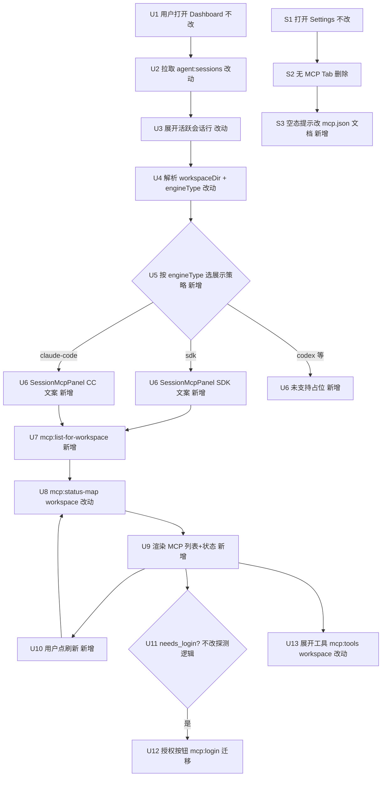
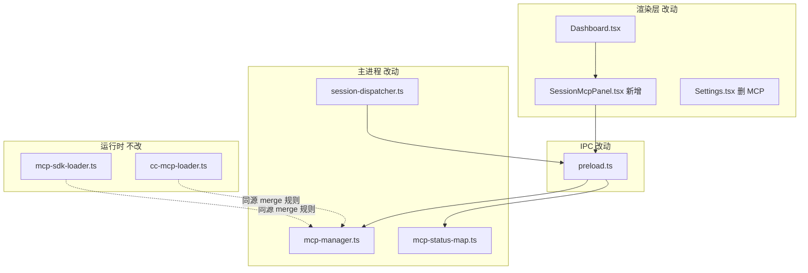

# MCP 展示迁移至 Agent 详情 - 实现设计

> **业务 PRD**：见同目录 `01-proposal.md`（验收标准以 01 为准）

## 一、业务流程与改动范围

> 业务口径以 `01-proposal.md` F1～F5、验收 1～7 为准；产品待确认项 **C1～C4 已拍板**（见 §二 设计决策）。

### （一）业务流程图



**图例**：`不改` 行为与现网一致；`改动` 需改代码；`新增` 新模块/分支；`删除` 移除 Settings MCP Tab 及 CRUD UI。

### （二）流程步骤与改动对照

| 步骤 ID | 业务含义 | 改动 | 落点（模块/文件） | 01 验收关联 |
|---------|----------|------|-------------------|-------------|
| U1 | 用户打开 Dashboard，Daemon 运行 | 不改 | `src/renderer/pages/Dashboard.tsx` | — |
| U2 | IPC 返回活跃会话含 `workspaceDir`、`engineType` | 改动 | `electron/session-dispatcher.ts` `getSessionAgentList`；`electron/agent-claude-sdk.ts` `getClaudeCodeSessionList`；`electron/preload.ts`；`src/renderer/env.d.ts` | 验收 2、3 |
| U3 | 活跃会话行可展开（不限于有排队消息） | 改动 | `Dashboard.tsx` 展开条件与布局 | 验收 2、4 |
| U4 | 有效工作区：会话 `workspaceDir` 优先，空则回退 `config.workspaceDir` | 改动 | `SessionMcpPanel.tsx` `resolveEffectiveWorkspace` | 验收 2、4 |
| U5 | 按 `engineType` dispatch 展示策略 | 新增 | `SessionMcpPanel.tsx` 或 `mcp-view-strategy.ts` | 验收 3、7 |
| U6 | 引擎差异化标题/空态文案 | 新增 | `SessionMcpPanel.tsx` | 验收 3 |
| U7 | 按工作区合并 global+project mcp.json 列表 | 新增 | `electron/mcp-manager.ts` `getMcpServerListForWorkspace`；IPC `mcp:list-for-workspace` | 验收 2、4 |
| U8 | 状态探测绑定会话工作区（stdio cwd / OAuth store） | 改动 | `mcp-status-map.ts` `fetchMcpStatusMap(ws)`；`mcp-manager.ts` `getMcpStatusMap(force, ws?)`；`main.ts` | 验收 2、5 |
| U9 | 列表展示 name/source/enabled/状态，无增删改 | 新增 | `SessionMcpPanel.tsx` | 验收 2、3；C1 |
| U10 | 用户主动刷新状态 | 新增 | `SessionMcpPanel.tsx` → `getMcpStatusMap(true, ws)` | F4；C2 |
| U11 | URL MCP 探测 `needs_login` | 不改 | `mcp-status-map.ts` `probeMcpServerStatus` | 验收 5 |
| U12 | OAuth 授权按钮迁移至详情 | 改动 | `SessionMcpPanel.tsx` → `loginMcp(name, ws?)` | C2 |
| U13 | 可折叠工具列表 | 新增 | `SessionMcpPanel.tsx` → `getMcpTools(name, ws?)` | C3 |
| S1 | Settings 其它 Tab 不变 | 不改 | `Settings.tsx` 非 MCP 区块 | — |
| S2 | 移除 MCP Tab、state、handlers、CRUD Modal | 删除 | `Settings.tsx`（TABS `mcp`、L752～832 及关联 state） | 验收 1；C1 |
| S3 | 无 MCP 时空态提示编辑 `~/.cursor/mcp.json` / `{ws}/.cursor/mcp.json` | 新增 | `SessionMcpPanel.tsx` | F5；C1 |
| R1 | SDK/CC 运行时 MCP 注入 | 不改 | `electron/mcp-sdk-loader.ts`；`electron/cc-mcp-loader.ts` | 非目标 |
| R2 | Daemon MCP HTTP | 不改 | `src/server-workflow.ts` 等 | 非目标 |

### （三）改动汇总

- **删除**：`Settings.tsx` MCP Tab 及全部 MCP 管理 UI（列表 CRUD、toggle、新增 Modal、`refreshMcpServers` 等）；`Tab` 联合类型中的 `"mcp"`；TABS 条目 `{ id: "mcp", ... }`
- **新增**：`src/renderer/components/SessionMcpPanel.tsx`（≤300 行）；可选 `src/renderer/lib/mcp-view-strategy.ts`（策略注册表，超行数时拆分）；`getMcpServerListForWorkspace`；IPC `mcp:list-for-workspace`
- **改动**：`Dashboard.tsx` 活跃会话展开区；`getSessionAgentList` / `getClaudeCodeSessionList`；`mcp-manager.ts` / `mcp-status-map.ts` / `main.ts` / `preload.ts` / `env.d.ts` 支持 `workspaceDir` 上下文
- **不改**：`mcp-sdk-loader.ts`、`cc-mcp-loader.ts`、Daemon MCP HTTP、IM `/mcp` 指令（仍走 `mcp-manager` CRUD API）

## 二、整体思路

**根因**（已回源码核实）：

1. MCP 展示绑定 **全局** `config.workspaceDir`（`mcp-manager.ts` L87-117 `getMcpServerList`；`mcp-status-map.ts` L65-66 缓存键 `ws = config.workspaceDir`），与活跃会话实际 `workspaceDir`（SDK 已有、`CcSessionAgent` 有但未透出列表）不一致。
2. Settings MCP Tab（`Settings.tsx` L752-832）承担诊断 + 管理双职责，与「MCP 属于运行中 Agent」心智冲突。
3. `getSessionAgentList()`（`session-dispatcher.ts` L379-390）合并 SDK/CC 列表时 **未** 标注 `engineType`；CC 列表 **未** 导出 `workspaceDir`（`getClaudeCodeSessionList` L247-254）。

**设计决策（产品 C1～C4 拍板）**：

| 编号 | 决策 | 设计落点 |
|------|------|----------|
| C1 | 设置页 **完全移除** MCP Tab 及管理 UI；配置改 `mcp.json`，空态文案引导 | S2、S3；保留后端 CRUD IPC 供 IM，Renderer 不再调用 toggle/save/delete |
| C2 | Agent 详情首版支持 **刷新状态**；OAuth **迁移**到详情，复用 `mcp:login` | U10、U12；扩展 login 接受 `workspaceDir` |
| C3 | 详情支持 **展开工具列表**，复用 `mcp:tools` | U13 |
| C4 | MCP **按活跃会话**绑定（`workspaceDir` + `engineType` 决定合并范围） | U2、U4、U7、U8 |

**方案要点**：

1. **抽取** Settings MCP 只读展示（列表/状态/工具/刷新/授权）→ `SessionMcpPanel`，props：`workspaceDir`、`engineType`、`sessionKey`。
2. **补齐** 会话元数据：`engineType: 'sdk' | 'claude-code'`；CC 补 `workspaceDir`。
3. **扩展** MCP 查询 API 为 workspace 上下文（与 `mcp-sdk-loader.mergeMcpJsonEntries` 同源合并规则），避免 Settings 与 Agent 详情双源。
4. **策略表** 区分 SDK/CC 文案；`codex` 等未实现引擎显示占位，扩展点 `McpViewStrategy`。

**与 01 追溯**：F1→S2；F2→U3-U9；F3→U5-U6；F4→U10；F5→S3；验收 1→S2；验收 2→U2/U7/U8；验收 3→U5/U6；验收 4→U4；验收 5→U8；验收 7→U5。

## 三、分层设计

| 层 | 职责 | 本变更 |
|----|------|--------|
| 渲染层 | Dashboard 会话展开、`SessionMcpPanel` | 新增面板；Settings 删 MCP |
| IPC 桥 | `preload.ts` / `env.d.ts` | 会话类型扩展；MCP API 增 `workspaceDir?` |
| 主进程 | `session-dispatcher`、`mcp-manager`、`mcp-status-map`、`main.ts` | workspace  scoped 列表/状态/工具/login |
| 运行时注入 | `mcp-sdk-loader`、`cc-mcp-loader` | **不改** |



## 四、接口设计

### （一）IPC 扩展

| 方法 | 变更 | 入参 | 出参 |
|------|------|------|------|
| `agent:sessions` | 出参扩展 | — | 每项增 `workspaceDir?: string`、`engineType: 'sdk' \| 'claude-code'` |
| `mcp:list-for-workspace` | **新增** | `workspaceDir: string` | `McpServerEntry[]`（global + project 合并，project 同名覆盖） |
| `mcp:status-map` | 扩展 | `force?: boolean`, `workspaceDir?: string` | `Record<string, string>` |
| `mcp:tools` | 扩展 | `name: string`, `workspaceDir?: string` | 既有 tools 结构 |
| `mcp:login` | 扩展 | `name: string`, `workspaceDir?: string` | 既有 `{ ok, output }` |
| `mcp:toggle` / `mcp:save` / `mcp:delete` | 保留 | 不变 | Renderer **不再调用**（IM 仍可用） |

`workspaceDir` 省略时行为与现网一致（回退 `config.workspaceDir`），保证 IM/脚本兼容。

### （二）Renderer 组件契约

```typescript
// SessionMcpPanel.tsx（示意）
interface SessionMcpPanelProps {
  sessionKey: string
  workspaceDir?: string
  engineType: 'sdk' | 'claude-code' | 'codex' // codex 仅占位
  fallbackWorkspaceDir: string // config.workspaceDir
}
```

## 五、数据结构

### （一）SessionAgent 列表项（IPC / Renderer）

| 字段 | 类型 | 来源 | 说明 |
|------|------|------|------|
| `sessionKey` | string | 既有 | — |
| `chatType` / `chatName` / `startedAt` / `pid` 等 | 既有 | 既有 | — |
| `workspaceDir` | `string?` | SDK：`getSdkSessionList` 已有；CC：`CcSessionAgent.workspaceDir` 透出 | 空则 UI 用 fallback |
| `engineType` | `'sdk' \| 'claude-code'` | `getSessionAgentList` 组装 | SDK 列表标 sdk，CC 列表标 claude-code |

依据：`agent-sdk.ts` L1128-1138（SDK 已有 workspaceDir）；`agent-cc-types.ts` L43（CC 已有 workspaceDir）；`getClaudeCodeSessionList` L247-254（待补字段）。

### （二）MCP 状态缓存

`mcp-status-map.ts` 缓存键由单一 `config.workspaceDir` 改为 **`workspaceDir` 参数字符串**（trim 后），避免多会话切换展示过期状态。

无 DB / proto 变更。

## 六、实现步骤

1. **U2 / 五·（一）**：`getClaudeCodeSessionList` 增 `workspaceDir`；`getSessionAgentList` 为 SDK/CC 分别加 `engineType`；同步 `preload.ts`、`env.d.ts`、`Dashboard` 会话类型。
2. **U7 / U8**：`mcp-manager.ts` 抽取 `getMcpServerListForWorkspace(ws)`；`fetchMcpStatusMap(force, servers, ws)`；`getMcpServerTools(name, ws?)`、`loginMcpServer(name, ws?)`；`main.ts` 注册 `mcp:list-for-workspace` 并扩展既有 handler。
3. **U5～U13 / S3**：新建 `SessionMcpPanel.tsx` — 策略标题、空态、刷新、列表、授权、工具折叠；从 `Settings.tsx` 迁移只读 UI 逻辑（**不含** toggle/增删改 Modal）。
4. **U3**：`Dashboard.tsx` — 会话行始终可展开；展开区先 `SessionMcpPanel`，其下保留排队消息列表。
5. **S2**：删除 `Settings.tsx` MCP Tab 及相关 state/effect/handlers/modal；清理 `Tab` 类型与 TABS；确认无 `onSettings("mcp")` 入口（当前 `App.tsx`/`Dashboard` 无 mcp 深链，仅防 residual）。
6. **回归**：IM Run、MCP 工具调用、Rules/Skills 等 Settings Tab 无退化。

## 七、参考实现

> CodeGraph MCP 调用失败（`.codegraph/` 未就绪）；以下由 Grep + Read 核实。

| 符号 | 路径 | 职责 |
|------|------|------|
| `getSessionAgentList` | `electron/session-dispatcher.ts` L379-390 | 合并 SDK+CC 会话列表；待扩展 engineType |
| `getSdkSessionList` | `electron/agent-sdk.ts` L1128-1138 | 已含 `workspaceDir` |
| `getClaudeCodeSessionList` | `electron/agent-claude-sdk.ts` L247-254 | 待补 `workspaceDir` |
| `CcSessionAgent` | `electron/agent-cc-types.ts` L34-86 | `workspaceDir` 字段已存在 |
| MCP Settings UI | `src/renderer/pages/Settings.tsx` L752-832 | 迁移源；待删除 |
| `refreshMcpServers` | `Settings.tsx` L174-191 | 迁移 refresh/status/tools 模式 |
| `getMcpServerList` | `electron/mcp-manager.ts` L87-117 | 全局 ws；抽取 ForWorkspace |
| `fetchMcpStatusMap` | `electron/mcp-status-map.ts` L64-89 | 缓存绑 global ws；待参数化 |
| `getMcpServerTools` | `mcp-manager.ts` L220-237 | 待 workspaceCwd 参数化 |
| `loginMcpServer` | `mcp-manager.ts` L190-214 | 待 workspace 参数化 |
| `mergeMcpJsonEntries` | `electron/mcp-sdk-loader.ts` L25+ | 运行时 merge 规则 SSOT |
| `loadInlineCcMcpServers` | `electron/cc-mcp-loader.ts` | CC 运行时注入；展示应对齐 |
| 活跃会话 UI | `Dashboard.tsx` L510-567 | 展开区集成点 |
| MCP IPC | `electron/main.ts` L205-217；`preload.ts` L258-265 | handler 扩展点 |

### SDK 展示策略（F3 核心）

| engineType | MCP 配置源 | 状态探测 | 展示差异 |
|------------|-----------|---------|---------|
| `sdk` | `~/.cursor/mcp.json` + `{workspaceDir}/.cursor/mcp.json` 合并（project 覆盖 global） | `mcp:status-map(force, workspaceDir)` | 区块标题「Cursor SDK 内联 MCP」；stdio/URL 状态；`needs_login` 显示授权按钮 |
| `claude-code` | 同上（与 `cc-mcp-loader` 同源） | 同上 | 标题「Claude Agent 内联 MCP」；字段一致 |
| `codex`（预留） | `McpViewStrategy` 注册表按 `engineType` dispatch | — | 文案「该引擎 MCP 查看尚未支持」；不调用 list API |

实现：`SessionMcpPanel` 入口 `switch(engineType)` 或 `mcp-view-strategy.ts` 导出 `getMcpViewConfig(engineType)`。

## 八、技术影响

### （一）影响范围

- **涉及模块**：Renderer（`Dashboard.tsx`、`SessionMcpPanel.tsx`、`Settings.tsx`）；主进程（`session-dispatcher.ts`、`agent-claude-sdk.ts`、`mcp-manager.ts`、`mcp-status-map.ts`、`main.ts`）；类型（`preload.ts`、`env.d.ts`）。
- **接口变更**：IPC 扩展 + 新增 `mcp:list-for-workspace`；无 HTTP/proto 变更。
- **风险**：
  - `Settings.tsx` 删 MCP 后仍 >300 行：本变更 **不强制** 拆分，后续独立 refactor。
  - 多会话并行展开时 status 探测次数增加 — 保留 30s TTL + per-workspace 缓存；手动刷新传 `force=true`。
  - CC 会话 `workspaceDir` 为空（历史会话）：回退 global 主工作区并在 UI 标注「使用主工作区 MCP 配置」。
  - `mcp:login` 仍为手动 OAuth 指引（`loginMcpServer` L201-214），非 IDE 一键授权 — 行为与迁移前一致。

### （二）工程补充验收项

- [ ] Settings 无 MCP Tab；搜索 `Settings.tsx` 无 `tab === "mcp"`、无 MCP CRUD 按钮。
- [ ] SDK 活跃会话展开可见 MCP 区块，列表条目数与 `{ws}` 下 mcp.json 合并结果一致（允许 project 覆盖 global）。
- [ ] CC 活跃会话 MCP 标题为 Claude Agent 文案，且 `engineType` 不为 sdk。
- [ ] 详情内刷新后 30s 内再次打开不重复全量探测（除非点刷新）。
- [ ] `needs_login` 条目显示授权按钮；点击后走 `mcp:login` 且 output 含 auth 路径提示。
- [ ] 工具折叠展开调用 `mcp:tools` 且 stdio MCP 使用会话 `workspaceDir` 作 cwd。
- [ ] `engineType=codex`（若类型预留）仅显示未支持占位，不 crash。
- [ ] IM `/mcp`、SDK/CC Run 内 MCP 工具调用无回归。

## 九、知识库影响

- `knowledge/工程平台/Electron桌面应用/03-渲染端界面.md` — Settings Tab 数量、MCP 入口迁至 Dashboard、接口表。
- `knowledge/工程平台/Electron桌面应用/02-主进程与IPC.md` — MCP IPC workspace 参数、`mcp:list-for-workspace`。
- `knowledge/业务域/Agent调度/02-多会话模型.md` — 活跃会话详情含 MCP 诊断（若已描述 Dashboard 会话区）。
- 两级索引 `知识索引.md` — archive 后视摘要是否需补「MCP 按会话查看」。

## 十、知识库更新计划

### （一）必须更新

| 文件 | 更新要点 |
|------|----------|
| `knowledge/工程平台/Electron桌面应用/03-渲染端界面.md` | Settings **10 Tab**（移除 MCP）；Dashboard 活跃会话展开含 `SessionMcpPanel`；MCP 管理改 mcp.json 文案；接口表改 workspace 参数 |
| `knowledge/工程平台/Electron桌面应用/02-主进程与IPC.md` | 新增 `mcp:list-for-workspace`；`mcp:status-map`/`tools`/`login` 增 `workspaceDir`；`agent:sessions` 出参字段 |

### （二）可能更新（视实现结果）

| 文件 | 条件 |
|------|------|
| `knowledge/业务域/Agent调度/02-多会话模型.md` | 若补充「会话详情 MCP 与工作区绑定」段落 |
| `knowledge/工程平台/Electron桌面应用/01-概览.md` | 若概览图含 Settings MCP 入口 |
| `知识索引.md` | archive 摘要新增 MCP 入口迁移 |

### （三）不需要更新

- `knowledge/工程平台/Daemon守护进程/**` — Daemon MCP HTTP 不变。
- `electron/mcp-sdk-loader.ts` / `cc-mcp-loader.ts` 对应知识若仅描述运行时注入 — 无结构性变更则不改。
- IM 工作流 MCP 工具文档 — CRUD IPC 未删，行为不变。
