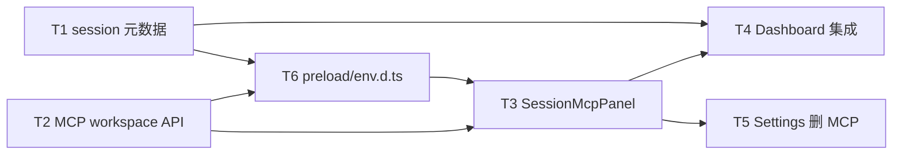

# MCP 展示迁移至 Agent 详情 - 任务分解

> **来源**：`/kb-plan`（基于 `01-proposal.md`、`02-design.md`）

## 一、执行计划

### （一）依赖图



```
T1 ──┐
T2 ──┼──→ T6 ──→ T3 ──┬──→ T4
     │                 └──→ T5
T1 ────────────────→ T4
```

- **T1** 与 **T2** 主进程改动文件无交叉，可并行。
- **T6** 须等 T1/T2 定稿 IPC 签名后再同步类型。
- **T3** 依赖 T2（workspace 级 MCP API）与 T6（Renderer 类型）；会话 props 字段语义来自 T1。
- **T4**、**T5** 均依赖 T3（UI 迁移完成后再集成/删除）；T4 另依赖 T1（Dashboard 读取 `engineType`/`workspaceDir`）。

### （二）分组调度

| 轮次 | 并行任务 | 说明 |
|------|----------|------|
| 第一轮 | T1, T2 | 后端会话元数据 + MCP workspace 上下文 API |
| 第二轮 | T6 | preload / env.d.ts 与主进程 IPC 对齐 |
| 第三轮 | T3 | SessionMcpPanel + mcp-view-strategy |
| 第四轮 | T4, T5 | Dashboard 集成；Settings 移除 MCP Tab（不同文件可并行） |

---

## 二、任务清单

<!-- 以下每条任务自包含；子 agent 执行时只读单条 T{n} + 上下文文件 -->

---

## T1: 会话列表扩展 engineType / workspaceDir

### 背景

Dashboard 须按活跃会话绑定 MCP（C4），需 IPC `agent:sessions` 返回 `engineType` 与 `workspaceDir`。现网 SDK 列表已有 `workspaceDir`，但合并列表未标 `engineType`；CC 列表未透出 `workspaceDir`（`CcSessionAgent` 字段已存在）。对应设计 U2、01 验收 2/3。

### 上下文文件

- 必读: `electron/session-dispatcher.ts` L379–390 — `getSessionAgentList` 合并逻辑
- 必读: `electron/agent-sdk.ts` L1128–1138 — `getSdkSessionList` 返回字段
- 必读: `electron/agent-claude-sdk.ts` L247–254 — `getClaudeCodeSessionList` 待补字段
- 必读: `electron/agent-cc-types.ts` L34–86 — `CcSessionAgent.workspaceDir`
- 参考: `src/renderer/pages/Dashboard.tsx` — 活跃会话行类型消费点（T4 集成，本任务仅确保 IPC 出参）

### 实现范围

- 修改: `electron/agent-claude-sdk.ts` — `getClaudeCodeSessionList()` 返回项增 `workspaceDir?: string`（取自 `CcSessionAgent.workspaceDir`）
- 修改: `electron/session-dispatcher.ts` — `getSessionAgentList()`：SDK 项加 `engineType: 'sdk'`；CC 项加 `engineType: 'claude-code'` 与 `workspaceDir`
- 不改: `preload.ts` / `env.d.ts`（留给 T6）；Dashboard UI（留给 T4）

### 接口契约

- IPC `agent:sessions` 每项新增：
  - `engineType: 'sdk' | 'claude-code'`
  - `workspaceDir?: string`（空表示 UI 回退 `config.workspaceDir`）
- 既有字段（`sessionKey`、`chatType`、`startedAt` 等）不变

### 验收标准

- [ ] `getClaudeCodeSessionList()` 返回含 `workspaceDir`（有值时非空字符串）
- [ ] `getSessionAgentList()` SDK 项 `engineType === 'sdk'`，CC 项 `engineType === 'claude-code'`
- [ ] 主进程 TypeScript 编译通过
- [ ] 覆盖 01 验收 2、3 的数据前提；CC 会话 `engineType` 不为 sdk
- [ ] 无 `02`/`03` 未要求的抽象层或未批准的新依赖

### 依赖

- 前置任务: 无
- 后续任务: T4, T6

---

## T2: MCP workspace 上下文 API（list-for-workspace / status-map / tools / login）

### 背景

MCP 展示须绑定会话工作区而非全局 `config.workspaceDir`（设计 §二 根因 1）。需新增按 workspace 合并 mcp.json 列表，并将状态探测、工具列表、OAuth 登录参数化到 `workspaceDir`。对应 U7、U8、U12、U13；保留 CRUD IPC 供 IM，Renderer 不再调用 toggle/save/delete。

### 上下文文件

- 必读: `electron/mcp-manager.ts` L87–117 — `getMcpServerList`；L190–237 — `loginMcpServer`、`getMcpServerTools`
- 必读: `electron/mcp-status-map.ts` L64–89 — `fetchMcpStatusMap` 缓存键
- 必读: `electron/mcp-sdk-loader.ts` L25+ — `mergeMcpJsonEntries`（merge 规则 SSOT）
- 必读: `electron/main.ts` L205–217 — 现有 MCP IPC handlers
- 参考: `src/renderer/pages/Settings.tsx` L174–191 — `refreshMcpServers` 调用模式（迁移参考，本任务仅后端）

### 实现范围

- 修改: `electron/mcp-manager.ts`
  - 新增 `getMcpServerListForWorkspace(workspaceDir: string): McpServerEntry[]`（global + project 合并，project 同名覆盖；规则对齐 `mergeMcpJsonEntries`）
  - `getMcpStatusMap(force?, workspaceDir?)` — 省略 `workspaceDir` 时行为与现网一致
  - `getMcpServerTools(name, workspaceDir?)`、`loginMcpServer(name, workspaceDir?)` — stdio cwd / OAuth store 绑定传入 workspace
- 修改: `electron/mcp-status-map.ts` — `fetchMcpStatusMap(force, servers, workspaceDir?)`；缓存键改为 trim 后的 `workspaceDir` 字符串（非单一 global ws）
- 修改: `electron/main.ts` — 注册 `mcp:list-for-workspace`；扩展 `mcp:status-map` / `mcp:tools` / `mcp:login` handler 接受可选 `workspaceDir`
- 不改: `mcp-sdk-loader.ts`、`cc-mcp-loader.ts` 运行时注入；`mcp:toggle`/`save`/`delete` 签名

### 接口契约

| 方法 | 变更 | 入参 | 出参 |
|------|------|------|------|
| `mcp:list-for-workspace` | **新增** | `workspaceDir: string` | `McpServerEntry[]` |
| `mcp:status-map` | 扩展 | `force?: boolean`, `workspaceDir?: string` | `Record<string, string>` |
| `mcp:tools` | 扩展 | `name: string`, `workspaceDir?: string` | 既有 tools 结构 |
| `mcp:login` | 扩展 | `name: string`, `workspaceDir?: string` | `{ ok, output }` |

省略 `workspaceDir` 时回退 `config.workspaceDir`，保证 IM/脚本兼容。

### 验收标准

- [ ] `getMcpServerListForWorkspace(ws)` 条目数与 `{ws}/.cursor/mcp.json` 合并 global 结果一致（project 覆盖 global 同名）
- [ ] 不同 `workspaceDir` 的 status 缓存独立；手动 `force=true` 可刷新
- [ ] `mcp:tools` 对 stdio MCP 使用传入 workspace 作 cwd
- [ ] `needs_login` 探测逻辑不变（`probeMcpServerStatus`）
- [ ] 覆盖 02 §八·（二）：刷新 30s TTL、工具折叠 cwd、needs_login 授权路径
- [ ] 主进程 TypeScript 编译通过
- [ ] 无 `02`/`03` 未要求的抽象层或未批准的新依赖

### 依赖

- 前置任务: 无
- 后续任务: T3, T6

---

## T3: SessionMcpPanel 组件与 mcp-view-strategy

### 背景

将 Settings MCP Tab 的**只读**展示（列表/状态/刷新/授权/工具折叠）迁移至可复用面板，按 `engineType` 差异化文案与空态；`codex` 等未支持引擎显示占位。不含 toggle/增删改 Modal（C1）。对应 U5–U13、S3、F2/F3/F4。

### 上下文文件

- 必读: `src/renderer/pages/Settings.tsx` L752–832 — MCP Tab UI（迁移源）；L174–191 — refresh/status/tools 模式
- 必读: `02-design.md` §四·（二）— `SessionMcpPanelProps` 契约
- 必读: `02-design.md` §七 — SDK/CC 展示策略表
- 参考: `electron/preload.ts` L258–265 — MCP IPC 暴露（T6 完成后对齐类型）

### 实现范围

- 新建: `src/renderer/components/SessionMcpPanel.tsx`（≤300 行，中文注释）
  - props: `sessionKey`, `workspaceDir?`, `engineType`, `fallbackWorkspaceDir`
  - `resolveEffectiveWorkspace()` — 会话 ws 优先，空则 fallback；空 ws 时 UI 标注「使用主工作区 MCP 配置」
  - 加载: `listMcpForWorkspace(ws)` → `getMcpStatusMap(false, ws)`；刷新按钮 `force=true`
  - 列表: name/source/enabled/状态；**无**增删改/toggle
  - `needs_login` → 授权按钮 → `loginMcp(name, ws)`
  - 可折叠工具列表 → `getMcpTools(name, ws)`
  - 空态文案引导编辑 `~/.cursor/mcp.json` / `{ws}/.cursor/mcp.json`
- 新建（可选，超行数时）: `src/renderer/lib/mcp-view-strategy.ts` — `getMcpViewConfig(engineType)` 返回标题/空态/占位文案；`codex` 仅占位不调用 list API
- 不改: `Dashboard.tsx`（T4）；`Settings.tsx`（T5）

### 接口契约

```typescript
interface SessionMcpPanelProps {
  sessionKey: string
  workspaceDir?: string
  engineType: 'sdk' | 'claude-code' | 'codex'
  fallbackWorkspaceDir: string
}
```

- `sdk` → 标题「Cursor SDK 内联 MCP」
- `claude-code` → 标题「Claude Agent 内联 MCP」
- `codex` → 「该引擎 MCP 查看尚未支持」，不 crash

### 验收标准

- [ ] 组件 ≤300 行；策略文件（若有）≤300 行
- [ ] SDK/CC 会话展示标题与 02 §七 一致，非简单复制同一套误导文案
- [ ] 刷新、授权、工具折叠行为与 Settings 迁移前诊断能力对齐（C2/C3）
- [ ] 无 MCP 时显示明确空态 + mcp.json 路径引导（C1/S3）
- [ ] `engineType=codex` 仅占位，不调用 list API（02 §八·（二）第 7 条）
- [ ] Renderer TypeScript 编译通过（依赖 T6 类型）
- [ ] 无 `02`/`03` 未要求的抽象层或未批准的新依赖

### 依赖

- 前置任务: T2, T6
- 后续任务: T4, T5

---

## T4: Dashboard 活跃会话集成 SessionMcpPanel

### 背景

主界面 Agent 卡片展开区须展示 MCP 区块（F2），与会话绑定（C4）；会话行应始终可展开（不限于有排队消息）。MCP 区块置于排队消息之上，信息层级清晰。对应 U3、01 验收 2/4/5/6。

### 上下文文件

- 必读: `src/renderer/pages/Dashboard.tsx` L510–567 — 活跃会话展开区
- 必读: `src/renderer/components/SessionMcpPanel.tsx` — T3 产出
- 参考: `electron/config-store.ts` — 读取 `config.workspaceDir` 作 `fallbackWorkspaceDir`

### 实现范围

- 修改: `src/renderer/pages/Dashboard.tsx`
  - 活跃会话类型对齐 T1/T6（含 `engineType`、`workspaceDir`）
  - 展开条件：有活跃会话即可展开（移除「仅有排队消息才可展开」限制）
  - 展开区布局：上方 `SessionMcpPanel`（传入 session 的 ws/engineType + fallback）；下方保留排队消息列表
  - 每条活跃会话独立 MCP 区块（多会话并行展开时各自 workspace 上下文）

### 接口契约

- 无新 IPC；消费 T1 `agent:sessions` 扩展字段与 T3 组件 props

### 验收标准

- [ ] SDK 活跃会话展开可见 MCP 区块，列表与 `{ws}` 下 mcp.json 合并一致（02 §八·（二）第 2 条）
- [ ] CC 活跃会话 MCP 标题为 Claude Agent 文案，`engineType !== 'sdk'`（第 3 条）
- [ ] 无 MCP 会话显示空态，不出现全局 Settings 时代列表（01 验收 4）
- [ ] 排队消息展示与 IM Run 主流程无退化（01 验收 6）
- [ ] TypeScript 编译通过
- [ ] 无 `02`/`03` 未要求的抽象层或未批准的新依赖

### 依赖

- 前置任务: T1, T3
- 后续任务: 无

---

## T5: Settings 移除 MCP Tab 及管理 UI

### 背景

设置页完全移除 MCP 服务器 Tab 及管理型 UI（C1）；配置改 mcp.json，空态引导在 SessionMcpPanel（S3）。须清理 state/effect/handlers/modal 避免双源真相与残留入口。对应 S2、01 验收 1。

### 上下文文件

- 必读: `src/renderer/pages/Settings.tsx` — TABS 定义、`tab === "mcp"` 区块 L752–832、关联 state（`mcpServers`、`refreshMcpServers`、CRUD Modal 等）
- 参考: `src/renderer/App.tsx` — 确认无 `onSettings("mcp")` 深链

### 实现范围

- 修改: `src/renderer/pages/Settings.tsx`
  - 删除 Tab 联合类型中的 `"mcp"` 及 TABS 条目 `{ id: "mcp", ... }`
  - 删除 MCP Tab JSX、CRUD Modal、toggle/save/delete/refresh 相关 state 与 handlers
  - 删除 Renderer 对 `toggleMcp`/`saveMcp`/`deleteMcp` 的调用（后端 IPC 保留供 IM）
- 不改: Rules/Skills/Agent 等其他 Settings Tab

### 接口契约

- Settings 不再暴露 MCP 管理 UI；IM `/mcp` 与主进程 CRUD IPC 行为不变

### 验收标准

- [ ] 设置页无 MCP Tab；搜索 `Settings.tsx` 无 `tab === "mcp"`、无 MCP CRUD 按钮（02 §八·（二）第 1 条）
- [ ] 其它 Settings Tab（Rules、Skills、Agent 等）功能无退化
- [ ] 无残留 `onSettings("mcp")` 或 dead import
- [ ] TypeScript 编译通过
- [ ] 覆盖 01 验收 1
- [ ] 无 `02`/`03` 未要求的抽象层或未批准的新依赖

### 依赖

- 前置任务: T3（只读 UI 已迁移至 SessionMcpPanel）
- 后续任务: 无

---

## T6: preload 与 env.d.ts 类型同步

### 背景

Renderer 须类型安全调用扩展后的 `agent:sessions` 与 workspace 级 MCP IPC。T1/T2 完成后同步 `preload.ts` 暴露与 `env.d.ts` 声明，避免 Dashboard/SessionMcpPanel 编译错误。

### 上下文文件

- 必读: `electron/preload.ts` — `electronAPI` 现有 MCP 与 session 方法
- 必读: `src/renderer/env.d.ts` — `ElectronAPI`、`SessionAgent` 等全局类型
- 必读: `02-design.md` §四·（一）— IPC 扩展表
- 参考: T1/T2 主进程 handler 签名（以代码为准）

### 实现范围

- 修改: `electron/preload.ts`
  - `getSessionAgents()` 返回类型增 `engineType`、`workspaceDir?`
  - 新增 `listMcpForWorkspace(workspaceDir: string)`
  - 扩展 `getMcpStatusMap(force?, workspaceDir?)`、`getMcpTools(name, workspaceDir?)`、`loginMcp(name, workspaceDir?)`
- 修改: `src/renderer/env.d.ts` — 与 preload 保持一致的类型声明
- 不改: 业务组件逻辑（T3/T4 消费本任务类型）

### 接口契约

- `ElectronAPI` 与 `preload.ts` 导出一一对应
- `engineType: 'sdk' | 'claude-code'`；`listMcpForWorkspace` 返回 `McpServerEntry[]`

### 验收标准

- [ ] `env.d.ts` 含 `engineType`、`workspaceDir?` 及全部 MCP workspace 参数
- [ ] preload 与 env.d.ts 签名一致
- [ ] Renderer + 主进程 TypeScript 编译通过
- [ ] 无 `02`/`03` 未要求的抽象层或未批准的新依赖

### 依赖

- 前置任务: T1, T2
- 后续任务: T3
