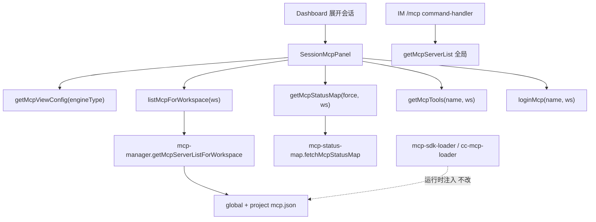

# MCP 展示迁移至 Agent 详情 - 代码评审报告

## 1、审查范围

- **变更类型**: apply 产出的未提交变更（`git diff` 覆盖 manifest 登记文件）
- **评审等级**: focused-review（Renderer + Electron IPC 局部重构；无 proto/DB/资金路径）
- **涉及文件**: 11 个（新建 2、修改 9）
  - 新建: `src/renderer/components/SessionMcpPanel.tsx`、`src/renderer/lib/mcp-view-strategy.ts`
  - 修改: `electron/agent-claude-sdk.ts`、`electron/session-dispatcher.ts`、`electron/mcp-manager.ts`、`electron/mcp-status-map.ts`、`electron/main.ts`、`electron/preload.ts`、`src/renderer/env.d.ts`、`src/renderer/pages/Dashboard.tsx`、`src/renderer/pages/Settings.tsx`
- **设计文档**: `01-proposal.md`（PRD）、`02-design.md`（对照基准）、`03-tasks.md` T1–T6
- **CodeGraph**: 未就绪（`.codegraph/` 缺失）；调用链与 merge 规则以下文 diff + grep 核实

## 2、严重（必须处理）

无

## 3、警告（建议处理）

无（评分 ≥75 的问题未发现）

**Ponytail 精简轴（focused-review）**：

| 标签 | 位置 | 说明 |
|------|------|------|
| — | 整体 | **Lean already. Ship.** `mcp-view-strategy.ts` 46 行策略表合理；`SessionMcpPanel` 210 行；无未批准新依赖 |
| `shrink:` | `SessionMcpPanel.tsx` | `formatMcpUiError` 与旧 Settings 逻辑略异但必要，不宜再拆 |
| `yagni:` | `preload.ts` | 仍暴露 `saveMcp`/`toggleMcp`/`deleteMcp` — 设计刻意保留供 IM，非 bloat |

**评分 50–74、不写入 manifest open 的观察项**：

1. **`agent-claude-sdk.ts` 夹带 CC watchdog 改动**（评分 65）
   - 位置: `electron/agent-claude-sdk.ts` L30–L35、L261–L281
   - 说明: T1 仅要求 `getClaudeCodeSessionList` 透出 `workspaceDir`；同文件另含 `NEVER_CANCEL_ON_DURATION`、`PLATFORM_RUN_LIMIT_MS`、`resolveCcSafeTimeoutMs` 等，属并行变更「CC 路径 watchdog 超时」范畴。MCP 功能不受影响，但 `/kb-test` 回归 CC 会话时需与 MCP 验收分项记录，避免归因混淆。

2. **Settings `initialTab="mcp"` 深链无兜底**（评分 55）
   - 位置: `src/renderer/pages/Settings.tsx` L69–L73
   - 说明: Tab 联合类型已移除 `"mcp"`，若外部仍传入 `initialTab="mcp"` 会选中不存在的内容区（空白）。当前代码库无 `onSettings("mcp")` 引用；极低概率，可在 archive 前加一行 fallback 至 `"general"`（非本变更必做）。

3. **F3 引擎差异主要为标题**（评分 50）
   - 位置: `src/renderer/lib/mcp-view-strategy.ts`
   - 说明: SDK 与 Claude 列表 UI、空态文案结构相同，仅 `title` 不同。与 02 §七「Claude 路径字段一致」吻合，满足 01 验收 3 最低口径；若产品期望更显著交互差异，属后续迭代而非本评审阻断项。

## 4、设计偏差

1. **CC watchdog 改动混入 MCP 变更包**
   - 设计预期: T1 仅扩展 `getClaudeCodeSessionList` / `getSessionAgentList` 元数据（02 §六 步骤 1）
   - 实际实现: `agent-claude-sdk.ts` 同步修改 watchdog 绝对超时与 `neverCancelOnDuration`
   - 影响: **可接受但需知悉** — 与 MCP 展示无功能耦合；台架与 commit 拆分建议由主 Agent 在 archive 前评估

2. **OAuth 授权按钮展示条件收紧**
   - 设计预期: U12 迁移 Settings 授权按钮，U11 不改探测逻辑
   - 实际实现: `SessionMcpPanel` 仅在 `rawStatus === "needs_login"` 时显示授权（Settings 为 `enabled && !authenticated` 更宽）
   - 影响: **正向偏差** — 减少误点；与 status 探测一致，符合 F4/F5

3. **其余落点与 02 一致**
   - `getMcpServerListForWorkspace` merge 规则与 `mcp-sdk-loader.mergeMcpJsonEntries` / `cc-mcp-loader` 同源（global + project 覆盖）
   - per-workspace 30s status 缓存、`mcp:list-for-workspace` IPC、Dashboard 始终可展开、Settings 完全移除 MCP Tab — 均符合 C1–C4 拍板

## 5、验收标准检查

### 01-proposal（PRD F1–F5 / 验收 1–7）

| 编号 | PRD 要点 | 代码层状态 |
|------|----------|------------|
| F1 / 验收 1 | 设置页无 MCP Tab 及管理 UI | ✅ `Settings.tsx` 无 `"mcp"` Tab、无 CRUD/toggle/refresh handlers |
| F2 / 验收 2 | Dashboard 活跃会话详情展示 MCP | ✅ `SessionMcpPanel` 集成于展开区，绑定 `workspaceDir` + `engineType` |
| F3 / 验收 3 | 按引擎差异化策略 | ✅ `mcp-view-strategy.ts` 标题分 SDK/CC；`codex` 占位不调用 list API |
| F4 | 可刷新、随会话更新 | ✅ 刷新按钮 `getMcpStatusMap(true, ws)`；`sessionKey`/`effectiveWs` 变化触发 reload |
| F5 | 诊断信息不丢失；配置改 mcp.json | ✅ 列表/状态/工具/授权迁移；空态引导 mcp.json 路径 |
| 验收 4 | 无 MCP 空态，非全局误导 | ✅ `servers.length === 0` 时 `emptyHint`，不用 `getMcpServers()` 全局列表 |
| 验收 5 | 与会话实际 MCP 一致 | ⏳ 需台架：workspace 参数化已实现，运行时一致性待 `/kb-test` |
| 验收 6 | IM Run / 排队无退化 | ✅ Dashboard 排队区块保留；Daemon/IM 路径未改 |
| 验收 7 | Codex 扩展占位 | ✅ `engineType` 默认分支 `supported: false` |

### 03-tasks 任务验收（结构）

| 任务 | 关键验收 | 状态 |
|------|---------|------|
| T1 | CC 列表含 `workspaceDir`；合并列表含 `engineType` | ✅ |
| T2 | `getMcpServerListForWorkspace`；status/tools/login workspace 参数；`mcp:list-for-workspace` | ✅ |
| T3 | `SessionMcpPanel` ≤300 行；策略文件；只读无 CRUD | ✅ 210 + 46 行 |
| T4 | 会话可展开；MCP 在上、排队在下；多会话独立面板 | ✅ |
| T5 | Settings 无 MCP Tab 残留 | ✅ grep 无 `tab === "mcp"` |
| T6 | preload / env.d.ts 与 IPC 一致 | ✅ |

### 02 §八·（二）工程补充验收项

| 项 | 状态 |
|----|------|
| Settings 无 MCP Tab / CRUD | ✅ 代码 |
| SDK 会话 MCP 与 ws merge 一致 | ⏳ 台架 |
| CC 标题 Claude Agent 文案 | ✅ 代码 |
| 刷新 30s TTL / 非 force 不重复全量探测 | ✅ `mcp-status-map.ts` per-ws 缓存 |
| `needs_login` 授权 + `mcp:login` | ✅ 代码 |
| 工具折叠 `mcp:tools` + stdio cwd | ✅ 传 `effectiveWs` |
| `codex` 仅占位 | ✅ |
| IM `/mcp`、Run 内 MCP 无回归 | ⏳ 台架 |

**编译**: 根目录 `npx tsc --noEmit` 通过。

## 6、调用链与回归风险

| 回归点 | 风险 | 说明 |
|--------|------|------|
| Settings 其它 Tab | 低 | 仅删 MCP 块；Rules/Skills/Agent 未动 |
| IM MCP CRUD | 低 | `mcp:toggle/save/delete` handler 保留 |
| 多会话并行展开 | 中 | 每 ws 独立探测；30s 缓存缓释；多 ws 同时 force 刷新仍可能短时 CPU  spike |
| CC watchdog 夹带改动 | 中 | 与 MCP 无关；台架 CC 路径须单独回归 |
| 全局 workspace 变更 | 低 | 已展开面板不自动 reload；用户可点刷新 |
| Daemon MCP HTTP | 低 | 未改 `server-workflow.ts` |

## 7、遗留债务

- 运行时验收（01 验收 2/3/5、§八·（二）台架项）留待 `/kb-test`。
- `knowledge/工程平台/Electron桌面应用/` 知识文件未在本变更更新（02 §十 计划 archive 时处理）。
- `Settings.tsx` 仍 1137 行 — 02 §八 已声明本变更不强制拆分。

## 8、修复任务建议

| 问题 ID | 建议动作 | 关联任务 |
|---------|----------|----------|
| — | 无 open 阻断项 | — |

若 `/kb-test` 发现多工作区会话 MCP 列表与 Run 实际注入不一致，建议 `T-FIX-01`：核对 `getMcpServerListForWorkspace` 与 `cc-mcp-loader`/`mcp-sdk-loader` 过滤规则（如 disabled 条目）。

## 9、结论

**通过**，可进入 `/kb-test` 执行台架验收；台架通过后运行 `/kb-archive`。

实现与 `02-design.md` U2–U13/S2/S3、`03-tasks.md` T1–T6 代码结构一致；PRD F1–F5 在代码层已落点。无评分 ≥75 的阻断问题；CC watchdog 夹带改动已记录为观察项，不阻塞 MCP 功能验收。
