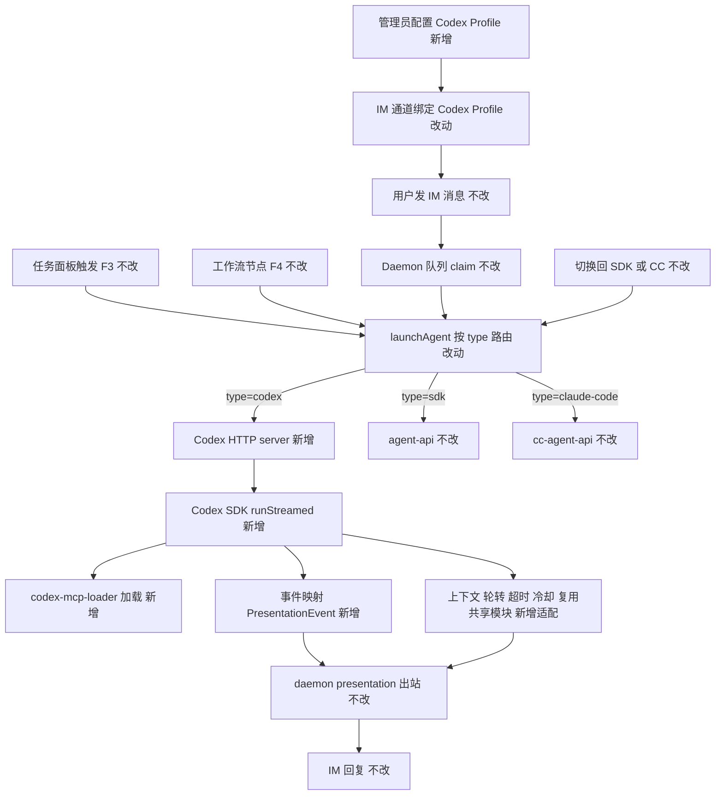
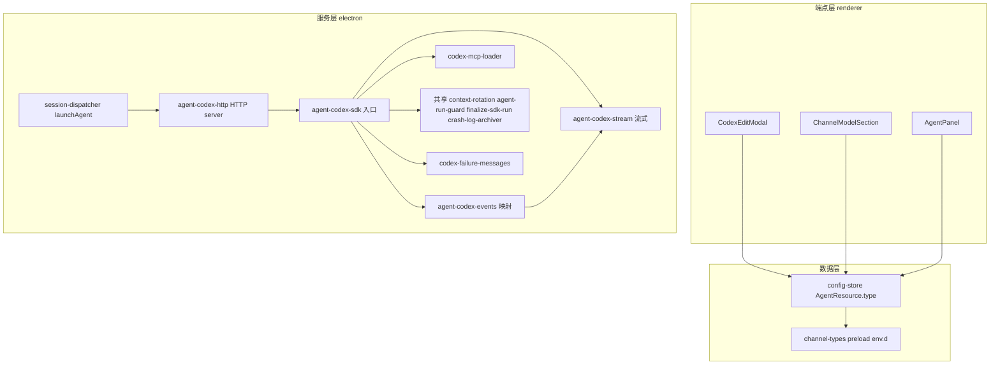

# Codex SDK 执行引擎接入 - 实现设计

> **业务 PRD**：见同目录 `01-proposal.md`（10 条验收标准以 01 为准）
> **技术口径**：用户已澄清 Codex SDK API 形态、鉴权、MCP、HTTP 落点、与 OpenCodeSDK 变更冲突决策，设计稿无「待确认」。

## 一、业务流程与改动范围

> 业务口径以 `01-proposal.md` §功能需求 F1~F6 为准；下图以 F2 IM 消息路径为主流程，含 F1 配置前置、F3/F4 触发分支、F5 生命周期、F6 通道绑定。

### （一）业务流程图



**图例**：`不改` 行为与现网一致；`改动` 需改代码/配置；`新增` 新节点或新分支；`删除` 移除路径（本变更无删除）。

### （二）流程步骤与改动对照

| 步骤 ID | 业务含义 | 改动 | 落点（模块/文件） | 01 验收关联 |
|---------|----------|------|-------------------|-------------|
| S1 | 管理员配置 Codex Profile（F1） | 新增 | `src/renderer/components/AgentResourceModals.tsx`（`CodexEditModal`）、`electron/config-store.ts`（`newCodexResourceId`） | 01 §F1 验收 7、8 |
| S2 | IM 通道绑定 Codex Profile（F6） | 改动 | `src/renderer/components/ChannelModelSection.tsx`（`RESOURCE_GROUP_LABELS`/`groupedTypes`/分支）、`AgentPanel.tsx` | 01 §F6 验收 9 |
| S3 | 资源模型扩 `codex` 类型（F1） | 改动 | `src/shared/channel-types.ts`、`electron/preload.ts`、`src/renderer/env.d.ts`（含 `engineType`） | 01 §F1 验收 7 |
| S4 | 配置兜底加 codex（F1） | 改动 | `electron/config-store.ts`（`findFirstRunnableResource` 加 codex 兜底） | 01 §F1 |
| S5 | 用户发 IM 消息（F2） | 不改 | daemon 队列 | 01 §F2 验收 1 |
| S6 | Daemon claim/转发（F2） | 不改 | daemon orchestrator | 01 §F2 |
| S7 | `launchAgent` 按 type 路由（F2/F3/F4） | 改动 | `electron/session-dispatcher.ts`（`launchAgent` 加 `codex` 分支） | 01 §F2/F3/F4 验收 1、2、3 |
| S8 | Codex HTTP server（F2） | 新增 | `electron/agent-codex-http.ts`、端口文件 `codex-agent-api-port.json` | 01 §F2 |
| S9 | Codex SDK 执行（F2/F5） | 新增 | `electron/agent-codex-sdk.ts` + `agent-codex-{types,utils,stream,events}.ts` | 01 §F2 验收 1、5 |
| S10 | 流式事件映射 PresentationEvent（F2） | 新增 | `electron/agent-codex-events.ts`、`agent-codex-stream.ts` | 01 §F2 验收 5 |
| S11 | 上下文/轮转/超时/冷却（F5） | 新增适配 | 复用 `context-rotation-lite.ts`/`agent-run-guard.ts`/`finalize-sdk-run.ts`/`crash-log-archiver.ts`；新建 `codex-failure-messages.ts` | 01 §F5 验收 6、10 |
| S12 | MCP 工具加载（F2 对等） | 新增 | `electron/codex-mcp-loader.ts` | 01 §F2 |
| S13 | 任务面板触发（F3） | 不改 | `launchIndependentAgent` → `launchAgent` | 01 §F3 验收 2 |
| S14 | 工作流节点执行（F4） | 不改 | `electron/workflow-runner.ts` `launchWorkflowAgent` → `launchAgent` | 01 §F4 验收 3 |
| S15 | daemon presentation 出站（F2） | 不改 | daemon `/api/presentation-event`、`/api/stream-text` | 01 §F2 验收 4 |
| S16 | IM 回复（F2） | 不改 | daemon `/api/send-text` | 01 §F2 验收 1 |
| S17 | 切换回 SDK/CC（F1） | 不改 | 现有 sdk/claude-code 路径 | 01 §F1 验收 4 |

### （三）改动汇总

- **改动**：`src/shared/channel-types.ts`（`AgentResource.type` 联合扩 `"codex"`）、`electron/preload.ts`与`src/renderer/env.d.ts`（type 联合 + `engineType` 联合同步）、`electron/config-store.ts`（`newCodexResourceId` + `findFirstRunnableResource` codex 兜底）、`electron/session-dispatcher.ts`（`launchAgent` 加 codex 分支）、`src/renderer/components/ChannelModelSection.tsx`（`RESOURCE_GROUP_LABELS.codex`/`groupedTypes`/`isCodexProfile` 分支）、`src/renderer/components/AgentResourceModals.tsx`（新增 `CodexEditModal`）、`src/renderer/components/AgentPanel.tsx`（Codex 资源管理）。
- **新增**：`electron/agent-codex-sdk.ts`（入口）、`agent-codex-types.ts`、`agent-codex-utils.ts`、`agent-codex-stream.ts`、`agent-codex-events.ts`、`agent-codex-http.ts`、`codex-mcp-loader.ts`、`codex-failure-messages.ts`；运行期产物 `userData/codex-agent-api-port.json`。
- **不改（显式列出）**：daemon 队列/presentation 出站、`src/workflow-engine.ts`与`electron/workflow-runner.ts`、IM 通道连接层（飞书/微信 WebSocket）、`electron/agent-sdk.ts`（Cursor SDK）、`electron/agent-claude-sdk.ts` 及 `agent-cc-*`（Claude Code）、共享模块 `context-usage.ts`/`context-rotation-lite.ts`/`agent-run-guard.ts`/`finalize-sdk-run.ts`/`crash-log-archiver.ts`（复用不改动）。

## 二、整体思路

**根因**：cursor-claw 当前 Agent 执行层为 Cursor SDK + Claude Code SDK 双引擎，路由层 `launchAgent` 按 `resource.type` 加分支分发。Codex SDK 与 Claude Code SDK 同为 spawn CLI 子进程、经 stdin/stdout 交换 JSONL 事件的模式，可直接复用 CC 的「独立 HTTP server + 拆分文件群」接入模板。

**方案要点**：

1. 沿用现有「按 `resource.type` 加分支」模式，在 `session-dispatcher.launchAgent` 加 `resource.type === "codex"` 分支，路由到新建的 Codex HTTP server（**不走 Daemon 转发**，与 CC 路径对等）。
2. 仿 `agent-cc-*` 拆分模式新建 `agent-codex-*` 文件群（每文件 <300 行），将事件映射、流式缓冲、HTTP server、MCP 加载、失败归因各自独立成文件，入口 `agent-codex-sdk.ts` 只做生命周期编排。
3. Codex SDK 流式事件（`thread.started`/`turn.started`/`item.started`/`item.updated`/`item.completed`/`turn.completed`/`turn.failed`/`thread.error`）经 `agent-codex-events.ts` 映射到现有 `PresentationEvent`（`tool`/`thinking`/`assistant`），出站复用 daemon presentation，IM 回复无感知差异。
4. 会话续接用 `codex.resumeThread(threadId)`，thread 持久化在 `~/.codex/sessions`，直接对应现有 `ccSessionId` 机制（Codex 侧字段名 `codexSessionId`=thread_id）。
5. F1/F5/F6 与 CC 路径对等：Profile 字段（apiKey、model、可选 baseUrl 透传到 CLI 配置）、`findFirstRunnableResource` 加 codex 兜底、复用 `acquireRunGuard`/`maybeRotateContext`/`PLATFORM_RUN_LIMIT_MS`/`archiveAgentFailureLogs` 共享生命周期模块。

**与 01 的追溯**：F1（S1/S3/S4）→ 验收 7、8；F2（S5~S10/S15/S16）→ 验收 1、5；F3（S13）→ 验收 2；F4（S14）→ 验收 3；F5（S11）→ 验收 6、10；F6（S2）→ 验收 9；切换回退（S17）→ 验收 4。

**最小方案三问**：

1. **能否复用现有模块/符号而非新建抽象层？** 是。复用 CC 的拆分模板与共享生命周期模块（`acquireRunGuard`/`maybeRotateContext`/`finalize-sdk-run`/`crash-log-archiver`），不新建抽象层。
2. **拟新增抽象是否被 01 验收或 PRD 明确要求？** 否。**不引入** `EngineAdapter` 抽象层——用户已决策「Codex 独立加分支不改抽象层」（与 Claude Code 接入对等）。YAGNI 依据：CC 接入即按 type 加分支，引入抽象层需回改 SDK+CC 两路径，收益不抵成本；并列进行中的 `20260630105159-OpenCodeSDK执行引擎接入` 后接并承担 rebase 成本，本变更不预建通用层。
3. **能否合并到已有文件而非预建通用层？** Codex 适配器必须新建 `agent-codex-*` 文件群。理由：Codex SDK 事件类型与 CC 不同，需独立事件映射；单文件聚合会超 300 行违反工作区硬规则，故按 `agent-cc-*` 拆分模式分散到 types/utils/stream/events/http 五个文件 + 入口 + MCP loader + failure-messages，每文件 <300 行。

## 三、分层设计



- **端点层（UI）**：`CodexEditModal`（Profile 新建/编辑/删除）、`ChannelModelSection`（`RESOURCE_GROUP_LABELS.codex`/`groupedTypes` 加 codex/`isCodexProfile` 分支，Codex 模型由 Profile 管理，与 CC 对等不拉列表）、`AgentPanel`（Codex 资源列表管理）。
- **服务层（electron 引擎 + HTTP）**：`session-dispatcher.launchAgent` 加 codex 分支；`agent-codex-http.ts` 独立 HTTP server（`POST /api/codex/agent/launch|dispatch`）；`agent-codex-sdk.ts` 入口编排生命周期；`agent-codex-events.ts` 事件映射；`agent-codex-stream.ts` 流式缓冲/节流；`codex-mcp-loader.ts` MCP 加载；`codex-failure-messages.ts` 失败归因；复用 `context-rotation-lite`/`agent-run-guard`/`finalize-sdk-run`/`crash-log-archiver`。
- **数据层（config-store）**：`newCodexResourceId`、`findFirstRunnableResource` 加 codex 兜底；`AgentResource.type` 扩 `"codex"`（三处同步 + `engineType` 两处同步）。

## 四、接口设计

### Codex SDK API（已查文档确认，设计稿直接落定）

- 构造：`new Codex({ apiKey })`，apiKey 为 `sk-...`/`sk-proj-...`，亦支持环境变量 `OPENAI_API_KEY`。SDK 构造器**不直接暴露 baseUrl**，自定义 baseUrl 经 CLI 配置文件/环境变量透传（Profile 层可选透传到 CLI 配置）。
- 启动会话：`codex.startThread()` → `Thread`；续接：`codex.resumeThread(threadId)`，thread 持久化在 `~/.codex/sessions`。
- 执行：`thread.run(prompt)`（缓冲）或 `thread.runStreamed(prompt)`（流式，返回 `{ events }` async generator）。

### 流式事件枚举（来自 `sdk/typescript/src/events.ts`）

| 事件 | 载荷 | 映射到 PresentationEvent |
|------|------|--------------------------|
| `thread.started` | `thread_id` | 写入 `codexSessionId`，不产出展示事件 |
| `turn.started` | — | 标记 turn 开始，置 `runStartedAt` |
| `item.started` | `item: ThreadItem` | 按子类型预建展示卡（thinking/tool） |
| `item.updated` | `item: ThreadItem`（流式文本增量） | `assistant_message` → assistant 流式增量；`thinking` → thinking 增量 |
| `item.completed` | `item: ThreadItem` | `command_execution` → tool 完成（含 exit_code）；`assistant_message` → assistant final |
| `turn.completed` | `usage` | run 完成，写 `contextUsage`，触发 footer |
| `turn.failed` | `error` | 失败归因，走 `codex-failure-messages` |
| `thread.error` | `error` | 线程级错误，走失败归因 |

**ThreadItem 子类型**：`assistant_message`（text）→ assistant/thinking；`command_execution`（command、exit_code）→ tool；file change notification → UI 日志（不产出展示事件）。

### 内部接口（electron）

- `launchCodexAgent(opts: CodexLaunchOptions): Promise<{ ok: boolean; error?: string }>`：首条启动，`startThread` + `runStreamed`，注册到 `CodexSessionAgent`。
- `dispatchToCodexAgent(sessionKey: string, taskText: string, messageIds?: string[]): Promise<{ ok, error? }>`：连发续接，`resumeThread(codexSessionId)` + `runStreamed`。
- `registerCodexLaunchHandler(fn)` / `registerCodexDispatchHandler(fn)`：依赖注入，避免与 `agent-codex-sdk.ts` 循环导入（仿 `registerCcLaunchHandler`/`registerCcDispatchHandler`）。
- `ensureCodexHttpServer(): void` / `getCodexAgentApiPort(): number`：独立 HTTP server，端口写 `userData/codex-agent-api-port.json`。

### HTTP 路由

- `POST /api/codex/agent/launch`：body 同 `launchBody`（session_key/task_text/chat_type/.../message_ids），调用 `launchCodexAgentFromHttp` → `launchCodexAgent`。
- `POST /api/codex/agent/dispatch`：body `{ session_key, task_text, message_ids? }`，调用 `dispatchToCodexAgent`。
- 错误码：400（参数缺失/启动失败）、405（非 POST）、404（路径未匹配）、500（handler 未注册）。

### 关键入参/出参

`CodexLaunchOptions`：`sessionKey`、`chatType`、`meta?`、`workspaceDir`、`useMainWorkspace?`、`senderOpenId?`、`chatName?`、`taskMessage?`、`apiKey`、`model?`、`baseUrl?`。出参统一 `{ ok: boolean; error?: string }`。

## 五、数据结构

### `AgentResource.type` 扩展（三处同步 + engineType 两处同步）

```7:7:src/shared/channel-types.ts
  type: "sdk" | "claude-code";
```

扩展为 `type: "sdk" | "claude-code" | "codex"`；`id` 前缀新增 `"codex_<hex>"`。同步点：

```6:6:electron/preload.ts
  type: "cli" | "sdk" | "claude-code"
```

```13:13:src/renderer/env.d.ts
  type: "sdk" | "claude-code"
```

`preload.ts:232` 与 `env.d.ts:191` 的 `engineType: "sdk" | "claude-code"` 同步扩 `"codex"`。

### Codex Profile 字段（`AgentResource` 内）

- `apiKey: string`（必填，`sk-...`/`sk-proj-...`）
- `model?: string`（空 = 使用 `CODEX_MODEL_LIST` 默认或 SDK 默认）
- `baseUrl?: string`（可选，透传到 CLI 配置；SDK 构造器不暴露）
- `name: string`、`id: "codex_<hex>"`

### `CodexSessionAgent`（新建，仿 `CcSessionAgent`）

```34:91:electron/agent-cc-types.ts
export interface CcSessionAgent {
  sessionKey: string
  /** 当前活跃的 SDK Query（null = idle resident） */
  activeQuery: Query | null
  /** SDK init/result 写入的 session_id，供 resume 续接上下文 */
  ccSessionId: string | null
```

Codex 对等字段：`sessionKey`、`activeThread: Thread | null`（替代 `activeQuery`）、`codexSessionId: string | null`（= thread_id）、`startedAt`/`lastActivityAt`/`chatType`/`workspaceDir`/`senderOpenId`/`chatName`/`apiKey`/`baseUrl?`/`model?`/`meta?`/`useMainWorkspace?`/`abortController`/`f41Stream`/`streamBuffer`/`outboundMessageId?`/`toolPresentationOutboundIds?`/`streamId?`/`streamLastPostAt?`/`streamPostTimer?`/`streamPostChain?`/`errorNotified?`/`lastStatus?`/`lastTool?`/`residentMode`/`pendingDispatch`/`runStartedAt?`/`seenProcessEvent?`/`presentationDeferStream?`/`thinkingOpen?`/`contextUsage`/`contextUsagePeakTokens?`/`contextUsageFromRunTotal?`/`contextUsageFinalized?`/`contextLimitTokens?`/`modelId?`/`compressionNotified?`/`inboundMessageIds?`/`runFinalizing?`/`failureArchiveDone?`/`runGuardToken?`/`watchdogState`/`watchdogStateAt`/`watchdogTimedOut?`/`lastMcpServersSnapshot?`/`logAgg`。

### `CODEX_MODEL_LIST`（硬编码，仿 `CLAUDE_CODE_MODEL_LIST`）

```25:31:electron/agent-cc-types.ts
export const CLAUDE_CODE_MODEL_LIST: Array<{ id: string; label: string }> = [
  { id: "claude-opus-4-8", label: "Claude Opus 4.8" },
```

新建 `CODEX_MODEL_LIST`：以文档示例为准（如 `gpt-5.4`、`gpt-5.5` 等）；Profile 支持可选自定义模型名覆盖硬编码清单；不做运行时拉取。

## 六、实现步骤

> 每步回溯「一·（二）」步骤 ID。

1. **资源模型扩 codex 类型**：`channel-types.ts:7` 扩 `"codex"`；`preload.ts:6`、`env.d.ts:13` 同步；`preload.ts:232`/`env.d.ts:191` `engineType` 扩 `"codex"`。回溯 S3。
2. **config-store 兜底**：加 `newCodexResourceId`（`codex_<hex>`）；`findFirstRunnableResource` 链式加 codex 兜底（sdk → claude-code → codex）。回溯 S4。
3. **新建 `agent-codex-types.ts`**：定义 `CodexSessionAgent`、`CodexLaunchOptions`、`CODEX_MODEL_LIST`、Codex 事件/ThreadItem 类型别名。回溯 S9。
4. **新建 `agent-codex-http.ts`**：`ensureCodexHttpServer`/`getCodexAgentApiPort`/`registerCodexLaunchHandler`/`registerCodexDispatchHandler`/`launchCodexAgentFromHttp`；端口文件 `codex-agent-api-port.json`；路由 `POST /api/codex/agent/launch|dispatch`。回溯 S8。
5. **新建 `codex-mcp-loader.ts`**：读 Codex CLI 配置（`~/.codex` + 项目级 MCP 配置），仿 `cc-mcp-loader.ts` 的 `readClaudeJsonMcpServers`/`mergeMcpJsonEntries`/`appendInlineMcpToCcOptions`。回溯 S12。
6. **新建 `agent-codex-events.ts`**：Codex 事件 → `PresentationEvent` 映射（见 §四事件枚举表）。回溯 S10。
7. **新建 `agent-codex-stream.ts`**：流式增量缓冲/节流/串行链，仿 `agent-cc-stream.ts`。回溯 S10。
8. **新建 `agent-codex-utils.ts`**：端口/路径/凭证脱敏等工具。回溯 S9。
9. **新建 `codex-failure-messages.ts`**：失败归因（timeout → context_exhausted → session_abnormal → safe_message → fallback_actionable）与用户文案，仿 `sdk-failure-messages.ts`。回溯 S11。
10. **新建 `agent-codex-sdk.ts` 入口**：`launchCodexAgent`/`dispatchToCodexAgent`，复用 `acquireRunGuard`/`watchRunGuard`/`maybeRotateContext`/`PLATFORM_RUN_LIMIT_MS`/`archiveAgentFailureLogs`；`thread.started` 写 `codexSessionId`，`turn.completed` 写 `contextUsage`。回溯 S9、S11。
11. **`session-dispatcher.launchAgent` 加 codex 分支**：`resource.type === "codex"` → `getCodexAgentApiPort()` + `POST /api/codex/agent/launch`（不走 Daemon）；行 255 类型校验放行 codex。回溯 S7。
12. **应用 init 注册**：`ensureCodexHttpServer()` + `registerCodexLaunchHandler(launchCodexAgent)` + `registerCodexDispatchHandler(dispatchToCodexAgent)`（仿 `initSessionDispatcher` 中 CC 注册）。回溯 S8。
13. **UI**：`CodexEditModal`（仿 `CcEditModal`）；`RESOURCE_GROUP_LABELS.codex = "Codex Profile"`；`groupedTypes` 加 `"codex"`；`isCodexProfile` 分支（Codex 模型由 Profile 管理，与 CC 对等不拉列表）；`AgentPanel` 加 Codex 资源管理。回溯 S1、S2。

## 七、参考实现

CodeGraph 命中关键符号与路径（已复核）：

| 符号 | 路径:行 | 用途 |
|------|---------|------|
| `launchAgent` | `electron/session-dispatcher.ts:249` | 路由层，行 307 sdk 分支、行 316 cc 分支，Codex 加并行分支 |
| `ensureClaudeCodeHttpServer`/`getCcAgentApiPort` | `electron/agent-cc-http.ts:242`/`:288` | HTTP server 模板，端口文件 `cc-agent-api-port.json`（行 122） |
| `registerCcLaunchHandler`/`registerCcDispatchHandler` | `electron/agent-cc-http.ts:28`/`:38` | handler 依赖注入模板 |
| `launchCcAgentFromHttp` | `electron/agent-cc-http.ts:156` | HTTP body 解析模板 |
| `CcSessionAgent` | `electron/agent-cc-types.ts:34` | 会话状态模板，Codex 仿此建 `CodexSessionAgent` |
| `CLAUDE_CODE_MODEL_LIST` | `electron/agent-cc-types.ts:25` | 硬编码模型清单模板，仿此建 `CODEX_MODEL_LIST` |
| `ClaudeCodeLaunchOptions` | `electron/agent-cc-types.ts:10` | LaunchOptions 模板，含 apiKey/baseUrl/model |
| `readClaudeJsonMcpServers`/`mergeMcpJsonEntries`/`appendInlineMcpToCcOptions` | `electron/cc-mcp-loader.ts:40`/`:66`/`:155` | MCP 加载模板，仿此建 `codex-mcp-loader.ts` |
| `findFirstRunnableResource`/`newSdkResourceId`/`newClaudeCodeResourceId` | `electron/config-store.ts:136`/`:157`/`:161` | 配置兜底模板 |
| `AgentResource` | `src/shared/channel-types.ts:5` | 资源模型 SSOT |
| `maybeRotateContext` | `electron/context-rotation-lite.ts:33` | 上下文轮转，复用 |
| `acquireRunGuard`/`watchRunGuard` | `electron/agent-run-guard.ts:29`/`:60` | Run 互斥/超时，复用 |
| `PLATFORM_RUN_LIMIT_MS` | `electron/finalize-sdk-run.ts:13` | 平台长时阈值 7min，复用 |
| `formatUserSdkFailureMessage` | `electron/sdk-failure-messages.ts:101` | 失败归因模板，仿此建 `codex-failure-messages.ts` |
| `archiveAgentFailureLogs` | `electron/crash-log-archiver.ts:110` | 崩溃归档，复用 |
| `launchWorkflowAgent` | `electron/session-dispatcher.ts`（`workflow-runner.ts:7` import） | F4 汇聚点，不感知引擎，不改 |

### 仿 `agent-cc-*` 拆分的新建文件清单（每文件 <300 行）

| 新建文件 | 仿自 | 主要职责 |
|----------|------|----------|
| `electron/agent-codex-types.ts` | `agent-cc-types.ts` | `CodexSessionAgent`/`CodexLaunchOptions`/`CODEX_MODEL_LIST`/事件类型 |
| `electron/agent-codex-http.ts` | `agent-cc-http.ts` | HTTP server + 端口文件 + handler 注册 + `launchCodexAgentFromHttp` |
| `electron/agent-codex-events.ts` | `agent-cc-events.ts` | Codex 事件 → `PresentationEvent` 映射 |
| `electron/agent-codex-stream.ts` | `agent-cc-stream.ts` | 流式增量缓冲/节流/串行链 |
| `electron/agent-codex-utils.ts` | `agent-cc-utils.ts` | 端口/路径/凭证脱敏工具 |
| `electron/agent-codex-sdk.ts` | `agent-claude-sdk.ts`（入口） | `launchCodexAgent`/`dispatchToCodexAgent`/生命周期编排，复杂逻辑下沉到 events/stream/utils，确保 <300 行 |
| `electron/codex-mcp-loader.ts` | `cc-mcp-loader.ts` | 读 `~/.codex` + 项目级 MCP 配置 |
| `electron/codex-failure-messages.ts` | `sdk-failure-messages.ts` | 失败归因与用户文案 |

### UI 落点

- `src/renderer/components/AgentResourceModals.tsx:6` `SdkEditModal`、`:57` `CcEditModal` → 新增 `CodexEditModal`。
- `src/renderer/components/ChannelModelSection.tsx:19` `RESOURCE_GROUP_LABELS` → 加 `codex: "Codex Profile"`；`:97` `groupedTypes` → 加 `"codex"`；`:40` `isCcProfile` 旁加 `isCodexProfile` 分支。
- `src/renderer/components/AgentPanel.tsx` → Codex 资源列表管理（新建/编辑/删除）。

## 八、技术影响

### （一）影响范围

- **涉及模块**：electron 主进程（路由层 + Codex HTTP server + Codex 引擎 + MCP loader + 失败归因）、renderer（配置 UI）、shared 类型（资源模型）。
- **接口/proto 变更**：新增 HTTP 路由 `POST /api/codex/agent/launch|dispatch`（Electron 直起独立 server，不走 Daemon）；`AgentResource.type` 联合扩展 `"codex"`；`engineType` 联合扩展 `"codex"`。
- **数据变更**：`config-store` 加 `newCodexResourceId`、`findFirstRunnableResource` 加 codex 兜底；Codex Profile 持久化进 `agentResources`；运行期产物 `userData/codex-agent-api-port.json`。
- **风险**：① Codex CLI 二进制未安装/不可执行导致 spawn 失败；② `OPENAI_API_KEY` 凭证泄露进日志/崩溃归档；③ 与并列进行中的 `20260630105159-OpenCodeSDK执行引擎接入` 落点冲突（`AgentResource.type` 三处同步、`launchAgent` 分支、`RESOURCE_GROUP_LABELS`/`groupedTypes`、`findFirstRunnableResource` 兜底）。

### （二）工程补充验收项

- [ ] **OpenCodeSDK 变更（`20260630105159`）后续需 rebase 本变更落点**：`AgentResource.type` 三处同步、`launchAgent` 加 codex 分支、`RESOURCE_GROUP_LABELS`/`groupedTypes`、`findFirstRunnableResource` codex 兜底均为本变更先行落点；OpenCodeSDK 接入时按相同模式加 `"opencode"` 分支并承担 rebase 成本（用户已决策）。
- [ ] Codex CLI 二进制可执行文件可用性校验：spawn 前检测 `@openai/codex` CLI 可执行，缺失时返回用户可见文案（「未检测到 Codex CLI，请先安装」），不抛原始 ENOENT。
- [ ] `OPENAI_API_KEY`/Profile apiKey 不可走日志/崩溃归档：`codex-failure-messages`、UI 日志、`crash-log-archiver` 快照须对 apiKey 脱敏/过滤（复用现有脱敏工具或新增 `agent-codex-utils.ts` 脱敏函数）。
- [ ] Codex SDK 未识别事件类型降级：`agent-codex-events.ts` 遇未知事件/ThreadItem 子类型写 UI 日志 WARN，不崩溃、不阻断流。
- [ ] `codex-agent-api-port.json` 端口文件读写容错（仿 `cc-agent-api-port.json`，写入失败 WARN 不阻断）。
- [ ] Codex Profile 被删除后，绑定该 Profile 的通道在编辑时提示重新选择，不自动降级执行（01 §F6）。
- [ ] 三引擎互不干扰：切换 sdk/claude-code/codex 后各路径正常，无需额外操作（01 验收 4）。
- [ ] 长驻/resident 续接：同 sessionKey 连发经 `resumeThread(codexSessionId)` 续跑，与 CC `--resume` 体验一致（01 §F5）。

## 九、知识库影响

- `knowledge/业务域/Agent调度/01-概览.md` — 现「双引擎」措辞、架构图（仅 `agent-api`/`cc-agent-api`）、子模块清单、关键约束需改为三引擎并纳入 Codex。
- `knowledge/业务域/Agent调度/00-README.md` — 文件清单、关键源码、变更记录需补 Codex 条目。
- 新增 `knowledge/业务域/Agent调度/08-CodexSDK执行引擎.md` — Codex 引擎子模块（十段式）。
- `knowledge/业务域/Agent调度/02-多会话模型.md` — 可能（视实现结果，若 Codex thread 续接与会话模型交互需补充）。
- `knowledge/业务域/Agent调度/03-启动与自动重连.md` — 可能（视实现结果，若 Codex resident/重连行为需单独说明）。
- 工作流域、IM 通道连接层知识文件 — 不受影响（`workflow-runner` 经 `launchAgent` 汇聚不感知引擎，IM 连接层不改）。
- 两级索引：`知识索引.md` 若维护 Agent 调度域叶子清单需补 `08-CodexSDK执行引擎.md` 条目（archive 时由 kb-librarian 核实）。

## 十、知识库更新计划

### （一）必须更新

- **新增** `knowledge/业务域/Agent调度/08-CodexSDK执行引擎.md`（十段式：能力范围、设计决策、服务端规则、客户端流程、接口、数据、非功能与可观测、推送、已知限制、变更记录）。
- **更新** `knowledge/业务域/Agent调度/00-README.md`：文件清单加 `08-CodexSDK执行引擎.md`、关键源码加 `agent-codex-*`/`codex-mcp-loader.ts`/`agent-codex-http.ts`、变更记录追加本次接入摘要。
- **更新** `knowledge/业务域/Agent调度/01-概览.md`：§一/§五「双引擎」→「三引擎」措辞；§二架构图加 `codex-agent-api`/`agent-codex-sdk` 节点；§四子模块清单加 `[08 Codex SDK]`；§五关键约束补 Codex resident 靠 `codexSessionId`/`resumeThread`。

### （二）可能更新（视实现结果）

- `knowledge/业务域/Agent调度/02-多会话模型.md`：若 Codex thread 续接与多会话模型交互需补充，视实现结果由 kb-librarian 在 archive 前定。
- `knowledge/业务域/Agent调度/03-启动与自动重连.md`：若 Codex resident/重连行为与 CC 存在差异需单独说明，视实现结果定。

### （三）不需要更新

- `knowledge/业务域/Agent调度/04-远程指令.md`、`05-定时任务.md`：经 `launchAgent` 汇聚，不感知引擎，本变更不改其行为。
- `knowledge/业务域/Agent调度/06-CursorSDK执行引擎.md`、`07-ClaudeCodeSDK执行引擎.md`：本变更不改现有引擎，无影响。
- 工作流域知识文件：`workflow-runner.ts` 不改，F4 自动支持。
- IM 通道连接层知识文件：飞书/微信 WebSocket 连接层不改。
