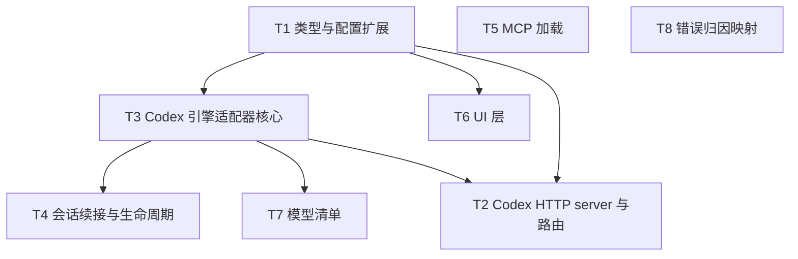

# Codex SDK 执行引擎接入 - 任务分解

> **来源**：`/kb-plan`（基于 `01-proposal.md`、`02-design.md`）
> **任务数**：8（T1~T8）
> **依赖图与分组调度**：见「一、执行计划」；每条 `T{n}` 自包含，子 agent 只读该 `T{n}` + 上下文文件即可开工，不应回读 02-design.md。

## 一、执行计划

### （一）依赖图

**依赖说明**：
- T1（类型/配置）为地基，被 T2/T3/T6 依赖；T7 经 T3 间接依赖 T1。
- T5、T8 独立无依赖，提前至第一轮并行，使其在 T3 第二轮开工前就绪，T3 可直接 import 真实函数（优于 contract-first 引用签名，消除集成编译风险）。
- T3 → T4 / T3 → T7 / T3 → T2 为冲突文件串行约束（见「（二）分组调度」）。

### （二）分组调度

- **第一轮（并行）**：T1、T5、T8
  - T1：类型/配置前置（`channel-types.ts`/`preload.ts`/`env.d.ts`/`config-store.ts`）。
  - T5：`codex-mcp-loader.ts`（全新文件，无冲突）。
  - T8：`codex-failure-messages.ts`（全新文件，无冲突）。
- **第二轮（并行）**：T3、T6
  - T3：`agent-codex-{types,events,stream,utils,sdk}.ts`（全新文件群，依赖 T1）。
  - T6：UI（`AgentResourceModals.tsx`/`ChannelModelSection.tsx`/`AgentPanel.tsx`，依赖 T1）。
  - T3 与 T6 文件集无交集，可并行。
- **第三轮（并行）**：T2、T4、T7
  - T2：`agent-codex-http.ts` + `session-dispatcher.ts`（依赖 T1、T3）。
  - T4：扩展 `agent-codex-sdk.ts`/`agent-codex-events.ts`/`agent-codex-stream.ts`（依赖 T3）。
  - T7：扩展 `agent-codex-types.ts`（依赖 T3）。
  - T2/T4/T7 文件集互不相交，可并行。

**串行约束（冲突文件唯一写入者）**：
- T3 → T4：共写 `electron/agent-codex-sdk.ts`、`electron/agent-codex-events.ts`、`electron/agent-codex-stream.ts`（T3 先建骨架，T4 后填生命周期）。
- T3 → T7：共写 `electron/agent-codex-types.ts`（T3 先建类型，T7 后追加 `CODEX_MODEL_LIST`）。
- T3 → T2：T2 应用 init 注册需 T3 的 `launchCodexAgent`/`dispatchToCodexAgent` 入口就绪。
- 跨变更约束：`channel-types.ts`/`preload.ts`/`env.d.ts`/`config-store.ts`/`session-dispatcher.ts`/`ChannelModelSection.tsx` 为本变更先行落点，并列进行中的 `20260630105159-OpenCodeSDK执行引擎接入` 后接并承担 rebase 成本（02 八·（二）OpenCodeSDK rebase 提示）。

## 二、任务清单

## T1: 类型与配置扩展

### 背景

为 Codex SDK 引擎接入打地基：扩展资源模型 `AgentResource.type` 联合类型纳入 `"codex"`，同步 `engineType`，并在 `config-store` 增加 `newCodexResourceId` 与 `findFirstRunnableResource` 的 codex 兜底，使后续 T2/T3/T6/T7 能基于 codex 类型与配置兜底构建引擎、HTTP、UI。本任务为整个变更的类型与配置前置。

### 上下文文件

- CodeGraph: `AgentResource` / `findFirstRunnableResource` / `newClaudeCodeResourceId` — 定位资源模型 SSOT 与配置兜底模板。
- 必读: `src/shared/channel-types.ts` — 资源模型 SSOT，扩 type 联合。
- 必读: `electron/preload.ts` — type 联合与 engineType 同步点。
- 必读: `src/renderer/env.d.ts` — type 联合与 engineType 同步点。
- 必读: `electron/config-store.ts` — `newCodexResourceId`/`findFirstRunnableResource` 兜底模板。
- 参考: `electron/agent-cc-types.ts:25` `CLAUDE_CODE_MODEL_LIST` — 仅参考 id 前缀风格。

### 实现范围

- 修改: `src/shared/channel-types.ts:7` — `type: "sdk" | "claude-code"` → `type: "sdk" | "claude-code" | "codex"`。
- 修改: `electron/preload.ts:6` — type 联合扩 `"codex"`。
- 修改: `electron/preload.ts:232` — `engineType: "sdk" | "claude-code"` 扩 `"codex"`。
- 修改: `src/renderer/env.d.ts:13` — type 联合扩 `"codex"`。
- 修改: `src/renderer/env.d.ts:191` — `engineType` 扩 `"codex"`。
- 修改: `electron/config-store.ts` — 新增 `newCodexResourceId()` 返回 `"codex_<hex>"`（仿 `newClaudeCodeResourceId`）；`findFirstRunnableResource` 链式兜底加 codex（sdk → claude-code → codex）。
- **可能冲突文件**: `src/shared/channel-types.ts`、`electron/preload.ts`、`src/renderer/env.d.ts`、`electron/config-store.ts`（均仅 T1 写入，无跨任务冲突；OpenCodeSDK 变更 `20260630105159` 后接需 rebase 此处）。

### 接口契约

- `AgentResource.type: "sdk" | "claude-code" | "codex"` — 资源模型类型联合（三处同步：channel-types/preload/env.d）。
- `engineType: "sdk" | "claude-code" | "codex"` — 引擎类型联合（preload:232/env.d:191 两处同步）。
- `newCodexResourceId(): string` — 返回 `"codex_<hex>"`，供 Codex Profile 新建。
- `findFirstRunnableResource(): AgentResource | null` — 兜底链扩展为 sdk → claude-code → codex。

### 验收标准

- [ ] `AgentResource.type` 联合含 `"codex"`，channel-types/preload/env.d 三处 type 与两处 engineType 全部同步（01 验收 7、9 配置基础）。
- [ ] `newCodexResourceId` 生成 `codex_<hex>` 格式 id，多次调用唯一（01 验收 8 多 Profile 独立）。
- [ ] `findFirstRunnableResource` 在无 sdk/claude-code 资源时回退到 codex（01 验收 4 切换回正常不破坏）。
- [ ] 现有 sdk/claude-code 路径不受影响，类型扩展不引发 TS 编译错误（01 验收 4；02 八·（二）三引擎互不干扰）。
- [ ] 02 八·（二）OpenCodeSDK rebase 提示：type 三处同步、`findFirstRunnableResource` codex 兜底为本变更先行落点，落点注释标注待 OpenCodeSDK 接入时按同模式加 `"opencode"`。
- [ ] 无 02/03 未要求的抽象层或新依赖（Ponytail 口径）。

### 依赖

- 前置任务: 无
- 后续任务: T2、T3、T6（T7 经 T3 间接依赖）

## T2: Codex HTTP server 与路由

### 背景

为 Codex 引擎搭建独立 HTTP server（与 CC 路径对等，不走 Daemon 转发），并在路由层 `launchAgent` 加 `codex` 分支，使 IM 消息/任务/工作流三类触发经 `launchAgent` 路由到 Codex HTTP server，再由 T3 的 `launchCodexAgent` 执行。本任务承担 F2/F3/F4 的路由与 HTTP 入口。

### 上下文文件

- CodeGraph: `launchAgent` / `ensureClaudeCodeHttpServer` / `getCcAgentApiPort` / `registerCcLaunchHandler` — 定位路由层与 HTTP server 模板。
- 必读: `electron/session-dispatcher.ts:249` `launchAgent`（行 307 sdk 分支、行 316 cc 分支，行 255 类型校验）— 加 codex 并行分支。
- 必读: `electron/agent-cc-http.ts:242` `ensureClaudeCodeHttpServer` / `:288` `getCcAgentApiPort` / `:28` `registerCcLaunchHandler` / `:38` `registerCcDispatchHandler` / `:156` `launchCcAgentFromHttp` / `:122` 端口文件 — HTTP server 模板。
- 参考: T3 接口契约（`launchCodexAgent`/`dispatchToCodexAgent`/`CodexLaunchOptions` 签名）— handler 注册所需。
- 参考: `electron/cc-agent-api-port.json` 机制 — 端口文件容错模板。

### 实现范围

- 新建: `electron/agent-codex-http.ts` — `ensureCodexHttpServer`/`getCodexAgentApiPort`/`registerCodexLaunchHandler`/`registerCodexDispatchHandler`/`launchCodexAgentFromHttp`；端口文件 `codex-agent-api-port.json`；路由 `POST /api/codex/agent/launch|dispatch`（错误码 400/405/404/500）。
- 修改: `electron/session-dispatcher.ts:249` `launchAgent` — 加 `resource.type === "codex"` 分支（行 307/316 旁并行分支），调用 `getCodexAgentApiPort()` + `POST /api/codex/agent/launch`（不走 Daemon）；行 255 类型校验放行 codex。
- 修改: 应用 init 注册 — `ensureCodexHttpServer()` + `registerCodexLaunchHandler(launchCodexAgent)` + `registerCodexDispatchHandler(dispatchToCodexAgent)`（仿 `initSessionDispatcher` 中 CC 注册）。
- **可能冲突文件**: `electron/session-dispatcher.ts`（仅 T2 写入 launchAgent 区域；OpenCodeSDK 变更后接需 rebase 加 `"opencode"` 分支）。

### 接口契约

- `ensureCodexHttpServer(): void` — 启动独立 Codex HTTP server。
- `getCodexAgentApiPort(): number` — 返回 server 监听端口，读 `userData/codex-agent-api-port.json`。
- `registerCodexLaunchHandler(fn: (opts: CodexLaunchOptions) => Promise<{ok: boolean; error?: string}>): void` — handler 依赖注入。
- `registerCodexDispatchHandler(fn: (sessionKey: string, taskText: string, messageIds?: string[]) => Promise<{ok: boolean; error?: string}>): void`。
- `launchCodexAgentFromHttp(body: launchBody): Promise<{ok: boolean; error?: string}>` — HTTP body 解析转 `launchCodexAgent`。
- HTTP 路由: `POST /api/codex/agent/launch`（body 同 launchBody: session_key/task_text/chat_type/.../message_ids）、`POST /api/codex/agent/dispatch`（body: session_key/task_text/message_ids?）。
- `launchAgent` codex 分支: `resource.type === "codex"` → `getCodexAgentApiPort()` + POST launch。

### 验收标准

- [ ] `POST /api/codex/agent/launch` 正确解析 body 并调用 `launchCodexAgent`（01 验收 1 IM 消息路径）。
- [ ] `POST /api/codex/agent/dispatch` 正确调用 `dispatchToCodexAgent`（01 验收 1 连发续接）。
- [ ] `launchAgent` 对 `resource.type === "codex"` 路由到 Codex HTTP server，不影响 sdk(行307)/cc(行316) 分支（01 验收 2 任务、验收 3 工作流经 launchAgent 汇聚；01 验收 4 切换回正常）。
- [ ] 行 255 类型校验放行 codex，不抛类型错误。
- [ ] `codex-agent-api-port.json` 读写容错：写入失败 WARN 不阻断（02 八·（二）端口文件容错）。
- [ ] 错误码 400（参数缺失/启动失败）、405（非 POST）、404（路径未匹配）、500（handler 未注册）齐全。
- [ ] 02 八·（二）OpenCodeSDK rebase：`launchAgent` 加 codex 分支为先行落点，注释标注 OpenCodeSDK 按同模式加 `"opencode"` 分支。
- [ ] 02 八·（二）三引擎互不干扰：codex 分支与 sdk/cc 分支隔离。
- [ ] 无 02/03 未要求的抽象层或新依赖（Ponytail 口径）。

### 依赖

- 前置任务: T1（type 扩展放行 codex）、T3（`launchCodexAgent`/`dispatchToCodexAgent` 入口就绪供 handler 注册）。
- 后续任务: 无

## T3: Codex 引擎适配器核心

### 背景

构建 Codex 引擎适配器核心：定义会话状态 `CodexSessionAgent`、启动入参 `CodexLaunchOptions`、事件类型，实现事件→`PresentationEvent` 映射、流式缓冲/节流、端口/路径/凭证脱敏工具，并编写入口 `agent-codex-sdk.ts` 做 `launchCodexAgent`/`dispatchToCodexAgent` 生命周期编排。复杂逻辑下沉到 events/stream/utils，入口仅编排，**每文件 <300 行**。本任务是 Codex 引擎执行主体，承担 F2 执行与流式呈现。

### 上下文文件

- CodeGraph: `CcSessionAgent` / `ClaudeCodeLaunchOptions` / `agent-cc-events` / `agent-cc-stream` / `agent-cc-utils` / `launchCcAgent` — 定位 CC 拆分模板。
- 必读: `electron/agent-cc-types.ts:34` `CcSessionAgent` / `:10` `ClaudeCodeLaunchOptions` / `:25` `CLAUDE_CODE_MODEL_LIST` — 会话状态/LaunchOptions/模型清单模板。
- 必读: `electron/agent-cc-events.ts` — 事件→PresentationEvent 映射模板。
- 必读: `electron/agent-cc-stream.ts` — 流式缓冲/节流/串行链模板。
- 必读: `electron/agent-cc-utils.ts` — 端口/路径/凭证脱敏工具模板。
- 必读: `electron/agent-claude-sdk.ts` — 入口生命周期编排模板（launchCcAgent/dispatchToCcAgent）。
- 必读: `electron/agent-run-guard.ts:29` `acquireRunGuard` / `:60` `watchRunGuard` — Run 互斥/超时复用。
- 必读: `electron/context-rotation-lite.ts:33` `maybeRotateContext` — 上下文轮转复用。
- 必读: `electron/finalize-sdk-run.ts:13` `PLATFORM_RUN_LIMIT_MS` — 平台长时阈值复用。
- 必读: `electron/crash-log-archiver.ts:110` `archiveAgentFailureLogs` — 崩溃归档复用。
- 参考: T5 `loadCodexMcpServers` 签名、T8 `formatCodexFailureMessage` 签名 — 入口调用。
- 参考: Codex SDK 事件枚举（`thread.started`/`turn.started`/`item.started`/`item.updated`/`item.completed`/`turn.completed`/`turn.failed`/`thread.error`）。

### 实现范围

- 新建: `electron/agent-codex-types.ts` — `CodexSessionAgent`（字段对齐 02 §五 CodexSessionAgent 清单）、`CodexLaunchOptions`、Codex 事件/ThreadItem 类型别名。
- 新建: `electron/agent-codex-events.ts` — 8 类 Codex 事件 → `PresentationEvent`（tool/thinking/assistant）映射；未识别事件/ThreadItem 子类型写 UI 日志 WARN 不崩溃。
- 新建: `electron/agent-codex-stream.ts` — 流式增量缓冲/节流/串行链（仿 agent-cc-stream）。
- 新建: `electron/agent-codex-utils.ts` — 端口/路径/凭证脱敏工具（含 `maskCodexApiKey`）。
- 新建: `electron/agent-codex-sdk.ts` — 入口 `launchCodexAgent`/`dispatchToCodexAgent`，`new Codex({apiKey})` + `startThread` + `runStreamed`；spawn 前检测 `@openai/codex` CLI 可执行；`thread.started` 写 `codexSessionId`，`turn.completed` 写 `contextUsage`；复用 `acquireRunGuard`/`watchRunGuard`/`maybeRotateContext`/`PLATFORM_RUN_LIMIT_MS`/`archiveAgentFailureLogs`；**复杂逻辑下沉到 events/stream/utils，入口仅编排，确保 <300 行**。
- **可能冲突文件**: `electron/agent-codex-sdk.ts`、`electron/agent-codex-events.ts`、`electron/agent-codex-stream.ts`（与 T4 共写，须 T3 先行、T4 串行其后）；`electron/agent-codex-types.ts`（与 T7 共写，T7 串行其后）。

### 接口契约

- `CodexSessionAgent` interface — 字段：`sessionKey`/`activeThread: Thread | null`/`codexSessionId: string | null`/`startedAt`/`lastActivityAt`/`chatType`/`workspaceDir`/`senderOpenId`/`chatName`/`apiKey`/`baseUrl?`/`model?`/`meta?`/`useMainWorkspace?`/`abortController`/`f41Stream`/`streamBuffer`/`outboundMessageId?`/`toolPresentationOutboundIds?`/`streamId?`/`streamLastPostAt?`/`streamPostTimer?`/`streamPostChain?`/`errorNotified?`/`lastStatus?`/`lastTool?`/`residentMode`/`pendingDispatch`/`runStartedAt?`/`seenProcessEvent?`/`presentationDeferStream?`/`thinkingOpen?`/`contextUsage`/`contextUsagePeakTokens?`/`contextUsageFromRunTotal?`/`contextUsageFinalized?`/`contextLimitTokens?`/`modelId?`/`compressionNotified?`/`inboundMessageIds?`/`runFinalizing?`/`failureArchiveDone?`/`runGuardToken?`/`watchdogState`/`watchdogStateAt`/`watchdogTimedOut?`/`lastMcpServersSnapshot?`/`logAgg`。
- `CodexLaunchOptions` — `sessionKey`/`chatType`/`meta?`/`workspaceDir`/`useMainWorkspace?`/`senderOpenId?`/`chatName?`/`taskMessage?`/`apiKey`/`model?`/`baseUrl?`；出参 `{ ok: boolean; error?: string }`。
- `launchCodexAgent(opts: CodexLaunchOptions): Promise<{ok: boolean; error?: string}>` — 首条启动，`startThread` + `runStreamed`，注册到 `CodexSessionAgent`。
- `dispatchToCodexAgent(sessionKey: string, taskText: string, messageIds?: string[]): Promise<{ok: boolean; error?: string}>` — 连发续接（T4 扩展 `resumeThread`）。
- 事件映射: `thread.started`→写 codexSessionId；`turn.started`→置 runStartedAt；`item.started`→预建展示卡；`item.updated`→assistant/thinking 流式增量；`item.completed`→tool 完成/assistant final；`turn.completed`→写 contextUsage+footer；`turn.failed`/`thread.error`→失败归因(T8)。

### 验收标准

- [ ] `launchCodexAgent` 经 `new Codex({apiKey})` + `startThread` + `runStreamed` 启动并正常回复（01 验收 1）。
- [ ] 8 类 Codex 事件正确映射到 `PresentationEvent`（thinking/tool/assistant），流式进度推送正常（01 验收 5）。
- [ ] `thread.started` 写入 `codexSessionId`，`turn.completed` 写入 `contextUsage`（01 验收 5、验收 6 基础）。
- [ ] spawn 前检测 `@openai/codex` CLI 可执行，缺失返回「未检测到 Codex CLI，请先安装」不抛原始 ENOENT（02 八·（二）Codex CLI 二进制校验）。
- [ ] 未识别事件/ThreadItem 子类型写 UI 日志 WARN，不崩溃不阻断流（02 八·（二）未识别事件降级）。
- [ ] `agent-codex-utils.ts` 提供 apiKey 脱敏函数，日志/归档不泄露 `OPENAI_API_KEY`（02 八·（二）apiKey 脱敏）。
- [ ] 每个新建文件 <300 行，入口仅编排、复杂逻辑下沉（工作区硬规则）。
- [ ] 代码含中文注释（工作区硬规则）。
- [ ] 无 02/03 未要求的抽象层（不引入 `EngineAdapter`，与 CC 接入对等加分支）（Ponytail 口径）。

### 依赖

- 前置任务: T1（type 扩展）
- 后续任务: T2（handler 注册）、T4（生命周期扩展）、T7（模型清单追加）

## T4: 会话续接与生命周期

### 背景

在 T3 创建的 `agent-codex-sdk.ts`/`events`/`stream` 上补齐会话续接与生命周期机制：`codexSessionId`=thread_id 经 `resumeThread` 续接、watchdog 超时、失败冷却、长驻 residentMode，复用共享模块 `agent-run-guard`/`context-rotation-lite`/`finalize-sdk-run`/`crash-log-archiver`，使 Codex 路径在上下文轮转、超时、失败冷却与用户通知上与现有双引擎等价。承担 F5 生命周期一致性。

### 上下文文件

- CodeGraph: `acquireRunGuard` / `watchRunGuard` / `maybeRotateContext` / `PLATFORM_RUN_LIMIT_MS` / `archiveAgentFailureLogs` / `resumeThread` — 定位生命周期复用符号。
- 必读: `electron/agent-run-guard.ts:29`/`:60` — Run 互斥/超时。
- 必读: `electron/context-rotation-lite.ts:33` `maybeRotateContext` — 上下文轮转。
- 必读: `electron/finalize-sdk-run.ts:13` `PLATFORM_RUN_LIMIT_MS` — 7min 长时阈值。
- 必读: `electron/crash-log-archiver.ts:110` `archiveAgentFailureLogs` — 崩溃归档（须对 apiKey 脱敏）。
- 必读: `electron/agent-claude-sdk.ts` — CC `--resume` 续接与 resident 模板。
- 必读: T3 产出的 `electron/agent-codex-sdk.ts`/`agent-codex-events.ts`/`agent-codex-stream.ts` — 在此扩展。
- 参考: T8 `formatCodexFailureMessage` — 失败归因文案。

### 实现范围

- 修改: `electron/agent-codex-sdk.ts` — `dispatchToCodexAgent` 用 `codex.resumeThread(codexSessionId)` 续接；watchdog 超时（`watchRunGuard`/`PLATFORM_RUN_LIMIT_MS`）；失败冷却；residentMode 长驻；`turn.failed`/`thread.error` 调 T8 归因并 `archiveAgentFailureLogs`（快照脱敏）。
- 修改: `electron/agent-codex-events.ts` — `turn.failed`/`thread.error` 事件接入失败归因路径。
- 修改: `electron/agent-codex-stream.ts` — resident 长驻下流式串行链与上下文轮转触发协同（`maybeRotateContext`）。
- **可能冲突文件**: `electron/agent-codex-sdk.ts`、`electron/agent-codex-events.ts`、`electron/agent-codex-stream.ts`（与 T3 共写，须 T3 先行、T4 串行其后）。

### 接口契约

- `dispatchToCodexAgent` 续接: `codex.resumeThread(codexSessionId)` + `runStreamed`（codexSessionId 由 T3 `thread.started` 写入）。
- watchdog: `watchRunGuard` + `PLATFORM_RUN_LIMIT_MS`(7min) 超时触发失败归因。
- 失败冷却: 失败后置 `watchdogState`/冷却态，拒绝/延迟新 dispatch。
- residentMode: idle resident 保活，连发经 `resumeThread` 续跑。
- `archiveAgentFailureLogs` 快照须对 `OPENAI_API_KEY`/apiKey 脱敏（调 T8/T3 脱敏函数）。

### 验收标准

- [ ] 同 sessionKey 连发经 `resumeThread(codexSessionId)` 续跑，与 CC `--resume` 体验一致（01 验收 10；02 八·（二）resident 续接）。
- [ ] Run 超时(7min)触发 watchdog 失败归因，用户可见错误提示（01 验收 10）。
- [ ] 失败冷却机制生效，失败后冷却态拒绝/延迟新 dispatch（01 验收 10）。
- [ ] 上下文超限时 `maybeRotateContext` 正常触发（01 验收 6）。
- [ ] 流式进度推送在 resident/轮转场景下正常（01 验收 5）。
- [ ] `archiveAgentFailureLogs` 快照对 apiKey/`OPENAI_API_KEY` 脱敏，不泄露凭证（02 八·（二）apiKey 脱敏）。
- [ ] 修改后各文件仍 <300 行（工作区硬规则）。
- [ ] 代码含中文注释。
- [ ] 无 02/03 未要求的抽象层（Ponytail 口径）。

### 依赖

- 前置任务: T3（agent-codex-sdk/events/stream 入口骨架）
- 后续任务: 无

## T5: MCP 加载

### 背景

为 Codex 引擎加载 MCP 工具配置，与 CC 路径对等。读 Codex CLI 配置（`~/.codex` + 项目级 MCP 配置），仿 `cc-mcp-loader.ts` 的 `readClaudeJsonMcpServers`/`mergeMcpJsonEntries`/`appendInlineMcpToCcOptions`，供 T3 入口在启动会话时注入 MCP 工具。承担 F2 MCP 对等。

### 上下文文件

- CodeGraph: `readClaudeJsonMcpServers` / `mergeMcpJsonEntries` / `appendInlineMcpToCcOptions` — 定位 MCP 加载模板。
- 必读: `electron/cc-mcp-loader.ts:40`/`:66`/`:155` — MCP 加载模板。
- 参考: Codex CLI 配置目录 `~/.codex` 与项目级 MCP 配置形态。
- 参考: T3 接口契约（`launchCodexAgent` 调用 `loadCodexMcpServers` 注入会话）。

### 实现范围

- 新建: `electron/codex-mcp-loader.ts` — `readCodexMcpServers`（读 `~/.codex` + 项目级）、`mergeMcpJsonEntries`、`appendInlineMcpToCodexOptions`；输出供 `launchCodexAgent` 注入。
- **可能冲突文件**: 无（全新文件）。

### 接口契约

- `readCodexMcpServers(): McpServerEntry[]` — 读 Codex CLI 配置（全局 `~/.codex` + 项目级）。
- `mergeMcpJsonEntries(...entries): McpServerEntry[]` — 合并多源 MCP 配置。
- `appendInlineMcpToCodexOptions(opts, servers): CodexLaunchOptions` — 将 MCP 配置注入 Codex 会话选项。

### 验收标准

- [ ] 正确读取 `~/.codex` 与项目级 MCP 配置并合并（01 验收 1 F2 对等执行含工具）。
- [ ] 与 CC `cc-mcp-loader` 行为对等，不引入新抽象层（Ponytail 口径）。
- [ ] 文件 <300 行，代码含中文注释。
- [ ] 无 02/03 未要求的新依赖。

### 依赖

- 前置任务: 无
- 后续任务: T3（入口引用其函数；T3 在 T5 完成后直接 import）

## T6: UI 层

### 背景

为 Codex 引擎提供配置 UI：新增 `CodexEditModal`（新建/编辑/删除 Codex Profile），`ChannelModelSection` 加 `RESOURCE_GROUP_LABELS.codex`/`groupedTypes`/`isCodexProfile` 分支（Codex 模型由 Profile 管理，与 CC 对等不拉列表），`AgentPanel` 加 Codex 资源管理。承担 F1 Profile 管理、F6 通道绑定。

### 上下文文件

- CodeGraph: `CcEditModal` / `RESOURCE_GROUP_LABELS` / `groupedTypes` / `isCcProfile` / `AgentPanel` — 定位 UI 模板。
- 必读: `src/renderer/components/AgentResourceModals.tsx:6` `SdkEditModal`、`:57` `CcEditModal` — Modal 模板。
- 必读: `src/renderer/components/ChannelModelSection.tsx:19` `RESOURCE_GROUP_LABELS`、`:97` `groupedTypes`、`:40` `isCcProfile` — 分组/分支模板。
- 必读: `src/renderer/components/AgentPanel.tsx` — 资源列表管理模板。
- 必读: T1 `AgentResource.type` 扩展、`newCodexResourceId` — UI 调用。
- 参考: T7 `CODEX_MODEL_LIST` — Profile 模型选择清单。

### 实现范围

- 修改: `src/renderer/components/AgentResourceModals.tsx` — 新增 `CodexEditModal`（仿 `CcEditModal`，字段 name/apiKey/model?/baseUrl?）。
- 修改: `src/renderer/components/ChannelModelSection.tsx:19` — `RESOURCE_GROUP_LABELS.codex = "Codex Profile"`；`:97` `groupedTypes` 加 `"codex"`；`:40` 旁加 `isCodexProfile` 分支（模型由 Profile 管理，不拉列表）。
- 修改: `src/renderer/components/AgentPanel.tsx` — Codex 资源列表管理（新建/编辑/删除）。
- **可能冲突文件**: `AgentResourceModals.tsx`、`ChannelModelSection.tsx`、`AgentPanel.tsx`（均仅 T6 写入；OpenCodeSDK 变更后接需 rebase `RESOURCE_GROUP_LABELS`/`groupedTypes` 加 `"opencode"`）。

### 接口契约

- `CodexEditModal` component — props 仿 `CcEditModal`（resource/onSave/onDelete）。
- `RESOURCE_GROUP_LABELS.codex: "Codex Profile"`。
- `groupedTypes` 含 `"codex"` 分组。
- `isCodexProfile(resource): boolean` — Codex Profile 分支判定。

### 验收标准

- [ ] `CodexEditModal` 支持新建/编辑/删除 Codex Profile，鉴权(apiKey)与模型独立保存互不干扰（01 验收 7、8）。
- [ ] `ChannelModelSection` 引擎选择 Codex 时可从 Profile 列表绑定一个（01 验收 9 两通道绑不同 Profile）。
- [ ] 绑定的 Profile 被删除后，通道编辑时提示重新选择，不自动降级执行（02 八·（二）Profile 删除提示；01 §F6）。
- [ ] Codex 模型由 Profile 管理，不运行时拉列表（与 CC 对等）。
- [ ] 02 八·（二）OpenCodeSDK rebase：`RESOURCE_GROUP_LABELS`/`groupedTypes` 为先行落点，注释标注 OpenCodeSDK 加 `"opencode"`。
- [ ] 文件 <300 行（若超限按已有拆分风格再拆），代码含中文注释。
- [ ] 无 02/03 未要求的抽象层（Ponytail 口径）。

### 依赖

- 前置任务: T1（type 扩展、`newCodexResourceId`）
- 后续任务: 无

## T7: 模型清单

### 背景

在 T3 创建的 `agent-codex-types.ts` 中追加硬编码 `CODEX_MODEL_LIST`（仿 `CLAUDE_CODE_MODEL_LIST`），供 T6 Profile 模型选择清单与 T3 默认模型使用。Profile 支持可选自定义模型名覆盖硬编码清单，不做运行时拉取。承担 F1 模型选择。

### 上下文文件

- CodeGraph: `CLAUDE_CODE_MODEL_LIST` — 定位模型清单模板。
- 必读: `electron/agent-cc-types.ts:25` `CLAUDE_CODE_MODEL_LIST` — 硬编码清单模板。
- 必读: T3 产出的 `electron/agent-codex-types.ts` — 在此追加。
- 参考: T6 `CodexEditModal` 模型选择 UI（消费清单）。

### 实现范围

- 修改: `electron/agent-codex-types.ts` — 追加 `CODEX_MODEL_LIST: Array<{id: string; label: string}>` 硬编码（以文档示例为准，如 `gpt-5.4`/`gpt-5.5` 等）；Profile `model?` 字段支持自定义覆盖。
- **可能冲突文件**: `electron/agent-codex-types.ts`（与 T3 共写，须 T3 先行、T7 串行其后）。

### 接口契约

- `CODEX_MODEL_LIST: Array<{id: string; label: string}>` — 硬编码模型清单，供 UI 与默认模型。
- Profile `model?: string` 覆盖：空 = 使用清单默认或 SDK 默认。

### 验收标准

- [ ] `CODEX_MODEL_LIST` 硬编码含文档示例模型（如 `gpt-5.4`/`gpt-5.5`），UI 可选择（01 验收 7 模型名称配置有效）。
- [ ] Profile 支持自定义模型名覆盖清单（01 验收 7）。
- [ ] 不做运行时拉取（与 CC 对等）。
- [ ] 文件 <300 行，代码含中文注释。
- [ ] 无 02/03 未要求的抽象层（Ponytail 口径）。

### 依赖

- 前置任务: T3（agent-codex-types.ts 入口）
- 后续任务: 无

## T8: 错误归因映射

### 背景

为 Codex 引擎提供失败归因与用户文案，仿 `sdk-failure-messages.ts`，按 timeout → context_exhausted → session_abnormal → safe_message → fallback_actionable 链路归因，并确保 `OPENAI_API_KEY`/apiKey 不走文案/日志/归档。承担 F5 用户可见错误提示。

### 上下文文件

- CodeGraph: `formatUserSdkFailureMessage` / `sdk-failure-messages` — 定位失败归因模板。
- 必读: `electron/sdk-failure-messages.ts:101` `formatUserSdkFailureMessage` — 归因模板。
- 参考: T3 `agent-codex-utils.ts` 脱敏函数（复用或对齐）。
- 参考: T4 `turn.failed`/`thread.error` 调用方。

### 实现范围

- 新建: `electron/codex-failure-messages.ts` — `formatCodexFailureMessage(error): string`（归因链 timeout→context_exhausted→session_abnormal→safe_message→fallback_actionable）；apiKey 脱敏（复用 T3 utils 或内置 `maskCodexApiKey`）。
- **可能冲突文件**: 无（全新文件，但被 T3/T4 调用）。

### 接口契约

- `formatCodexFailureMessage(error: unknown): string` — 失败归因用户文案。
- `maskCodexApiKey(key: string): string` — apiKey 脱敏（与 T3 utils 对齐，避免重复实现）。

### 验收标准

- [ ] 失败归因链覆盖 timeout/context_exhausted/session_abnormal/safe_message/fallback_actionable，用户可见文案与双引擎一致（01 验收 10）。
- [ ] 文案/日志不含 `OPENAI_API_KEY`/apiKey 明文（02 八·（二）apiKey 脱敏）。
- [ ] 与 `sdk-failure-messages` 风格对等，不引入新抽象层（Ponytail 口径）。
- [ ] 文件 <300 行，代码含中文注释。
- [ ] 无 02/03 未要求的新依赖。

### 依赖

- 前置任务: 无
- 后续任务: T3/T4（引用其函数；T3/T4 在 T8 完成后直接 import）

---

## 三、修复任务清单（T-FIX，来源 `/kb-review`）

> 评审未通过（`04-review.md` §9），以下任务须在 archive 前完成。格式与 T{n} 一致。

## T-FIX-01: agent-sdk Daemon IM 入口 codex 路由

### 背景

R-CRIT-01（96 分）：`electron/agent-sdk.ts:1422-1472` `resolveBoundAgentResourceType` 不含 `"codex"`，IM 消息经 Daemon → `POST /api/agent/launch` 无法解析 Codex Profile，01 验收 1 与 T2 验收 1 不满足。须对齐 CC 接入同类修复。

### 上下文文件

- 必读: `electron/agent-sdk.ts:1422-1472` `resolveBoundAgentResourceType` — 扩展 codex 分支。
- 参考: `knowledge/变更/归档/20260629233840-修复IM通道ClaudeCodeLaunch路由/` — CC Daemon 路由修复先例。
- 参考: T2 `launchAgent` codex 分支（任务/工作流路径已通，IM Daemon 路径未通）。

### 实现范围

- 修改: `electron/agent-sdk.ts` — `resolveBoundAgentResourceType` 及 Daemon launch 路径纳入 `"codex"` 类型解析与 HTTP 转发。
- 确认: IM 消息触发时 `resource.type === "codex"` 能路由到 Codex HTTP server。

### 接口契约

- `resolveBoundAgentResourceType` 返回值含 `"codex"` 分支，与 sdk/claude-code 对等。
- Daemon `POST /api/agent/launch` 对 codex 通道正确转发至 Codex HTTP launch。

### 验收标准

- [ ] 配置 Codex Profile 后，飞书/微信 IM 消息触发的 Agent Run 使用 Codex 执行（01 验收 1）。
- [ ] T2 验收 1 `POST /api/codex/agent/launch` IM 路径端到端可用。
- [ ] sdk/claude-code Daemon 路径行为不变（01 验收 4）。
- [ ] 代码含中文注释，修改文件 <300 行。

### 依赖

- 前置任务: T2、T3（Codex HTTP 与 launch 入口已就绪）
- 关联评审: R-CRIT-01

## T-FIX-02: feishuSuppressesProcessKind import alias

### 背景

R-CRIT-02（88 分）：`agent-codex-stream.ts:6` 只 import `isFeishuProcessPresentationSuppressed`，`:71` 调用 `feishuSuppressesProcessKind` 未定义，飞书 process gate 抛 ReferenceError。

### 上下文文件

- 必读: `electron/agent-codex-stream.ts:6`、`:71` — import 与调用不一致。
- 参考: `electron/agent-cc-stream.ts` — 同名 alias 写法。

### 实现范围

- 修改: `electron/agent-codex-stream.ts:6` — `import { isFeishuProcessPresentationSuppressed as feishuSuppressesProcessKind }`。

### 接口契约

- 无新 API；修复后 `:71` 调用与 import 一致。

### 验收标准

- [ ] TypeScript 编译无 ReferenceError/未定义符号。
- [ ] Codex 路径飞书 process 事件 gate 与 CC 行为对等（F2 流式呈现不中断）。
- [ ] 代码含中文注释。

### 依赖

- 前置任务: T3
- 关联评审: R-CRIT-02

## T-FIX-03: session-dispatcher stop/list + daemon 运行态 + stopCodex 导出

### 背景

R-WARN-01（92 分）、R-WARN-07（75 分）：`session-dispatcher.ts:59-71` stop/isRunning/getSessionAgentList 未覆盖 Codex；`daemon-manager` 运行态计数未合并 Codex；缺 OpenCode rebase 注释。

### 上下文文件

- 必读: `electron/session-dispatcher.ts:59-71` — stop/isRunning/getSessionAgentList。
- 必读: `electron/daemon-manager.ts` — 运行态计数模板。
- 必读: `electron/agent-codex-sdk.ts` — 需导出 `stopCodexSession`/`isCodexSessionRunning`/`getCodexSessionList`（仿 CC）。
- 参考: `electron/agent-claude-sdk.ts` stop 系列实现。

### 实现范围

- 修改: `electron/agent-codex-sdk.ts` — 导出 `stopCodexSession`/`stopAllCodexSessions`/`isCodexSessionRunning`。
- 修改: `electron/session-dispatcher.ts` — 三处 API 补齐 codex 分支；launchAgent codex 分支补 OpenCode rebase 注释。
- 修改: `electron/daemon-manager.ts` — 运行态计数合并 Codex 会话。

### 接口契约

- `stopSessionAgent(sessionKey)` 对 Codex 会话可 abort Turn 并释放 runGuard。
- `isSessionAgentRunning(sessionKey)` / `getSessionAgentList()` 含 Codex 条目。
- `stopAllSessionAgents()` 三引擎对称。

### 验收标准

- [ ] Dashboard 可列出 Codex 活跃会话并可停止（R4 多端一致性）。
- [ ] 应用退出时 Codex CLI 子进程与 apiKey 可回收（R5）。
- [ ] launchAgent codex 分支含 OpenCode rebase 注释（T2 验收）。
- [ ] sdk/cc 路径 stop/list 行为不变。
- [ ] 各文件 <300 行，含中文注释。

### 依赖

- 前置任务: T2、T3、T4
- 关联评审: R-WARN-01、R-WARN-07

## T-FIX-04: ERROR 日志脱敏 + completeCodexRun 代际校验 + 双重文案

### 背景

R-WARN-02（85 分）completeCodexRun 无 run 代际校验；R-WARN-04（80 分）ERROR 日志未脱敏；R-WARN-06（77 分）IM 失败链双重 `formatCodexFailureMessage`。

### 上下文文件

- 必读: `electron/agent-codex-stream.ts` `completeCodexRun` — 对比 `agent-sdk.ts` `completeSdkRun` 代际校验。
- 必读: `electron/agent-codex-sdk.ts:108`、`electron/agent-codex-events.ts` — 异常日志路径。
- 必读: `electron/agent-codex-utils.ts` `sanitizeCodexSensitiveText`/`maskCodexApiKey`。
- 参考: `electron/codex-failure-messages.ts` — 失败文案单点格式化。

### 实现范围

- 修改: `completeCodexRun` — 加入 runStartedAt/runGuardToken 代际校验，过期收尾 no-op。
- 修改: 异常 catch 路径 — ERROR/WARN 统一 `sanitizeCodexSensitiveText(e.message)`。
- 修改: IM 失败通知链 — 消除双重 `formatCodexFailureMessage`（保留单点调用）。

### 接口契约

- `completeCodexRun(session, expectedRunToken)` 或等价代际闩，与 SDK 路径语义一致。
- 日志/归档快照不含 apiKey 明文（02 八·（二））。

### 验收标准

- [ ] 连发 dispatch 时旧 run 收尾不覆盖新 run 状态（R-WARN-02）。
- [ ] 模拟含 `sk-` 的异常 message 不进入 UI ERROR 日志明文（R-WARN-04）。
- [ ] IM 失败用户可见文案无重复段落（R-WARN-06）。
- [ ] T4 归档脱敏验收仍通过。
- [ ] 各文件 <300 行，含中文注释。

### 依赖

- 前置任务: T3、T4、T8
- 关联评审: R-WARN-02、R-WARN-04、R-WARN-06

## T-FIX-05: getAgentResource fallback 与 codex 通道 model 覆盖

### 背景

R-WARN-03（85 分）Profile 删除后 `getAgentResource` 仍 fallback `findFirstRunnableResource`，违反 F6；R-WARN-05（78 分）通道残留 model 覆盖 Codex Profile 模型。

### 上下文文件

- 必读: `electron/config-store.ts` `getAgentResource` — fallback 逻辑。
- 必读: `electron/session-dispatcher.ts` `launchAgent` — model 传递链。
- 参考: T6 验收 — Profile 删除提示、不自动降级。

### 实现范围

- 修改: `getAgentResource` — 绑定 Profile 已删除时返回 null/明确错误，不 fallback 其他 codex Profile。
- 修改: `launchAgent` codex 分支 — model 以 Profile `resource.model` 为准，忽略通道级残留 model（与 CC 对等）。

### 接口契约

- Profile 删除后通道编辑须提示重新选择（F6），runtime 不静默换 Profile。
- Codex launch `model` 来自绑定的 Codex Profile，非通道历史 model 字段。

### 验收标准

- [ ] 删除已绑定 Profile 后，IM 触发不自动换用其他 codex Profile（01 §F6）。
- [ ] 通道曾选 sdk model 后切 Codex，Run 使用 Profile 模型非残留 model（R-WARN-05）。
- [ ] sdk/claude-code getAgentResource 行为不变。
- [ ] 含中文注释。

### 依赖

- 前置任务: T1、T6
- 关联评审: R-WARN-03、R-WARN-05

