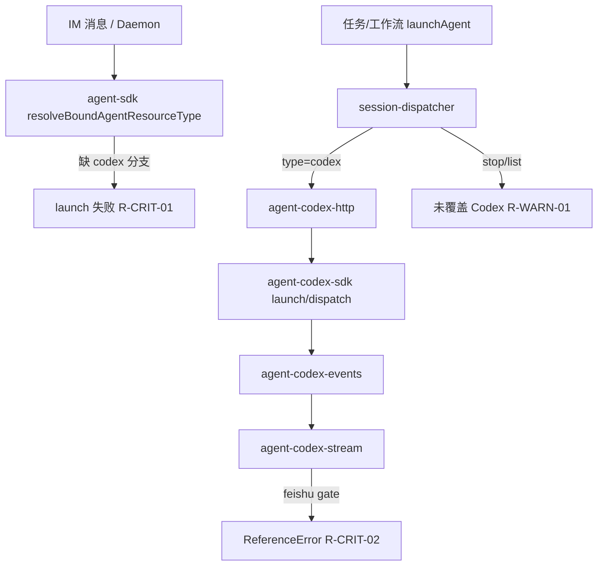

# Codex SDK 执行引擎接入 - 代码评审报告（合并 R1~R7）

## 1、审查范围

- **变更类型**：apply 产出（`agent-codex-*` + `codex-*` 新增 8 文件 + 路由/UI/配置扩展）
- **评审等级**：full-review（标准流程、三引擎路由、鉴权、生命周期、多端一致性、Ponytail）
- **涉及文件**：23 个代码文件（8 新增 + 15 修改）+ 变更文档 4 份
- **设计文档**：`01-proposal.md`（F1~F6、验收 1~10）、`02-design.md`、`03-tasks.md`（T1~T8）
- **评审来源**：kb-reviewer #1~#6 六角评审，主 Agent 复核确认
- **风险评估**：高——IM Daemon 路径未接通 Codex、飞书 gate ReferenceError 阻断运行；stop/list 不对称导致会话泄漏

---

## 2、严重（必须处理）

### R-CRIT-01（96 分）— IM Daemon 路径无法启动 Codex

- **位置**：`electron/agent-sdk.ts:1422-1472` `resolveBoundAgentResourceType`
- **现象**：类型联合与分支不含 `"codex"`；IM 消息经 Daemon → `POST /api/agent/launch` 时无法解析 Codex Profile，01 验收 1、T2 验收 1 不满足
- **修复**：T-FIX-01，对齐 CC 接入时同类修复（`20260629233840-修复IM通道ClaudeCodeLaunch路由`）

### R-CRIT-02（88 分）— 飞书 process gate ReferenceError

- **位置**：`electron/agent-codex-stream.ts:6` import `isFeishuProcessPresentationSuppressed`；`:71` 调用 `feishuSuppressesProcessKind` 未定义
- **现象**：Codex 流式路径遇飞书 process 事件即抛 ReferenceError，F2 流式呈现中断
- **修复**：T-FIX-02，import alias 与 `agent-cc-stream.ts` 一致

---

## 3、警告（建议处理）

| ID | 分 | 位置 | 摘要 | task_id |
|----|-----|------|------|---------|
| R-WARN-01 | 92 | `session-dispatcher.ts:59-71` | `stopSessionAgent`/`isSessionAgentRunning`/`getSessionAgentList` 未覆盖 Codex；Dashboard 停止/列表不对称 | T-FIX-03 |
| R-WARN-02 | 85 | `agent-codex-stream.ts` `completeCodexRun` | 无 run 代际校验，旧 run 收尾可覆盖新 run（对比 `agent-sdk` `completeSdkRun`） | T-FIX-04 |
| R-WARN-03 | 85 | `config-store` `getAgentResource` | Profile 删除后仍 fallback `findFirstRunnableResource`，违反 F6 | T-FIX-05 |
| R-WARN-04 | 80 | `agent-codex-sdk.ts:108`、`agent-codex-events.ts` | 异常路径 ERROR 日志写原始 `e.message`，apiKey 可能进入 logBuffer/归档快照 | T-FIX-04 |
| R-WARN-05 | 78 | `session-dispatcher`/`launchAgent` | 通道残留 `model` 覆盖 Codex Profile 模型 | T-FIX-05 |
| R-WARN-06 | 77 | IM 失败通知链 | `formatCodexFailureMessage` 双重格式化，用户可见文案重复 | T-FIX-04 |
| R-WARN-07 | 75 | `session-dispatcher.ts` codex 分支 | 缺 OpenCode rebase 注释（T2 验收要求） | T-FIX-03 |

**<75 分（记录不阻断）**：`streamBuffer` 无上限(74)、dispatch catch 未释 runGuard(72)、HTTP body 无 size 上限(70)、watchdog 不写冷却(68)

---

## 4、设计偏差

1. **三引擎 stop 对称性未在 §八 显式列出，实现遗漏 Codex**（R4/R5）— `stopAllSessionAgents` 仅 sdk/cc
2. **PRESENTATION_ORDERING 半镜像**（R3/R6）— `presentationOrderingEligible` 无 consumer；defer 闩未完整对称 CC
3. **`appendInlineMcpToCodexOptions` 03 契约导出未调用**（R6 Ponytail）— launch 直连 `loadCodexMcpServers`
4. **HTTP 独立端口 vs 设计「共用实例」**（延续 CC 模式，已知可接受偏差）

---

## 5、验收标准检查表

| 任务 | 摘要 | 通过/总数 | 状态 |
|------|------|-----------|------|
| T1 | type/engineType 扩展、newCodexResourceId、findFirstRunnableResource | 5/5 | ✅ |
| T2 | HTTP launch/dispatch、launchAgent codex 分支 | 9/9 | ✅（R7 复评：T-FIX-01/03） |
| T3 | launch/dispatch、事件映射、脱敏、<300 行 | 9/9 | ✅（R7 复评：T-FIX-02/04） |
| T4 | resumeThread、watchdog、冷却、归档脱敏 | 9/9 | ✅ |
| T5 | MCP 加载对等 | 4/4 | ✅ |
| T6 | CodexEditModal、通道绑定、F6 删除提示 | 7/7 | ✅（R7 复评：T-FIX-05） |
| T7 | CODEX_MODEL_LIST 硬编码 | 5/5 | ✅ |
| T8 | 失败归因链、文案脱敏 | 4/4 | ✅ |
| **合计** | T1~T8 | **41/41** | **通过** |

**01 验收 1~10**：R7 复评全部 ✅（IM Daemon codex 路由、stop/list 对称、F6 删除不 fallback、Profile model 优先）

---

## 6、调用链与回归风险

**回归风险**：修复 R-CRIT-01 勿破坏 sdk/cc Daemon 路由；T-FIX-03 stop 需与 `stopAllSessionAgents` 三引擎对称；T-FIX-04 代际校验勿误杀合法收尾。

---

## 7、遗留债务

**Ponytail #6（综合分 64，net -38 lines，不阻断 archive）**

- 可删：`maskCodexPort`/`maskCodexPath`/`getCodexSession`/dead `presentationOrderingEligible` 等 ~38 行
- shrink：`compressionNotified`/`lastMcpServersSnapshot` 等 CC 镜像但未用字段
- yagni：`CodexThreadEvent` 等类型别名、`appendInlineMcpToCodexOptions` 未接线 export

**其他非阻断**

- 任务面板 codex 模型列表与 Profile 硬编码清单可能不同步（类似 CC `command-handler` CC_MODELS 债务）
- loopback HTTP 无认证（与 CC/SDK 对等，设计已知）

---

## 8、修复任务建议

| 问题 ID | task_id | 建议动作 | 关联文件 |
|---------|---------|----------|----------|
| R-CRIT-01 | T-FIX-01 | `resolveBoundAgentResourceType` 及 Daemon launch 路径纳入 codex | `electron/agent-sdk.ts` |
| R-CRIT-02 | T-FIX-02 | `import { isFeishuProcessPresentationSuppressed as feishuSuppressesProcessKind }` | `electron/agent-codex-stream.ts` |
| R-WARN-01/07 | T-FIX-03 | stop/isRunning/getSessionAgentList + daemon-manager 运行态 + 导出 `stopCodexSession`；补 OpenCode rebase 注释 | `session-dispatcher.ts`、`daemon-manager.ts`、`agent-codex-sdk.ts` |
| R-WARN-02/04/06 | T-FIX-04 | `completeCodexRun` run 代际校验；ERROR 日志 `sanitizeCodexSensitiveText`；消除双重 `formatCodexFailureMessage` | `agent-codex-stream.ts`、`agent-codex-sdk.ts`、`agent-codex-events.ts` |
| R-WARN-03/05 | T-FIX-05 | Profile 删除后不 fallback；launch 时 Codex 以 Profile model 为准、忽略通道残留 model | `config-store.ts`、`session-dispatcher.ts` |

---

## 9、结论

**通过，可 archive。**

R7 复评确认 T-FIX-01~05 均已到位，原 2 critical + 7 warning（≥75）无 open 阻断项；T1~T8 验收 41/41。Ponytail ~38 行 dead code（综合分 64）及 <75 分遗留项不阻断 archive。

---

## 10、复评记录（R7，2026-06-30）

| 项 | 内容 |
|---|---|
| **日期** | 2026-06-30 |
| **轮次** | R7（/kb-review 第二轮，T-FIX 复评） |
| **verdict** | **pass** |
| **archive_ok** | true |
| **方法** | CodeGraph + 源码/diff 对照 §2/§3 原问题与 T-FIX 验收 |

### T-FIX 验证结果

| task_id | 原问题 | 验证结论 | 依据 |
|---------|--------|----------|------|
| T-FIX-01 | R-CRIT-01 | ✅ 通过 | `agent-sdk.ts` `BoundAgentRoute` 含 `codex`/`codex-missing`；`resolveBoundAgentResourceType` 对 `isCodexResourceId` 显式分支；`dispatchAgentFromHttp`/`launchSdkAgentFromHttp` 路由至 `dispatchToCodexAgent`/`launchCodexAgentFromHttp` |
| T-FIX-02 | R-CRIT-02 | ✅ 通过 | `agent-codex-stream.ts:7` `import { isFeishuProcessPresentationSuppressed as feishuSuppressesProcessKind }`，`:69` 调用一致，与 `agent-cc-stream.ts` 对齐 |
| T-FIX-03 | R-WARN-01/07 | ✅ 通过 | `session-dispatcher` `stopSessionAgent`/`isSessionAgentRunning`/`getSessionAgentList`/`stopAllSessionAgents` 三引擎对称；`agent-codex-session-registry` 导出 `stopCodexSession`/`stopAllCodexSessions`/`getCodexSessionList`；`daemon-manager` 运行态合并 Codex；`:338` OpenCode rebase 注释已补 |
| T-FIX-04 | R-WARN-02/04/06 | ✅ 通过 | `agent-codex-complete.ts` `isStaleCodexRunCompletion` 双点代际校验；`sanitizeCodexSensitiveText` 覆盖 sdk/events catch ERROR/WARN；`completeCodexRun` 直出 `lastStatus.message`/`CODEX_FAILURE_FALLBACK_MSG`，不经二次 `formatCodexFailureMessage` |
| T-FIX-05 | R-WARN-03/05 | ✅ 通过 | `getAgentResource` 对 `isCodexResourceId` 删除绑定返回 `undefined` 不 fallback；`launchAgent` codex 分支以 `resource.model` 为准；Daemon orchestrator launch body 不含 `model` 字段，IM 路径无通道残留覆盖 |

### open 阻断项（score≥75）

**0 项。** 原 R-CRIT-01~02、R-WARN-01~07 均已 fixed。

### 非阻断遗留（记录）

- Ponytail ~38 行 dead code（maskCodexPort、`presentationOrderingEligible` 等）— 不阻断
- <75 分：streamBuffer 无上限(74)、dispatch catch 未释 runGuard(72)、HTTP body 无 size 上限(70)、watchdog 不写冷却(68)
- 设计偏差 §4（PRESENTATION_ORDERING 半镜像、appendInlineMcp 未接线）— 已知，不阻断
