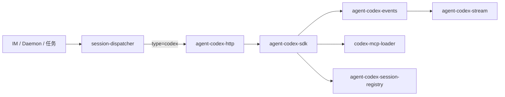

# Codex SDK 执行引擎接入 - 变更总结

> **变更 ID**：`20260630104714-CodexSDK执行引擎接入`
> **来源**：kb-propose（standard，P1 新功能）
> **归档 stage 建议**：`archived_with_debt`（R7 pass；K1–K5 runtime 待人工；Ponytail 不阻断）

---

## 1、变更概述

在 Cursor SDK、Claude Agent SDK 之后，接入 **OpenAI Codex SDK** 作为第三执行引擎。用户可在 Dashboard 新建/编辑 **Codex Profile**（`AgentResource.type = "codex"`），经 IM Daemon、任务面板、工作流 `launchAgent` 汇聚路由至独立 HTTP 服务（`codex-agent-api-port.json`）与 `agent-codex-sdk` 执行链；支持流式呈现、thread 续接（`resumeThread`）、MCP 加载、失败归因与三引擎 stop/list 对称。

**调用链（迁移后）**：



---

## 2、主要交付（代码文件清单）

### 2.1 新建（`agent-codex-*` + `codex-*`，T1–T8）

| 文件 | 任务 | 职责 |
|------|------|------|
| `electron/agent-codex-types.ts` | T3 | 类型、`CODEX_MODEL_LIST`、事件类型 |
| `electron/agent-codex-http.ts` | T2 | HTTP server、端口文件、`launchCodexAgentFromHttp` |
| `electron/agent-codex-events.ts` | T3/T4 | Codex 事件 → `PresentationEvent` |
| `electron/agent-codex-stream.ts` | T3/T4 | 流式缓冲、节流、串行链 |
| `electron/agent-codex-utils.ts` | T3 | 端口/路径/凭证脱敏 |
| `electron/agent-codex-sdk.ts` | T2–T4 | launch/dispatch、生命周期编排 |
| `electron/codex-mcp-loader.ts` | T5 | `~/.codex` + 项目级 MCP |
| `electron/codex-failure-messages.ts` | T8 | 失败归因与用户文案 |
| `src/renderer/components/AgentProfilePanels.tsx` | T6 | Codex Profile 面板拆分 |
| `src/renderer/components/AGENTS.md` | T6 | Renderer 组件约定 |

### 2.2 T-FIX 增量新建

| 文件 | 任务 | 职责 |
|------|------|------|
| `electron/agent-codex-session-registry.ts` | T-FIX-03 | `stopCodexSession`/`getCodexSessionList` 等会话注册表 |
| `electron/agent-codex-complete.ts` | T-FIX-04 | `completeCodexRun`、run 代际校验 `isStaleCodexRunCompletion` |
| `electron/agent-codex-watchdog.ts` | T-FIX-04 | watchdog 抽离，保持主文件 <300 行 |

### 2.3 修改（manifest `kind: code` + T-FIX 触及）

| 文件 | 任务 | 改动要点 |
|------|------|----------|
| `src/shared/channel-types.ts` | T1 | `type`/`engineType` 扩展 `"codex"` |
| `electron/config-store.ts` | T1/T-FIX-05 | `newCodexResourceId`、F6 删除不 fallback |
| `electron/preload.ts` | T1/T7 | Codex IPC bridge |
| `src/renderer/env.d.ts` | T1/T7 | `ElectronAPI` 类型 |
| `electron/session-dispatcher.ts` | T2/T-FIX-03/05 | `launchAgent` codex 分支；三引擎 stop/list 对称；Profile model 优先 |
| `electron/daemon-manager.ts` | T7/T-FIX-03 | Codex 运行态合并、re-export |
| `electron/main.ts` | T7 | `codex:*` IPC handlers |
| `electron/agent-sdk.ts` | T-FIX-01/05 | Daemon 路径 `resolveBoundAgentResourceType` 含 codex |
| `electron/ui-logger.ts` | T3 | Codex 日志通道 |
| `package.json` | T3 | `@openai/codex` 依赖 |
| `package-lock.json` | T3 | 锁文件同步 |
| `electron/AGENTS.md` | T2/T-FIX-03 | Codex 引擎约定 |
| `src/renderer/components/AgentResourceModals.tsx` | T6 | `CodexEditModal` |
| `src/renderer/components/ChannelModelSection.tsx` | T6 | `codex` 分组与绑定 |
| `src/renderer/components/AgentPanel.tsx` | T6 | Codex 资源列表管理 |

**统计**：新建 13 + 修改 15 = **28** 个工程文件（含 `package-lock.json`）。

---

## 3、知识库合并清单（kb-librarian 产出）

> 来源：`02-design.md` §九、§十；archive 步骤 6 已落盘。

### （一）必须更新 — 已完成

- [x] **新增** `knowledge/业务域/Agent调度/08-CodexSDK执行引擎.md` — Codex 十段式子模块
- [x] **更新** `knowledge/业务域/Agent调度/00-README.md` — 文件清单、`agent-codex-*` 关键源码、变更记录
- [x] **更新** `knowledge/业务域/Agent调度/01-概览.md` — 「双引擎」→「三引擎」；架构图加 `codex-agent-api`；子模块清单加 08

### （二）可能更新 — 已按实现补充

- [x] `knowledge/业务域/Agent调度/02-多会话模型.md` — Codex thread 续接与会话列表字段
- [x] `knowledge/业务域/Agent调度/03-启动与自动重连.md` — Codex resident/`resumeThread`、端口文件

### （三）不需要更新

- [x] `04-远程指令.md`、`05-定时任务.md` — 经 `launchAgent` 汇聚，不感知引擎
- [x] `06-CursorSDK执行引擎.md`、`07-ClaudeCodeSDK执行引擎.md` — 本变更不改现有引擎行为

---

## 4、评审结论

| 项 | 内容 |
|----|------|
| **等级** | full-review（R1~R6 六角 + R7 复评） |
| **R7 verdict** | **pass**（`archive_ok: true`） |
| **T-FIX** | T-FIX-01~05 均已 **done**；原 2 critical + 7 warning（≥75）无 open 阻断项 |
| **验收** | T1~T8 **41/41**；01 验收 1~10 R7 复评全部 ✅ |
| **合并文档** | `04-review.md` |

| task_id | 修复摘要 | 状态 |
|---------|----------|------|
| T-FIX-01 | IM Daemon `resolveBoundAgentResourceType` 纳入 codex | ✅ |
| T-FIX-02 | 飞书 process gate import 别名 | ✅ |
| T-FIX-03 | stop/list/daemon 运行态 + `stopCodexSession` + OpenCode rebase 注释 | ✅ |
| T-FIX-04 | run 代际校验、日志脱敏、失败文案单点 | ✅ |
| T-FIX-05 | F6 删除不 fallback；Profile model 覆盖通道残留 | ✅ |

---

## 5、测试（`06-automation-test.md`）

| 维度 | 结果 |
|------|------|
| **编译** | `npx tsc --noEmit` — **通过**（exit 0） |
| **T-FIX 静态追溯** | T-FIX-01~05 关键路径 rg/读源码 — **✅** |
| **runtime** | K1–K5（IM launch、飞书 process、Dashboard stop、连发代际、F6/model）— **待人工** |
| **通过口径** | 轻量 `/kb-test` 满足 archive 静态层；不新增 `auto_test/` |

---

## 6、遗留债务（不阻断 archive）

### 6.1 Ponytail（R6，综合分 64，~38 行 dead code）

- 可删：`maskCodexPort`/`maskCodexPath`/`getCodexSession`/`presentationOrderingEligible` 等
- shrink：CC 镜像但未用字段（`compressionNotified` 等）
- yagni：`appendInlineMcpToCodexOptions` 未接线 export、`CodexThreadEvent` 类型别名

### 6.2 其他非阻断

| 项 | 说明 |
|----|------|
| **K1–K5 runtime** | 依赖 Daemon、IM 凭据、`OPENAI_API_KEY`、`@openai/codex` CLI；见 `06-automation-test.md` §4 |
| **<75 分 review 项** | streamBuffer 无上限(74)、dispatch catch 未释 runGuard(72)、HTTP body 无 size 上限(70)、watchdog 不写冷却(68) |
| **设计偏差** | PRESENTATION_ORDERING 半镜像；HTTP 独立端口（延续 CC 模式，已知可接受） |
| **OpenCode rebase** | `20260630105159-OpenCodeSDK执行引擎接入` 须按本变更落点承担 rebase 成本 |

---

## 7、与设计的差异

| 项 | 设计预期 | 实际 | 处置 |
|----|----------|------|------|
| HTTP 端口 | 设计「共用实例」表述 | 独立 `listen(0)` + `codex-agent-api-port.json`，对称 CC | 已知可接受 |
| `completeCodexRun` | 内联于 stream | T-FIX-04 抽至 `agent-codex-complete.ts` | 可接受（<300 行） |
| session registry | 未单列文件 | `agent-codex-session-registry.ts` | 可接受（T-FIX-03 对称 stop/list） |

---

## 8、archive 白名单文件列表（供 kb-release commit）

> **合计：40 个文件**（变更文档 7 + 知识库 5 + 工程 28）。按路径逐文件 `git add`，禁止 `git add .`。

### 8.1 变更文档（7）

```
knowledge/变更/归档/20260630104714-CodexSDK执行引擎接入/00-manifest.json
knowledge/变更/归档/20260630104714-CodexSDK执行引擎接入/01-proposal.md
knowledge/变更/归档/20260630104714-CodexSDK执行引擎接入/02-design.md
knowledge/变更/归档/20260630104714-CodexSDK执行引擎接入/03-tasks.md
knowledge/变更/归档/20260630104714-CodexSDK执行引擎接入/04-review.md
knowledge/变更/归档/20260630104714-CodexSDK执行引擎接入/05-summary.md
knowledge/变更/归档/20260630104714-CodexSDK执行引擎接入/06-automation-test.md
```

### 8.2 知识库（5）

```
knowledge/业务域/Agent调度/08-CodexSDK执行引擎.md
knowledge/业务域/Agent调度/00-README.md
knowledge/业务域/Agent调度/01-概览.md
knowledge/业务域/Agent调度/02-多会话模型.md
knowledge/业务域/Agent调度/03-启动与自动重连.md
```

### 8.3 工程代码（28）

```
electron/agent-codex-types.ts
electron/agent-codex-http.ts
electron/agent-codex-events.ts
electron/agent-codex-stream.ts
electron/agent-codex-utils.ts
electron/agent-codex-sdk.ts
electron/agent-codex-session-registry.ts
electron/agent-codex-complete.ts
electron/agent-codex-watchdog.ts
electron/codex-mcp-loader.ts
electron/codex-failure-messages.ts
electron/agent-sdk.ts
electron/config-store.ts
electron/session-dispatcher.ts
electron/daemon-manager.ts
electron/main.ts
electron/preload.ts
electron/ui-logger.ts
electron/AGENTS.md
package.json
package-lock.json
src/shared/channel-types.ts
src/renderer/env.d.ts
src/renderer/components/AgentResourceModals.tsx
src/renderer/components/ChannelModelSection.tsx
src/renderer/components/AgentPanel.tsx
src/renderer/components/AgentProfilePanels.tsx
src/renderer/components/AGENTS.md
```

### 8.4 kb-release 待办（本 scribe 不写）

- `mv` 变更目录至 `knowledge/变更/归档/`
- `manifest.stage` → `archived_with_debt`
- 按需 `package.json` patch bump + `changelog/*.json`（若本变更含用户可见版本说明）

---

**变更文档**：`01-proposal.md`、`02-design.md`、`03-tasks.md`、`04-review.md`、`06-automation-test.md`、`00-manifest.json`、`05-summary.md`（本文件）。
