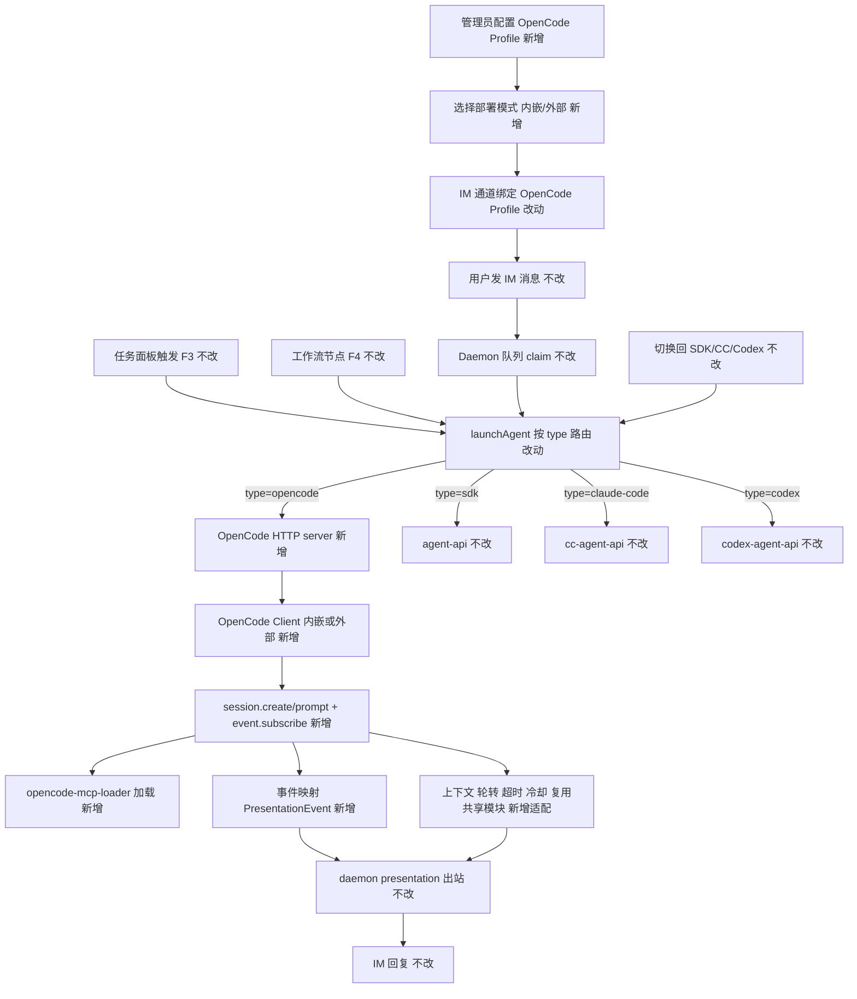
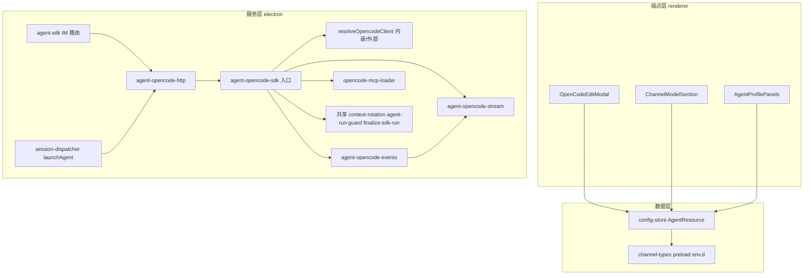

# OpenCode SDK 执行引擎接入 - 实现设计

> **业务 PRD**：见同目录 `01-proposal.md`（10 条验收标准以 01 为准）
> **技术口径**：对照已交付 Codex SDK 接入（变更 `20260630104714`）与 `@opencode-ai/sdk` 官方文档；rebase Codex 先行落点注释处。

## 一、业务流程与改动范围

> 业务口径以 `01-proposal.md` §功能需求 F1~F6 为准；下图以 F2 IM 消息路径为主流程，含 F1 配置前置、F3/F4 触发分支、F5 生命周期、F6 通道绑定。

### （一）业务流程图

**图例**：`不改` 行为与现网一致；`改动` 需改代码/配置；`新增` 新节点或新分支；`删除` 移除路径（本变更无删除）。

### （二）流程步骤与改动对照

| 步骤 ID | 业务含义 | 改动 | 落点（模块/文件） | 01 验收关联 |
|---------|----------|------|-------------------|-------------|
| S1 | 管理员配置 OpenCode Profile（F1：部署模式、Provider、模型） | 新增 | `src/renderer/components/AgentResourceModals.tsx`（`OpenCodeEditModal`）、`AgentProfilePanels.tsx`、`electron/config-store.ts`（`newOpencodeResourceId`） | 01 §F1 验收 7、8 |
| S2 | IM 通道绑定 OpenCode Profile（F6） | 改动 | `src/renderer/components/ChannelModelSection.tsx`（`RESOURCE_GROUP_LABELS`/`groupedTypes`/`isProfileResource`）、`AgentPanel.tsx` | 01 §F6 验收 9 |
| S3 | 资源模型扩 `opencode` 类型（F1） | 改动 | `src/shared/channel-types.ts`、`electron/preload.ts`、`src/renderer/env.d.ts`（含 `engineType`） | 01 §F1 验收 7 |
| S4 | 配置兜底加 opencode（F1） | 改动 | `electron/config-store.ts`（`findFirstRunnableResource` 加 opencode 兜底、`isOpencodeResourceId`） | 01 §F1 |
| S5 | 用户发 IM 消息（F2） | 不改 | daemon 队列 | 01 §F2 验收 1 |
| S6 | Daemon claim/转发（F2） | 不改 | daemon orchestrator | 01 §F2 |
| S7 | `launchAgent` 按 type 路由（F2/F3/F4） | 改动 | `electron/session-dispatcher.ts`（`launchAgent` 加 `opencode` 分支；stop/isRunning/list 对称补齐） | 01 §F2/F3/F4 验收 1、2、3 |
| S8 | OpenCode HTTP server（F2） | 新增 | `electron/agent-opencode-http.ts`、端口文件 `opencode-agent-api-port.json` | 01 §F2 |
| S9 | OpenCode SDK 执行（F2/F5） | 新增 | `electron/agent-opencode-sdk.ts` + `agent-opencode-{types,utils,stream,events,complete,watchdog,session-registry}.ts` | 01 §F2 验收 1、5 |
| S10 | 流式事件映射 PresentationEvent（F2） | 新增 | `electron/agent-opencode-events.ts`、`agent-opencode-stream.ts` | 01 §F2 验收 5 |
| S11 | 上下文/轮转/超时/冷却（F5） | 新增适配 | 复用 `context-rotation-lite.ts`/`agent-run-guard.ts`/`finalize-sdk-run.ts`/`crash-log-archiver.ts`；新建 `opencode-failure-messages.ts` | 01 §F5 验收 6、10 |
| S12 | MCP 工具加载（F2 对等） | 新增 | `electron/opencode-mcp-loader.ts` | 01 §F2 |
| S13 | IM 路径 agent-sdk 路由（F2） | 改动 | `electron/agent-sdk.ts`（`resolveBoundAgentRoute` 加 `opencode`/`opencode-missing`） | 01 §F2 验收 1 |
| S14 | 任务面板触发（F3） | 不改 | `launchIndependentAgent` → `launchAgent` | 01 §F3 验收 2 |
| S15 | 工作流节点执行（F4） | 不改 | `electron/workflow-runner.ts` `launchWorkflowAgent` → `launchAgent` | 01 §F4 验收 3 |
| S16 | daemon presentation 出站（F2） | 不改 | daemon `/api/presentation-event`、`/api/stream-text` | 01 §F2 验收 4 |
| S17 | IM 回复（F2） | 不改 | daemon `/api/send-text` | 01 §F2 验收 1 |
| S18 | 切换回 SDK/CC/Codex（F1） | 不改 | 现有 sdk/claude-code/codex 路径 | 01 §F1 验收 4 |
| S19 | 依赖与 init 注册 | 新增 | `package.json`（`@opencode-ai/sdk`）、`electron/main.ts`（`ensureOpencodeHttpServer` + handler 注册）、`electron/daemon-manager.ts`（运行态合并） | 01 §F1 |

### （三）改动汇总

- **改动**：`src/shared/channel-types.ts`（`AgentResource.type` 扩 `"opencode"` + OpenCode 字段）、`electron/preload.ts` 与 `src/renderer/env.d.ts`（type/`engineType` 同步）、`electron/config-store.ts`（`newOpencodeResourceId`/`isOpencodeResourceId`/`findFirstRunnableResource`）、`electron/session-dispatcher.ts`（`launchAgent` + 三处 session API）、`electron/agent-sdk.ts`（IM 路由）、`src/renderer/components/ChannelModelSection.tsx`（`RESOURCE_GROUP_LABELS.opencode`/`groupedTypes`/`isProfileResource`）、`src/renderer/components/AgentProfilePanels.tsx`（OpenCode 资源管理）、`electron/daemon-manager.ts`、`src/renderer/env.d.ts`（`getSessionAgents` engineType）、`src/renderer/lib/mcp-view-strategy.ts`（`opencode` 展示策略）。
- **新增**：`electron/agent-opencode-sdk.ts`（入口）、`agent-opencode-types.ts`、`agent-opencode-utils.ts`、`agent-opencode-stream.ts`、`agent-opencode-events.ts`、`agent-opencode-http.ts`、`agent-opencode-complete.ts`、`agent-opencode-watchdog.ts`、`agent-opencode-session-registry.ts`、`opencode-mcp-loader.ts`、`opencode-failure-messages.ts`；`OpenCodeEditModal`；运行期产物 `userData/opencode-agent-api-port.json`；依赖 `@opencode-ai/sdk`。
- **不改（显式列出）**：daemon 队列/presentation 出站、`electron/workflow-runner.ts`、IM 通道连接层（飞书/微信 WebSocket）、`electron/agent-sdk.ts` 核心 Cursor 路径、`electron/agent-claude-sdk.ts`/`agent-cc-*`、`electron/agent-codex-sdk.ts`/`agent-codex-*`、共享模块 `context-usage.ts`/`context-rotation-lite.ts`/`agent-run-guard.ts`/`finalize-sdk-run.ts`/`crash-log-archiver.ts`（复用不改动）。

## 二、整体思路

**根因**：cursor-claw 已支持 Cursor SDK、Claude Code SDK、Codex SDK 三引擎，`launchAgent` 按 `resource.type` 分支路由。OpenCode 提供 `@opencode-ai/sdk`，支持内嵌启动服务（`createOpencode`）或连接外部服务（`createOpencodeClient`），经 HTTP API 管理 Session、Prompt 与 SSE 事件流，与 Codex/CC「独立 HTTP server + 拆分文件群」模式可对齐。

**方案要点**：

1. **Rebase Codex 先行落点**：在 Codex 已标注的注释处（`channel-types.ts`、`preload.ts`、`env.d.ts`、`config-store.ts`、`session-dispatcher.ts`、`ChannelModelSection.tsx`）按同模式加 `"opencode"`，不引入 `EngineAdapter` 抽象层。
2. **独立 HTTP server**：`agent-opencode-http.ts` 暴露 `POST /api/opencode/agent/launch|dispatch`，端口写 `opencode-agent-api-port.json`；任务/工作流经 `session-dispatcher` 直 POST，IM 经 `agent-sdk` 路由转发（与 Codex 对称）。
3. **双部署模式**：Profile `deployMode: "embedded" | "external"`。内嵌：`createOpencode({ hostname, port, config, signal })` 懒启动并按 Profile 缓存 `{ server, client }`；外部：`createOpencodeClient({ baseUrl })` 直连。启动前 `client.global.health()` 探活。
4. **Provider/模型**：Profile 存 `providerId`（如 `anthropic`）、`apiKey`（Provider 凭证）、`model`（`providerID/modelID` 或拆分字段）；Run 前 `client.auth.set({ path: { id: providerId }, body: { type: "api", key: apiKey } })`；`session.prompt` body 带 `model: { providerID, modelID }`。
5. **会话续接**：首条 `session.create` 得 `opencodeSessionId`；连发 `session.prompt` 复用同 session id（resident 模式与 `SDK_RESIDENT_AGENT` 对齐，新建 `OPENCODE_RESIDENT_AGENT` 环境变量，默认跟随 SDK）。
6. **流式**：并行 `client.event.subscribe()` SSE，将 OpenCode 事件（message/part 增量、tool、permission 等）映射到 `PresentationEvent`（`tool`/`thinking`/`assistant`），出站复用 daemon presentation。
7. **生命周期**：复用 `acquireRunGuard`/`maybeRotateContext`/`PLATFORM_RUN_LIMIT_MS`/`archiveAgentFailureLogs`；上下文轮转清 `opencodeSessionId` 并 `session.create` 新会话。

**与 01 的追溯**：F1（S1/S3/S4/S19）→ 验收 7、8；F2（S5~S10/S13/S16/S17）→ 验收 1、5；F3（S14）→ 验收 2；F4（S15）→ 验收 3；F5（S11）→ 验收 6、10；F6（S2）→ 验收 9；切换回退（S18）→ 验收 4。

**最小方案三问**：

1. **能否复用现有模块/符号而非新建抽象层？** 是。复用 Codex/CC 的 HTTP server 模板、共享生命周期模块、`AgentProfilePanels`/`ChannelModelSection` Profile 管理模式；`agent-sdk` 仅扩路由分支。
2. **拟新增抽象是否被 01 验收或 PRD 明确要求？** 否。不引入 `EngineAdapter`；双部署模式由 Profile 字段 + `agent-opencode-utils.ts` 内 `resolveOpencodeClient(profile)` 内联实现。YAGNI：与 Codex/CC 一致按 type 加分支。
3. **能否合并到已有文件而非预建通用层？** OpenCode 适配器须新建 `agent-opencode-*` 文件群。理由：OpenCode SSE 事件形态与 Codex JSONL 不同，需独立映射；单文件聚合超 300 行违反工作区硬规则，故仿 `agent-codex-*` 拆分，每文件 <300 行。

## 三、分层设计

- **端点层（UI）**：`OpenCodeEditModal`（部署模式、hostname/port 或 baseUrl、Provider 凭证、默认模型）；`ChannelModelSection`（`isProfileResource` 纳入 `opencode`，通道不拉模型列表）；`AgentProfilePanels`（OpenCode 资源 CRUD，仿 Codex 区块）。
- **服务层**：`session-dispatcher` + `agent-sdk` 双入口汇聚 `agent-opencode-http`；`agent-opencode-sdk.ts` 编排 `session.create`/`prompt`/`event.subscribe`；`opencode-mcp-loader.ts` 读 `opencode.json` 与项目级配置注入 inline config。
- **数据层**：`AgentResource` 扩 OpenCode 专用可选字段；`findFirstRunnableResource` 链式兜底至 opencode。

## 四、接口设计

### OpenCode SDK API（官方文档落定）

| 能力 | API | 用途 |
|------|-----|------|
| 内嵌服务 | `createOpencode({ hostname, port, config, signal, timeout })` | Profile `deployMode=embedded` |
| 外部连接 | `createOpencodeClient({ baseUrl })` | Profile `deployMode=external` |
| 健康检查 | `client.global.health()` | 启动/重连探活 |
| Provider 鉴权 | `client.auth.set({ path: { id }, body: { type: "api", key } })` | Run 前按 Profile 注入 |
| 会话 | `client.session.create({ body })` / `session.prompt({ path: { id }, body })` | 首条/续跑 |
| 流式 | `client.event.subscribe()` → `events.stream` async iterator | SSE 驱动 Presentation |
| 配置 | `client.config.providers()` | UI 可选拉取 Provider 列表（非 01 硬性要求，失败回退硬编码） |

### 流式事件映射（初版，实现时以 SDK 类型为准）

| OpenCode 事件类型（推测自 Part/Message） | 映射到 PresentationEvent |
|------------------------------------------|--------------------------|
| text part 增量 | `assistant` 流式增量 |
| reasoning/thinking part | `thinking` |
| tool call started/completed | `tool` |
| permission 请求 | UI 日志 WARN（本变更不实现人工审批 UI，自动 deny 或 skip） |
| session 完成/错误 | run 终态，走 `opencode-failure-messages` |

### 内部接口（electron）

- `launchOpencodeAgent(opts: OpencodeLaunchOptions): Promise<{ ok: boolean; error?: string }>`
- `dispatchToOpencodeAgent(sessionKey, taskText, messageIds?): Promise<{ ok, error? }>`
- `registerOpencodeLaunchHandler` / `registerOpencodeDispatchHandler`（依赖注入，仿 Codex）
- `ensureOpencodeHttpServer()` / `getOpencodeAgentApiPort()`
- `resolveOpencodeClient(profile): Promise<OpencodeClientBundle>`（含 embedded server 生命周期）

### HTTP 路由

- `POST /api/opencode/agent/launch`：body 同 `launchBody`，调用 `launchOpencodeAgentFromHttp`
- `POST /api/opencode/agent/dispatch`：body `{ session_key, task_text, message_ids? }`
- 错误码：400/405/404/500（与 Codex HTTP 语义对齐）

## 五、数据结构

### `AgentResource.type` 扩展（三处同步 + engineType 两处同步）

扩展为 `type: "sdk" | "claude-code" | "codex" | "opencode"`；`id` 前缀 `"opencode_<hex>"`。同步点：`src/shared/channel-types.ts`、`electron/preload.ts`、`src/renderer/env.d.ts`；`engineType` 于 `preload.ts` 与 `env.d.ts` `getSessionAgents` 回调类型同步扩 `"opencode"`。

### OpenCode Profile 字段（`AgentResource` 内，仅 `type==="opencode"` 使用）

| 字段 | 类型 | 说明 |
|------|------|------|
| `deployMode` | `"embedded" \| "external"` | 部署模式（必填） |
| `opencodeHostname` | `string?` | 内嵌默认 `127.0.0.1` |
| `opencodePort` | `number?` | 内嵌默认 `4096` |
| `baseUrl` | `string?` | 外部模式服务地址（如 `http://localhost:4096`） |
| `providerId` | `string` | Provider ID（如 `anthropic`） |
| `apiKey` | `string` | Provider API Key |
| `model` | `string?` | 默认 `providerID/modelID`；空则用 `OPENCODE_DEFAULT_MODEL` |
| `name` | `string` | 展示名 |

### `OpencodeSessionAgent`（新建，仿 `CodexSessionAgent`）

核心字段：`sessionKey`、`opencodeSessionId: string | null`（OpenCode session.id）、`activeClient`（缓存 client 引用）、`deployMode`/`providerId`/`apiKey`/`model`、以及 CC/Codex 对齐的 presentation/context/runGuard/watchdog 字段。

### `OPENCODE_DEFAULT_MODEL`（硬编码）

示例：`anthropic/claude-3-5-sonnet-20241022`（与官方文档示例一致）；Profile `model` 非空时覆盖。

## 六、实现步骤

> 每步回溯「一·（二）」步骤 ID。

1. **依赖**：`package.json` 加 `@opencode-ai/sdk`。回溯 S19。
2. **资源模型**：三处 `AgentResource.type` + OpenCode 字段 + `engineType` 同步。回溯 S3。
3. **config-store**：`newOpencodeResourceId`、`isOpencodeResourceId`、`findFirstRunnableResource` 加 opencode 兜底。回溯 S4。
4. **agent-opencode-types.ts**：`OpencodeSessionAgent`、`OpencodeLaunchOptions`、`OPENCODE_DEFAULT_MODEL`。回溯 S9。
5. **agent-opencode-http.ts**：HTTP server + 端口文件 + handler 注册。回溯 S8。
6. **agent-opencode-utils.ts**：`resolveOpencodeClient`（embedded/external）、`parseModelRef`、`maskOpencodeApiKey`、`f41Eligible` 复用。回溯 S9。
7. **opencode-mcp-loader.ts**：读 `opencode.json`/项目配置，仿 `codex-mcp-loader`。回溯 S12。
8. **agent-opencode-events.ts** + **agent-opencode-stream.ts**：SSE → PresentationEvent。回溯 S10。
9. **opencode-failure-messages.ts**：失败归因与脱敏。回溯 S11。
10. **agent-opencode-session-registry.ts** + **watchdog** + **complete**：仿 Codex 拆分。回溯 S9、S11。
11. **agent-opencode-sdk.ts** 入口：`launchOpencodeAgent`/`dispatchToOpencodeAgent`，复用共享生命周期模块。回溯 S9、S11。
12. **session-dispatcher**：`launchAgent` opencode 分支；`isSessionAgentRunning`/`stopSessionAgent`/`stopAllSessionAgents`/`getSessionAgentList` 对称。回溯 S7。
13. **agent-sdk.ts**：`resolveBoundAgentRoute` 加 `opencode`/`opencode-missing`；launch/dispatch 转发。回溯 S13。
14. **main.ts init**：`ensureOpencodeHttpServer` + handler 注册；**daemon-manager** 运行态合并。回溯 S19。
15. **UI**：`OpenCodeEditModal`；`ChannelModelSection`/`AgentProfilePanels` 扩展；`mcp-view-strategy` 加 `opencode`。回溯 S1、S2。

## 七、参考实现

CodeGraph 命中关键符号与路径（已复核）：

| 符号 | 路径 | 用途 |
|------|------|------|
| `launchAgent` | `electron/session-dispatcher.ts:252` | 路由层，加 `opencode` 并行分支 |
| `isSessionAgentRunning`/`stopSessionAgent`/`getSessionAgentList` | `electron/session-dispatcher.ts:59-73` | 三引擎对称，扩 opencode |
| `findFirstRunnableResource` | `electron/config-store.ts:136` | 兜底链，加 opencode |
| `newCodexResourceId`/`isCodexResourceId` | `electron/config-store.ts:170` | id 生成/删除拦截模板 |
| `ensureCodexHttpServer`/`registerCodexLaunchHandler` | `electron/agent-codex-http.ts` | HTTP server 模板 |
| `launchCodexAgent`/`dispatchToCodexAgent` | `electron/agent-codex-sdk.ts` | 入口编排模板 |
| `CodexSessionAgent` | `electron/agent-codex-types.ts:43` | 会话状态模板 |
| `resolveBoundAgentRoute` | `electron/agent-sdk.ts:1427` | IM 路由，加 opencode |
| `launchCodexAgentFromHttp` | `electron/agent-codex-http.ts` | IM launch 转发模板 |
| `AgentResource` | `src/shared/channel-types.ts:5` | 资源模型 SSOT |
| `isProfileResource`/`RESOURCE_GROUP_LABELS` | `src/renderer/components/ChannelModelSection.tsx:19` | Profile UI 模板 |
| `AgentProfilePanels` | `src/renderer/components/AgentProfilePanels.tsx` | Codex 区块模板，扩 OpenCode |
| `CodexEditModal` | `src/renderer/components/AgentResourceModals.tsx` | Modal 模板 |
| `maybeRotateContext`/`acquireRunGuard` | `electron/context-rotation-lite.ts`/`agent-run-guard.ts` | 生命周期复用 |

### 新建文件清单（每文件 <300 行）

| 新建文件 | 仿自 | 主要职责 |
|----------|------|----------|
| `electron/agent-opencode-types.ts` | `agent-codex-types.ts` | 类型与默认模型 |
| `electron/agent-opencode-http.ts` | `agent-codex-http.ts` | HTTP server |
| `electron/agent-opencode-events.ts` | `agent-codex-events.ts` | SSE 事件映射 |
| `electron/agent-opencode-stream.ts` | `agent-codex-stream.ts` | 流式缓冲/出站 |
| `electron/agent-opencode-utils.ts` | `agent-codex-utils.ts` | Client 解析/脱敏 |
| `electron/agent-opencode-sdk.ts` | `agent-codex-sdk.ts` | 入口编排 |
| `electron/agent-opencode-session-registry.ts` | `agent-codex-session-registry.ts` | 会话表/stop API |
| `electron/agent-opencode-complete.ts` | `agent-codex-complete.ts` | Run 收尾 |
| `electron/agent-opencode-watchdog.ts` | `agent-codex-watchdog.ts` | 超时看门狗 |
| `electron/opencode-mcp-loader.ts` | `codex-mcp-loader.ts` | MCP 配置加载 |
| `electron/opencode-failure-messages.ts` | `codex-failure-messages.ts` | 失败文案 |

## 八、技术影响

### （一）影响范围

- **涉及模块**：electron 主进程（路由 + OpenCode HTTP + 引擎 + MCP + 失败归因）、renderer（配置 UI）、shared 类型、package 依赖。
- **接口变更**：新增 `POST /api/opencode/agent/launch|dispatch`；`AgentResource.type`/`engineType` 扩 `"opencode"`。
- **数据变更**：OpenCode Profile 持久化进 `agentResources`；运行期 `opencode-agent-api-port.json`；内嵌模式可能产生 per-Profile OpenCode server 进程。
- **风险**：① 内嵌多 Profile 端口冲突（须 Profile 级 port 配置或启动时检测）；② Provider 凭证泄露进日志（须脱敏）；③ OpenCode SSE 事件类型与文档漂移（未知类型 WARN 降级）；④ 外部服务不可达时 launch 失败（health 探活 + 用户可见文案）；⑤ rebase 与 Codex 共享落点合并冲突（按本设计顺序 implement）。

### （二）工程补充验收项

- [ ] 内嵌模式：`createOpencode` 启动失败（端口占用/超时）返回用户可见文案，不抛原始 stack 到 IM。
- [ ] 外部模式：`global.health()` 失败提示「无法连接 OpenCode 服务，请检查地址」。
- [ ] Provider `apiKey` 脱敏：`opencode-failure-messages`、UI 日志、崩溃归档过滤。
- [ ] OpenCode Profile 删除后绑定通道提示重选（`opencode-missing`），不自动降级（01 §F6）。
- [ ] 四引擎切换后各路径正常（01 验收 4）。
- [ ] `session-dispatcher` stop/isRunning/list 与 Codex 对称覆盖 opencode。
- [ ] Dashboard `engineType=opencode` 会话展示与 MCP 面板策略可辨识（占位或 disk 读盘，与 codex 对等）。
- [ ] 内嵌 server 应用退出时 `server.close()` best-effort（`app.on("before-quit")` 挂钩）。

## 九、知识库影响

- `knowledge/业务域/Agent调度/01-概览.md` — 「三引擎」→「四引擎」；架构图加 `opencode-agent-api`。
- `knowledge/业务域/Agent调度/00-README.md` — 文件清单与关键源码补 OpenCode。
- 新增 `knowledge/业务域/Agent调度/09-OpenCodeSDK执行引擎.md` — 十段式子模块。
- `knowledge/业务域/Agent调度/08-CodexSDK执行引擎.md` — 可能补交叉引用。
- `knowledge/业务域/Agent调度/02-多会话模型.md`、`03-启动与自动重连.md` — 视实现补充 opencodeSessionId 续接说明。
- 两级索引：`知识索引.md` 可能需补 `09-OpenCodeSDK执行引擎.md`（archive 时 kb-librarian 核实）。

## 十、知识库更新计划

### （一）必须更新

- **新增** `knowledge/业务域/Agent调度/09-OpenCodeSDK执行引擎.md`（十段式）。
- **更新** `knowledge/业务域/Agent调度/00-README.md`：清单加 `09`、关键源码加 `agent-opencode-*`/`opencode-mcp-loader.ts`。
- **更新** `knowledge/业务域/Agent调度/01-概览.md`：四引擎措辞；架构图加 OpenCode 节点；子模块清单加 `[09 OpenCode SDK]`；关键约束补 `opencodeSessionId` 续接。

### （二）可能更新（视实现结果）

- `knowledge/业务域/Agent调度/02-多会话模型.md`、`03-启动与自动重连.md`：resident/重连若与 Codex 有差异则补充。
- `knowledge/业务域/Agent调度/08-CodexSDK执行引擎.md`：补「与 OpenCode 并列」交叉引用一句。

### （三）不需要更新

- `06-CursorSDK执行引擎.md`、`07-ClaudeCodeSDK执行引擎.md`：本变更不改现有引擎。
- 工作流域、IM 通道连接层知识文件：`workflow-runner` 与 WebSocket 层不改。
